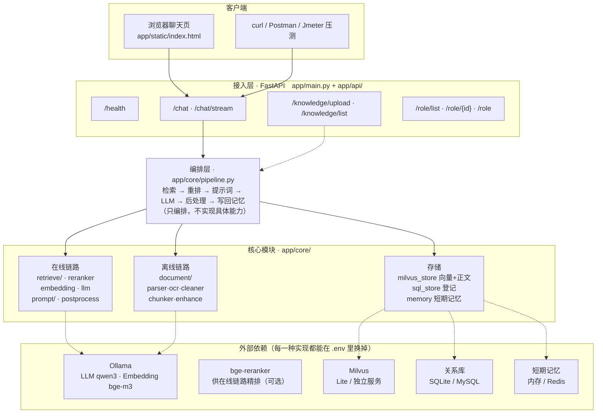
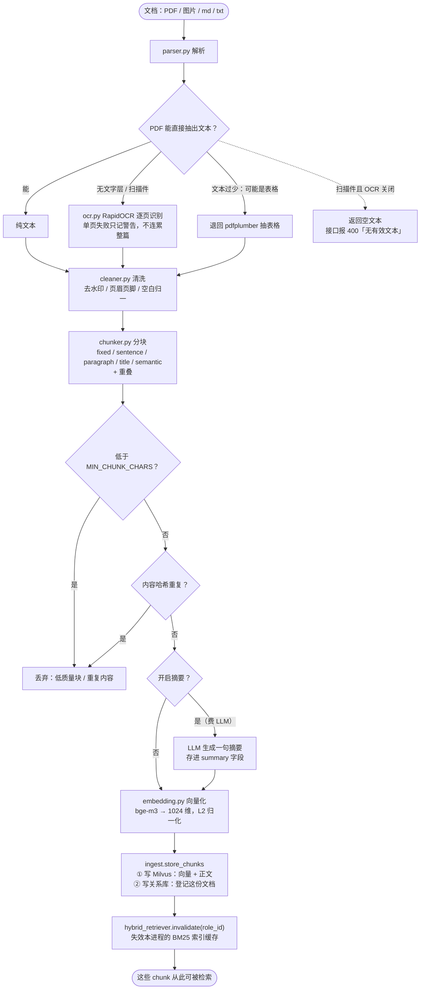
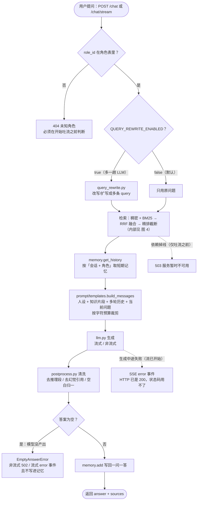
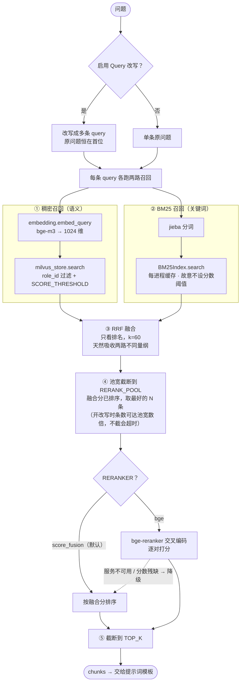

# 流程图 —— rag-roleplay

> 本文的图用 **Mermaid** 写（GitHub、VS Code（装 Markdown Preview Mermaid 插件）、Typora
> 都能直接渲染成图）。
>
> 需要**能拖进 Word / PPT 的图片**时，用 `docs/figures/` 里同名的 `.svg`（首选，矢量、
> 放大不糊）或 `.png`（保底，给不认 SVG 的老版 Office）。两种格式都由
> `docs/figures/make_figures.py` 产出，**改图请改脚本再重跑，别手改图片**——
> 详见文末「附：图片文件」。
>
> 图与 [代码地图.md](代码地图.md) 是配套的：地图讲「每个文件负责什么」，这里讲「数据怎么流动」。

四张图各管一段：

| 图 | 回答的问题 |
|---|---|
| [图 1 系统架构](#图-1系统架构) | 系统由哪几层组成、外部依赖有哪些、哪一层可以换 |
| [图 2 离线入库](#图-2离线入库) | 一份 PDF 怎么变成可检索的向量 |
| [图 3 在线问答](#图-3在线问答) | 一次提问从进来到出去，中间经过哪些步骤、在哪里会失败 |
| [图 4 检索内部](#图-4检索内部展开) | 混合检索那一步里面到底做了什么 |

---

## 图 1：系统架构



> 外部依赖那一行的**排列顺序是按「谁用它」放的**（前两个归在线/离线链路，后三个归存储），
> 目的只是让上面下来的虚线不交叉，不代表这几样东西之间有分组关系。

> 图片版：[fig1_architecture.svg](figures/fig1_architecture.svg)　·　[fig1_architecture.png](figures/fig1_architecture.png)

**怎么看这张图**

- 上三层（客户端 → 接入层 → 编排层）是**单向向下**的：接入层只做「校验 → 调 pipeline
  → 翻译错误码」，不含业务；所以 `scripts/*.py` 能绕过 HTTP 直接复用编排层。
- 核心模块横向分三块，对应两条链路加一个存储层。**在线链路只读存储，离线链路只写存储**，
  这是它俩唯一不重叠的地方。
- 最下面一层是「**可替换**」的边界：换模型、换向量库、换关系库、换记忆后端，
  都只改 `.env`，上面一行代码不动。抽象接口在 `app/core/store/`、`llm.py`、`embedding.py`、`reranker.py`。

---

## 图 2：离线入库



> 图片版：[fig2_ingest.svg](figures/fig2_ingest.svg)　·　[fig2_ingest.png](figures/fig2_ingest.png)

**怎么看这张图**

- 解析那一段是**三级兜底**：PyMuPDF → 抽不到文本或文本过少就退回 pdfplumber → 实在没有
  文字层才走 OCR。三级都在 `document/parser.py` 里。
- 中间那两个「丢弃」判断（低质量过滤、去重）是**入库侧的数据增强**，在 `document/enhance.py`。
- **结尾那一步容易被忽略但很关键**：BM25 索引是**每进程**内存缓存，新文档入库后必须让
  进程内的缓存失效，否则关键词召回看不见新文档。多 worker 部署时只有处理上传的那个
  worker 会失效（见 `retrieve/hybrid_retriever.py` 的注释）。
- 重复入库同一个 `source` 时是「先删后插」保证幂等的，见业务规则 BR-5。

---

## 图 3：在线问答



> 图片版：[fig3_chat.svg](figures/fig3_chat.svg)　·　[fig3_chat.png](figures/fig3_chat.png)

**怎么看这张图**

- 图上标了**三种失败**，它们的区别是这套接口设计的重点：
  - **404** 角色不存在 —— 在进生成器之前就判掉，因为响应头一旦发出就改不了状态码；
  - **502** 模型一个字都没答（被截断 / 上游返回空 choices）—— 与「依赖掉线」是两种语义，
    故意不并进 503；而且**空答案不写记忆**，否则下一轮模型会读到「用户问了、自己没答」；
  - **503** 依赖掉线 —— 只在**开始吐流之前**（检索、取记忆、拼提示词）才可能返回；
    流一旦开始，HTTP 已经是 200，只能改用 `error` 事件。
- 右侧那条虚线是**并发保护**之外的另一个易漏点：短期记忆按「会话 + 角色」隔离，
  且同一会话的请求是串行的（否则两个并发请求交错写记忆会把历史配错对）。

---

## 图 4：检索内部（展开）



> 图片版：[fig4_retrieval.svg](figures/fig4_retrieval.svg)　·　[fig4_retrieval.png](figures/fig4_retrieval.png)

**怎么看这张图**

- **两路召回的分数不可比**：稠密是 0~1 的余弦相似度，BM25 无上界且可能为负。
  所以第三步用 RRF 融合——它**只看排名、不看分数**，天生不需要调参。
- **BM25 那一路故意不设分数阈值**：`rank_bm25` 的平滑 IDF 在词出现在一半文档时恰好为 0、
  超过一半时为负，用 `score > 0` 过滤会把命中项滤掉（这是修过的一个真 bug）。
- **第四步的池宽截断是必须的**：精排只能从粗排池里挑人，池宽等于 `TOP_K` 时它就只能换顺序；
  但池子开太大、又叠上 query 改写，一次要喂给交叉编码器几十对，本机实测会超 60s 而整体降级——
  两头都是坑，所以是「宽召回一次、再按池宽截断」。
- **降级不静默**：BGE 不可用或只回了部分分数时，链路照常可用，但一定会打日志。

---

## 附：图片文件

`docs/figures/` 下每张图都有 **SVG + PNG 两种格式**（同名）：

| 文件 | 对应 | 什么时候用 |
|---|---|---|
| `fig1_architecture.*` | 图 1 系统架构 | |
| `fig2_ingest.*` | 图 2 离线入库 | |
| `fig3_chat.*` | 图 3 在线问答 | |
| `fig4_retrieval.*` | 图 4 检索内部 | |

**SVG 优先**：矢量、放大不糊，Word 2016 及以上可直接插入（插入后还能右键「取消组合」
拆成图形改字）。**PNG 是保底**：2 倍分辨率（≈190 DPI），给老版 Word / PPT、
或任何不认 SVG 的地方用；代价是放大到很大时字会糊。

> ⚠️ SVG 的文字靠**系统字体**渲染（字体栈是 微软雅黑 → 苹方 → Noto Sans CJK → 黑体）。
> 在 Windows / macOS 上没问题；如果拿到没有中文字体的环境（某些 Linux 容器、在线预览），
> 中文可能回退成方框——那种场合请直接用 PNG。

### 重新生成

```bash
# 1) 生成 SVG（唯一的真源，改图请改这个脚本再重跑，不要手改 SVG）
.venv/bin/python docs/figures/make_figures.py

# 2) 需要 PNG 时，再转一道（本仓库不带这个依赖，sharp 只用一次）
#    注意 PNG 是**派生物**：改了 SVG 一定要重新转，否则两边会不一致
npm --prefix /tmp/svg2png install sharp     # 一次性
node -e "const s=require('/tmp/svg2png/node_modules/sharp'),f=require('fs');
['fig1_architecture','fig2_ingest','fig3_chat','fig4_retrieval'].forEach(n=>
  s(f.readFileSync('docs/figures/'+n+'.svg'),{density:144}).png()
   .toFile('docs/figures/'+n+'.png').then(()=>console.log('✓',n)));"
```
