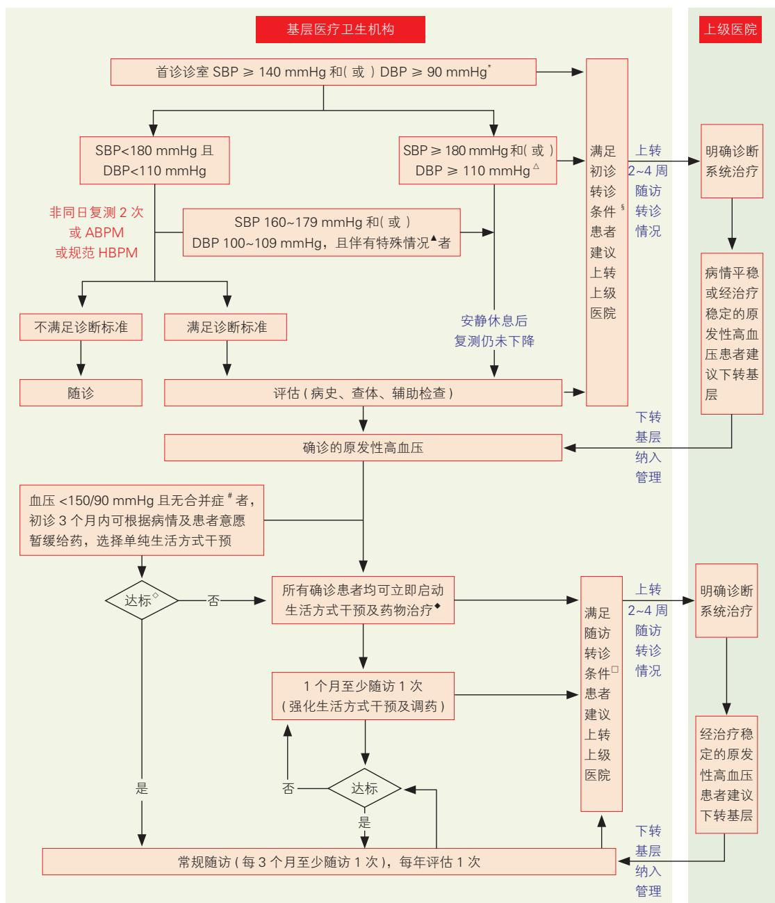
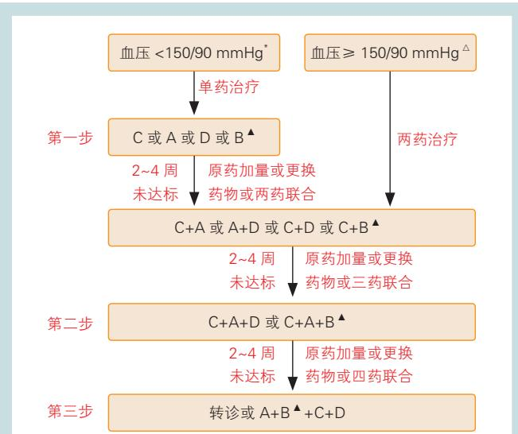

指南与共识

# 国家基层高血压防治管理指南 2025版

国家心血管病中心国家基本公共卫生服务项目基层高血压管理办公室 国家基层高血压管理专家委员会

## 摘要

为了给基层医务人员提供简单、易懂的高血压防治管理指导，2017年我国发布了第一版《国家基层高血压防治管理指南》，并于2020年更新。本指南在2020版的基础上，基于政府部门的管理要求和新近发布的相关领域研究证据和指南，对高血压的基层管理要求、诊断、治疗、长期随访管理等内容进行了更新，并新增了筛查与预防和健康教育章节。希望新版指南为基层高血压防治管理提供实用的、基于最新证据的技术指导。

关键词 高血压；防治；管理；指南；基层

# National Clinical Practice Guidelines on the Management of Hypertension in Primary Health Care in China (2025)

The National Essential Public Health Service Program Office for Management of Hypertension in Primary Health Care, National Center for Cardiovascular Diseases; National Committee on Hypertension Management in Primary Health Care

Corresponding Author: LI Jing, Email: lijing@fuwai.com

## Abstract

To provide straightforward instructions for hypertension prevention and management to primary healthcare practitioners, the first edition of the " National Clinical Practice Guidelines on the Management of Hypertension in Primary Health Care in China " was released in 2017 and updated in 2020. On the basis of the previous editions, the experts updated the guideline according to the requirement from the government, the latest clinical evidence and other newly released guidelines. The updates mainly focused on the requirements of hypertension management in primary health care, diagnosis, treatment, and long-term follow-up management. In addition, chapters on hypertension screening and prevention as well as health education were added. We hope these new guidelines could provide practical and evidence-based technical guidance for primary healthcare practitioners in the prevention and management of hypertension in China.

Key words: hypertension; prevention and treatment; management; guideline; primary health care

《中国心血管健康与疾病报告2023概要》 显示，我国高血压患病人数已达 2.45 亿 [1]。高血压严重并发症（包括脑卒中、冠心病、心力衰竭、慢性肾脏病等）的致残率和致死率较高，已成为我国家庭和社会的沉重负担。然而，高血压可防可控。研究表明，在血压不低于 115/75 mmHg（1 mmHg=0.133 kPa）的范围内，收缩压每降低 10 mmHg，或舒张压每降低5 mmHg，死亡风险降低 10%\~15%，脑卒中风险降低 35%，冠心病风险降低 20%，心力衰竭风险降低40%[2]。因此，预防和控制高血压是遏制我国心脑血(Chinese Circulation Journal, 2025, 40: 836.)

管疾病流行的核心策略之一。

基层医疗卫生机构是高血压管理的“主战场”，其管理水平的高低将直接影响我国未来心脑血管疾病的发展趋势。国家基本公共卫生服务项目中的高血压患者健康管理旨在通过合理、有效的治疗，提高血压达标率，减少或延缓并发症的发生，以达到降低病死率、提高生活质量的最终目的。为满足广大基层医务人员的需要，有效支持基层高血压管理，国家卫生健康委员会基层卫生健康司委托国家心血管病中心成立的国家基本公共卫生服务项目基层高血压管理办公室组织相关专家制定本指南。

本指南制定的核心是提供基层医务人员可掌握、可普及的简单、实用的原发性高血压诊疗指导，实现管理效果可追踪、可考核。药物治疗的推荐以具有明确循证医学证据的药物为基础，逐步实现基层医疗卫生机构与上级医院在原发性高血压诊疗方面的同质化。

本指南适用于基层医疗卫生机构（社区卫生服务中心 /站、乡镇卫生院、村卫生室等）医务人员，管理人群涵盖辖区内≥ 18 周岁的成年高血压患者。本指南主要内容包括基层高血压管理的基本要求、管理流程、诊断方法、治疗方案及长期管理，以及针对社区居民的高血压筛查与预防及健康教育等。为确保其可实施性，以直接的操作推荐为主。为提高基层医务人员的高血压诊疗水平，辅以国家基本公共卫生服务项目《国家基层高血压防治管理手册》（以下简称《手册》）[3]，对指南涉及的推荐内容进行详细说明、提供推荐依据、扩展相关临床知识等。

在 2020 版指南的基础上，本指南的更新重点参考了高血压领域（包含中医药相关）新近发布的指南[4-7] 和重要研究结果[8-15]。2025更新版指南经国家基层高血压管理专家委员会多次审核、讨论后定稿。

## 1 基层高血压管理基本要求

## 1.1 组建管理团队

依托家庭医生签约制度，基层医疗卫生机构成立由医生、护士、公共卫生人员等组成的管理团队，鼓励上级医院专科医生（含中医类别医生）加入团队给予专业指导。各管理团队在机构主要负责人的领导下，通过签约服务的方式，按照本指南要求，为辖区内高血压患者提供规范服务。团队中的医生应完成最新一版《国家基层高血压防治管理指南》培训。基层医疗卫生机构结合团队服务绩效，建立并完善相应的激励机制。

## 1.2 配置基本设备

所有基层医疗卫生机构应配备上臂式医用电子血压计、身高体重计和软尺。推荐使用经准确度验证的上臂式医用电子血压计（可在 http://www.stridebp.org 网站查询），血压计应定期校准。建议配备不同规格的袖带。不建议使用传统的台式水银柱血压计。不推荐使用腕式或手指式电子血压计。

社区卫生服务中心和乡镇卫生院还应配备以下设备：血常规分析仪、尿常规分析仪、血生化分析仪、心电图机，并定期校准。宜配备动态血压监测仪。

有条件的基层医疗卫生机构建议配备心脏及血管彩色多普勒超声诊断仪、X 线胸片检查设备、眼底检查设备、尿液微量白蛋白肌酐比值分析仪等。

## 1.3 保障基本药物

基层医疗卫生机构应配备下述五大类降压药：（1）A：血管紧张素转换酶抑制剂（ACEI）和血管紧张素Ⅱ受体拮抗剂（ARB）两类药物建议都配备。ACEI与ARB降压作用机制相似，无条件的基层医疗卫生机构应至少配备其中一种。（2） B：β受体阻滞剂。（3）C：钙拮抗剂（CCB），二氢吡啶类CCB常用于降压。（4）D：利尿剂，噻嗪类利尿剂常用于降压。

宜配备由上述五大类药物组成的单片复方制剂。有条件的基层医疗卫生机构建议配备血管紧张素受体脑啡肽酶抑制剂（ARNI）沙库巴曲缬沙坦。

## 2 基层高血压诊疗管理流程

基层医疗卫生机构应承担原发性高血压的诊断、治疗及长期随访等管理工作，识别出不适合在基层诊治的高血压患者并及时向上级医院转诊。上级医院确诊的及接收的上转原发性高血压患者经治疗病情平稳后，应及时将有关信息推送至基层医疗卫生机构，以便及时纳入管理并跟踪随访。管理目标是降压达标、降低并发症发生风险。基层高血压诊疗管理流程见图 1。

## 3 诊疗关键点

（1） 血压测量“三要点”：设备精准，安静放松，位置规范。

（2） 诊断要点：诊室血压为主，140/90 mmHg为界，非同日3 次超标确诊。

（3） 健康生活方式“八部曲”：限盐减重多运动，戒烟戒酒心态平，营养平衡睡得香。

（4） 治疗“三原则”：达标、平稳、综合管理。

（5） 基层高血压转诊五类人群：起病急、症状重、疑继发、难控制、孕产妇。

## 4 高血压诊断与评估

## 4.1 血压测量

血压测量方式包括：诊室血压测量、家庭血压监测和动态血压监测。

## 4.1.1 诊室血压测量

## 4.1.1.1 测量仪器

（1）应选择经准确度验证的上臂式医用电子血 压计，定期校准。

（2）袖带大小适合患者上臂臂围，袖带气囊覆盖75%\~100%的上臂周径；上臂臂围大者（＞32 cm）应换用大规格袖带，上臂臂围小者（<24 cm）应使用小袖带。

注：\*：“和（或）”包括以下 3 种情况：（1）SBP ≥ 140 mmHg 且 DBP ≥ 90 mmHg；（2）SBP ≥ 140 mmHg 且 DBP<90 mmHg；（3）SBP<140 mmHg且DBP ≥90 mmHg。△：“和（或）”的意义同\*。▲：特殊情况：医生认为如果不立即进行药物降压治疗将存在风险，或患者难以复诊完成规范的诊断流程。#：合并症：指冠心病、心力衰竭、脑卒中、慢性肾脏病、糖尿病或动脉粥样硬化性外周血管疾病。◇：达标：对于 <80 岁的高血压患者，推荐诊室血压降至 130/80 mmHg 以下；对于≥ 80 岁的高血压患者，建议诊室血压降至 150/90mmHg 以下，如能耐受，可进一步降至 140/90 mmHg 以下。◆：基层医疗卫生机构应积极应用中医药及特色适宜技术。§：初诊转诊：见本指南“7转诊”部分。□：随访转诊：见本指南“7转诊”部分。SBP：收缩压；DBP：舒张压；ABPM：动态血压监测；HBPM：家庭血压监测。1 mmHg=0.133 kPa。

## 图1 基层高血压诊疗管理流程图

## 4.1.1.2 测量方法

诊室血压规范测量“三要点”：设备精准，安静放松，位置规范。

设备精准：选择经准确度验证的上臂式医用电 子血压计，定期校准。

安静放松：去除可能的影响因素（测量前30 min内禁止吸烟、饮咖啡或茶等，排空膀胱），安静休息至少 5 min。测量时取坐位，双脚平放于地面，背靠椅背，放松且身体保持不动，不说话。

位置规范：上臂中点与心脏处于同一水平线上；袖带下缘应在肘窝上2.5 cm（约两横指）处，松紧合适，可插入 1\~2指为宜。

注意事项：（1）首诊测量双上臂血压，以后通常测量读数较高的一侧。若双上臂收缩压测量值差异超过 20 mmHg，应转诊除外锁骨下动脉狭窄的可能。（2）每次门诊测量两次，间隔约1 min，取两次的平均值记录，如果两次收缩压或两次舒张压的读数差异 >10 mmHg，则测量第三次，取后两次读数的平均值记录。随访期间如果首次门诊测量血压<120/80mmHg，则不需要额外测量。（3）如果患者出现体位性低血压的症状（如跌倒或体位性头晕），应该加测站立位血压。站立位血压分别在卧位或坐位改为站立位后 1 min 和 3 min 时测量。

## 4.1.2 诊室外血压监测

（1）家庭血压监测建议使用经准确度验证的电子血压计。血压测量方式同诊室血压，早晚各测量1 次，每次测量 2\~3 遍。早上在起床后排空膀胱、服药前和早饭前坐位测量血压，晚上在晚饭后、睡觉前坐位测量血压。

（2）动态血压监测的具体操作见《手册》[3]。

## 4.2 高血压诊断标准

诊室血压测量是诊断高血压的常用方法，有条件时应尽可能进行诊室外血压测量，以确诊高血压。

## 4.2.1 诊断标准

（1）诊室血压诊断标准：4 周内非同日 3 次规范测量的诊室血压均≥ 140/90 mmHg。

（2）家庭血压诊断标准：经准确度验证的电子血压计规范测量的家庭血压平均值≥ 135/85 mmHg。建议测量5\~7 d，早晚各测量 1 次，每次测量 2\~3遍，取所有测量值的平均值用于高血压的诊断。若无法进行 5\~7 d 的测量，可取不少于 3 d、至少 12 个测量值的平均值用于高血压的诊断。

（3）动态血压诊断标准：24 小时动态血压平均值≥ 130/80 mmHg，或白天血压平均值≥ 135/85mmHg，或夜间血压平均值≥ 120/70 mmHg。

诊室及诊室外血压的高血压诊断标准见表1。

表1 诊室及诊室外血压的高血压诊断标准
<table><tr><td>分类</td><td>高血压诊断标准</td></tr><tr><td>诊室血压</td><td>收缩压≥140 mmHg 和（或）舒张压≥90 mmHg</td></tr><tr><td>动态血压</td><td></td></tr><tr><td>白天</td><td>收缩压≥ 135 mmHg 和(或）舒张压≥ 85 mmHg</td></tr><tr><td>夜间</td><td>收缩压≥ 120 mmHg 和（或）舒张压≥ 70 mmHg</td></tr><tr><td>24 小时</td><td>收缩压≥ 130 mmHg和（或）舒张压≥80 mmHg</td></tr><tr><td>家庭血压</td><td>收缩压≥ 135 mmHg 和（或）舒张压≥85 mmHg</td></tr></table>

注：\*：指平均血压。1 mmHg=0.133 kPa。

## 4.2.2 诊断流程

当首诊诊室血压≥ 140/90 mmHg 或家庭血压≥ 135/85 mmHg 时：

（1）对于所有 <180/110 mmHg 的患者，应在4 周内尽快预约 2 次非同日诊室血压测量，或进行动态血压监测，或指导患者进行规范的家庭血压测量，以明确诊断。如果首诊诊室收缩压为 160\~179mmHg 和（或）舒张压为 100\~109 mmHg，排除其他可能的诱因和需要转诊的情况，安静休息后复测仍达此标准，医生认为如果不立即进行药物降压治疗将存在风险，或患者难以复诊完成规范的诊断流程，可立即确诊。

（2）若首诊诊室收缩压≥180 mmHg 和（或）舒张压≥ 110 mmHg，伴有急性症状者建议立即转诊；无明显症状者，排除其他可能的诱因，并安静休息后复测仍达此标准，即可确诊。

（3）若根据诊室血压诊断不确定，或怀疑“白大衣高血压”或“隐蔽性高血压”，有条件者可结合动态血压或家庭自测血压明确诊断；无条件者，建议转诊。

白大衣高血压：反复出现的诊室血压升高，而动态血压或家庭自测血压正常。隐蔽性高血压：诊室血压正常，但诊室外血压升高。

（4）在诊断流程中，应注意鉴别伴有紧急或危重情况、怀疑继发性高血压等需转诊的情况（见“7转诊”部分）。

## 4.2.3 血压分类

按血压水平，血压分为正常血压、正常高值血压、高血压（包括单纯收缩期高血压、单纯舒张期高血压）；用于分类的血压水平主要依据诊室坐位血压，以收缩压或舒张压的最高水平为准（表 2）。

## 诊室血压分类及其定义

<table><tr><td>分类</td><td>定义</td></tr><tr><td>正常血压</td><td>收缩压 &lt; 120 mmHg 和舒张压 &lt; 80 mmHg</td></tr><tr><td>正常高值血压</td><td>收缩压 120~139 mmHg和（或）舒张压 80~89 mmHg</td></tr><tr><td>高血压</td><td>收缩压≥ 140 mmHg 和（或）舒张压≥90 mmHg</td></tr><tr><td>单纯收缩期高血压</td><td>收缩压≥ 140 mmHg 和舒张压 &lt; 90 mmHg</td></tr><tr><td>单纯舒张期高血压</td><td>收缩压 &lt; 140 mmHg 和舒张压≥ 90 mmHg</td></tr><tr><td colspan="2">注: 1 mmHg=0.133 kPa。</td></tr></table>

## 4.3 初诊评估

评估是确定高血压治疗策略的基础。

在基层医疗卫生机构首次诊断的高血压患者应在有条件的社区卫生服务中心、乡镇卫生院或上级医疗机构进行首次评估，目的是评估心血管疾病发病风险、靶器官损害及并存的临床情况。评估内容包括病史、体格检查及辅助检查。

病史：高血压确诊的时间、降压药物的使用情况及耐受性；既往是否有糖尿病、脑卒中、冠心病、心力衰竭、心房颤动、慢性肾脏病、动脉粥样硬化性外周血管疾病、血脂异常、痛风、甲状腺功能亢进症等合并症；是否有打鼾伴呼吸暂停，肌无力、发作性软瘫，阵发性头痛、心悸、多汗等继发性高血压相关症状；高血压、糖尿病、血脂异常及早发心血管疾病家族史；吸烟、饮酒史。

体格检查：测量血压、心率、心律、身高、体重、腰围，检查是否有血管（包括颈动脉、胸主动脉、腹部动脉和股动脉）杂音，检查足背动脉搏动情况，确认有无双下肢水肿等。

辅助检查：建议做血常规、尿常规、生化检查[血肌酐、血尿酸、丙氨酸氨基转移酶（ALT）、天门冬氨酸氨基转移酶（AST）、血钾、血钠、血氯、血糖、血脂]、心电图（识别有无左心室肥厚、心肌梗死、心律失常如心房颤动等）。有条件者可选做：动态血压监测、超声心动图、颈动脉超声、尿白蛋白/肌酐比、X线胸片、眼底检查、肾脏超声（肾动脉、肾上腺）等。

## 5 高血压治疗

## 5.1 治疗原则

高血压治疗三原则：达标、平稳、综合管理。治疗高血压的主要目的是降低心、脑、肾与血管并发症的发生和死亡风险。

首先要降压达标。不论采用何种治疗，将血压控制在目标值以下是根本。

其次是平稳降压。告知患者长期坚持生活方式干预和药物治疗，保持血压长期平稳至关重要；此外，长效制剂有利于每日血压的平稳控制，对于减少心血管并发症有益，推荐使用。

再次要对高血压患者进行综合干预管理。选择降压药物时应综合考虑其伴随合并症情况；对于已患心血管疾病的患者及具有某些危险因素的患者，应考虑给予降脂及抗血小板治疗，以降低心血管疾病再发及死亡风险。此外，还应加强高血压患者的血糖监测和管理，以预防糖尿病及其并发症的发生。

## 5.2 降压目标

高血压患者的降压目标：对于 <80 岁的高血压患者，推荐诊室血压降至 130/80 mmHg 以下；对于≥ 80 岁的高血压患者，建议诊室血压降至 150/90mmHg 以下，可耐受者建议降至 140/90 mmHg 以下。

## 5.3 生活方式干预

一旦确诊高血压，应立即启动并长期坚持生活方式干预，即“健康生活方式八部曲”——限盐减重多运动，戒烟戒酒心态平，营养平衡睡得香。一些生活方式干预方法可明确降低血压，如合理膳食、减少钠盐及增加钾盐摄入、减轻体重、规律的中等强度运动（如快走、慢跑、骑车、游泳、太极拳等）均有直接的降压效果。戒烟、戒酒可直接降低心血管疾病发生风险，更应大力提倡。此外，减轻精神压力、保持心理健康、保证好的睡眠，也是提高治疗效果的重要方面。

具体生活方式干预的内容及操作方法见《手册》[3] 及《膳食运动指导要点——基层医务人员应用实操手册》[16]。各类生活方式干预目标及降压效果见表 3。

表3 生活方式干预目标及降压效果
<table><tr><td>生活方式干预内容</td><td>目标</td><td>可获得的收缩压下降效果</td></tr><tr><td>合理膳食</td><td>食物多样，合理搭配；增加富含钾和膳食纤维的食物摄入，减少饱和脂肪酸 DASH饮食可降低11.4mmHg； 含量较高的食物摄入，限制反式脂肪酸的食物摄入</td><td>CHH 饮食▲可降低 10 mmHg</td></tr><tr><td>减少钠盐摄入、增加钾摄入</td><td>每人每日食盐摄入量不超过5g（推荐使用带刻度的盐勺；肾功能正常的人 群，建议使用低钠富钾替代盐)；注意隐性盐的摄入（咸菜、鸡精、酱油等）</td><td>1.2 mmHg/减少 1 g 盐</td></tr><tr><td>减轻体重</td><td>BMI*&lt;24 kg/m²，腰围 &lt;90 cm（男性)或 &lt;85 cm（女性）</td><td>5~20 mmHg/减重 10 kg</td></tr><tr><td>规律运动</td><td>中等强度有氧运动，每次至少 30min，每周 5~7 次；抗阻运动，每周2~3 d 不连续(至少间隔 1 d)</td><td>5~7 mmHg</td></tr><tr><td>戒烟</td><td>建议戒烟，避免被动吸烟，也不建议使用电子烟</td><td>-</td></tr><tr><td>戒酒</td><td>推荐不饮酒；建议戒酒</td><td>–</td></tr><tr><td>心理平衡</td><td>减轻精神压力，保持心情愉悦</td><td>一</td></tr><tr><td>睡眠健康</td><td>规律作息，建议成年人每晚睡眠时间7~9h；改善睡眠障碍</td><td>–</td></tr></table>

注：\*：BMI= 体重 ÷ 身高 2（体重单位：kg；身高单位：m）；BMI 18.5\~<24.0 kg/m2 为正常，BMI 24\~<28 kg/m2 为超重，BMI ≥ 28 kg/m2 为肥胖。△：DASH 饮食：终止高血压的饮食疗法，饮食模式为：（1） 摄入足量的蔬菜、水果和低脂奶制品；（2） 减少富含饱和脂肪、胆固醇和反式脂肪食物的摄入；（3） 摄入适量的全谷物、鱼、禽肉和干果类；（4） 控制钠、甜点、含糖饮料和红肉的摄入。▲：CHH饮食：中国心脏健康饮食，饮食模式为低钠、高钾、高膳食纤维和多豆制品，并结合我国四大菜系（鲁菜、淮扬菜、粤菜、川菜）的特色食材和烹饪方法，符合中国餐饮文化且味道可口。BMI：体重指数。1 mmHg=0.133 kPa。-：无相关数据。

干预前可根据患者情况，与患者共同讨论需要改善的生活方式，制定最终目标。每次随访时，根据改善情况设定近期的具体目标，为患者提供咨询，鼓励其坚持。为提高可行性，可根据患者意愿，每次有针对性地选择 1\~2 项需改善的生活方式，持续督促、追踪。

## 5.4 降压药物治疗

## 5.4.1 启动药物治疗时机

所有高血压患者一旦明确诊断，建议在干预生活方式的同时立即启动药物治疗。

对于收缩压 <150 mmHg 且舒张压 <90 mmHg 同时未合并冠心病、心力衰竭、心房颤动、脑卒中、动脉粥样硬化性外周血管疾病、慢性肾脏病、视网膜病变或糖尿病的高血压患者，也可根据病情及患者意愿暂缓给药，采用单纯生活方式干预；生活方式干预最多 3 个月，若血压仍未达标，再启动药物治疗。

## 5.4.2 降压药物选择

尽量选用证据明确、可改善预后的五大类降压药物，即 ACEI、ARB、β 受体阻滞剂、CCB、噻嗪类利尿剂，以及由上述药物组成的单片复方制剂。有条件者也可根据血压达标情况及适应证选择用ARNI 替代 ACEI/ARB。

为便于记忆，上述降压药物分别以 A、B、C、D 简称。

A：ACEI 和 ARB。这两类药物降压作用明确，尤其适用于伴心力衰竭、心肌梗死后、糖尿病、慢性肾脏病的患者，有充足的证据证明可改善预后。用于蛋白尿患者时，可降低尿蛋白，具有肾脏保护作用，但双侧肾动脉狭窄、血肌酐≥ 3 mg/dl（265µmol/L）的严重肾功能不全及高钾血症患者禁用。妊娠或计划妊娠患者禁用。ACEI 易引起干咳，若无法耐受，可换用 ARB。两类药物均有引起血管神经性水肿的可能，但罕见。

B：β 受体阻滞剂。此类药物可降低心率，尤其适用于心率偏快（诊室静息心率≥80 次/min）的患者。用于合并心肌梗死或心力衰竭的非急性期患者，可改善预后；用于冠心病、劳力型心绞痛患者，可减轻心绞痛症状。β 受体阻滞剂禁用于严重心动过缓、病态窦房结综合征、二度或三度房室阻滞和支气管哮喘患者。运动员、外周血管疾病患者及伴睡眠呼吸暂停综合征的患者慎用，建议遵循上级医院建议。长期应用β受体阻滞剂者突然停药可发生反跳现象即撤药综合征，应在停药前逐渐减少剂量。

推荐使用选择性 β 受体阻滞剂及 α-β 受体阻滞剂。

C：CCB。最常用于降压的是二氢吡啶类 CCB。此类药物降压作用强，耐受性较好，无绝对禁忌证，适用范围相对广，老年单纯收缩期高血压等更适用。常见的不良反应包括头痛、面部潮红、踝部水肿、心跳加快、牙龈增生等。

D：利尿剂。噻嗪类利尿剂较为常用。尤其适用于老年人、单纯收缩期高血压及合并心力衰竭的患者。噻嗪类利尿剂的主要不良反应是低钾血症，且随着利尿剂使用剂量增加，低钾血症发生率也相应增加，因此建议小剂量使用。小剂量利尿剂与ACEI或ARB合用，可抵消或减轻低钾血症这一不良反应。长期应用利尿剂者应监测血钾，高尿酸血症患者慎用，痛风患者禁用噻嗪类利尿剂。伴严重心力衰竭或慢性肾功能不全时，可能需要应用袢利尿剂（如呋塞米），同时需监测血钾或补钾，必要时建议转诊至上级医院进一步诊治。

近年来由上述药物组合而成的单片复方制剂由于服用方便、依从性好，推荐首选。

其他有明确降压效果的传统单片复方制剂，包括复方利血平片、复方利血平氨苯蝶啶片等，根据患者情况仍可使用。

沙库巴曲缬沙坦是新近推荐的ARNI类降压药，在高血压合并心力衰竭、左心室肥厚、慢性肾脏病以及老年和难治性高血压患者中有一定的降压优势。

ARNI 不能与 ACEI、ARB（相同成分的 ARB除外）、阿利吉仑联用。如果从 ACEI 转换成 ARNI，必须在停止 ACEI 治疗至少 36 h 之后才能开始应用ARNI，以降低潜在的血管性水肿发生风险，同时又不易导致心力衰竭恶化或血压明显波动。ARNI可导致血管性水肿、低血压、肾功能损害、高钾血症。重度肾功能不全 [ 估算肾小球滤过率 <30ml/（min·1.73 m2）]、肾动脉狭窄及中度肝功能损害者应慎用，妊娠者禁用。

基层常用降压药物的用法、适应证、禁忌证及不良反应见表4。

## 5.4.3 药物治疗方案

根据患者是否存在合并症及其血压水平选择合适的药物，优选长效药物。除心力衰竭及直立性低血压风险较大的高龄初始用药患者建议从小剂量开始应用外，其他高血压患者可从常用起始剂量开始应用，具体见表4。

表4 基层常用降压药物的用法、适应证、禁忌证及不良反应
<table><tr><td rowspan=1 colspan=1>分类</td><td rowspan=1 colspan=1>名称</td><td rowspan=1 colspan=1>每次剂量</td><td rowspan=1 colspan=1>服药频率(次/d)</td><td rowspan=1 colspan=1>推荐常用起始用法</td><td rowspan=1 colspan=1>适应证</td><td rowspan=1 colspan=1>禁忌证</td><td rowspan=1 colspan=1>主要不良反应</td></tr><tr><td rowspan=8 colspan=1>A (ACEI)</td><td rowspan=1 colspan=1>依那普利</td><td rowspan=1 colspan=1>5~20 mg</td><td rowspan=1 colspan=1>1~2</td><td rowspan=1 colspan=1>5 mg bid</td><td rowspan=1 colspan=1>心力衰竭；心肌</td><td rowspan=2 colspan=1>绝对禁忌：妊娠；高钾血症；双</td><td rowspan=3 colspan=1></td></tr><tr><td rowspan=1 colspan=1>卡托普利</td><td rowspan=1 colspan=1>12.5~50 mg</td><td rowspan=1 colspan=1>2~3</td><td rowspan=1 colspan=1>12.5 mg tid</td><td rowspan=1 colspan=1>梗死后；左心室肥厚；外周</td></tr><tr><td rowspan=1 colspan=1>培哚普利</td><td rowspan=1 colspan=1>4~8 mg</td><td rowspan=1 colspan=1>1</td><td rowspan=1 colspan=1>4 mg qd</td><td rowspan=1 colspan=1>动脉粥样硬</td><td rowspan=1 colspan=1>侧肾动脉狭窄</td></tr><tr><td rowspan=1 colspan=1>贝那普利</td><td rowspan=1 colspan=1>10~20 mg</td><td rowspan=1 colspan=1>1~2</td><td rowspan=1 colspan=1>10 mg qd</td><td rowspan=1 colspan=1>化；糖尿病肾</td><td rowspan=2 colspan=1>肾功能不全即血肌酐&gt;</td><td rowspan=5 colspan=1>， 高；血管神经3  性水肿</td></tr><tr><td rowspan=1 colspan=1>雷米普利</td><td rowspan=1 colspan=1>1.25~10 mg</td><td rowspan=1 colspan=1>1</td><td rowspan=1 colspan=1>5 mg qd</td><td rowspan=1 colspan=1>病；非糖尿病</td></tr><tr><td rowspan=1 colspan=1>福辛普利</td><td rowspan=1 colspan=1>10~40 mg</td><td rowspan=1 colspan=1>1</td><td rowspan=1 colspan=1>10 mg qd</td><td rowspan=1 colspan=1>微量蛋白尿；</td><td rowspan=1 colspan=1>mg/dl（265</td></tr><tr><td rowspan=1 colspan=1>赖诺普利</td><td rowspan=1 colspan=1>5~80 mg</td><td rowspan=1 colspan=1>1</td><td rowspan=1 colspan=1>10 mg qd</td><td rowspan=1 colspan=1>代谢综合征；</td><td rowspan=2 colspan=1>μmol/L)；可能妊娠的女性</td></tr><tr><td rowspan=1 colspan=1>咪达普利</td><td rowspan=1 colspan=1>2.5~10 mg</td><td rowspan=1 colspan=1>1</td><td rowspan=1 colspan=1>5 mg qd</td><td rowspan=1 colspan=1>糖尿病</td></tr><tr><td rowspan=7 colspan=1>A (ARB)</td><td rowspan=1 colspan=1>缬沙坦</td><td rowspan=1 colspan=1>80~160 mg</td><td rowspan=1 colspan=1>1</td><td rowspan=1 colspan=1>80 mg qd</td><td rowspan=1 colspan=1>心力衰竭；左心</td><td rowspan=7 colspan=1>同 ACEI</td><td rowspan=7 colspan=1>血钾升高；血管神经性水肿</td></tr><tr><td rowspan=1 colspan=1>氯沙坦</td><td rowspan=1 colspan=1>25~100 mg</td><td rowspan=1 colspan=1>1</td><td rowspan=1 colspan=1>50 mg qd</td><td rowspan=1 colspan=1>室肥厚；心肌梗死后；糖尿</td></tr><tr><td rowspan=1 colspan=1>厄贝沙坦</td><td rowspan=1 colspan=1>150~300 mg</td><td rowspan=1 colspan=1>1</td><td rowspan=1 colspan=1>150 mg qd</td><td rowspan=1 colspan=1>病肾病；蛋白</td></tr><tr><td rowspan=1 colspan=1>替米沙坦</td><td rowspan=1 colspan=1>20~80 mg</td><td rowspan=1 colspan=1>1</td><td rowspan=1 colspan=1>40 mg qd</td><td rowspan=1 colspan=1>尿；微量白蛋</td></tr><tr><td rowspan=1 colspan=1>坎地沙坦</td><td rowspan=1 colspan=1>4~12 mg</td><td rowspan=1 colspan=1>1</td><td rowspan=1 colspan=1>4 mg qd</td><td rowspan=1 colspan=1>白尿：代谢综</td></tr><tr><td rowspan=1 colspan=1>奧美沙坦酯</td><td rowspan=1 colspan=1>20~40 mg</td><td rowspan=1 colspan=1>1</td><td rowspan=1 colspan=1>20 mg qd</td><td rowspan=1 colspan=1>合征；糖尿病；ACEI引起的咳</td></tr><tr><td rowspan=1 colspan=1>阿利沙坦酯</td><td rowspan=1 colspan=1>80~240 mg</td><td rowspan=1 colspan=1>1</td><td rowspan=1 colspan=1>240 mg qd</td><td rowspan=1 colspan=1>嗽</td></tr><tr><td rowspan=4 colspan=1>B(β受体阻滞剂）</td><td rowspan=1 colspan=1>阿替洛尔</td><td rowspan=1 colspan=1>6.25~25 mg</td><td rowspan=1 colspan=1>1~2</td><td rowspan=1 colspan=1>6.25 mg bid</td><td rowspan=1 colspan=1></td><td rowspan=2 colspan=1>对禁忌：二度、</td><td rowspan=7 colspan=1>体位性低血压；心动过缓；支气管痉挛</td></tr><tr><td rowspan=1 colspan=1>美托洛尔</td><td rowspan=1 colspan=1>12.5~100 mg</td><td rowspan=1 colspan=1>2</td><td rowspan=1 colspan=1>25 mg bid</td><td rowspan=1 colspan=1>心绞痛；心肌梗绝</td></tr><tr><td rowspan=1 colspan=1>美托洛尔缓释片</td><td rowspan=1 colspan=1>23.75~190 mg</td><td rowspan=1 colspan=1>1</td><td rowspan=1 colspan=1>47.5 mg qd</td><td rowspan=1 colspan=1>死后；快速性心律失常；心</td><td rowspan=3 colspan=1>三度房室阻滞；哮喘对禁忌：慢性阻塞性肺疾病；</td></tr><tr><td rowspan=1 colspan=1>比索洛尔</td><td rowspan=1 colspan=1>2.5~10 mg</td><td rowspan=1 colspan=1>1~2</td><td rowspan=1 colspan=1>5 mg qd</td><td rowspan=1 colspan=1>力衰竭；拉贝相</td></tr><tr><td rowspan=3 colspan=1>B(α-β受体阻滞剂）</td><td rowspan=1 colspan=1>卡维地洛</td><td rowspan=1 colspan=1>3.125~25 mg</td><td rowspan=1 colspan=1>2</td><td rowspan=1 colspan=1>12.5 mg bid</td><td rowspan=1 colspan=1>洛尔适用于妊</td></tr><tr><td rowspan=1 colspan=1>阿罗洛尔</td><td rowspan=1 colspan=1>5~10 mg</td><td rowspan=1 colspan=1>2</td><td rowspan=1 colspan=1>5 mg bid</td><td rowspan=2 colspan=1>娠期高血压</td><td rowspan=2 colspan=1>外周动脉疾病</td></tr><tr><td rowspan=1 colspan=1>拉贝洛尔</td><td rowspan=1 colspan=1>100~200 mg</td><td rowspan=1 colspan=1>2</td><td rowspan=1 colspan=1>100 mg bid</td></tr><tr><td rowspan=11 colspan=1>C(二氢吡啶类钙拮抗剂）</td><td rowspan=1 colspan=1>氨氯地平</td><td rowspan=1 colspan=1>2.5~10 mg</td><td rowspan=1 colspan=1>1</td><td rowspan=1 colspan=1>5 mg qd</td><td rowspan=4 colspan=1></td><td rowspan=4 colspan=1></td><td rowspan=4 colspan=1></td></tr><tr><td rowspan=1 colspan=1>左旋氨氯地平</td><td rowspan=1 colspan=1>2.5~5 mg</td><td rowspan=1 colspan=1>1</td><td rowspan=1 colspan=1>2.5 mg qd</td></tr><tr><td rowspan=1 colspan=1>硝苯地平</td><td rowspan=1 colspan=1>5~20 mg</td><td rowspan=1 colspan=1>2~3</td><td rowspan=1 colspan=1>10 mg tid</td></tr><tr><td rowspan=1 colspan=1>硝苯地平缓释片</td><td rowspan=1 colspan=1>10~40 mg</td><td rowspan=1 colspan=1>1~2</td><td rowspan=1 colspan=1>20 mg bid</td></tr><tr><td rowspan=1 colspan=1>硝苯地平控释片</td><td rowspan=1 colspan=1>30~60 mg</td><td rowspan=1 colspan=1>1</td><td rowspan=1 colspan=1>30 mg qd</td><td rowspan=7 colspan=1>老年单纯收缩期高血压；心绞痛；动脉粥样硬化</td><td rowspan=7 colspan=1>相对禁忌：快速性心律失常；慢性心力衰竭</td><td rowspan=7 colspan=1>头痛；面部潮红；踝部水肿；心跳加快；牙龈增生</td></tr><tr><td rowspan=1 colspan=1>尼群地平</td><td rowspan=1 colspan=1>10~20 mg</td><td rowspan=1 colspan=1>2</td><td rowspan=1 colspan=1>10 mg bid</td></tr><tr><td rowspan=1 colspan=1>非洛地平缓释片</td><td rowspan=1 colspan=1>2.5~10 mg</td><td rowspan=1 colspan=1>1</td><td rowspan=1 colspan=1>5 mg qd</td></tr><tr><td rowspan=1 colspan=1>拉西地平</td><td rowspan=1 colspan=1>2~8 mg</td><td rowspan=1 colspan=1>1</td><td rowspan=1 colspan=1>2 mg qd</td></tr><tr><td rowspan=1 colspan=1>贝尼地平</td><td rowspan=1 colspan=1>4~8 mg</td><td rowspan=1 colspan=1>1</td><td rowspan=1 colspan=1>4 mg qd</td></tr><tr><td rowspan=1 colspan=1>乐卡地平</td><td rowspan=1 colspan=1>10~20 mg</td><td rowspan=1 colspan=1>1</td><td rowspan=1 colspan=1>10 mg qd</td></tr><tr><td rowspan=1 colspan=1>西尼地平</td><td rowspan=1 colspan=1>5~10 mg</td><td rowspan=1 colspan=1>1</td><td rowspan=1 colspan=1>5 mg qd</td></tr><tr><td rowspan=3 colspan=1>D(噻嗪类利尿剂）</td><td rowspan=1 colspan=1>氢氯噻嗪</td><td rowspan=1 colspan=1>6.25~25 mg</td><td rowspan=1 colspan=1>1</td><td rowspan=1 colspan=1>12.5 mg qd</td><td rowspan=1 colspan=1>老年单纯收缩期</td><td rowspan=3 colspan=1>绝对禁忌：痛风相对禁忌：妊娠</td><td rowspan=3 colspan=1>低钾血症</td></tr><tr><td rowspan=1 colspan=1>吲达帕胺</td><td rowspan=1 colspan=1>0.625~2.5 mg</td><td rowspan=1 colspan=1>1</td><td rowspan=1 colspan=1>1.25 mg qd</td><td rowspan=2 colspan=1>高血压；心力衰竭</td></tr><tr><td rowspan=1 colspan=1>吲达帕胺缓释片</td><td rowspan=1 colspan=1>1.5 mg</td><td rowspan=1 colspan=1>1</td><td rowspan=1 colspan=1>1.5 mg qd</td></tr><tr><td rowspan=1 colspan=1>ARNI</td><td rowspan=1 colspan=1>沙库巴曲缬沙坦钠</td><td rowspan=1 colspan=1>200~400 mg</td><td rowspan=1 colspan=1>1</td><td rowspan=1 colspan=1>200 mg qd</td><td rowspan=1 colspan=1>心力衰竭；心肌梗死后；左心室肥厚；慢性肾脏病；老年高血压</td><td rowspan=1 colspan=1>绝对禁忌：妊娠；高钾血症；双侧肾动脉重度狭窄；重度肾功能损害相对禁忌：中度肝功能损害</td><td rowspan=1 colspan=1>低血压；高钾血症；血管神经性水肿（极少见）</td></tr><tr><td rowspan=5 colspan=1>单片复方制剂</td><td rowspan=1 colspan=1>贝那普利氢氯噻嗪</td><td rowspan=1 colspan=1>1 片(贝那普利 10 mg/ 氢氯噻嗪 12.5 mg)</td><td rowspan=1 colspan=1>1</td><td rowspan=1 colspan=1>1片qd</td><td rowspan=3 colspan=1>经单药治疗血压</td><td rowspan=3 colspan=1></td><td rowspan=5 colspan=1>相应成分的不良反应</td></tr><tr><td rowspan=1 colspan=1>复方卡托普利</td><td rowspan=1 colspan=1>1~2 片(卡托普利 10 mg/ 氢氯噻嗪 6 mg)</td><td rowspan=1 colspan=1>1~2</td><td rowspan=1 colspan=1>1 片 bid</td></tr><tr><td rowspan=1 colspan=1>赖诺普利氢氯噻嗪</td><td rowspan=1 colspan=1>1 片(赖诺普利 10 mg/ 氢氯噻嗪 12.5 mg)</td><td rowspan=1 colspan=1>1</td><td rowspan=1 colspan=1>1片qd</td></tr><tr><td rowspan=1 colspan=1>依那普利氢氯噻嗪（Ⅱ)</td><td rowspan=1 colspan=1>1片（依那普利5mg/氢氯噻嗪12.5 mg)</td><td rowspan=1 colspan=1>1</td><td rowspan=1 colspan=1>1 片 qd</td><td rowspan=2 colspan=1>未达标或需两种及以上药物治疗的高血压</td><td rowspan=2 colspan=1>相应成分的禁忌证</td></tr><tr><td rowspan=1 colspan=1>培哚普利氨氯地平</td><td rowspan=1 colspan=1>1 片（精氨酸培哚普利10 mg/苯磺酸氨氯地平 5 mg，或精氨酸培哚普利 5 mg/ 苯磺酸氨氯地平 10 mg，或精氨酸培哚普利 10 mg/ 苯磺酸氨氯地平 10 mg)</td><td rowspan=1 colspan=1>1</td><td rowspan=1 colspan=1>1片qd</td></tr></table>

（续表 4）

<table><tr><td rowspan=1 colspan=1>分类</td><td rowspan=1 colspan=1>名称</td><td rowspan=1 colspan=1>每次剂量</td><td rowspan=1 colspan=1>服药频率(次/d)</td><td rowspan=1 colspan=1>推荐常用起始用法</td><td rowspan=1 colspan=1>适应证</td><td rowspan=1 colspan=1>禁忌证</td><td rowspan=1 colspan=1>主要不良反应</td></tr><tr><td rowspan=8 colspan=1>单片复方制剂</td><td rowspan=1 colspan=1>培哚普利吲达帕胺</td><td rowspan=1 colspan=1>1 片（培哚普利 4 mg/吲达帕胺 1.25 mg)</td><td rowspan=1 colspan=1>1</td><td rowspan=1 colspan=1>1片qd</td><td rowspan=4 colspan=1>经单药治疗血压未达标或需两相</td><td rowspan=8 colspan=1>应成分的禁忌相证</td><td rowspan=8 colspan=1>应成分的不良反应</td></tr><tr><td rowspan=1 colspan=1>厄贝沙坦氢氯噻嗪</td><td rowspan=1 colspan=1>1 片(厄贝沙坦 150 mg/氢氯噻嗪 12.5 mg)</td><td rowspan=1 colspan=1>1</td><td rowspan=1 colspan=1>1 片 qd</td></tr><tr><td rowspan=1 colspan=1>氯沙坦钾氢氯噻嗪</td><td rowspan=1 colspan=1>1~2 片(氯沙坦钾 50 mg/氢氯噻嗪12.5mg)；或 1 片(氯沙坦钾 100 mg/氢氯噻嗪 12.5 mg，或氯沙坦钾 100 mg/ 氢氯噻嗪 25 mg)</td><td rowspan=1 colspan=1>1</td><td rowspan=1 colspan=1>1 片 qd</td></tr><tr><td rowspan=1 colspan=1>替米沙坦氢氯噻嗪</td><td rowspan=1 colspan=1>1 片（替米沙坦 40 mg/氢氯噻嗪12.5 mg，或替米沙坦 80 mg/氢氯噻嗪 12.5 mg)</td><td rowspan=1 colspan=1>1</td><td rowspan=1 colspan=1>1 片 qd</td></tr><tr><td rowspan=1 colspan=1>缬沙坦氢氯噻嗪</td><td rowspan=1 colspan=1>1~2 片(缬沙坦 80 mg/ 氢氯噻嗪 12.5 mg)</td><td rowspan=1 colspan=1>1</td><td rowspan=1 colspan=1>1片 qd</td><td rowspan=4 colspan=1>种及以上药物治疗的高血压</td></tr><tr><td rowspan=1 colspan=1>氨氯地平贝那普利</td><td rowspan=1 colspan=1>1~4 片(氨氯地平 2.5 mg/贝那普利 10mg)；或 1~2 片(氨氯地平 5 mg/ 贝那普利 10 mg)</td><td rowspan=1 colspan=1>1</td><td rowspan=1 colspan=1>1 片 qd</td></tr><tr><td rowspan=1 colspan=1>缬沙坦氨氯地平</td><td rowspan=1 colspan=1>1~2片(缬沙坦80mg/氨氯地平5 mg，或缬沙坦 160 mg/ 氨氯地平 5 mg)</td><td rowspan=1 colspan=1>1</td><td rowspan=1 colspan=1>1片qd</td></tr><tr><td rowspan=1 colspan=1>奧美沙坦氢氯噻嗪</td><td rowspan=1 colspan=1>1~2 片(奥美沙坦 20 mg/氢氯噻嗪 12.5mg)</td><td rowspan=1 colspan=1>1</td><td rowspan=1 colspan=1>1 片 qd</td></tr><tr><td rowspan=2 colspan=1>传统单片复方制剂</td><td rowspan=1 colspan=1>复方利血平片</td><td rowspan=1 colspan=1>1~3 片（利血平 0.032 mg/氢氯噻嗪 3.1mg/ 双肼屈嗪 4.2 mg/ 异丙嗪 2.1 mg)</td><td rowspan=1 colspan=1>2~3</td><td rowspan=1 colspan=1>1 片 tid</td><td rowspan=1 colspan=1>经单药治疗血压未达标或需两</td><td rowspan=1 colspan=1>相应成分的禁忌证</td><td rowspan=2 colspan=1>相应成分的不良反应</td></tr><tr><td rowspan=1 colspan=1>复方利血平氨苯蝶啶片(0号)</td><td rowspan=1 colspan=1>1~2 片（利血平 0.1 mg/氨苯蝶啶12.5 mg/氢氯噻嗪 12.5 mg/ 双肼屈嗪 12.5 mg)</td><td rowspan=1 colspan=1>1</td><td rowspan=1 colspan=1>1片 qd</td><td rowspan=1 colspan=1>种及以上药物治疗的高血压</td><td rowspan=1 colspan=1>活动性溃疡</td></tr></table>

注：\*：推荐常用起始用法适用于一般高血压患者，对于合并心力衰竭或≥80岁易发生直立性低血压的老年患者仍建议从更小剂量开始。△：每种药物的适应证、禁忌证及不良反应以说明书为准。ACEI：血管紧张素转换酶抑制剂；ARB：血管紧张素Ⅱ受体拮抗剂；ARNI：血管紧张素受体脑啡肽酶抑制剂；qd：每日 1 次；bid：每日2次；tid：每日3次。

## 5.4.3.1 <80 岁、无合并症的高血压药物治疗方案（图 2）

注：本流程适用于年龄<80岁的患者，对于年龄≥80岁或衰弱的老年患者，建议单药起始治疗。\*：血压＜150/90 mmHg：收缩压＜ 150 mmHg 且舒张压＜ 90 mmHg；△：血压≥ 150/90mmHg：收缩压≥ 150 mmHg 和（或）舒张压≥ 90 mmHg；▲：B 类药物适用于静息心率≥80次/min的高血压患者。注意每次调整治疗后均需观察2\~4周，看血压达标情况（除非出现不良反应等不耐受或需紧急处理的情况）。A：血管紧张素转换酶抑制剂/血管紧张素Ⅱ受体拮抗剂；B：β受体阻滞剂；C：二氢吡啶类钙拮抗剂；D：利尿剂，常用噻嗪类利尿剂。1 mmHg＝0.133 kPa。

## 图 2 无合并症的高血压药物治疗流程图

合并症：包括冠心病、心力衰竭、脑卒中、糖尿病、慢性肾脏病或动脉粥样硬化性外周血管疾病。

第一步：（1）收缩压 <150 mmHg 且舒张压 <90mmHg：单药起始，可选择C、A、D 或 B。B 尤其适用于心率偏快者（诊室静息心率≥ 80 次 /min）。起始剂量观察 2\~4 周，血压未达标者加量，或更换另一种药物，或小剂量联合使用两种药物，每次调整治疗后观察2\~4周。（2）收缩压≥150 mmHg和（或）舒张压≥ 90 mmHg：推荐两种药物联合使用，如C+A、A+D、C+D 或 C+B，首选相应的单片复方制剂。如血压未达标，则采用如上方法增加剂量或更换方案，每次调整治疗后观察2\~4 周。

第二步：应用上述两药联合方案后，如血压仍未达标，加用第三种药物，可选 C+A+D或 C+A+B。

第三步：3 种药物足量（即指南推荐的最大剂量），且至少包含 1 种利尿剂，观察 2\~4 周若血压仍未达标，建议转诊；或A、B、C、D四类药物合用，2\~4 周后若血压仍未达标，建议转诊。

年龄≥ 80 岁或衰弱的老年患者，建议单药起始治疗。

## 5.4.3.2 有合并症的高血压药物治疗方案（表 5）

合并心肌梗死：首选 A+B，小剂量联用，避免出现低血压。若血压未达标可加量，加量后如血压仍未达标，加用长效 C 或 D（包括螺内酯）。

合并心绞痛：可选择 B、A 或 C，可联用，若血压仍未达标，加用 D。

合并心力衰竭：A+B，小剂量联用，合并水钠潴留时加用D，一般选择袢利尿剂，并补钾，可加螺内酯，若血压仍未达标可加C（限氨氯地平、非洛地平）。合并心力衰竭的患者起始联用A和B，主要用于改善预后，应注意血压偏低者起始剂量宜小，缓慢加量。

合并脑卒中：可选择 C、A 或 D，血压未达标者可联合使用。

合并糖尿病：首选A，血压未达标者加用C或D。

合并慢性肾脏病：首选 A，血压未达标者加用C 或 D。如血肌酐水平首次超出正常范围，建议降压治疗方案由上级医院决定。

合并动脉粥样硬化性外周血管疾病：初始选择C、A、D或B均可，如经单药治疗血压仍未达标，可联合用药，方案同“5.4.3.1 <80岁、无合并症的高血压药物治疗方案”。但注意慎用非选择性β受体阻滞剂，如普萘洛尔。

表5 有合并症\*的高血压药物治疗方案△
<table><tr><td>合并症</td><td>第一步</td><td>第二步</td><td>第三步</td></tr><tr><td>心肌梗死</td><td>A+B▲</td><td>A+B+C#或A+B+D</td><td>转诊或A+B+C#+D</td></tr><tr><td>心绞痛</td><td>B或A或C</td><td>B+C 或B+A 或A+C</td><td>B+C+A或B+C+D</td></tr><tr><td>心力衰竭</td><td>A+B</td><td> $A + B + D ^ { \circ }$ </td><td>转诊或  $A + B + \mathsf { D } ^ { \circ } + \mathsf { C } ^ { \# }$ </td></tr><tr><td>脑卒中</td><td>C或A或D</td><td>C+A或 C+D 或A+D</td><td>C+A+D</td></tr><tr><td>糖尿病或慢性肾脏病</td><td>A</td><td>A+C 或A+D</td><td>A+C+D</td></tr></table>

注：\*：合并症包括冠心病、心力衰竭、脑卒中、糖尿病、慢性肾脏病或动脉粥样硬化性外周血管疾病，且处于稳定期；伴动脉粥样硬化性外周血管疾病的高血压患者用药方案同无合并症的高血压患者，无特殊推荐，故未列入本表。△：年龄 <80 岁的非衰弱患者，如血压≥ 150/90 mmHg，可从两药联合起始应用；年龄≥ 80 岁或衰弱的老年患者，从单药起始应用，可考虑小剂量缓慢滴定。▲：A+B 两药合用，应从最小剂量起始应用，避免出现低血压。#：C 类药物用于合并心肌梗死的患者时，限长效药物；C 类药物用于合并心力衰竭的患者时，仅限氨氯地平及非洛地平两种药。◇：D 类药物用于合并心肌梗死的患者时，包括螺内酯；用于合并心力衰竭的患者时，包括袢利尿剂和螺内酯。◆：血肌酐水平首次超出正常范围，降压治疗方案建议由上级医院决定。A：血管紧张素转换酶抑制剂/血管紧张素Ⅱ受体拮抗剂；B：β 受体阻滞剂；C：二氢吡啶类钙拮抗剂；D：噻嗪类利尿剂。1 mmHg=0.133 kPa。

## 5.4.4 用药注意事项

每次调整药物种类或剂量后建议观察 2\~4 周，评价药物治疗的有效性，避免频繁更换药物，除非出现不良反应等不耐受或需紧急处理的情况。

不宜联合应用ACEI与ARB。

## 5.4.5 已用药患者的治疗方案调整建议

血压已达标：无合并症的高血压患者，如用药后血压已达标，可维持原治疗方案；若伴上述合并症，建议采用上述推荐方案治疗。

血压未达标：建议采用上述治疗方案调整药物。

因客观原因无法实施推荐的治疗方案，则以降压达标为根本，允许使用其他类别降压药物。服药后血压已达标的患者如偶尔出现血压波动，应注意排除诱因，避免依据单次血压测量值频繁调整药物。5.4.6 血压≥ 180/110 mmHg 的紧急处理

5.4.6.1 血压≥ 180/110 mmHg，不伴心、脑、肾急 性并发症的临床症状

心、脑、肾急性并发症：包括高血压脑病、脑出血、蛛网膜下腔出血、脑梗死、主动脉夹层动脉瘤、急性心力衰竭、肺水肿、不稳定性心绞痛、急性心肌梗死等疾病。

（1）口服短效降压药物，如卡托普利 12.5\~25 mg，或酒石酸美托洛尔25 mg，口服，1 h 后可重复给药，门诊用药后观察，直至降到180/110 mmHg以下。 （2）经上述处理，血压仍≥ 180/110 mmHg，或症状明显，建议转诊。（3）24\~48 h 将血压降至 160/100 mmHg以下，之后调整长期治疗方案。 （4）注意：禁止舌下含服硝苯地平快速降压。

5.4.6.2 血压≥ 180/110 mmHg，伴心、脑、肾急性 并发症的临床症状

建议立即转诊。等待转诊过程中，可参照《手册》[3]做简单处理。

## 5.4.7 特殊情况的处理

白大衣高血压：未诊断高血压且在未经治疗的情况下，诊室血压升高而诊室外血压（动态血压或家庭自测血压）正常者，建议进行生活方式干预，每半年监测1 次血压。

隐蔽性高血压：诊室血压正常而诊室外血压（动态血压或家庭自测血压）升高者，建议进行生活方式干预的同时，启动降压药物治疗。

单纯收缩期高血压：建议进行生活方式干预的同时，启动降压药物治疗。

单纯舒张期高血压：建议进行生活方式干预，每半年监测 1 次血压。对于心血管高风险患者，应

给予降压药物治疗。

对于收缩压 130\~139 mmHg 和（或 ）舒张压85\~89 mmHg 的正常高值血压且合并脑血管疾病、冠心病、慢性心力衰竭、心房颤动、外周血管疾病、糖尿病、慢性肾脏病或视网膜病变的患者，应给予降压药物治疗，将血压降至130/80 mmHg 以下。

## 5.5 综合干预管理

高血压患者在选择降压药物时应综合考虑伴随的合并症，如上文所述；对于已患动脉粥样硬化性心血管疾病（ASCVD）及具有某些危险因素的患者，应考虑给予降脂及抗血小板治疗，以降低心血管疾病再发及死亡风险。此外，还应加强高血压患者的血糖监测和管理，以预防糖尿病及其并发症的发生。

## 5.5.1 降脂治疗

低密度脂蛋白胆固醇（LDL-C）每降低1 mmol/L，主要血管事件发生风险降低 1/5。本底风险越高，LDL-C 降幅越大，心血管获益越大。因此，应根据ASCVD 及其危险因素合并情况确定 LDL-C 目标值（表6）。

为达到 LDL-C 目标，在严格生活方式干预的基础上，首选他汀类药物治疗。如经中等强度他汀类药物治疗后 LDL-C 仍不达标，可加用胆固醇吸收抑制剂（如依折麦布10 mg，每日 1 次；或海博麦布10 mg，每日 1 次）。如LDL-C 仍未达标，建议转诊至上级医院，考虑联用前蛋白转化酶枯草溶菌素 9（PCSK9）抑制剂或其他降脂治疗方式。

<table><tr><td rowspan=1 colspan=2>表6高血压合并相关疾病或临床情况的降脂目标</td></tr><tr><td rowspan=1 colspan=1>合并疾病或临床情况</td><td rowspan=1 colspan=1>LDL-C 目标值</td></tr><tr><td rowspan=1 colspan=1>≥ 2 次 ASCVD 事件</td><td rowspan=2 colspan=1>&lt;1.4 mmol/L (55 mg/dl)</td></tr><tr><td rowspan=1 colspan=1>1 次 ASCVD 事件*合并≥ 1 项高危因素</td></tr><tr><td rowspan=1 colspan=1>除上述情况以外的 ASCVD</td><td rowspan=1 colspan=1>&lt;1.8 mmol/L (70 mg/dl)</td></tr><tr><td rowspan=1 colspan=1>慢性肾脏病</td><td rowspan=3 colspan=1>&lt;1.8 mmol/L (70 mg/dl)</td></tr><tr><td rowspan=1 colspan=1>≥40 岁的糖尿病</td></tr><tr><td rowspan=1 colspan=1>严重高胆固醇血症（基线 TC ≥7.2 mmol/L 或 LDL-C ≥ 4.9 mmol/L)</td></tr><tr><td rowspan=1 colspan=1>合并以下任意 1 条:(1)吸烟；(2) HDL-C &lt; 1.0 mmol/L (40 mg/dI)；(3)男性≥ 45 岁或女性≥ 55 岁</td><td rowspan=1 colspan=1>&lt;2.6 mmol/L (100 mg/dl)</td></tr><tr><td rowspan=1 colspan=1>LDL-C ≥ 3.4 mmol/L (130 mg/dl)(不符合上述情况)</td><td rowspan=1 colspan=1>&lt;3.4 mmol/L (130 mg/dl)</td></tr></table>

注：\*：ASCVD事件包括：心肌梗死、缺血性脑卒中、有症状的动脉粥样硬化性外周血管疾病、接受过血运重建或截肢手术。△：高危因素包括：早发冠心病（男性＜ 55 岁，女性＜ 65 岁）、家族性高胆固醇血症或基线 LDL-C ≥ 4.9 mmol/L、糖尿病、慢性肾脏病 3\~4 期、吸烟。▲：ASCVD包括：冠心病、缺血性脑卒中、动脉粥样硬化性外周血管疾病。ASCVD：动脉粥样硬化性心血管疾病；TC：总胆固醇；LDL-C：低密度脂蛋白胆固醇；HDL-C：高密度脂蛋白胆固醇。

中等强度他汀类药物（日剂量）：阿托伐他汀10\~20 mg；瑞舒伐他汀5\~10 mg；辛伐他汀 20\~40 mg；匹伐他汀 2\~4 mg；洛伐他汀 40 mg；氟伐他汀 80 mg；普伐他汀 40 mg；血脂康 1.2 g。

他汀类药物应用注意事项：（1）他汀类药物总体耐受性好，但有导致肌病、横纹肌溶解、转氨酶升高等不良反应的可能，且随剂量增加，风险升高。（2）对初始用药和剂量增加的患者，4\~6 周后应复查血脂、ALT和肌酸激酶，无不良反应且LDL-C 达标后，可调整为6\~12 个月复查 1 次。（3）应用他汀类药物降脂达标后，如能耐受，应继续以原剂量长期服用。（4）如监测发现 ALT 升高 < 正常上限的 3 倍，建议继续或减量服用他汀类药物，密切监测有无肝脏相关症状和体征（如食欲减退、恶心、巩膜或皮肤黄染等），4 周内复查。如果 ALT 升高≥正常上限的 3倍，或出现上述症状或体征，建议停药并转诊。（5）如肌酸激酶升高 < 正常上限的 4 倍，但无肌痛、肌无力等肌肉症状，建议继续服用他汀类药物，密切监测症状，4 周内复查。如果出现上述症状或肌酸激酶升高≥正常上限的4 倍，建议停药并转诊。（6）在应用他汀类药物期间，需关注其与其他药物或食物间的相互作用，包括免疫抑制剂（如环孢菌素 A等）、抗真菌药物、大环内酯类药物、胺碘酮、吉非罗齐以及西柚汁等。联用时可能增加肌病或肌溶解风险，应注意加强监测。

## 5.5.2 抗血小板治疗

已患 ASCVD、血压稳定控制在 150/90 mmHg以下的高血压患者，如无禁忌证及不良反应，建议服用阿司匹林 75\~100 mg，每日 1 次。如阿司匹林不能耐受，建议转诊。

对于未患 ASCVD 的高血压患者，不推荐常规使用阿司匹林。如合并糖尿病、慢性肾脏病或40\~70 岁伴多个危险因素，应用阿司匹林可能利大于弊，可在充分权衡获益与出血风险的基础上慎重使用，必要时转诊。

阿司匹林应用注意事项：（1）肠溶阿司匹林建议空腹服用，非肠溶阿司匹林建议饭后服用，以减少胃肠道反应。（2）血压控制不良可能增加脑出血风险，因此，建议血压至少稳定控制在 150/90 mmHg以下再开始使用。（3）合并消化道出血高风险（年龄＞65 岁、消化道溃疡史以及服用皮质类固醇、抗凝药物或非甾体类抗炎药物等）的患者，建议采用筛查和治疗幽门螺杆菌感染、预防性使用质子泵抑制剂等措施。（4）活动性消化道溃疡、消化道出血、血友病或血小板减少等血液疾病、阿司匹林过敏、严重肝肾功能衰竭者禁用阿司匹林。服用阿司匹林如出现上述情况，应停用阿司匹林，转诊至上级医院，确定下一步治疗方案。

## 5.5.3 血糖管理

所有高血压患者年度评估时均需检测空腹血糖。空腹血糖筛查是简单、易行的糖尿病筛查方法，但有漏诊的可能。如条件允许，建议行口服葡萄糖耐量试验（OGTT）检测空腹和糖负荷后 2 h 血糖，或检测糖化血红蛋白。初次发现血糖升高（空腹血糖≥ 7 mmol/L，或餐后 2 h 血糖≥ 11.1 mmol/L，或糖化血红蛋白≥ 6.5%）者，应进一步明确糖尿病诊断；临床分型不明确或处理有困难者以及妊娠和哺乳期女性，建议转诊至上级医院。

如符合糖尿病前期[即满足空腹血糖受损（空腹血糖为 6.1\~7.0 mmol/L 且 OGTT 2 h 血糖 <7.8 mmol/L）或糖耐量减低（空腹血糖 <7.0 mmol/L 且 OGTT 2 h血糖为 7.8\~<11.1 mmol/L）]，给予针对性的饮食及运动指导，并建议其每半年检测 1 次血糖，每年到医院进行1 次糖尿病诊断。

已确诊 2 型糖尿病者，参照《国家基层糖尿病防治管理指南（2022）》[17] 进行糖尿病长期随访管理。

## 6 高血压与中医药

## 6.1 临床定义和干预原则

根据高血压发病特点及临床表现，可归属中医“眩晕”、“头痛”、“风眩”、“头风”等范畴。相关病症描述首见于《黄帝内经》，主要病因为情志不遂、饮食不节、过度劳逸、禀赋不足等，其病理因素多为风、火、痰、瘀、虚，病理性质多属本虚标实，肝肾阴虚为本，风阳上亢、气血失调、痰浊内蕴为标，因病程及合并靶器官损害不同，多表现为早期肝阳上亢、中期阴虚阳亢、后期阴虚及阳，而瘀血阻络、痰浊内蕴在整个病程中均可能兼夹。本病总体上以阴虚阳亢、水不涵木最多见，潜阳育阴治则应用最广泛。

中医药强调整体调节，在我国基层高血压防治中也被广泛应用。中医“未病先防、既病防变、已变防衰”的全程防治策略，在高血压的预防、治疗、康复等不同阶段均可以通过调节阴阳平衡而发挥不同程度的作用。对于正常高值血压且需要药物治疗者，以及血压水平在 140\~159/90\~99 mmHg 的患者，可以进行中医药治疗；对于血压水平≥ 160/100mmHg 的患者，也可以用中医药作为常用降压药的联合用药，以改善相关症状。中医强调整体观的辨治理念，更有助于高血压多种危险因素的控制，从而降低心血管总体风险。

## 6.2 辨证论治

根据高血压中医流行病学数据和基层高血压的防治特点，可简要分为风阳上亢、肝肾阴虚等实、虚两个证型进行辨治，痰、火、瘀等病理因素作为兼夹证候处理。本指南推荐的相关中药制剂已开展了临床研究，积累了一定的循证医学证据，明确了其降压的获益。

## 6.2.1 风阳上亢证

主症：眩晕耳鸣，头痛且胀，遇劳或恼怒加重；次症：急躁易怒，少寐多梦，面红目赤，肢麻震颤；舌脉：舌质红，苔黄，脉弦。

推荐方药：天麻钩藤饮（《杂病证治新义》）加减。药物组成为：天麻9\~15 g、钩藤（后下）12\~20 g、生石决明（先煎）15\~20 g、山栀 6\~10 g、黄芩 3\~10 g、川牛膝 12\~20 g、杜仲 6\~10 g、益母草 9\~15 g、桑寄生9\~15 g、茯神 9\~15 g 等；每日 1 剂，煎煮后服用。

中成药可选择：天麻钩藤颗粒（1 次 5 g，每日3 次）、松龄血脉康胶囊（1 次3 粒，每日 3 次）、清肝降压胶囊（1 次3 粒，每日3 次）等。

## 6.2.2 肝肾阴虚证

主症：眩晕，腰酸膝软，五心烦热；次症：心悸，耳鸣，失眠，健忘；舌脉：舌红苔少，或伴有裂纹，脉弦细数。

推荐方药：杞菊地黄丸（《医级》）加减。药物组成为：枸杞子 10\~15 g、菊花 6\~12 g、熟地黄 10\~15 g、山萸肉 6\~12 g、山药 15\~30 g、丹皮 10\~15 g、茯苓10\~15 g、泽泻6\~10 g 等；煎服方法同风阳上亢证。

中成药可选择：杜仲平压片（1 次 2 片，每日2\~3 次）、杞菊地黄胶囊（1 次 5\~6 粒，每日 3 次）等。

此外，高血压患者若兼见心、脑、肾、外周血管等靶器官损伤的瘀血内阻等临床表现时，在辨证论治的基础上可酌情增加三七 2\~3 g（研粉吞服）、丹参 10\~15 g、川芎 10\~15 g、川牛膝 12\~20 g 等活血通络之品；若兼见头重如裹、形体肥胖等痰浊内阻证，可选择半夏白术天麻汤加减治疗，药用姜半夏 6\~9 g、白术 6\~12 g、天麻 9\~15 g 等。相关中成药可选择半夏天麻丸、眩晕宁颗粒等。

## 6.3 中医特色适宜技术

具有中医特色的外用药物及非药物方法在高血压防治中也广泛使用，推荐的方法大多安全、简便，通过短期培训即可掌握，特别适合基层应用，而且积累了较丰富的循证证据。

## 6.3.1 针灸

可由受过针灸培训的基层医生开展针灸治疗，治疗以“平肝潜阳，调和气血”为原则，而兼顾诸证。风阳上亢证可选合谷、太冲、侠溪、行间等穴位；肝肾阴虚证可选太溪、太冲、三阴交、侠溪等穴位；夹痰者可加丰隆穴；夹瘀者可加血海穴。每周2\~3次，可选择使用。

## 6.3.2 推拿

手法以推法、揉法等为主；基础穴位可选择百会、风池等，也可辨证取穴，风阳上亢证选合谷、太冲、侠溪、行间等，肝肾阴虚证选太溪、太冲、三阴交、侠溪等；推拿时以局部出现酸、麻、胀为准，每日或隔日1 次，酌情使用。

## 6.3.3 耳穴贴压

常用耳穴可选耳背沟、肝、心、神门等；风阳上亢证加交感穴，肝肾阴虚证加肾穴，夹痰者加脾穴，夹瘀者加皮质下穴。将粘有王不留行籽的胶布对准穴位紧贴压其上，以拇指和食指相对按压耳穴，每穴按压 20\~30 次，使患者感胀痛及耳廓发热。每隔3\~5 天更换 1 次，每次1耳，双耳交替，间断使用。

## 6.3.4 穴位贴敷

可采用吴茱萸散（吴茱萸：白醋=1：1）或天麻贴（天麻：吴茱萸：白醋：冰片 =1：1：1：0.1）穴位敷贴。临床选穴时，风阳上亢证可选穴太阳、风池，肝肾阴虚证可选穴三阴交、涌泉。贴敷的时间以 6\~9 h为宜，每天睡前 1 次，酌情使用。

## 6.3.5 刮痧

取足少阴肾经、足厥阴肝经、足太阳膀胱经为主要刮痧经络，患者取坐位或卧位，露出需要刮痧的部位，操作者右手拿取刮痧板，蘸石蜡油刮痧，以出痧（皮肤潮红或出现紫红色痧痕）为度。

## 6.3.6 中药足浴

可选用吴茱萸20 g、肉桂 20 g、川牛膝20 g 等，上药制成煎剂，用时加温至 50℃左右，浸泡双足，两足相互搓动，每次浴足 20\~30 min，长期坚持具有一定的辅助降压作用。

## 6.3.7 中药代茶饮

一些具有平肝潜阳、补益肝肾之功用且作用平和的中药可作为辅助降压的保健方法，代茶饮用，如可选鬼针草、菊花、枸杞子、决明子、生山楂、麦冬、罗布麻叶等适量泡茶。

## 6.3.8 体质调摄

根据不同的体质类型给予适当的饮食调理，平衡阴阳，对高血压的防治也有一定的辅助作用。气虚质可适当多食益气健脾之品，如山药、莲子、大枣等；阳虚质可适当增加温阳食物，如牛羊肉等，少食生冷寒凉之品；阴虚质可适当多食甘凉滋润之品，如百合、银耳，少食性温燥烈食物，如辣椒；痰湿质饮食以清淡为主，少食肥甘厚腻，多食冬瓜、白萝卜、薏苡仁等；湿热质可适当多食清淡、甘寒之品，如绿豆、苦瓜、薏苡仁等；血瘀质适当多食山楂、藕等；气郁质可适当多食行气解郁、消食醒神之品，如丝瓜、柑橘等。

## 6.4 传统运动方式

一些具有中国传统文化特点的运动方式可以调节情绪、缓解压力，并被初步的循证医学证据证实可获得明确的血压降低效果，可作为基层高血压管理的运动方式选择。

## 6.4.1 太极拳

太极拳可以调节情绪、缓解压力、调整阴阳失衡，每周运动3\~5次，每次30 min左右，坚持约22周，血压平均可降低 5\~11 mmHg。

## 6.4.2 八段锦

八段锦将呼吸吐纳与心理调节相结合，运动量适中，每周练习5 d，每日1次，每次2遍，30 min左右，坚持练习3\~6个月可有一定程度的血压降低作用。

## 6.5 中医综合调理

中医对高血压的管理特别强调整体调节的重要性，一些药物虽无直接的降压证据，但可改善部分高血压患者的临床症状，提高生活质量，降低相关心血管危险因素，如清肝滋肾法改善高血压相关代谢紊乱等，也会让高血压患者受益，临床可酌情使用。血脂康作为天然调脂药物，可中等强度降低LDL-C，对其他血脂指标也有改善作用，已有证据证明其在高血压患者中的应用价值。

## 7 转诊

需转诊人群主要包括起病急、症状重、怀疑继发性高血压以及多种药物无法控制的难治性高血压患者。妊娠和哺乳期女性高血压患者不建议在基层就诊。转诊后2\~4周，基层医务人员应主动随访，了解患者在上级医院的诊断结果或治疗效果，血压达标者恢复常规随访，预约下次随访时间；如未能确诊或血压未达标，或明确为继发性原因所致的血压升高，建议在上级医院进一步治疗。对于经治疗稳定的高血压患者，上级医院应及时将有关治疗信息推送至对应的基层医疗卫生机构，以便及时跟踪随访。

初诊转诊建议：（1）血压显著升高≥ 180/110mmHg，经短期处理仍无法控制；（2）怀疑新出现心、脑、肾并发症或其他严重临床情况；（3）妊娠和哺乳期女性；（4）发病年龄 <30 岁；（5）伴蛋白尿或血尿；（6）非利尿剂或小剂量利尿剂引起的低钾血症（血钾 <3.5 mmol/L）；（7）阵发性血压升高，伴头痛、心慌、多汗、视力模糊；（8）双上肢收缩压差异＞ 20mmHg；（9）因诊断需要到上级医院进一步检查。

随访转诊建议：（1）至少3种降压药物（包括1种利尿剂）足量使用，血压仍未达标；（2）血压明显波动并难以控制；（3）怀疑与降压药物相关且难以处理的不良反应；（4）随访过程中发现严重临床疾病或心、脑、肾损害而难以处理；（5） 需要转诊的其他情况。

下列严重情况建议急救车转诊：（1）意识丧失或模糊；（2）血压≥180/110 mmHg 伴剧烈头痛、呕吐，或突发言语障碍和（或）肢体瘫痪；（3）血压显著升高伴持续性胸背部剧烈疼痛；（4）血压升高伴下肢水肿、呼吸困难，或不能平卧；（5）胸闷、胸痛至少持续 10 min，伴大汗，心电图示至少两个导联 ST 段抬高，应以最快速度转诊，确诊为急性 ST 段抬高型心肌梗死后，考虑溶栓或行急诊经皮冠状动脉介入治疗；（6）其他影响生命体征的严重情况，如意识淡漠伴血压过低或测不出、心率过慢或过快，突发全身严重过敏反应等。

## 8 高血压长期随访管理

## 8.1 随访频率

血压达标患者，至少每 3 个月随访 1 次；血压未达标患者，每月至少随访1 次。符合转诊条件者，建议按照转诊要求操作。

## 8.2 随访内容

随访时应询问上次随访至今是否有新诊断的合并症，如冠心病、心力衰竭、心房颤动、脑卒中、糖尿病、慢性肾脏病或动脉粥样硬化性外周血管疾病等。每次随访均应查体（检查血压、心率等，超重或肥胖者应每 3 个月监测体重及腰围），判断血压是否达标；进行生活方式评估，了解服药依从性及不良反应。如血压未达标，应督促强化生活方式干预，并调整药物治疗方案，必要时转诊。

## 8.3 年度评估

所有患者每年应进行 1 次年度评估，可与随访相结合。除了进行常规体格检查外，每年至少测量1 次体重和腰围。建议每年进行必要的辅助检查，包括血常规、尿常规、生化检查（血肌酐、血尿酸、ALT 和 AST、血钾、血钠、血氯、血糖、血脂）、心电图。有条件者可选做：动态血压监测、超声心动图、颈动脉超声、尿白蛋白 /肌酐比、X 线胸片、眼底检查、肾脏超声（肾动脉、肾上腺）等。

## 9 筛查与预防

## 9.1 筛查方式

通过日常诊疗、健康体检、社区筛查等可能的途径筛查高血压患者。

≥ 18 周岁成人每年门诊首诊均测量血压。根据筛查血压水平及体检结果，给予相应指导。

## 9.2 预防管理

（1） 疑诊高血压（未确诊高血压者，首次发现诊室血压≥ 140/90 mmHg，或家庭自测血压≥ 135/85 mmHg），应依照诊断流程，诊断或排除高血压。不符合高血压诊断者，给予生活方式指导，建议每半年至少测量 1 次血压。

（2）正常高值血压，应给予生活方式指导，建议每半年至少测量 1 次血压。对于收缩压 130\~139mmHg 和（或）舒张压 85\~89 mmHg 且合并脑血管疾病、冠心病、慢性心力衰竭、心房颤动、外周血管疾病、糖尿病、慢性肾脏病或视网膜病变的患者，应给予降压药物治疗。

（3）正常血压、有高血压易患因素（包括高血压家族史、超重或肥胖、高盐饮食、长期过量饮酒、年龄 >55 岁或更年期女性），应给予生活方式指导，建议每半年至少测量 1 次血压。

（4）正常血压、无上述高血压易患因素，建议每年至少测量1 次血压。

生活方式指导包括：合理膳食（含减少钠盐、增加钾盐摄入）、控制体重、规律运动、戒烟、戒酒、减轻精神压力、保持健康睡眠等（具体参见本指南“5.3 生活方式干预”部分）。

## 10 健康教育

## 10.1 基本要求

基层医疗卫生机构应积极、持续地应用权威、科学的科普资料，通过多种形式（如短视频、直播、公众号、广播电视、线下讲座、书籍、海报等）组织开展针对居民的健康教育工作。

## 10.2 教育内容

针对各类人群的健康教育内容见表7。

<table><tr><td colspan="3">表7健康教育内容</td></tr><tr><td>健康教育内容</td><td>非高血压人群</td><td>高血压患者</td></tr><tr><td>高血压及其危害</td><td>√</td><td>√</td></tr><tr><td>高血压危险因素及其管理</td><td>√</td><td>√</td></tr><tr><td>健康生活方式的内容及其重要性</td><td>√</td><td>√</td></tr><tr><td>规范家庭血压测量的方法</td><td>√</td><td>√</td></tr><tr><td>定期监测血压的方法及其重要性</td><td>√</td><td>√</td></tr><tr><td>自我管理的方法及其重要性</td><td></td><td>√</td></tr><tr><td>坚持长期治疗的必要性</td><td></td><td>V</td></tr><tr><td>对降压药物不良反应的正确认识</td><td></td><td>√</td></tr></table>

注：\*：尚未确诊为高血压的人群，包括血压正常者。

## 国家基层高血压管理专家委员会第三届委员名单

主任委员：高润霖（国家心血管病中心 中国医学科学院阜外医院）

副主任委员（按姓氏笔画排序）：王继光（上海交通大学医学院附属瑞金医院 上海市高血压研究所），方祝元（南京中医药大学 江苏省中医院），孙宁玲（北京大学人民医院），杜雪平（首都医科大学附属复兴医院月坛社区卫生服务中心），李静（国家心血管病中心 中国医学科学院阜外医院），吴以岭（络病理论创新转化全国重点实验室），张运（山东大学齐鲁医院），张抒扬（中国医学科学院北京协和医院），张海波（国家心血管病中心 中国医学科学院阜外医院），周颖玲（广东省人民医院），郑哲（国家心血管病中心 中国医学科学院阜外医院），胡盛寿（国家心血管病中心 中国医学科学院阜外医院），顾东风（国家心血管病中心 中国医学科学院阜外医院），崔兆强（复旦大学附属中山医院），韩雅玲（北部战区总医院），樊静（国家心血管病中心 中国医学科学院阜外医院），霍勇（北京大学第一医院）

## 常务委员

全国专家（按姓氏笔画排序）：于波（哈尔滨医科大学附属第二医院），马吉祥（山东省慢性病医院），马依彤（新疆医科大学第一附属医院），刘佳敏（国家心血管病中心 中国医学科学院阜外医院），孙英贤（中国医科大学附属第一医院），严晓伟（中国医学科学院北京协和医院），杨新春（首都医科大学附属北京朝阳医院），陆峰（山东省中医药大学附属医院），郑昕（国家心血管病中心中国医学科学院阜外医院），赵冬（首都医科大学附属北京安贞医院），高传玉（阜外华中心血管病医院），符德玉（上海中医药大学附属岳阳中西医结合医院），葛金文（湖南省中医药研究院），蒋卫民（江苏省中医院），惠汝太（国家心血管病中心 中国医学科学院阜外医院），蔡军（首都医科大学附属北京安贞医院），管仲军（首都医科大学宣武医院）

基层专家（按姓氏笔画排序）：丁小燕（中国社区卫生协会），王良友[台州市疾病预防控制中心（台州市卫生监督所）]，朱秋艳（云南省疾病预防控制中心），朱桂荣（北京中医协会），汤松涛（东莞市寮步镇社区卫生服务中心），吴浩（首都医科大学全科医学与继续教育学院），周刚（河南省疾病预防控制中心），赵志广（深圳市慢性病防治中心），蒋晓霞（浙江省基层卫生协会），谭伟（武汉科技大学附属老年病医院）

## 委员

全国专家（按姓氏笔画排序）：马文君（国家心血管病中心 中国医学科学院阜外医院），王正珍（北京体育大学），王贤良（天津中医药大学第一附属医院），王鸿懿（北京大学人民医院），王增武（国家心血管病中心 中国医学科学院阜外医院），邓悦（长春中医药大学附属医院），龙明智（南京医科大学第二附属医院），冯雪（国家心血管病中心 中国医学科学院阜外医院），冯颖青（广东省人民医院），朱宁（大连医科大学附属第二医院），朱翠玲（河南中医药大学第一附属医院），华琦（首都医科大学宣武医院）；刘中勇（江西中医药大学附属医院），牟建军（西安交通大学第一附属医院），李小鹰（解放军总医院第二医学中心），李卫（国家心血管病中心 中国医学科学院阜外医院），李玉明（天津康汇医院），李希（国家心血管病中心 中国医学科学院阜外医院），李静（首都医科大学宣武医院），吴海英（国家心血管病中心 中国医学科学院阜外医院），邹冲（江苏省中医院），汪道文（华中科技大学同济医学院附属同济医院），宋雷（国家心血管病中心 中国医学科学院阜外医院），张宇清（国家心血管病中心 中国医学科学院阜外医院），张晶（内蒙古自治区中医医院），陈伟（中国医学科学院北京协和医院），陈伟伟（国家心血管病中心 中国医学科学院阜外医院），陈晓平（四川大学华西医院），陈联发（厦门市中医院），邵一兵（青岛市市立医院），武阳丰（北京大学临床医学高等研究院），林金秀（福建医科大学附属第一医院），赵兴胜（内蒙古自治区人民医院），胡申江（浙江大学医学院附属第一医院），姜一农（大连医科大学附属第一医院），祝之明[陆军特色医学中心（大坪医院）]，姚魁武（中国中医科学院），袁如玉（天津医科大学第二医院），格桑罗布（西藏自治区人民医院），郭子宏（云南省阜外心血管病医院），郭艺芳（河北省人民医院），郭远林（国家心血管病中心 中国医学科学院阜外医院），商黔惠（遵义医科大学附属医院），蒋雄京（国家心血管病中心 中国医学科学院阜外医院），程文立（首都医科大学附属北京安贞医院），谢良地（福建医科大学附属第一医院），谢建洪（浙江省人民医院），路方红（山东第一医科大学），戴小华（安徽中医药大学第一附属医院）

基层专家（按姓氏笔画排序）：丁兴宝（济南市长清区马山镇卫生院），于海蓉（新乡市红旗渠东社区卫生服务中心），王正伟（安徽省肥西县疾病预防控制中心），王建锋（陕西省宝鸡市凤翔区城关镇中心卫生院），田蕊（湖南省保靖县人民医院），白国霞（西藏自治区疾病预防控制中心），任永彪（河北省大名县疾病预防控制中心），任虎林（吉林省延吉市肛肠医院），任敏之（上海市虹口区凉城新村街道社区卫生服务中心），安春（芮城县陌南镇卫生院），阮佳慧（浙江省台州市椒江区白云街道社区卫生服务中心），李峰（昆山市千灯镇社区卫生服务中心），杨沧江（云南省疾病预防控制中心），杨春梅（内蒙古自治区呼和浩特市玉泉区中蒙医院），吴先萍（四川省卫生健康委员会），吴新建（重庆大学附属三峡医院），张正清（云南省楚雄彝族自治州禄丰县罗次中心卫生院），范丽花（江苏省太仓市中医院），赵书行（河北省清河县油坊镇卫生院），郝锋（内蒙古自治区和林格尔县中蒙医院），夏曙静（南京市秦淮区大光路社区卫生服务中心），柴永贵（山西省运城市盐湖区人民医院），徐伟（山东省临沂市沂水县第二人民医院），高春燕（江苏省常熟市常福街道社区卫生服务中心），黄莺（香港大学深圳医院），寇现立（新乡市牧野区荣校社区卫生服务中心），程应华（江苏省盐城市大丰区人民医院）

秘书长：李静（国家心血管病中心 中国医学科学院阜外医院）

副秘书长（按姓氏笔画排序）：王增武（国家心血管病中心 中国医学科学院阜外医院），张海波（国家心血管病中心中国医学科学院阜外医院），蔡军（首都医科大学附属北京安贞医院）

秘书（按姓氏笔画排序）：闫蕾（国家心血管病中心 中国医学科学院阜外医院），李美丽（国家心血管病中心 中国医学科学院阜外医院），李艳（国家心血管病中心 中国医学科学院阜外医院）

利益冲突：所有作者均声明不存在利益冲突

## 参考文献

[1] 国家心血管病中心 , 中国心血管健康与疾病报告编写组 . 中国心血管健康与疾病报告 2023 概要 [J]. 中国循环杂志 , 2024, 39(7):625-660. DOI: 10.3969/j.issn.1000-3614.2024.07.001.

[2] Williams B, Mancia G, Spiering W, et al. 2018 ESC/ESH guidelines for the management of arterial hypertension[J]. Eur Heart J, 2018, 39(33): 3021-104. DOI: 10.1093/eurheartj/ehy339.

[3] 国家心血管病中心 . 国家基层高血压防治管理手册 [M]. 北京 : 北京联合出版公司 , 2020: 12.

[4] McEvoy JW, McCarthy CP, Bruno RM, et al. 2024 ESC guidelines for the management of elevated blood pressure and hypertension[J]. Eur Heart J, 2024, 45(38): 3912-4018. DOI: 10.1093/eurheartj/ ehae178.

[5] 中国高血压防治指南修订委员会 , 高血压联盟 ( 中国 ), 中国医疗保健国际交流促进会高血压分会 , 等 . 中国高血压防治指南(2024 年修订版 )[J]. 中华高血压杂志 , 2024, 32(7): 603-700. DOI:10.16439/j.issn.1673-7245.2024.07.002.

[6] 中华医学会心血管病学分会 , 海峡两岸医药卫生交流协会高血压专业委员会 , 中国康复医学会心血管疾病预防与康复专业委员会 .中国高血压临床实践指南 [J]. 中华心血管病杂志 , 2024, 52(9):985-1032. DOI: 10.3760/cma.j.cn112148-20240709-00377.

[7] 中国血脂管理指南修订联合专家委员会 . 中国血脂管理指南(2023 年 )[J]. 中 国 循 环 杂 志 , 2023, 38(3): 237-271. DOI: 10.3969/j.issn.1000-3614.2023.03.001.

[8] Tan M, He F, Morris JK, et al. Reducing daily salt intake in China by 1 g could prevent almost 9 million cardiovascular events by 2030: a modelling study[J]. BMJ Nutr Prev Health, 2022, 5(2): 164-170. DOI: 10.1136/bmjnph-2021-000408.

[9] Millwood IY, Walters RG, Mei XW, et al. Conventional and genetic evidence on alcohol and vascular disease aetiology: a prospective study of 500 000 men and women in China[J]. Lancet (London, England), 2019, 393(10183): 1831-1842. DOI: 10.1016/S0140- 6736(18)31772-0.

[10] GBD 2016 Alcohol Collaborators. Alcohol use and burden for 195 countries and territories, 1990-2016: a systematic analysis for the Global Burden of Disease Study 2016[J]. Lancet, 2018, 392(10152): 1015-1035. DOI: 10.1016/S0140-6736(18)31310-2.

[11] Li JJ, Lu ZL, Kou WR, et al. Impact of Xuezhikang on coronary events in hypertensive patients with previous myocardial infarction from the China Coronary Secondary Prevention Study (CCSPS)[J]. Ann Med, 2010, 42(3): 231-240. DOI: 10.3109/07853891003652534.

[12] Wu Y, Johnson BT, Chen S, et al. Tai Ji Quan as antihypertensive lifestyle therapy: a systematic review and meta-analysis[J]. J Sport Health Sci, 2021, 10(2): 211-221. DOI: 10.1016/j.jshs.2020.03.007.

[13] Zhang DY, Cheng YB, Guo QH, et al. Treatment of masked hypertension with a Chinese herbal formula: a randomized, placebocontrolled trial[J]. Circulation, 2020, 142(19): 1821-1830. DOI: 10.1161/CIRCULATIONAHA.120.046685.

[14] 刘海华 , 王莹莹 , 高海波 , 等 . 针灸治疗高血压病选穴规律文献研究 [J]. 中医杂志 , 2014, 55(12): 1055-1058. DOI: 10.13288/j.11-2166/r.2014.12.018.

[15] 王东华 , 马吉祥 . 松龄血脉康胶囊与氯沙坦钾片对照治疗高血压的临床研究 [J]. 药物评价研究 , 2018, 41(5): 836-840. DOI: 10.7501/j.issn.1674-6376.2018.05.020.

[16] 中国健康教育中心 . 膳食运动指导要点 —— 基层医务人员应用实操手册 [M]. 北京 : 人民卫生出版社 , 2025: 2.

[17] 中华医学会糖尿病学分会 , 国家基层糖尿病防治管理办公室 . 国家基层糖尿病防治管理指南（2022）[J]. 中华内科杂志 , 2022,61(3): 249-262. DOI: 10.3760/cma.j.cn112138-20220120-000063.

（收稿日期：2025-03-31）

（编辑：朱柳媛）