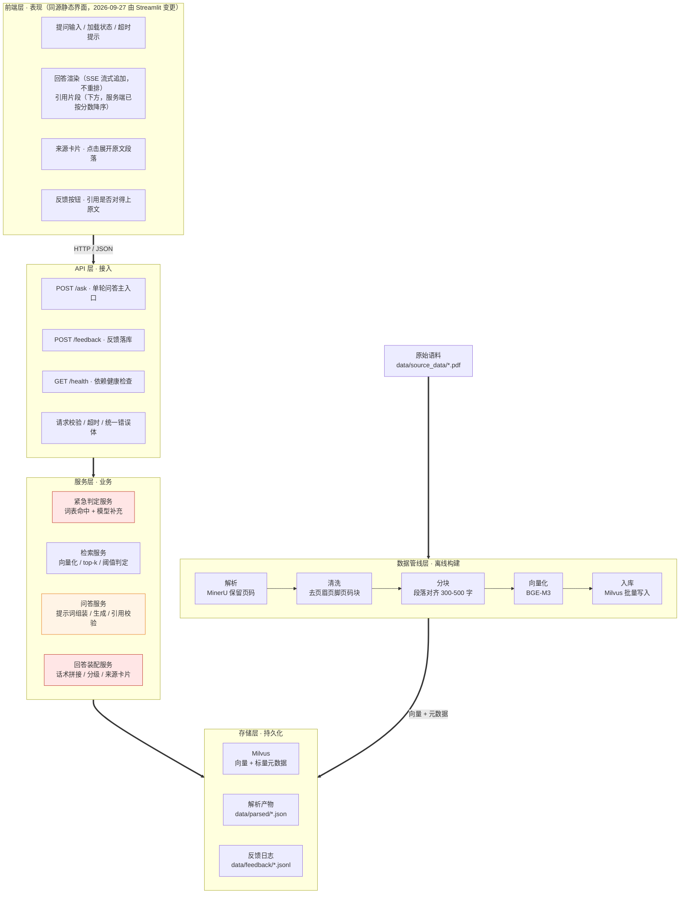
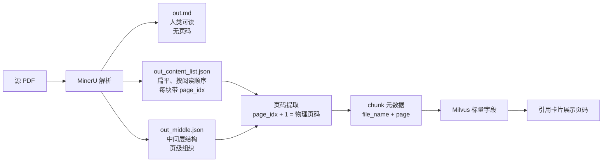
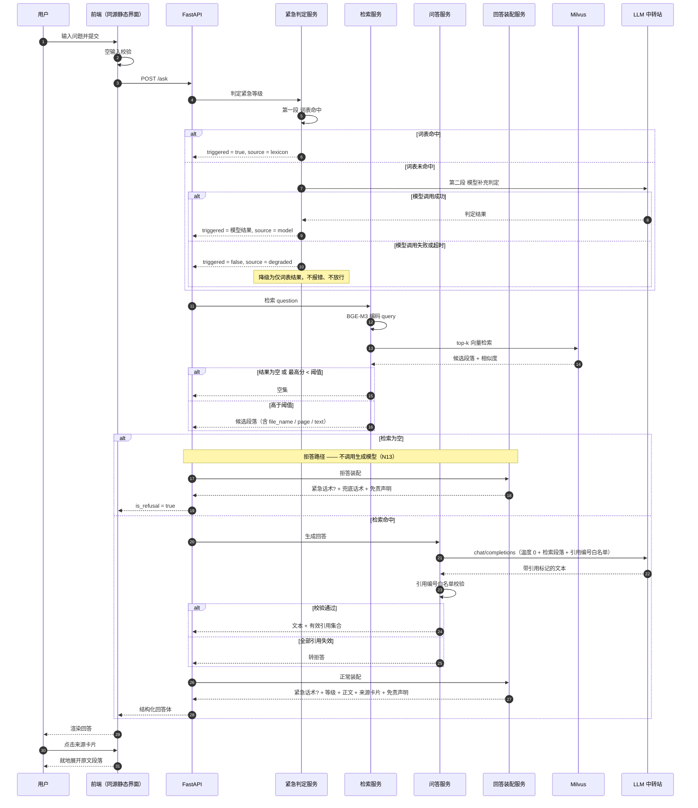
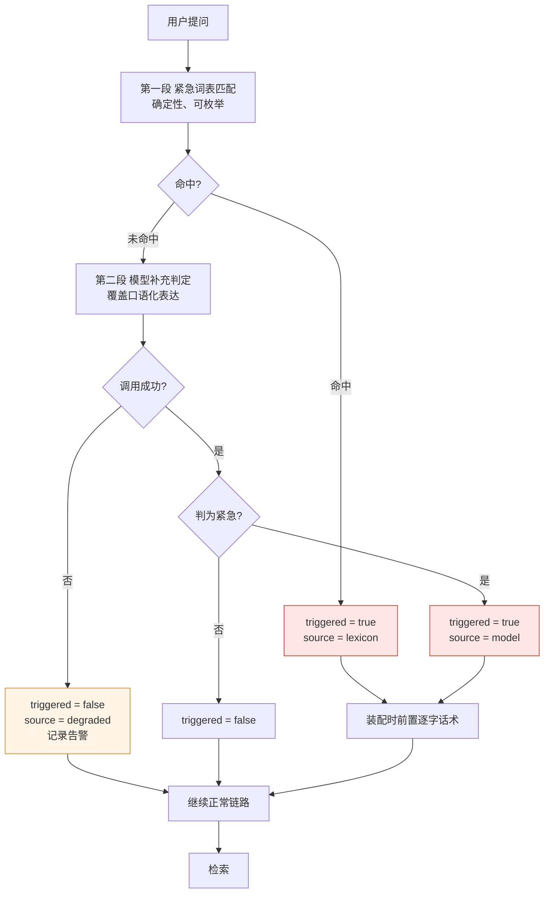
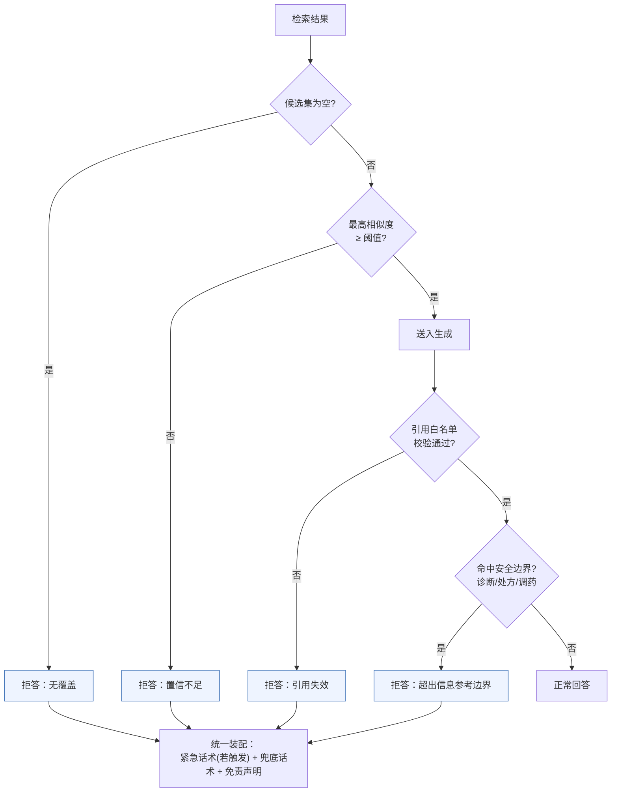
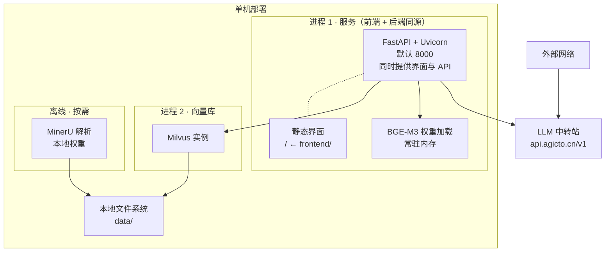

# 02 架构图

> 面向群众的医疗知识问答系统 · 系统架构设计
> 版本：v1.0　编制日期：2026-09-21
> 上游依据：`docs/01_需求分析.md` v1.0、`.specify/memory/constitution.md` v1.0.0
> 对应里程碑：M2 系统设计

---

## 0. 本文档的定位

本文回答"**系统由哪些部分组成、它们如何连接、V1 到哪里为止**"。

不回答的问题（留给后续文档）：

| 不回答 | 去哪里 |
|---|---|
| 语料如何切分、索引字段如何定义 | `docs/04_数据与语料规范.md`（M3） |
| 技术为什么这么选 | `docs/03_技术选型说明.md`（本文档配套） |
| 评估集怎么构造、指标怎么算 | `docs/05_评估方案.md`（M3） |
| 里程碑与任务拆解 | `docs/06_开发计划.md`（M4） |

### 贯穿全局的四条架构约束

这四条不是设计偏好，而是 constitution 中 NON-NEGOTIABLE 原则在架构上的直接投影。后文每一层的设计都受其约束：

| 约束 | 来源 | 架构上的体现 |
|---|---|---|
| **C1 确定性文本由代码产出，不由模型产出** | 原则 IV、V | 紧急话术前置、免责声明末尾由服务层字符串拼接，模型无权生成、无权改写 |
| **C2 知识只能来自检索结果** | 原则 II | 生成服务的输入被限制为检索到的段落集合；引用编号经白名单校验 |
| **C3 密钥与模型路径只走配置** | 原则 III | 所有外部依赖（LLM、embedding、MinerU 权重路径）通过环境变量注入，缺失即启动失败 |
| **C4 单一运行时** | 原则 I | 全链路由 `rag/python.exe` 承载，不引入第二解释器、不为单个组件建 venv |

---

## 1. 分层架构总图

> 读图说明：本图只画**层与层**的连接，层内组件细节各自独立。层内的详细数据流见 §4 时序图（在线）与 §3 流程图（离线）；外部依赖（本地模型权重、LLM 中转站）见 §10 部署视图。



**图中两处红色的含义**：紧急判定服务与回答装配服务承担 constitution 的逐字话术义务（原则 IV、V），它们产出的是**确定性文本**，不经过模型（见 §0 约束 C1）。问答服务标为橙色，是因为它是链路上唯一"输出内容由模型生成"的环节——也是唯一需要引用校验兜底的环节。

### 数据流向的三条链路

| 链路 | 方向 | 触发时机 | 是否在 V1 请求路径上 |
|---|---|---|---|
| **L1 离线构建链路** | 语料 PDF → 解析 → 清洗 → 分块 → 向量化 → Milvus | 人工触发，语料变更时 | 否 |
| **L2 在线问答链路** | 前端 → API → 紧急判定 → 检索 → 生成 → 装配 → 前端 | 每次提问 | 是 |
| **L3 反馈采集链路** | 前端 → API → 反馈日志 | 用户点击反馈 | 否（异步） |

**L1 与 L2 严格解耦**：问答链路的响应时间里不含任何解析或向量化耗时，语料只在离线阶段处理一次。这是 N12（端到端 ≤10s）能够成立的前提。

---

## 2. 各层职责与组件清单

### 2.1 前端层

| 组件 | 职责 | 对应需求 |
|---|---|---|
| 提问输入框 | 收集问题；空/纯空白输入在前端拦截，不发请求 | F1 |
| 回答渲染区 | **流式**：按事件到达顺序追加正文；引用片段先到、渲染在答案区**下方**；`done` 帧到达后以 `answer_text` 为准校正。**MUST NOT 对内容块重排** | F2、F4、F5 |
| 来源卡片 | 点击就地展开原文段落，展示**原文**而非系统转述 | F3 |
| 反馈按钮 | "引用是否对得上原文"，仅记录 | F7 |
| 加载与超时 | 生成中显示加载状态；超时给出明确提示，不停在无限加载 | F2、N14 |

**前端不承担的职责**：不做任何风险等级判断、不做紧急判定、不拼接话术、不做拒答决策。前端只做渲染与交互——所有业务判定必须收敛在服务层，否则 N7 的"可断言"无从测试。

**前端不承担的第二件事：排序**。引用片段由服务端按余弦相似度**降序**排好（`docs/05` §4.2），前端 MUST NOT 重新排序 —— 重排等于把排序规则在客户端复刻一遍，两份实现必然漂移，且漂移时**没有任何测试能发现**（服务端测试全绿，前端只是显示顺序不同）。

**流式引入的新约束**：前端 MUST 按事件到达顺序追加渲染，MUST NOT 在收到全部内容前重排节点。N7 在流式下的保证是"紧急话术必须是首个 `token` 事件"，这个保证依赖前端不重排（`docs/05` §3.1.1）。

### 2.2 API 层

| 端点 | 方法 | 职责 |
|---|---|---|
| `/ask` | POST | 单轮问答主入口，返回结构化回答体 |
| `/feedback` | POST | 接收引用准确性反馈，追加写日志 |
| `/health` | GET | 检查 Milvus 连通性、BGE-M3 权重可加载、LLM 配置已注入 |

**统一回答体**（前端渲染契约）：

```json
{
  "answer_id": "string",
  "is_refusal": false,
  "emergency": {
    "triggered": true,
    "source": "lexicon | model | both"
  },
  "risk_level": "immediate | soon | observe | none",
  "answer_text": "string",
  "citations": [
    {
      "citation_id": 1,
      "file_name": "国家基层高血压防治管理指南2025版.pdf",
      "page": 12,
      "section": "string | null",
      "text": "原文段落全文",
      "score": 0.71
    }
  ],
  "disclaimer": "以上为基于知识库的参考信息，不能替代执业医师的当面诊断。"
}
```

`emergency` 与 `risk_level` 分离是刻意的：紧急判定走两段式（词表 + 模型），风险分级走原文依据，二者判据不同、失败模式不同，合并成一个字段会让 N7 的断言无法定位到底是哪一环失效。

### 2.3 服务层

| 服务 | 职责 | 失败时的行为 |
|---|---|---|
| **紧急判定服务** | 词表命中（确定性）+ 模型补充判定（模糊覆盖），任一命中即触发 | 模型调用失败 → 降级为仅词表结果，**不报错、不放行**（见 §5） |
| **检索服务** | query 向量化 → Milvus top-k 检索 → 阈值判定 → 返回候选段落 | 检索为空或最高分低于阈值 → 返回空集，**不抛异常**，交给装配服务走拒答 |
| **问答服务** | 组装提示词（系统约束 + 检索段落 + 用户问题）→ 调 LLM → 解析输出 → 引用白名单校验 | 引用校验失败 → 该条引用被剥离；全部失效 → 转拒答 |
| **回答装配服务** | 拼接紧急话术、分级标签、知识内容、来源卡片、免责声明，产出最终回答体 | 纯函数式，无外部依赖 |
| **配置与密钥装配** | 启动期读取环境变量，区分必需/可选，缺失必需项即非 0 退出 | N11 |

**两个服务不可合并的理由**：紧急判定必须先于检索执行（紧急场景下即使检索为空，前置话术也必须出现），而检索服务在紧急路径上仍会被调用（因为"前置话术不豁免其他约束"）。把二者写在一起会导致拒答路径上紧急话术被一并跳过。

### 2.4 数据管线层（离线）

| 阶段 | 输入 | 输出 | 关键约束 |
|---|---|---|---|
| 解析 | `data/source_data/*.pdf` | MinerU 结构化产物（含 `page_idx`） | 页码不得丢失（见 §3） |
| 清洗 | 解析产物 | 纯正文块序列 | 丢弃页眉/页脚/页码块/参考文献噪声 |
| 分块 | 正文块序列 | chunk 列表（含元数据） | 段落级边界；300–500 中文字；不跨段落硬切 |
| 向量化 | chunk 文本 | 1024 维稠密向量 | 用与查询**完全相同**的模型与参数 |
| 入库 | 向量 + 元数据 | Milvus collection | 幂等：同一文件重复入库先删后插 |

**"入库即固化"原则**：一旦入库，chunk 的文本与页码即为审计基线，不再随代码变更而漂移。若切分策略调整，必须整库重建而非增量修补——否则 N4（拒答可复现）不成立。

### 2.5 存储层

| 存储 | 位置 | 内容 | 备份要求 |
|---|---|---|---|
| Milvus | 本地实例 | 向量 + 标量元数据 | 可从原始语料重建，无需备份 |
| 原始语料 | `data/source_data/` | 权威 PDF | **必须备份**，是唯一知识依据 |
| 解析产物 | `data/parsed/` | MinerU 中间结果 | 可重建，保留以加速重跑 |
| 反馈日志 | `data/feedback/*.jsonl` | 追加写 | 无需备份，仅观测用 |

---

## 3. 页码保留机制（引用可核对的关键）

风险等级与引用都必须落到"哪一页"，而 MinerU 的 **Markdown 输出不保留页码信息**。因此页码必须从结构化中间产物中取，而不是从 Markdown 中反推。



**页码取用规则（V1 锁定）**：

1. 以 MinerU 结构化中间产物中每个内容块的 **`page_idx`** 为唯一页码来源；
2. 存储时统一换算为 **1-based 物理页码**（`page_idx + 1`），与 PDF 阅读器页码一致；
3. chunk 由同一页的多个块合并而成时，页码取**首个块的页码**；跨页合并的 chunk 同时记录 `page_start` 与 `page_end`；
4. 块自带的 `type == "page_number"` 项是**版面噪声**（印刷页码），清洗阶段丢弃，不作为引用页码；
5. 表格跨页场景需在解析配置中显式设定是否合并，若合并则沿用首块页码。

> ⚠️ **待实测确认**：MinerU 版本迭代较快，`page_idx` 在按页范围解析（`-s/-e`）时是绝对页码还是相对切片页码、以及 `middle.json` 在目标版本中的字段命名，须在 M3 用真实语料验证后回填本文档。验证方式：取一份已知页码的指南 PDF，解析后抽查 20 个 chunk，人工比对页码与 PDF 实际页码。

---

## 4. 在线问答链路时序



### 关键路径上的两个"不"

1. **拒答路径不调用生成模型**（N13）。检索为空时直接进入装配，这既降低延迟也降低外部依赖失败面。
2. **紧急判定失败不放行**。模型补充判定调用失败时，结果是"仅按词表判定"，而不是"跳过紧急判定"——降级方向必须总是偏保守。

---

## 5. 紧急判定两段式流程



**为什么保留 `source` 字段**：词表命中与模型命中的漏检率、误检率完全不同。若线上紧急触发量骤降，`source` 能立刻区分是词表被改坏了还是模型接口挂了。这是可运维性的最小代价。

---

## 6. 拒答决策树

拒答是**设计内的正常输出**（原则 II），因此在架构上它不是异常分支，而是与正常路径平级的返回。



四条拒答路径共用同一个装配出口，保证**拒答内部不可区分**——用户永远看到同一套兜底话术，不暴露是哪一环失败。这既避免泄露系统内部状态，也让 F6"不得呈现为错误或系统故障"天然成立。

---

## 7. 存储层数据模型

### 7.1 Milvus collection（V1）

| 字段 | 类型 | 说明 |
|---|---|---|
| `chunk_id` | VARCHAR (主键) | `{file_hash}_{block_index}`，保证幂等重跑 |
| `vector` | FLOAT_VECTOR (1024) | BGE-M3 稠密向量，COSINE 度量 |
| `text` | VARCHAR | chunk 原文，引用卡片直接展示，不经二次改写 |
| `file_name` | VARCHAR | 来源文件名 |
| `page_start` | INT32 | 起始页码（1-based） |
| `page_end` | INT32 | 结束页码，单页时等于 `page_start` |
| `section` | VARCHAR | 所属章节标题，可为空 |
| `block_type` | VARCHAR | `text` / `table` / `list`，用于前端差异化渲染 |
| `source_hash` | VARCHAR | 源文件哈希，支持按文件整体重建 |

### 7.2 目录结构

```text
med_rag/
├─ data/
│  ├─ source_data/          # 权威语料，唯一知识依据（人工放入）
│  ├─ parsed/               # MinerU 解析产物（可重建）
│  ├─ feedback/             # 反馈日志 jsonl（仅观测）
│  └─ models/               # 本地模型权重（BGE-M3 等）
├─ backend/                 # FastAPI 应用
│  ├─ api/                  # 路由与请求/响应模型
│  ├─ services/             # 紧急判定 / 检索 / 问答 / 装配
│  ├─ pipeline/             # 离线解析、分块、向量化、入库
│  ├─ config.py             # 环境变量装配与启动期校验
│  └─ main.py
├─ frontend/                # 静态界面（原生 HTML/CSS/JS，由后端同源托管）
│                           #   2026-09-27 由 Streamlit 变更，见 docs/03 §6
├─ docs/
├─ rag/                     # 受支持的 Python 运行时
└─ .env.example
```

---

## 8. V1 关键参数（显式锁定，不得依赖库默认值）

constitution 与 N3 要求检索参数必须显式记录。V1 取值如下：

| 参数 | V1 取值 | 依据 |
|---|---|---|
| 向量模型 | BGE-M3 稠密向量，1024 维 | 见 `03_技术选型说明.md` |
| 距离度量 | COSINE | 语义检索标准做法，与归一化后的 BGE-M3 输出匹配 |
| 索引类型 | FLAT（暴力检索） | 语料规模小，召回率优先于速度 |
| `top_k` | 5 | 单份指南语料下供需平衡；过大会引入噪声段落稀释引用质量 |
| 相似度阈值 | **初值 0.45**，须标定后回填 | 见下方说明 |
| 分块粒度 | 段落对齐，目标 300–500 中文字 | 引用粒度定为段落级（需求 §9） |
| 分块重叠 | 0 | 段落级引用要求边界干净；重叠会让同一段落在多个 chunk 中重复出现，破坏引用唯一性 |
| 生成温度 | 0 | 可复现性（N4） |
| 生成最大输出 | 1024 tokens | 约束模型展开倾向，降低补全动机 |

> ⚠️ **阈值 0.45 是待标定的初值，不是结论。** 稠密向量余弦相似度是**弱分布外检测器**，没有任何公开的通用阈值可直接套用。V1 必须在 M3 阶段用自有语料完成标定：构造 30 条语料内问题 + 30 条语料外问题，统计两类得分分布，取分离点在标定集上的最优点，并把最终值回填 `.specify/memory/constitution.md` 的 `TODO(SIMILARITY_THRESHOLD)`。
>
> 更重要的一点：**阈值不是本系统的安全机制**。真正保证"无据不答"的是拒答决策树的四道关卡（§6）与紧急词表的确定性匹配。阈值只负责降低噪声段落进入生成的概率——它的误判只会让引用质量波动，不会让系统编造。任何试图靠调阈值来"提升回答率"的改动，都是在削弱 N4。

---

## 9. V1 版本边界


### 9.1 V1 实现（范围内）

- 全部 F1–F7 功能项与 §6 全部非功能项
- 分层架构中的**前端层、API 层、服务层、数据管线层、存储层**完整落地
- 离线管线：MinerU 解析 → 清洗 → 分块 → BGE-M3 向量化 → Milvus 入库
- 检索：**纯稠密向量检索**，top-k 召回
- 紧急判定：词表 + 模型两段式
- 部署形态：单机，**两个进程**（服务 + Milvus）；前端已并入服务进程同源提供（2026-09-27 修订）

### 9.2 V1 明确不做

| 不做 | 理由 |
|---|---|
| 多轮对话 / 上下文记忆 | 单轮即可覆盖目标场景；多轮会让紧急话术前置的断言复杂化 |
| BM25 混合检索 | V1 语料量小（1–2 份指南），纯向量足够；先拿到基线再决定是否需要 |
| 重排 rerank | 在混合检索仍不足时才评估，属 V2 |
| 账号、登录、历史记录 | 与核心价值无关；少收集个人信息也降低合规负担 |
| 图片 / 语音输入 | 引入 OCR/ASR 不确定性，不服务于核心价值 |
| 自动抓取语料 / 自动入库 | 语料入库必须经人工确认 |
| 在线问诊、挂号、药品导流 | 与 N6 冲突 |
| 从反馈自动学习 | V1 反馈仅用于观测 |

### 9.3 版本升级的判定条件（而非时间）

V1 → V2 的触发条件是**指标**，不是排期：

| 升级项 | 触发条件 |
|---|---|
| 补 BM25 混合检索 | 上线后拒答率偏高，且归因分析显示失败案例集中于药品名、指南编号、专业术语等**精确字符串**召回不足 |
| 补 rerank | 混合检索上线后，top-5 中存在相关段落但排序靠后导致生成质量不稳 |
| 阈值重标定 | 语料规模变化超过 2 倍，或拒答率相对基线漂移超过 10 个百分点 |

> **红线**：若拒答率偏高，**第一优先级是补 BM25，而不是放宽相似度阈值**。放宽阈值会让"无据不答"失效，属于产品倒退而非优化。这条约束在架构上无对应开关，只能靠评审纪律执行。

---

## 10. 部署视图与配置项



> **2026-09-27 修订：部署进程数由 3 降为 2。**
>
> 原部署视图有独立的"进程 1 · 前端（Streamlit，默认 8501）"。前端改为原生静态资源后，
> 由后端在 `/` 同源提供，不再需要独立进程与端口，也不再需要前端到后端的 HTTP 调用
>（图中 `FA -.- ST` 表示包含关系，已非网络调用）。
>
> 附带收益：**跨域问题不再存在**，前端不需要任何代理或 CORS 配置。

### 启动期必须由人工填写的配置

constitution 原则 III 要求密钥零硬编码、缺失即失败。以下配置项在部署时必须由部署者显式提供，**不得写入仓库**：

| 环境变量 | 是否必需 | 说明 |
|---|---|---|
| `AGICTO_API_KEY` | **必需** | LLM 中转站密钥，向部署者索取 |
| `LLM_BASE_URL` | 必需 | 默认 `https://api.agicto.cn/v1` |
| `LLM_MODEL` | 必需 | 默认 `deepseek-v4-flash` |
| `MINERU_MODELS_DIR` | **必需** | MinerU 本地权重目录**绝对路径**，部署时由部署者填写 |
| `MINERU_MODEL_SOURCE` | 必需 | 置为 `local`，强制离线加载 |
| `EMBED_MODEL_PATH` | **必需** | BGE-M3 本地权重目录绝对路径，部署时由部署者填写 |
| `MILVUS_URI` | 必需 | 向量库连接地址 |
| `MILVUS_COLLECTION` | 必需 | collection 名 |
| `SIMILARITY_THRESHOLD` | 必需 | 沿用 §8，标定后回填 |
| `TOP_K` | 必需 | 沿用 §8 |
| `REQUEST_TIMEOUT_S` | 可选 | 外部调用超时，默认 10 |

缺失任一必需项 → 启动失败并非 0 退出（N11）。**不存在"用默认值兜底"的分支**——静默降级会让线上以错误配置悄悄作答，这比启动失败危险得多。

---

## 11. Constitution Check

| 原则 | 架构层面的落实 | 状态 |
|---|---|---|
| **I. 环境锁定与依赖治理** | 全链路由 `rag/python.exe` 承载；目录结构中无第二套环境；`requirements.txt` 为唯一依赖源 | ✅ |
| **II. 无据不答与强制溯源引用** | §6 拒答决策树四道关卡；§3 页码保留机制；chunk 元数据携带 `file_name` + `page` + 原文；§8 显式锁定全部检索参数 | ✅ 阈值数值待 M3 标定后回填 |
| **III. 密钥零硬编码** | §10 全部外部依赖经环境变量注入；启动期校验缺失即非 0 退出；`.env.example` 仅占位符 | ✅ |
| **IV. 紧急症状前置响应** | §5 两段式判定；紧急话术由装配服务字符串拼接，模型无权生成改写（约束 C1）；`source` 字段保证可运维 | ✅ |
| **V. 面向群众的医疗安全边界** | 免责声明由装配服务拼接（C1）；§6 决策树含安全边界关卡；架构上不存在个体化诊断/处方/导流的数据通路 | ✅ |

**门禁结论**：无违规项，无需要在 Complexity Tracking 中说明的例外。

### 本文档遗留的待办

| 待办 | 归属 | 性质 |
|---|---|---|
| MinerU `page_idx` 语义与版本字段名实测确认 | M3 | 阻塞引用页码功能 |
| 相似度阈值标定并回填 constitution | M3 | 阻塞验收项 2 |
| Milvus 在 Windows 下的部署形态确认 | M3 | 见 `03_技术选型说明.md` §4 风险项 |
