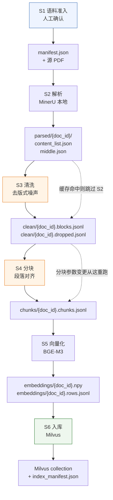

# 04 数据管线设计

> 面向群众的医疗知识问答系统 · 离线数据管线设计
> 版本：v1.0　编制日期：2026-09-21
> 上游依据：`docs/01_需求分析.md` v1.0、`docs/02_架构图.md` v1.0、`docs/03_技术选型说明.md` v1.0、`.specify/memory/constitution.md` v1.0.0
> 对应里程碑：M2 系统设计

---

## 0. 文档定位

数据管线（`02_架构图.md` §2.4 的"数据管线层"）是**离线**链路：把权威 PDF 变成可检索的向量索引。它不在问答请求路径上，因此允许慢、允许人工介入、允许重跑——但**不允许出错而不被发现**。

本文回答三件事：

| 问题 | 对应章节 |
|---|---|
| 管线怎么走？ | §1 管线总览 |
| 每一步的产出物长什么样？ | §2 数据形态总览 + 各步骤的"产出物"小节 |
| 每一步的关键设计是什么、为什么这么定？ | §4–§9 各步骤 |

### 三条贯穿管线的原则

| 原则 | 含义 | 为什么 |
|---|---|---|
| **P1 产物落盘，步骤可独立重跑** | 每一步的产出物写文件，下一步只读文件 | 解析要跑 MinerU（最贵），分块调参要反复跑（最便宜）。不落盘就无法只重跑便宜的那几步 |
| **P2 丢弃必须留痕** | 任何被清洗掉的内容都写入 `dropped` 日志 | 医疗语料的"噪声"和"正文"边界模糊。**静默丢弃等于静默篡改知识库**，而知识库是本系统唯一的依据 |
| **P3 入库即固化，参数变更即重建** | 索引与一套参数绑定，参数变了不许增量修补 | constitution N4 要求拒答可复现。新旧参数混在一个库里，复现性直接失效 |

---

## 1. 管线总览



**读图说明**：
- 橙色两步（清洗、分块）是**调参最频繁**的环节，虚线标出了两个常用的重跑起点。
- S2 解析最贵（MinerU，可能用 GPU），因此以 `source_hash` 为键缓存，内容未变则跳过。
- 每一步的产物都带 `doc_id`，多文件语料天然隔离，互不干扰。

### 步骤与产物的对照

| 步骤 | 输入 | 输出 | 可独立重跑 | 典型耗时 |
|---|---|---|---|---|
| S1 语料准入 | 人工放入的 PDF | `manifest.json` | — | 人工，分钟级 |
| S2 解析 | 源 PDF | `parsed/{doc_id}/` | ✅ | GPU 秒级 / CPU 分钟级 |
| S3 清洗 | 解析产物 | `clean/{doc_id}.blocks.jsonl` + `.dropped.jsonl` | ✅ | 毫秒级 |
| S4 分块 | 清洗后的块 | `chunks/{doc_id}.chunks.jsonl` | ✅ | 毫秒级 |
| S5 向量化 | chunk 文本 | `embeddings/{doc_id}.npy` + `.rows.jsonl` | ✅ | CPU 秒级 / GPU 更快 |
| S6 入库 | 向量 + 元数据 | Milvus collection + `index_manifest.json` | ✅（幂等） | 秒级 |

---

## 2. 数据形态总览

**这是本文档最需要被复用的一节**——上下游模块只需照这里的字段名对接。

| 阶段 | 载体 | 格式 | 位置 | 关键字段 | 是否可重建 |
|---|---|---|---|---|---|
| S1 准入 | manifest | JSON | `data/source_data/manifest.json` | `doc_id` `sha256` `权威等级` `人工确认` | ❌ **人工输入，不可重建** |
| S1 准入 | 源文件 | PDF | `data/source_data/*.pdf` | — | ❌ **唯一知识依据** |
| S2 解析 | 结构化内容 | JSON | `data/parsed/{doc_id}/content_list.json` | `type` `page_idx` `text` | ✅ 从 PDF |
| S2 解析 | 中间层 | JSON | `data/parsed/{doc_id}/middle.json` | 页级结构 | ✅ 从 PDF |
| S3 清洗 | 正文块 | JSONL | `data/clean/{doc_id}.blocks.jsonl` | `block_id` `page` `heading_path` `text` | ✅ |
| S3 清洗 | 丢弃日志 | JSONL | `data/clean/{doc_id}.dropped.jsonl` | `block_id` `drop_rule` `text` | ✅ |
| S4 分块 | 检索单元 | JSONL | `data/chunks/{doc_id}.chunks.jsonl` | `chunk_id` `text` `text_for_embedding` `page_start/end` `section` | ✅ |
| S5 向量化 | 向量矩阵 | NumPy `.npy` | `data/embeddings/{doc_id}.npy` | `float32[N, 1024]`，L2 归一化 | ✅ 但**需同模型同版本** |
| S5 向量化 | 行对齐表 | JSONL | `data/embeddings/{doc_id}.rows.jsonl` | 与 `.npy` **行号一一对应** | ✅ |
| S6 入库 | 向量库 | Milvus | 本地 Milvus 实例 | 见 §9.1 | ✅（清库重建） |
| S6 入库 | 索引凭据 | JSON | `data/index_manifest.json` | `pipeline_config_hash` `model_id` `chunk_count` | ❌ **必须与库同步，否则拒绝服务** |

> **不可重建的两项**（`source_data` 与 `manifest.json`）必须有独立备份。其余全部可以从这两项重新生成——这是把管线设计成"产物落盘 + 幂等重跑"的核心收益。

---

## 3. 语料现状（实测）

`data/source_data` 当前有 1 份文件，已实测其结构：

| 属性 | 实测值 |
|---|---|
| 文件名 | `国家基层高血压防治管理指南2025版.pdf` |
| 大小 | 1,246,571 字节（约 1.19 MB） |
| SHA-256（前 16 位） | `d6da41b5d3565c49` |
| PDF 版本 | 1.4 |
| 页数 | **15 页** |
| 内嵌位图数量 | **0**（无 `/Image` 对象） |
| 正文字符数 | **17,996 个中文字符**（另含标点/数字共 26,321 字符） |
| 每页中文字符数 | **约 1,200** |
| 生成工具 | iTextSharp 5.5.13.2 |
| 字体编码 | Identity-H CID 字体，带完整 ToUnicode CMap（文本可无损提取） |

### 这三条实测结论对设计的影响

1. **无位图 → 不需要 OCR 路径。** 该 PDF 是原生数字版，文本可直接抽取，MinerU 的 OCR 分支不会被触发。管线的图像处理分支在 V1 **没有实际输入**，但代码仍需保留——未来语料可能是扫描件。
2. **15 页 → 解析成本可忽略。** 即使纯 CPU 也只需秒到分钟级，"解析最贵"这一假设在本语料下不成立。缓存机制仍保留（面向未来语料），但不是 V1 的性能瓶颈。
3. **⚠️ 语料极小 → `top_k` 必须重估。** 实测 17,996 个中文字符、每页约 1,200 字，按当时设想的 300–500 字/块切分，**预计产出仅 35–59 个 chunk**（按纯正文估算的上界）。**该区间后经 `specs/003` 的 D1 裁决与实施修正为 300–700（见 §7），实测最终产出 65 个 chunk。** 下面的 `top_k` 论证按 35–59 的量级成立，65 与之同量级，结论不变。

   在 50 个 chunk 的规模下，`02_架构图.md` §8 暂定的 `top_k = 5` 意味着**把整个知识库的约 10% 送进提示词**。

> **建议**：V1 单文档语料下将 `top_k` 下调至 **3**。
>
> **但要注意这个判断的边界。** 用"占比"来论证 `top_k` 其实是**一个粗糙的代理指标**——真正决定回答质量的是"召回的那几条对不对"，而这由阈值（§相似度阈值）把关，不由占比把关。占比过高的真实危害是：**在只有 50 个 chunk 的库里，一条打分虚高但内容无关的段落，更容易挤进前 3 名**。
>
> 因此 §7 的自检指标里，"`top_k / chunk 总数`"只作为**异常提示**，不是硬性门槛。真正的处置顺序是：
> 1. 先看召回段落与问题的相关性（人工抽查 20 条）；
> 2. 相关性差 → 调**阈值**，而不是继续压 `top_k`；
> 3. 相关性好但排序靠后 → 那才是 V2 的 rerank 场景。
>
> 语料扩到多文件、chunk 数上千后，`top_k` 应重新评估并可能上调回 5 或更高。**这是一条随语料规模变化的参数，不是一次定死的常数。**

---

## 4. S1 语料准入（人工确认）

### 关键设计

M1 §8.2 与 constitution 都要求：**任何新增语料必须经人工确认，不做自动抓取**。因此管线的起点不是"扫描目录"，而是"读 manifest"——**没有登记在 manifest 里的 PDF，管线拒绝处理**。

这不是形式主义。它保证了两件事：一是每份入库语料都有明确的责任人确认记录；二是 `03_技术选型说明.md` 中的合规边界（只依据自有权威语料）在代码层面有对应的强制点。

### 产出物：`data/source_data/manifest.json`

```json
{
  "version": 1,
  "documents": [
    {
      "doc_id": "d6da41b5d356",
      "file_name": "国家基层高血压防治管理指南2025版.pdf",
      "sha256": "d6da41b5d3565c49...(完整 64 位)",
      "publisher": "国家卫生健康委员会",
      "publish_year": 2025,
      "authority_level": 1,
      "topics": ["高血压", "基层诊疗", "血压测量", "生活方式干预"],
      "license_note": "公开发布，使用范围待确认",
      "confirmed_by": "<人工填写>",
      "confirmed_at": "2026-09-21",
      "status": "approved"
    }
  ]
}
```

| 字段 | 约束 | 依据 |
|---|---|---|
| `doc_id` | `sha256` 前 12 位，**全局唯一且随内容变化** | 内容变更即新文档，杜绝"同名不同内容"混入 |
| `authority_level` | 1–4，对应 M1 §8.1 的权威等级。**V1 只接受 1–2 级** | M1 §8.1 |
| `topics` | 覆盖的疾病/主题范围 | M1 §8.2"覆盖可描述"——用于判断"该不该拒答" |
| `confirmed_by` / `confirmed_at` | 人工确认人与日期，**不得留空** | M1 §8.2、constitution |
| `status` | `approved` / `draft` / `revoked` | 只有 `approved` 参与索引 |

**硬性校验**（启动即失败，不静默跳过）：
- `sha256` 与实际文件内容不符 → 报错退出；
- `authority_level` 为 3 或 4 → 拒绝入库并提示 V1 范围限制；
- `confirmed_by` 为空 → 拒绝入库。

---

## 5. S2 解析

### 关键设计

| 设计点 | 决定 | 理由 |
|---|---|---|
| 解析工具 | MinerU（本地，`MINERU_MODEL_SOURCE=local`） | `03_技术选型说明.md` §1 |
| **页码来源** | 取结构化内容列表的**页级索引**，不取 Markdown | Markdown 输出不保留页码（见下） |
| 后端选择 | pipeline 后端 | 语料是原生数字版，不需要 VLM 的版面理解 |
| 缓存键 | `source_hash` = PDF 内容的 sha256 | 内容未变则跳过解析，直接复用产物 |
| 产物位置 | `data/parsed/{doc_id}/` | 以 `doc_id` 隔离，多文件互不干扰 |

### 为什么必须放弃 Markdown 输出

这是本步骤**最容易踩的坑**。MinerU 的 Markdown 输出人类可读、格式漂亮，但它**不携带页码信息**——一旦基于 Markdown 分块，页码就永久丢失，而 M1 §8.2 明确要求"解析时不得丢失页码信息"，引用卡片也依赖它。

因此管线只消费**结构化的内容列表**（每项带页级索引）。Markdown 仍生成，但**仅作为人工抽查可读性的辅助产物，不进入管线**。

### ⚠️ MinerU 版本必须锁定

**MinerU 的输出契约在版本间发生过破坏性变更**，这不是"注意一下"级别的提醒，而是会直接决定清洗代码怎么写：

| 版本段 | content_list 的 `type` 取值集合 | 噪声表达方式 |
|---|---|---|
| 2.7.x 及更早 | `text` `image` `table` `equation` `discarded` | **只有 `discarded` 一个兜底类型** |
| 3.x | `text` `image` `table` `chart` `equation` `code` `list` `header` `footer` `page_number` `aside_text` `page_footnote` | 噪声被拆成 5 个具体类型 |
| **4.x** | **整体更换契约**（`schema: docvortex.middle`），字段全变 | — |

3.x 相对 2.x 的关键变化是：**噪声从"一个 `discarded` 兜底"变成了 5 个具体类型**。这意味着同一份清洗代码在两个版本上的行为完全不同——在 2.x 下你只知道"这块被丢了"，在 3.x 下你知道"这块是因为是页脚被丢了"。

**决定**：
1. 选 **3.x 的 pipeline 后端**（能区分噪声类型，`discarded.jsonl` 的 `drop_rule` 才有意义）；
2. **MinerU 版本号写入 `index_manifest.json`**，与其他参数一起受 §10.2 的版本校验保护；
3. **禁止使用 4.x**，直到其契约稳定且有实测报告。

### 版式噪声的识别与处置（3.x）

| 类型标记 | 含义 | 处置 | 依据 |
|---|---|---|---|
| `page_number` | 印刷页码 | **丢弃** | 无检索价值；物理页码另由 `page_idx` 计算 |
| `header` / `footer` | 页眉页脚 | **丢弃** | 重复的书名/章节名，会造成跨页假重复 |
| `aside_text` | 侧边装饰文字 | **丢弃** | 版面装饰 |
| `page_footnote` | 页脚注释 | **默认保留**（`clean_drop_page_footnote=false`） | 医疗指南的页脚常是剂量或注意事项注解，**误杀代价高于噪声代价** |
| `discarded` | 解析器主动丢弃的块 | **丢弃，全文记入日志** | 2.x 下的唯一噪声类型，无法细分，只能靠人工复核 |
| `list` 且 `sub_type == "ref_text"` | 参考文献条目 | **丢弃** | 面向群众的问答不会引用文献条目 |
| `list` 且 `sub_type == "text"` | 普通条目列表 | **保留** | 指南中的"推荐要点"常以列表呈现，是高价值内容 |

### 字段访问的三个精确要求

实测确认的细节，写代码时必须按此处理（容易因"想当然"而写错）：

| 项 | 精确语义 | 常见写法错误 |
|---|---|---|
| 标题判定 | `type == "text"` **且 `"text_level"` 键存在** | ① 找 `type == "title"`（**该类型不存在**）；② 用 `item.get("text_level", 0) >= 1` 判断——**键在正文中是完全缺失的，不是 0** |
| `text_level` 值 | `1` = 一级标题，`2` = 二级……；pipeline 后端**无上限**，VLM 后端上限为 4 | 假设层级不超过 3 |
| `bbox` | 0–1000 归一化整数，**office 后端没有此字段** | 当作像素坐标使用 |

**其他确认项**：
- 表格：`table_body` 是 **HTML 字符串**（可能缺失，此时回退用 `img_path`）；`table_caption` / `table_footnote` 是**与表体分离的字符串列表**，需要显式拼回。
- 图片：`image_caption` / `image_footnote` 是列表。**注意 2.0.0 叫 `img_caption`，2.1.0 起改名**——这是锁定版本的另一条理由。
- 方程：`text_format` 恒为 `"latex"`，公式在 `text` 字段。

> **核对方法（M3 第一件事）**：解析语料后执行
> `Counter(item["type"] for item in content_list)`，
> 与本节表格逐一对照。出现本节未列出的类型 → **停止并人工决策，不得静默忽略**——未知类型意味着可能有内容被无声跳过。

### 产出物

```text
data/parsed/{doc_id}/
├─ content_list.json     # 扁平、按阅读顺序，每项带页级索引  ← 管线只读这个
├─ middle.json           # 页级中间结构，用于页码复核与调试
├─ {doc_id}.md           # 人类可读，辅助抽查，不入管线
└─ layout.pdf            # 版面可视化，人工排查解析错误用
```

单项结构示意（3.x pipeline 后端，已按实测契约书写）：

```jsonc
// 正文段落 —— 注意 text_level 键完全缺失
{"type": "text",
 "text": "在未使用降压药物的情况下，非同日 3 次测量诊室血压……",
 "bbox": [62, 480, 946, 904],
 "page_idx": 11}

// 标题段落 —— text_level 存在即为标题，值即层级
{"type": "text",
 "text": "3.2 诊断标准",
 "text_level": 2,
 "bbox": [83, 121, 917, 156],
 "page_idx": 11}

// 表格 —— 表体、表题、表注是三个分离的字段
{"type": "table",
 "img_path": "images/e3cb….jpg",
 "table_caption": ["表 3 血压水平分类"],
 "table_footnote": ["注：若收缩压与舒张压分属不同级别，取较高级别。"],
 "table_body": "<html><body><table>…</table></body></html>",
 "bbox": [62, 480, 946, 904],
 "page_idx": 11}

// 页脚注释 —— 默认保留
{"type": "page_footnote",
 "text": "* 合并糖尿病者目标值可下调。",
 "bbox": [71, 815, 915, 841],
 "page_idx": 11}
```

**`middle.json` 的页码用法与本文件不同**（实测确认）：顶层为 `pdf_info` 数组，**页级索引字段是 `pdf_info[i].page_idx`**（0-based）；而 `pdf_info[i]` 内部的块**不携带任何页码字段**——块级页码信息在解析过程中被显式删除。因此：

- 需要**块级页码** → 用 `content_list.json`（每项自带 `page_idx`）；
- 需要**页级结构复核/调试** → 用 `middle.json`。

管线的正常路径只读 `content_list.json`；`middle.json` 保留用于人工资排错。

---

## 6. S3 清洗

### 关键设计

**核心原则：清洗只做"去装饰"，绝不改写正文。** 任何对正文的增删改都发生在分块阶段且必须显式配置。清洗阶段的唯一职责是把非知识的排版残留剥掉。

| 设计点 | 决定 | 理由 |
|---|---|---|
| 标题识别 | `type == "text"` **且 `text_level` 键存在**（精确语义见 §5） | 标题**不是**独立类型；且正文中该键是**缺失**而非 0，不能用默认值判断 |
| 标题处置 | **不丢弃**，提取为 `heading_path` 元数据 | 标题是有效的章节定位信息，引用卡片可展示"第 3.2 节" |
| 页码计算 | `page = page_idx + 1`（1-based 物理页码） | 与 PDF 阅读器一致 |
| 丢弃留痕 | 每个被丢弃的块写入 `dropped.jsonl`，记录命中规则 | 原则 P2 |
| 空白处理 | 仅做首尾空白与连续空行压缩，**不做全角/半角转换、不做同义词替换** | 引用必须逐字可核对，任何字符级改写都会让"回原文核对"失败 |
| 规则版本 | 清洗规则集合有版本号，写入产物 | 规则变更需全量重建（原则 P3） |

### 为什么"丢弃留痕"不是可选项

医疗指南的边界元素很容易误判：一页页脚可能是印刷页码（噪声），也可能是重要的剂量注解（知识）。如果清洗静默丢弃，**没有任何人会发现知识库缺了一块**——而这恰恰是最危险的一类缺陷：系统会照常给出看起来正常、但有依据缺失的回答。

`dropped.jsonl` 的作用是让这件事可被人工复核：清点丢弃总量、抽查丢弃内容、发现误杀规则。

### 产出物

`data/clean/{doc_id}.blocks.jsonl`（每行一个块）：

```json
{
  "doc_id": "d6da41b5d356",
  "block_id": "d6da41b5d356:000042",
  "file_name": "国家基层高血压防治管理指南2025版.pdf",
  "page_idx": 11,
  "page": 12,
  "block_type": "text",
  "is_heading": false,
  "heading_path": ["第三章 高血压的诊断", "3.2 诊断标准"],
  "text": "在未使用降压药物的情况下，非同日 3 次测量诊室血压，收缩压≥140mmHg 和/或舒张压≥90mmHg，可诊断为高血压。",
  "char_len": 58,
  "clean_rule_version": "clean-v1"
}
```

| 字段 | 说明 |
|---|---|
| `block_id` | `{doc_id}:{全局序号6位}`，**在清洗后的块序列中稳定且唯一** |
| `heading_path` | 从文档根到当前块的标题链。**这是 `section` 元数据的来源** |
| `is_heading` | 该块本身是否为标题（标题块默认不单独成 chunk，见 §7） |
| `char_len` | 中文字符数，分块阶段的长度判据 |
| `clean_rule_version` | 规则版本，用于判断是否需要重建 |

`data/clean/{doc_id}.dropped.jsonl`（每行一个被丢弃的块）：

```json
{
  "doc_id": "d6da41b5d356",
  "block_id": "d6da41b5d356:000007",
  "page": 1,
  "drop_rule": "type:page_number",
  "block_type": "page_number",
  "text": "1",
  "char_len": 1
}
```

`drop_rule` 必须记录**命中的是哪条规则**，而不是笼统的 `"dropped"`。否则当发现误杀时，无法定位该关掉哪一条。

---

## 7. S4 分块

### 关键设计

| 设计点 | 决定 | 理由 |
|---|---|---|
| 切分单位 | **段落对齐**，不按固定字数滑动窗口 | 引用粒度是段落级（M1 §9）。滑窗会把段落拦腰截断，引用卡片就只能展示半句话 |
| 目标长度 | **300–700 中文字**（下限由 500 降为 300，上限 500 升为 700） | `specs/003` 的 D1 裁决 + 实施期修正 |
| 重叠 | **0** | 重叠会让同一段原文出现在多个 chunk 中，**破坏引用的唯一性**——用户点击引用时无法确定指向哪一条 |
| 合并方向 | 同章节内**相邻小段可合并**至 300 字下限 | 指南中短句段落很多（如条目式表述），不合并会产生大量无信息的碎块 |
| 跨章节合并 | **有限允许**：仅当两节同属一个父章节（`heading_path[:-1]` 相同）且合并后不超上限 | 父章节不同是硬边界 —— 会让 `section` 元数据失真，引用卡片显示错误的章节 |
| 跨页合并 | **受限允许**：仅当同章节内单页文本 < 下限的 50% 时 | 优先保证页码精确（页内合并）；但完全不跨页会让跨页断开的段落变成碎块 |
| 超长段落 | 按**句边界**二次切分，子块共享 `block_id` 并以 `sub_index` 区分 | 避免在句中截断导致语义残缺 |
| 表格 | **整表成一块，不切分** | 切了表头，后半张表的列就失去含义 |
| 跨文件合并 | **禁止** | 引用必须能定位到单一文件名 |
| 标题块 | 不单独成 chunk，作为 `section` 写入相邻正文块 | 单独成块的标题检索价值低，且会污染引用卡片 |

> **目标长度为什么是 300–700，而不是本节原定的 300–500。**
> 原定的「300–500 字」与「禁止跨章节合并」**在数学上互斥**：`specs/003` 对样例文档实测发现，
> **80% 的 section 不到 500 字**（52/65），如果同时禁止跨章节合并，这 52 个 section 永远凑不到
> 下限。`specs/003` 的 D1 裁决因此把目标改为 500–700 并放开「有限跨章节合并」；实施时又发现
> 下限 500 会让 **62% 的 chunk 落在下限之外**（原因是 80% 的 section 本就不到 500 字），
> 于是下限进一步降为 **300**。最终生效值是 `backend/chunk/core.py` 的 `LOW, HIGH = 300, 700`
> —— **代码是唯一权威来源**，本节与 §9.3、§12 的数值均须与之一致。

### 关键决策：用于展示的文本 ≠ 用于向量化的文本

这是本步骤最重要的设计。

指南正文大量使用"上述""该方法""如表 3 所示"等依赖上下文的表述。如果直接对正文段落做向量化，**脱离章节标题的段落语义会严重模糊**——用户问"高血压怎么诊断"，而正文段落写的是"非同日 3 次测量诊室血压……"，标题里的"诊断标准"四个字不在向量里。

因此 chunk 携带**两份文本**：

| 字段 | 内容 | 用途 |
|---|---|---|
| `text` | **纯正文原文**，一字不改 | 展示给用户、回原文核对、写入 Milvus |
| `text_for_embedding` | `heading_path` 拼接 + 正文 | **仅用于生成向量**，不展示、不入库 |

```text
text                = "在未使用降压药物的情况下，非同日 3 次测量诊室血压……"
text_for_embedding  = "第三章 高血压的诊断 > 3.2 诊断标准\n\n在未使用降压药物的情况下……"
```

这样做的收益是双向的：**检索召回率提升**（向量包含章节语义），同时**引用展示保持纯净**（用户看到的仍是原文，不会被系统拼接的标题干扰核对）。

> **一个必须避免的误解**：`text_for_embedding` 是"给模型的检索入口加了路标"，**不是**"用系统的话改写了原文"。用户核对时面对的是 `text`，与 PDF 原文逐字一致。这一区分必须写进代码注释，否则后来者很容易把两者混为一谈，进而做出"顺便把专业术语替换成口语"这类破坏溯源性的改动。

### 产出物

`data/chunks/{doc_id}.chunks.jsonl`：

```json
{
  "chunk_id": "d6da41b5d356:0007",
  "doc_id": "d6da41b5d356",
  "file_name": "国家基层高血压防治管理指南2025版.pdf",
  "text": "在未使用降压药物的情况下，非同日 3 次测量诊室血压，收缩压≥140mmHg 和/或舒张压≥90mmHg，可诊断为高血压。",
  "text_for_embedding": "第三章 高血压的诊断 > 3.2 诊断标准\n\n在未使用降压药物的情况下，非同日 3 次测量诊室血压……",
  "page_start": 12,
  "page_end": 12,
  "section": "3.2 诊断标准",
  "heading_path": ["第三章 高血压的诊断", "3.2 诊断标准"],
  "block_type": "text",
  "block_ids": ["d6da41b5d356:000042", "d6da41b5d356:000043"],
  "sub_index": 0,
  "char_len": 58,
  "source_hash": "d6da41b5d3565c49...(完整 64 位)",
  "chunk_rule_version": "chunk-v1"
}
```

| 字段 | 说明 |
|---|---|
| `chunk_id` | `{doc_id}:{序号4位}`，**分块参数不变则稳定** |
| `page_start` / `page_end` | 单页时相等；跨页合并时构成区间，引用卡片显示为"第 12–13 页" |
| `section` | 取自 `heading_path` 末级，用于引用卡片展示与前端分组 |
| `block_ids` | 溯源链：该 chunk 由哪些清洗后的块合并而成。**出问题时靠它反查原文** |
| `sub_index` | 超长段落二次切分时的子块序号，未切分时为 0 |
| `source_hash` | 完整 64 位，用于幂等入库（§10） |
| `chunk_rule_version` | 分块参数变更时递增 |

### 分块后的自检指标

分块完成即输出，供人工判定参数是否合理：

| 指标 | 合理区间 | 异常含义 |
|---|---|---|
| chunk 总数 | 35–59（基于 17,996 中文字符 / 15 页实测推算） | 显著偏离说明分块参数需调 |
| 长度中位数 | 300–700 字 | 远低于下限 → 合并规则失效；远高于上限 → 超长段落切分未生效 |
| 低于下限的 chunk 占比 | < 15% | 过高说明合并规则过于保守，会产生大量低信息碎块 |
| `top_k / chunk 总数` | 仅作异常提示，非门槛（见 §3 第 3 条） | 偏高不直接构成问题，处置顺序是先查相关性、再调阈值 |
| 页码缺失的 chunk 数 | **必须为 0** | 非 0 说明页码链路断了，引用功能不可用 |

---

## 8. S5 向量化

### 关键设计

| 设计点 | 决定 | 理由 |
|---|---|---|
| 模型 | BGE-M3，**本地权重** | `03_技术选型说明.md` §2 |
| 向量类型 | 只用**稠密向量**（1024 维） | V1 纯向量检索；稀疏/多向量表示留给 V2 |
| 输入文本 | **`text_for_embedding`** | §7 |
| 归一化 | **L2 归一化**后写入 | 归一化向量的余弦相似度 = 内积，数值稳定且与 Milvus COSINE 度量一致 |
| 批大小 | 显式配置（默认 16），不依赖库默认值 | N3 |
| 顺序保证 | 向量矩阵行序与 `rows.jsonl` 行序**严格一致** | 见下方风险 |
| 空文本 | 长度为 0 的 chunk 直接报错，不生成零向量 | 零向量与任何文本的余弦相似度都是 0，会静默污染检索 |

### 最大的风险：向量空间漂移

这是数据管线里**唯一一个会静默失效的环节**。

如果入库时用了一个版本的权重，查询时用了另一个版本（换了模型、换了归一化方式、甚至只是升级了推理库导致数值有微小差异），**检索结果会变差但不会报错**——系统会照常返回结果，只是相关性下降、拒答率上升，而排查时很难想到是模型版本问题。

**防护措施（三重）**：

1. **能力探测**：`<models>/bge-m3/config.json` 的哈希 + 权重文件大小，合成 `embed_model_fingerprint`；
2. **写入凭据**：`embed_model_fingerprint` 写入 `index_manifest.json`，同时作为建库时的常量记录；
3. **查询时校验**：后端启动时读取索引凭据并与当前加载的模型指纹比对，**不一致即启动失败并非 0 退出**（对齐 N11 的行为约定）。

> 第 3 条是关键。只在入库时记录指纹没有意义——**必须有一个读路径上的强制校验点**，否则记录只是一份无人查看的文档。

### 产出物

`data/embeddings/{doc_id}.npy`：

```text
NumPy 数组，dtype=float32，shape=(N, 1024)，N = 该文档的 chunk 数
每行已做 L2 归一化（‖v‖₂ = 1.0）
```

`data/embeddings/{doc_id}.rows.jsonl`（第 i 行描述 `.npy` 的第 i 行）：

```json
{
  "row_index": 0,
  "chunk_id": "d6da41b5d356:0007",
  "char_len": 58,
  "vector_norm": 1.0
}
```

| 字段 | 说明 |
|---|---|
| `row_index` | **与 `.npy` 的行号严格对应**，入库前必须断言 `len(rows) == npy.shape[0]` |
| `vector_norm` | 用于验证归一化确实生效（应恒为 1.0，浮点误差内） |

**为什么用 `.npy` + `.jsonl` 而不是把向量塞进 JSONL**：向量是数值密集型数据，JSON 的十进制文本表示既占空间又有精度损失。分离存储让"向量"与"元数据"各自用合适的格式，且 `.npy` 可被直接内存映射读取。

---

## 9. S6 入库

### 9.1 Milvus collection schema

| 字段 | 类型 | 来源 | 说明 |
|---|---|---|---|
| `chunk_id` | VARCHAR，主键 | `chunk_id` | 幂等键 |
| `vector` | FLOAT_VECTOR(1024) | `.npy` 第 i 行 | COSINE 度量 |
| `text` | VARCHAR | `text` | **展示用原文**，非 `text_for_embedding` |
| `doc_id` | VARCHAR | `doc_id` | 多文件隔离与按文档删除 |
| `file_name` | VARCHAR | `file_name` | 引用卡片 |
| `page_start` | INT32 | `page_start` | 引用卡片 |
| `page_end` | INT32 | `page_end` | 跨页合并时与 `page_start` 不同 |
| `section` | VARCHAR | `section` | 引用卡片显示章节 |
| `block_type` | VARCHAR | `block_type` | 前端差异化渲染（表格 vs 正文） |
| `source_hash` | VARCHAR | `source_hash` | 上游产物标识。**不用于幂等/删除**（见 §10.1） |
| `pipeline_config_hash` | VARCHAR | 计算得出 | 参数版本校验（§10） |
| **`chunk_meta`** | **JSON** | S4 记录的**剩余部分** | 见下方说明。上限 65536 字节（Milvus 对单个 JSON 字段的硬限） |

#### 关于 `chunk_meta`（`specs/005` 实施期新增）

**它装的是「S4 的整条记录，减去已经在上面单独成列的那些字段」**，即：

| 键 | 说明 |
|---|---|
| `text_for_embedding` | **真正喂给 BGE-M3 的那串文本**（章节路标 + 正文） |
| `heading_path` | 章节路标数组，如 `["1 基层高血压管理基本要求", "1.1 组建管理团队"]` |
| `block_ids` | 溯回 S3 块，可逐字定位到上游 |
| `sub_index` | 同一 `block_id` 被切分时的子块序号 |
| `char_len` | 非空白字符数（分块参数的判据） |
| `chunk_rule_version` | 产出这条 chunk 的分块规则版本 |

**为什么需要它**：`text` 列存的是**展示用原文**（不含章节路标），而向量是拿 **`text_for_embedding`**（路标 + 正文）算出来的。只存 `text` 的话，**"这条 1024 维向量到底是从哪串文本算出来的"无法核对** —— 只能拿 `text` 和 `section` 现场重拼，而重拼口径一旦与 S5 不一致，你发现不了。这正是 §8 说的那类静默漂移，`chunk_meta` 把它变成可查。

**为什么用 JSON 而不是逐个加列**：

- 用列的话要加 4 个 VARCHAR + 1 个 INT32，其中 `heading_path` 是数组、**Milvus 没有数组类型**，只能自己 `json.dumps` 再 `json.loads` —— 既然反正要编解码，不如整条塞进一个 JSON 字段。
- **S4 将来新增字段时，S6 一行都不用改、不用重建 collection。** 排除了 `SCALAR_FIELDS` 里已有的列，其余自动进 `meta`。

**两个已知约束**（`specs/005` 的 `inputs.py` V12 会在写库前拦住）：

1. **JSON 键只允许字母、数字、下划线**（Milvus 硬约束）。现有 6 个键均合规。
2. **单个 JSON 字段上限 65536 字节**。实测最大约 8 KB，8 倍余量。

> ⚠️ 另有一个 pymilvus 的坑：JSON 值里若混入 **numpy 类型**，插入会失败**且报错信息指向错误**
> （[pymilvus #2886](https://github.com/milvus-io/pymilvus/issues/2886)）。本管线从 `json.load`
> 取值，全是原生类型，不受影响；将来若直接注入向量运算结果，须先转成原生类型。

**索引配置（V1 锁定）**：`FLAT` 索引 + `COSINE` 度量。

> **对 `02_架构图.md` §7.1 的一处修订**：本文档新增了 `doc_id` 与 `pipeline_config_hash` 两个标量字段。前者支持多文档隔离与按文档删除，后者是 §10 参数版本校验的载体。`02_架构图.md` 的 schema 表应同步更新。

### 9.2 关键设计

| 设计点 | 决定 | 理由 |
|---|---|---|
| 写入粒度 | **按文件（`doc_id`）原子提交** | 一个文件要么完整入库，要么完全不入库。半份文档入库会让引用指向不存在的页码 |
| 写入顺序 | 先删同 **`doc_id`** 的旧数据，再插入 | 幂等（§10.1：`doc_id` 才是文档级幂等键，`source_hash` 不是） |
| 过滤表达式 | 按 **`doc_id`** 删除 | 支持单文件重建而不影响其他文件 |
| 索引构建 | 写入完成后统一建索引，不在写入过程中建 | 避免索引在中途状态被查询使用 |
| **禁止部分成功** | 插入行数 ≠ 预期 chunk 数 → 回滚并报错 | 与 P3 一致 |

### 9.3 产出物：`data/index_manifest.json`

这份文件是**索引的身份证**，也是后端启动时校验的对象。

> **实际落盘位置**：`med_rag\data\index_manifest.json`（即本节的 `data/`，与本文一致）。
> 回滚备份在同一目录下的 `index_backup\{doc_id}.rollback.jsonl`（仅当需要删旧数据时产生）。

```json
{
  "built_at": "2026-09-21T16:40:00+08:00",
  "collection": "med_rag_v1",
  "metric_type": "COSINE",
  "index_type": "FLAT",
  "dim": 1024,
  "total_chunks": 57,
  "documents": [
    {
      "doc_id": "d6da41b5d356",
      "file_name": "国家基层高血压防治管理指南2025版.pdf",
      "source_hash": "d6da41b5d3565c49...",
      "chunk_count": 57,
      "page_count": 15
    }
  ],
  "pipeline_config_hash": "9f2c...",
  "pipeline_config": {
    "mineru_version": "3.x.y",
    "mineru_backend": "pipeline",
    "clean_rule_version": "clean-v1",
    "chunk_rule_version": "chunk-v1+bge-m3",
    "chunk_min_chars": 300,
    "chunk_max_chars": 700,
    "chunk_overlap": 0,
    "embed_model_id": "BAAI/bge-m3",
    "embed_model_fingerprint": "a71e...",
    "embed_normalize": true
  },
  "app_config": {
    "top_k": 3,
    "similarity_threshold": 0.45
  }
}
```

---

## 10. 幂等、重跑与版本化

### 10.1 幂等键

| 层级 | 键 | 语义 |
|---|---|---|
| 文档级 | **`doc_id`**（源 PDF 内容 sha256 的**前 12 位**） | 同一份文件重复入库 = 先删后插，结果不变 |
| 块级 | `block_id` | 清洗规则不变时稳定 |
| 检索单元级 | `chunk_id` | 分块参数不变时稳定 |

**`doc_id` 与 `source_hash` 是两个不同的哈希 —— 别把后者当幂等键。**

> ⚠️ **本节原称「`source_hash`（PDF 内容 sha256）… `doc_id` 是 `source_hash` 的前 12 位」，
> 与实测不符，已于 `specs/005`（S6 入库）更正。** 实测：`doc_id` 确为源 PDF 哈希的前 12 位
> （`d6da41b5d356` ← `data/source_data/*.pdf` 的 sha256），但 chunks.jsonl 里的 `source_hash`
> 字段是 **MinerU 副本 `_origin.pdf` 的 sha256**（实测 `39ced98c…79bb8`，1,247,676 字节；
> 源 PDF 是 1,246,571 字节），依据 `backend/chunk/loader.py` 的 `resolve_source_hash`。

**为什么这件事是硬伤**：`source_hash` 依赖 MinerU 副本的字节。**换 MinerU 版本重跑解析，这个值
就会变** —— 若拿它做删除键，旧的 65 行删不掉，新旧两份并存，同一段落在检索里出现两次、
引用可能指向已作废的排版。因此：

- **`doc_id`** = 文档级幂等键与删除键。它由源 PDF 内容决定，重跑整条管线天然幂等。
- **`source_hash`** = 上游产物标识，**只照实落库，不参与删除与幂等**。

**注意 `doc_id` 与内容的关系**：内容一改，`doc_id` 就变。这带来一个需要显式处理的场景：指南修订后新版本入库，旧版本数据仍在库中。V1 的处置是**保留两者并用 `file_name` 区分**（文件名含年份）。若未来需要"同名不同版本"，须在 manifest 中引入独立的版本字段——**V1 不做，但要意识到这是已埋的坑**。

### 10.2 参数版本绑定

`pipeline_config_hash` = 所有影响产物的参数的哈希（分块参数、清洗规则版本、embedding 模型指纹）。

**写入前校验**：

```text
若 collection 已存在，且 index_manifest.pipeline_config_hash ≠ 本次计算的 hash
  → 拒绝写入，报错退出
  → 提示：参数已变更，必须显式执行全量重建
```

**为什么拒绝而不是自动全量重建**：自动重建会在无人知晓的情况下清空现有索引。如果这时重建又失败了，系统就从"可用但参数旧"变成"完全不可用"。**破坏性操作必须由人显式发起。**

### 10.3 重跑矩阵

| 变更内容 | 需重跑的步骤 | 说明 |
|---|---|---|
| 换语料文件 | S1 → S6 全部 | 新 `doc_id` |
| 清洗规则调整 | S3 → S6 | S2 解析产物可复用（最贵的一步省掉） |
| 分块参数调整 | S4 → S6 | 清洗产物可复用 |
| 换 embedding 模型 | **S5 → S6，且必须全量重建** | 新旧向量不在同一空间，混用会让检索静默劣化 |
| 调 `top_k` / 阈值 | **无需重跑** | 这是**查询期**参数，与索引无关 |

> 最后一行值得强调：`top_k` 与相似度阈值是查询期参数，**改它们不需要重建索引**。把查询期参数误当成索引期参数（写进 `pipeline_config_hash` 并触发重建）是常见的过度设计。本文档中它们被放在 `index_manifest.json` 的 `app_config` 段，仅作记录用途，**不参与 hash 计算**。

---

## 11. 失败处理

| 失败点 | 行为 | 不允许的行为 |
|---|---|---|
| manifest 缺失或 sha256 不符 | 报错退出，非 0 | 跳过该文件继续处理其他文件 |
| MinerU 权重路径不存在 | 报错退出，非 0 | 回退到联网下载 |
| 解析产物中页码字段缺失 | **报错退出** | 用 0 或 null 填充后继续 |
| 清洗丢弃比例异常（> 40%） | **告警并要求人工确认** | 静默继续 |
| 空 chunk（长度为 0） | 报错退出 | 生成零向量 |
| 向量矩阵行数与元数据行数不符 | 报错退出 | 截断到较短的一方 |
| 模型指纹与索引凭据不符 | 报错退出，非 0 | 警告后继续服务 |
| Milvus 写入行数不足 | 回滚该文件并报错 | 部分成功 |

**贯穿所有失败处理的同一条规则**：**失败必须显式，绝不静默降级**（constitution 代码规范："MUST NOT 以 try/except 吞掉证据不足、密钥缺失等失败条件"）。

数据管线里最危险的失败模式不是崩溃，而是**带着不完整的知识库继续提供服务**——用户不会收到任何异常，只会得到一个依据缺失的回答。

---

## 12. 参数清单（V1 锁定值）

| 参数 | 值 | 是否影响索引 | 变更后果 |
|---|---|---|---|
| `mineru_version` | 3.x.y（实施时锁定具体版本） | ✅ | 全量重建（输出契约可能变化） |
| `mineru_backend` | `pipeline` | ✅ | 全量重建 |
| `chunk_min_chars` | 300 | ✅ | 全量重建 |
| `chunk_max_chars` | **700**（原定 500，见 §7） | ✅ | 全量重建 |
| `chunk_overlap` | 0 | ✅ | 全量重建 |
| `chunk_merge_cross_page` | 受限允许（< 下限 50% 时） | ✅ | 全量重建 |
| `clean_drop_page_footnote` | `false`（保留） | ✅ | 全量重建 |
| `clean_rule_version` | `clean-v1` | ✅ | 全量重建 |
| `embed_model_id` | `BAAI/bge-m3` | ✅ | 全量重建 |
| `embed_normalize` | `true` | ✅ | 全量重建 |
| `embed_batch_size` | 16 | ❌ | 无（仅影响速度） |
| `index_type` | `FLAT` | ✅ | 重建索引 |
| `metric_type` | `COSINE` | ✅ | 全量重建 |
| `top_k` | **3**（原定 5，按 §3 实测下调） | ❌ | 无，改配置即生效 |
| `similarity_threshold` | 0.45（待标定） | ❌ | 无，改配置即生效 |

---

## 13. 与既有文档的一致性

| 文档 | 差异 | 处置 |
|---|---|---|
| `02_架构图.md` §7.1 | Milvus schema 缺 `doc_id`、`pipeline_config_hash` | **需同步更新** |
| `02_架构图.md` §8 | `top_k = 5`，与本文档 §3 的实测建议（3）不一致 | **需同步更新** |
| `02_架构图.md` §3 | 页码机制与本文档一致；本文档补充了清洗规则与 `dropped` 留痕 | 一致 |
| `03_技术选型说明.md` §12 | M3 验证清单第 V3 项（MinerU `page_idx` 语义） | 本文档细化为具体核对方法（§5） |

---

## 14. Constitution Check

| 原则 | 管线层面的落实 | 状态 |
|---|---|---|
| **I. 环境锁定与依赖治理** | 全管线由 `rag/python.exe` 执行；§12 参数全部显式配置，无库默认值 | ✅ |
| **II. 无据不答与强制溯源引用** | §5 放弃 Markdown 以保住页码；§6 清洗只去装饰不改写正文；§7 `chunk_id` → `block_ids` → 原文的完整溯源链；§7 禁止重叠以保证引用唯一；§8 防向量空间漂移 | ✅ |
| **III. 密钥零硬编码** | 管线只需模型路径（`MINERU_MODELS_DIR`、`EMBED_MODEL_PATH`）与 Milvus 连接串，全部走环境变量；**数据管线不持有 LLM 密钥** | ✅ |
| **IV. 紧急症状前置响应** | 管线不参与该原则。紧急词表是独立配置资产，**不通过管线生成**——词表必须人工维护，避免任何自动化引入漏检 | ✅ |
| **V. 面向群众的医疗安全边界** | §4 manifest 的 `authority_level` 与人工确认字段，从入口处拦截低权威语料 | ✅ |

**门禁结论**：无违规项。

---

## 15. M3 待验证清单

| 编号 | 验证项 | 方法 | 不通过时的处置 |
|---|---|---|---|
| P1 | MinerU 实际输出的 `type` 取值集合与版本 | 解析语料后 `Counter(item["type"] ...)` 统计，并记录 `mineru.__version__` | 未知类型 → **停止并人工决策**；回写 §5 类型表并锁定版本 |
| P2 | `page_idx` 是否为绝对物理页码 | 抽查 20 个 chunk 与 PDF 实际页码人工比对 | 修正页码换算逻辑，回写 `02_架构图.md` §3 |
| P3 | 实际 chunk 总数与长度分布 | 跑 S4 后输出 §7 的自检指标表 | 调整分块参数，重跑 S3 起 |
| P4 | `top_k` 是否应保持 3 | 用 `top_k / chunk 总数 < 5%` 判定 | 调整并回写本文档 §12 与 `02_架构图.md` §8 |
| P5 | 清洗丢弃比例是否正常 | 检查 `dropped.jsonl` 总量与抽样内容 | 调整清洗规则，回写 §6 |
| P6 | BGE-M3 在 `rag/python.exe` 下的加载 | 实际加载并编码一条文本 | **停止并请求人工决策，不得更换解释器** |
| P7 | Milvus 可用形态 | 见 `03_技术选型说明.md` §12 V1 | 见该节回退方案 |

> **实施前的前置条件**：`rag/` 当前**未安装任何依赖**（已实测：`numpy`、`torch`、`pymilvus`、`mineru`、`FlagEmbedding` 均不可导入）。M3 开工前需先按 constitution 原则 I 安装依赖并同步登记到根 `requirements.txt`。**依赖安装属于需人工确认的动作**，不得自动执行。
