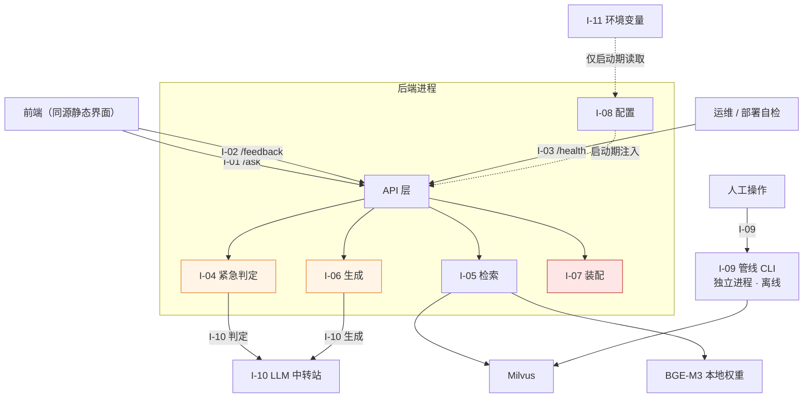

# 05 接口设计

> 面向群众的医疗知识问答系统 · 接口契约
> 版本：v1.0　编制日期：2026-09-21
> 上游依据：`docs/01_需求分析.md` v1.0、`docs/02_架构图.md` v1.0、`docs/03_技术选型说明.md` v1.0、`docs/04_数据管线设计.md` v1.0、`.specify/memory/constitution.md` v1.0.0
> 对应里程碑：M2 系统设计

---

## 1. 接口统计表

### 1.1 全部接口

| 编号 | 接口 | 类型 | 方向 | 提供方 | 调用方 | 对应需求 | 关键约束 |
|---|---|---|---|---|---|---|---|
| **I-01** | `POST /ask` | HTTP | **SSE 流式**（2026-09-27 修订，原为同步） | 后端 | 前端 | F1–F6、N12–N14 | **拒答返回 200；逐字话术由服务端拼进 `answer_text`；流式下话术 MUST 是首个 `token` 事件** |
| **I-02** | `POST /feedback` | HTTP | 异步落库 | 后端 | 前端 | F7 | 追加写，仅记录不学习 |
| **I-03** | `GET /health` | HTTP | 同步 | 后端 | 运维 / 部署自检 | N11 | **不主动调用 LLM** |
| **I-04** | `emergency_service.evaluate` | Python 函数 | 进程内调用 | 服务层 | API 层 | F4、N7、§5 | 两段式；模型失败降级**不放行** |
| **I-05** | `retrieval_service.search` | Python 函数 | 进程内调用 | 服务层 | API 层 | F2、F3、N1–N4 | **阈值判定在内**；空集不抛异常 |
| **I-06** | `generation_service.generate` | Python 函数 | 进程内调用 | 服务层 | API 层 | F2、N1、N5 | 入参只能是检索结果；**引用白名单校验** |
| **I-07** | `assembly_service.build` | Python 函数 | 进程内调用 | 服务层 | API 层 | F4–F6、N7 | **纯函数；唯一拼接逐字话术的地方** |
| **I-08** | `config.load` | Python 函数 | 启动期调用 | 服务层 | 应用入口 | N8、N11 | 缺失必需项即非 0 退出 |
| **I-09** | 数据管线 CLI | 命令行 | 人工触发 | `backend.pipeline` | 运维 | M1 §8.2 | 破坏性操作需显式确认开关 |
| **I-10** | LLM `chat/completions` | HTTP | 出向调用 | 中转站 | 问答 / 紧急判定服务 | N12、N13 | OpenAI 兼容；密钥走环境变量 |
| **I-11** | 环境变量配置 | 进程环境 | 启动注入 | 部署者 | 全部组件 | N8、N11 | **零硬编码**；无默认值兜底 |

**统计**：11 个接口。其中对外 HTTP 3 个、进程内函数 5 个、命令行 1 个、出向 HTTP 1 个、配置 1 个。

### 1.2 接口关系图



**图中红色 = 唯一拼接逐字话术的位置**（I-07）。橙色 = 两个会调用外部模型的位置（I-04、I-06）。

**这张图说明了什么**：`I-07 assembly_service.build` 是 N7 两条断言（话术前置、声明结尾）的**唯一实现点**，且它是纯函数。因此对 N7 的测试只需覆盖这一个函数加上 I-01 的端到端用例，不需要在生成链路的每个环节重复验证——**这是把"可断言的确定性输出"与"不可完全控管的模型输出"在接口层面隔开的结果**。

---

## 2. 通用约定

以下约定适用于 §3 的全部 HTTP 接口，后续各接口不再重复。

### 2.1 版本策略

**V1 不引入 `/v1` 路径前缀。**

理由：本 API 只有单一客户端（同仓库、同源托管的前端界面），无外部消费者，且接口契约在 V1 内会随实现调整。版本前缀的唯一收益是并行维护多版本，而这是本项目不需要承担的复杂度。

**升级触发条件**：出现第二个消费者（如移动端、第三方集成）时再引入前缀，届时以"当时的最新语义"为 `/v1`。**在此之前引入前缀是纯粹的仪式性成本。**

### 2.2 通用请求头

| 请求头 | 必需 | 说明 |
|---|---|---|
| `Content-Type: application/json` | ✅ | 全部 POST 接口 |
| `X-Request-Id` | ❌ | 客户端可选传入，用于日志关联。未传则服务端生成 |

**V1 无鉴权头。** M1 §4 F1 明确"不要求用户注册、登录或填写任何个人信息"。服务不暴露到公网，鉴权由部署层（反向代理 / 网络边界）承担。**若未来对外提供服务，鉴权必须在此处补齐，且需先解决 `03_技术选型说明.md` §4 的备案问题。**

### 2.3 错误响应契约

**所有非 2xx 响应使用同一结构**：

```json
{
  "error": {
    "code": "INVALID_QUESTION",
    "message": "请输入你的问题",
    "request_id": "018f3a2b-..."
  }
}
```

| 错误码 | HTTP | 触发条件 | 用户可见文案 |
|---|---|---|---|
| `INVALID_QUESTION` | 422 | 问题为空、纯空白或超长 | 请输入你的问题 |
| `SERVICE_UNAVAILABLE` | 503 | LLM 不可用或超时，且无法走拒答路径 | 服务暂时不可用，请稍后重试 |
| `INDEX_UNAVAILABLE` | 503 | 索引未加载、chunk 数为 0 | 服务暂时不可用，请稍后重试 |
| `INTERNAL_ERROR` | 500 | 未预期异常 | 服务暂时不可用，请稍后重试 |

**硬性要求**：

1. 错误响应 **MUST NOT** 包含堆栈、异常类名、内部文件路径、密钥、模型供应商原始错误体（constitution 原则 III：日志脱敏）；
2. 错误响应 **MUST NOT** 出现在"系统能够给出有依据的回答或正当拒答"的场景里——**能答就 200，答不了但理由正当也是 200**（见 §3.1.4）；
3. `request_id` **MUST** 出现在响应与服务端日志两侧，便于用户报障时定位。

### 2.4 延迟预算（N12：端到端 ≤ 10s）

| 环节 | 预算 | 超时行为 |
|---|---|---|
| 紧急词表匹配 | < 1 ms | — |
| 紧急模型补充判定（I-04 → I-10） | 2.0 s | **降级为仅词表结果，不阻塞** |
| query 向量化（BGE-M3 本地） | 0.3 s | CPU 推理，不设独立超时 |
| Milvus 检索（FLAT，< 100 chunk） | 0.1 s | 失败 → `INDEX_UNAVAILABLE` |
| 生成（I-06 → I-10） | 6.0 s | **超时 → `SERVICE_UNAVAILABLE`** |
| 装配（I-07） | < 10 ms | — |
| **正常路径合计** | **≈ 8.4 s** | 目标 ≤ 10 s |
| **拒答路径合计**（不调生成） | **< 0.5 s** | N13 |

**流式下的预算拆成两段（2026-09-27 修订）**：

上表的"合计"在流式形态下**只描述整体完成时间**，而用户感知的是**首块时间**。两者必须分开计量，否则会出现"整体 8.4s 达标、但用户盯着空白等了 8 秒"的情况 —— 那与超时失败在体验上无法区分。

| 指标 | 含义 | 目标 |
|---|---|---|
| **首字节时间**（TTFB） | 从请求到收到 `status` 帧 | **≤ 0.5 s**（不含生成） |
| **首正文块时间** | 从请求到收到**第一个 `token`** | **≤ 2.0 s**（不调 LLM 时）；**≤ 8.0 s**（含生成） |
| 整体完成 | 到 `done` 帧 | ≤ 10 s（N12） |

**紧急兜底路径在流式下反而更强**：话术是首个 `token`，因此即使后续生成失败、连接中断，用户已经看到了最关键的那句话。这是非流式方案不具备的性质。

**一个必须正视的代价**：本设计在正常路径上有**两次 LLM 调用**（紧急判定 + 生成），预算因此相当紧张。

为什么仍然保留两次：

- 紧急判定**必须**在检索之前（紧急场景下即使检索为空，前置话术也必须出现）；
- 拒绝路径**必须**不调用生成模型（N13）；
- 因此二者无法合并为一次调用。

**超时超标时的处置优先级**（不得跳级）：

1. 压缩紧急判定的输出预算（`max_tokens` 压到能表达一个布尔值即可）；
2. 评估紧急判定改用**本地小模型**，消除这次网络往返（V2 候选）；
3. **不得**通过放宽 `REQUEST_TIMEOUT_S` 来掩盖问题——那只是把超时失败从"明确报错"变成"用户长时间等待"，直接违反 N14。

**成本提示**：每一次**词表未命中**的提问都会产生一次额外的 LLM 调用（哪怕问题明显与紧急无关）。这是为"漏检即安全事故"（M1 §5.2）付的保险费，属有意为之。

---

## 3. 对外 HTTP 接口

### 3.1 I-01 `POST /ask`

**用途**：单轮问答主入口。前端提交一个问题，返回完整的结构化回答体。

**调用方**：前端（同源静态界面，2026-09-27 由 Streamlit 变更，见 `docs/03` §6）。
**SSE 流式**（2026-09-27 由同步阻塞变更，理由见 §3.1.1）。

#### 3.1.1 为什么改为流式（2026-09-27 修订）

> **本节原为"为什么不流式"，主张 V1 同步阻塞。该结论已被 `specs/006-medical-qa-input`
> 推翻（人工裁决），原文理由保留在下方"原来的顾虑"中 —— 它并没有消失，只是被处理了。**

**现在的方案**：以 SSE（`text/event-stream`）流式应答，事件序列为

```text
status  →  citations  →  token*  →  done
```

其中 `done` 帧**逐字段复用** §3.1.3 的响应契约，因此前端解析字段的代码在后续模块
接入时不需要改动。线格式契约见 `specs/006-medical-qa-input/contracts/sse.md`。

**N7 的断言点下移，但没有消失**：

| | 非流式（原方案） | 流式（现方案） |
|---|---|---|
| 断言 | `answer_text.startswith("请立即就医…")` | **第一个 `token` 事件的内容 == 逐字话术** |
| 顺序控制权 | 服务端拼装单字符串 | 服务端决定事件顺序，前端只按到达顺序追加 |
| 前端风险 | 无（只渲染成品） | **必须只追加、不重排** |

之所以流式成立，是因为把话术固定为**首个 `token` 事件**后，"第一句是什么"仍由服务端
单方面决定。**但这个保证是有条件的**：若前端在收到首块之前先渲染了占位内容，或在终帧
到达后重排节点，N7 就真的失守了。因此：

- 前端 MUST 按到达顺序追加，MUST NOT 对内容块重排；
- 前端 MUST 在 `done` 到达后**以 `answer_text` 为准**校正已渲染内容（§3.1.5 的要求在
  流式形态下的实现方式：渐进渲染只是预览，最终显示的必须与服务端逐字一致）。

**原来的顾虑（保留原文）**：

> N7 要求紧急话术出现在回答的**第一句**。流式输出意味着前端可能在收到完整回答前就开始
> 渲染，一旦渲染逻辑有瑕疵（如先渲染模型正文、再插入前置话术），用户看到的第一句就不是
> 那句话——**而这恰恰是本项目最不能出错的一条**。

这条顾虑依然成立，只是处理方式从"取消流式"改成了"固定首个事件 + 禁止重排 + 终帧校正"。
**若这三条约束在实现中被破坏，应回到非流式方案**，而不是继续在流式上打补丁。

#### 3.1.2 请求

```json
{
  "question": "我最近血压有点高，多少算高血压？"
}
```

| 字段 | 类型 | 必需 | 约束 |
|---|---|---|---|
| `question` | string | ✅ | 去除首尾空白后长度 **1–200** 字符 |

**校验规则**：

| 情况 | 响应 |
|---|---|
| 缺失 / 空串 / 纯空白 | 422 `INVALID_QUESTION` |
| 长度 > 200 | 422 `INVALID_QUESTION` |

**上限 200 的依据**：M1 定义的是单轮、非专业的口语化提问（"体检说甲状腺结节 3 类是什么意思"），200 字符足以覆盖。超长输入既不服务真实场景，又会放大提示词注入与成本风险。**这是产品边界的显式表达，不是技术限制。**

#### 3.1.3 响应 `200 OK`

```json
{
  "answer_id": "018f3a2b-7c41-7b3e-9f2a-1d4c8e5b0a11",
  "is_refusal": false,
  "emergency": { "triggered": true },
  "risk_level": "immediate",
  "answer_text": "请立即就医或拨打急救电话。以下信息仅供参考。\n\n高血压的诊断标准为……【1】。合并糖尿病者……【2】",
  "citations": [
    {
      "citation_id": 1,
      "file_name": "国家基层高血压防治管理指南2025版.pdf",
      "page_start": 12,
      "page_end": 12,
      "section": "3.2 诊断标准",
      "block_type": "text",
      "text": "在未使用降压药物的情况下，非同日 3 次测量诊室血压，收缩压≥140mmHg 和/或舒张压≥90mmHg，可诊断为高血压。",
      "score": 0.71
    }
  ],
  "disclaimer": "以上为基于知识库的参考信息，不能替代执业医师的当面诊断。"
}
```

**字段说明**：

| 字段 | 类型 | 说明 |
|---|---|---|
| `answer_id` | string (UUID) | 本次回答的唯一标识。用于 `POST /feedback` 关联与日志追踪 |
| `is_refusal` | boolean | 是否为拒答。**拒答是正常输出，不是错误**（F6） |
| `emergency.triggered` | boolean | 是否触发紧急前置话术。前端据此决定是否用醒目样式渲染首句 |
| `risk_level` | enum | `immediate` / `soon` / `observe` / `none` |
| `answer_text` | string | **完整最终文本**，已含前置话术与正文（见 §3.1.5） |
| `citations` | array | 引用来源列表，按 `citation_id` 升序 |
| `disclaimer` | string | 免责声明逐字文本 |

**`answer_text` 与 `disclaimer` 的关系**：`answer_text` **已包含** `disclaimer` 作为结尾。`disclaimer` 字段单独返回是为了让前端可以独立做样式处理（如弱化显示），**不是为了拼接**。

#### 3.1.4 四种结果形态与 HTTP 状态码

这是本接口最需要精确的一块。**能否给出回答**与**系统是否正常**是两件事，必须分开表达：

| 场景 | 紧急 | 检索 | LLM | 响应 | HTTP |
|---|---|---|---|---|---|
| **正常回答** | — | 命中 | 可用 | `is_refusal=false`，含引用 | **200** |
| **正当拒答** | 未触发 | 空 / 低于阈值 | **不调用** | `is_refusal=true`，兜底话术 | **200** |
| **紧急兜底** | **触发** | 空 / 低于阈值 | 视场景 | `is_refusal=true` + **前置话术** | **200** |
| **能力未就绪** | 未触发 | **模块未建成** | 未建成 | `is_refusal=true` + **未就绪文案** | **200** |
| **系统故障** | 未触发 | 命中 | 不可用 | `error` 体 | **503** |

> **第五种形态：能力未就绪（2026-09-27 增补）**
>
> 当检索或生成模块**尚未建成**（而非"检索过但没命中"）时，返回 200 与一段明确的
> 未就绪文案，**MUST NOT 复用拒答兜底话术**。
>
> 理由是本表规则 3 的镜像：把"能力没建成"说成"知识库没内容"，用户会以为换个问法
> 也许有 —— 而实际是问什么都一样。这与"把 LLM 故障伪装成拒答"是同一类误导，
> 只是一个发生在能力缺失、一个发生在基础设施故障。
>
> 该形态属于过渡期：检索模块接入后自动消失，不再是可选项。

**三条判定规则**：

1. **紧急判定优先于一切。** 只要 `emergency.triggered == true`，无论检索结果如何、LLM 是否可用，**都返回 200 且首句必须是逐字话术**。紧急话术完全由服务端生成（I-07），不依赖任何外部依赖——**这也是为什么 LLM 故障时它仍然能正常工作**。
2. **拒答返回 200。** F6 明确"拒答是设计内的正常输出，前端不得呈现为错误、异常或系统故障"。用 4xx/5xx 表达拒答会直接违背这条需求。
3. **只有"本该能答、但基础设施坏了"才返回 503。** 把 LLM 故障伪装成拒答是**误导**：用户会以为"这个知识库里没有相关内容"，而实际上是系统坏了；运维上也无法从指标里区分"知识库覆盖不足"与"服务不可用"——前者要补语料，后者要修服务，是完全不同的处置。

#### 3.1.5 `answer_text` 的拼装契约（N7 的落点）

**服务端 MUST 返回完整最终文本**，即：

```text
answer_text = [紧急话术 + "\n\n"] + 知识正文或兜底话术 + "\n\n" + 免责声明
```

**前端 MUST 直接渲染 `answer_text` 整体，MUST NOT 自行拼接或改写其中任何部分。**

**为什么把话术放进 `answer_text` 而不是让前端拼**：N7 要求紧急话术是"第一句"、免责声明是"结尾"。如果由前端拼接，这条断言就**分裂在客户端与服务端两侧**——服务端测试全绿，前端一个渲染顺序的 bug 就能让用户看到的第一句不是那句话，而服务端无从察觉。

把完整文本收在服务端，意味着 **N7 的两条断言可以针对单个字符串完成**：

```python
assert response.answer_text.startswith("请立即就医或拨打急救电话。以下信息仅供参考。")
assert response.answer_text.endswith("以上为基于知识库的参考信息，不能替代执业医师的当面诊断。")
```

这两条断言对**所有**路径成立（正常、拒答、紧急兜底），因为拼装只发生在 I-07 一处。

#### 3.1.6 `risk_level` 的取值规则

| 条件 | `risk_level` |
|---|---|
| `emergency.triggered == true` | **`immediate`**（无条件） |
| 否则，检索到的原文表述为急症/危重 | `immediate` |
| 否则，原文表述为"需就医""建议专科评估" | `soon` |
| 否则，原文表述为常见/自限性且无危险信号 | `observe` |
| 拒答（无原文依据） | `none` |

> **⚠️ 这条规则是对 M1 §3.1 的一处补充，需你确认。**
>
> M1 §3.1 说"等级**必须有原文依据**"，同时说"若检索结果不足以支撑任何等级判断，走拒答流程"。但 M1 §5 的紧急判定**不依赖原文**（词表命中或模型判定即触发）。
>
> 于是存在一个 M1 未覆盖的组合：**紧急触发 + 检索为空**。此时按 §3.1 应判 `none`，但界面会同时显示"立即就医"话术和"无风险等级"——自相矛盾，且可能被用户读成"系统说没事"。
>
> **本文档的处置**：紧急触发时 `risk_level` 无条件为 `immediate`，因为**紧急判定本身即是依据**（词表命中是比原文表述更强的信号）。这与 M1 §3.1 的"必须有依据"不冲突——词表就是依据，只是它不来自检索结果。

#### 3.1.7 引用标记契约

正文中的引用标记格式为 **`【n】`**（中文方括号 + 阿拉伯数字），`n` 与 `citations[].citation_id` 一一对应。

**为什么不使用 `[1]`**：中文医学指南正文普遍使用 `[1]` 作为参考文献标号。若采用同一形式，**模型可能把原文自带的文献标号误当作引用标记输出**，导致引用指向错误来源。`【】` 在指南正文中几乎不出现，冲突概率低。

**校验规则**（在 I-06 内执行）：

1. 提取正文中全部 `【n】`；
2. 剔除不在本次检索结果白名单内的 `n`；
3. 若剔除后**不存在任何有效标记**，判定为引用失效 → **转拒答**（不返回无依据的正文）。

> **已知局限**：本校验只能保证"出现的标记都有效"，**无法保证"每处知识性陈述都带标记"**。后者需要句级语义比对，属评估范畴而非接口层能解决的。`docs/05_评估方案`（M3）应以人工抽检覆盖这一项——这正是 M1 验收标准 1 的做法。

#### 3.1.8 契约上刻意不暴露的字段

| 未暴露项 | 理由 |
|---|---|
| `emergency.source`（`lexicon`/`model`/`both`/`degraded`） | 纯运维信息，客户端无用途。暴露会把内部实现细节固化进公开契约，未来更换判定实现就要改契约。**保留在服务端日志**——`02_架构图.md` §5 提出该字段的理由（区分词表失效与接口故障）本就属于日志分析，服务端保留即已满足 |
| `refusal_reason_code` | `02_架构图.md` §6 明确"四条拒答路径共用同一装配出口，拒答内部不可区分"。暴露失败原因会让用户看到系统内部状态，也让"拒答不对用户呈现为故障"的设计意图落空 |
| `matched_terms`（命中的紧急词） | 紧急词表是安全资产，其内容不应出现在任何客户端可见的位置 |

---

### 3.2 I-02 `POST /feedback`

**用途**：记录"引用是否对得上原文"的用户反馈（F7）。

**调用方**：前端。**异步落库，不阻塞回答。**

#### 请求

```json
{
  "answer_id": "018f3a2b-7c41-7b3e-9f2a-1d4c8e5b0a11",
  "verdict": "mismatch",
  "comment": "第二条引用说的不是这个意思"
}
```

| 字段 | 类型 | 必需 | 约束 |
|---|---|---|---|
| `answer_id` | string | ✅ | UUID 格式 |
| `verdict` | enum | ✅ | `match` / `mismatch` |
| `comment` | string | ❌ | ≤ 200 字符 |

#### 响应 `202 Accepted`

```json
{ "recorded": true }
```

#### 关键设计

| 设计点 | 决定 | 理由 |
|---|---|---|
| 状态码 | **202 而非 200** | 语义是"已接受待处理"，与"同步完成"区分开 |
| 存储 | 追加写 `data/feedback/{yyyymmdd}.jsonl` | 只增不改，天然可审计 |
| `answer_id` 校验 | **不校验其存在性** | 系统不存回答（M1 §7.2：不做历史记录），只做日志关联。校验存在性等于变相建立回答存储，违反范围边界 |
| 是否影响回答 | **否** | F7 明确"MVP 阶段仅记录，不做自动学习" |
| 重复提交 | 允许 | 追加写，不去重。前端应做按钮置灰 |
| 限流 | V1 不做 | 服务不暴露公网；前端为单一可信客户端。**若对外提供服务，此处必须补限流** |

**反馈的用途**：M1 F7 说目的是让"引用是否真实"这一核心假设**可被持续观测**。因此 `mismatch` 记录必须包含足够复现的信息——日志中除请求体外，**服务端还应追加记录该 `answer_id` 对应的引用列表快照**（不含用户问题原文，降低隐私面）。否则事后无法判断用户说的"对不上"指的是哪一条。

---

### 3.3 I-03 `GET /health`

**用途**：部署后自检与运维探活。

**调用方**：运维、部署脚本、容器健康检查。

#### 响应 `200 OK`（全部关键项正常）

```json
{
  "status": "ok",
  "checks": {
    "config": {
      "ok": true,
      "missing_required": []
    },
    "index": {
      "ok": true,
      "collection": "med_rag_v1",
      "total_chunks": 57,
      "pipeline_config_hash": "9f2c...",
      "built_at": "2026-09-21T16:40:00+08:00"
    },
    "embedding_model": {
      "ok": true,
      "model_id": "BAAI/bge-m3",
      "fingerprint": "a71e...",
      "matches_index": true
    },
    "milvus": {
      "ok": true,
      "latency_ms": 3
    },
    "llm": {
      "ok": true,
      "reachable": "not_probed"
    }
  }
}
```

#### 响应 `503 Service Unavailable`

任一**关键项**失败时，`status` 为 `"down"`，对应 `checks.*.ok` 为 `false`。

#### 关键设计

| 设计点 | 决定 | 理由 |
|---|---|---|
| **LLM 是否主动探测** | **否**，固定返回 `"reachable": "not_probed"` | 健康检查会被高频轮询，每次探测都是一次真实计费调用。**用探活把 LLM 费用打上去是荒谬的**。只校验配置项存在 |
| `matches_index` | **必须检查** | 这是 `04_数据管线设计.md` §8 "向量空间漂移"防护的**读路径强制校验点**。指纹不一致必须暴露，否则检索会静默劣化 |
| Milvus | 做一次轻量调用并记录延迟 | 廉价且能真实反映连通性，与 LLM 不同 |
| 关键项 | `config`、`index`、`embedding_model`、`milvus` | 任一失败 → 503 |
| 非关键项 | `llm` | 失败不导致 503（用户仍可能得到拒答或紧急兜底），但 `status` 降为 `"degraded"` |

**`status` 取值语义**：

| 值 | 含义 | HTTP |
|---|---|---|
| `ok` | 全部检查通过 | 200 |
| `degraded` | 关键项通过，非关键项异常（如 LLM 不可达） | 200 |
| `down` | 任一关键项失败 | 503 |

`degraded` 返回 200 是刻意的：容器编排不应因为 LLM 波动就重启后端——重启不会修复外部服务，只会让本来能提供"拒答"和"紧急兜底"的能力也一并失去。

---

## 4. 服务层内部接口

服务层接口是 Python 函数契约（constitution：函数签名 MUST 带类型注解，公开函数 MUST 带返回类型注解）。数据模型用 Pydantic 定义，理由见 `03_技术选型说明.md` §5。

### 4.1 I-04 `emergency_service.evaluate`

```python
def evaluate(question: str) -> EmergencyVerdict: ...
```

```python
class EmergencyVerdict(BaseModel):
    triggered: bool
    source: Literal["lexicon", "model", "both", "degraded"]
    matched_terms: list[str]      # 仅用于日志，不进入任何响应体
    model_raw: str | None         # 模型原始输出，仅用于日志
```

| `source` 取值 | 含义 |
|---|---|
| `lexicon` | 仅词表命中 |
| `model` | 仅模型补充判定命中 |
| `both` | 两段均命中 |
| `degraded` | 词表未命中且模型调用失败 → `triggered=False` |

> **`source` 取值的一处统一**：`02_架构图.md` §2.2 写作 `lexicon | model | both`，而 §5 的流程图引入了 `degraded`。**本文档取四值版本为准**，`02_架构图.md` §2.2 需同步更新。

**关键约束**：

1. **降级方向必须偏保守**：模型调用失败 → `triggered=False` 且 `source="degraded"`，**绝不向上抛异常**。抛异常会让整条链路中断，用户连"检索不到就拒答"都得不到。
2. **`degraded` 必须产生告警级日志**。这是唯一一个"系统能力实际下降但用户无感"的状态，不告警就永远不会被发现。
3. 词表命中时**不再调用模型**（省一次 LLM 往返，也是延迟预算里 2s 的来源）。

### 4.2 I-05 `retrieval_service.search`

```python
def search(
    question: str,
    query_vector: list[float],
    top_k: int,
    threshold: float,
) -> RetrievalResult: ...
```

```python
class RetrievedPassage(BaseModel):
    chunk_id: str
    file_name: str
    page_start: int
    page_end: int
    section: str | None
    block_type: str
    text: str
    score: float                       # 恒为余弦相似度，见下方约束 5

class RetrievalResult(BaseModel):
    passages: list[RetrievedPassage]   # 按融合排名降序
    top_score: float | None            # 结果中最大余弦；空集为 None；全关键词命中为 0.0
    is_empty: bool                     # 最终结果为空
    below_threshold: bool              # 有候选，但最高余弦仍低于阈值
```

**关键约束**：

1. **阈值判定在服务内部完成**，调用方只读 `is_empty`。把阈值比较散落到调用方，是让 N3（参数显式配置）失效的常见方式。
2. **检索为空是正常返回值，不是异常**（`02_架构图.md` §2.3）。抛异常会诱导调用方用 try/except 包住它，而 constitution 明令禁止用 try/except 吞掉"证据不足"。
3. `top_k` 与 `threshold` 由调用方显式传入而非读全局默认值——便于测试时注入不同参数，也符合 N3。
4. `below_threshold` 与"完全为空"分开记录：二者的拒答率若一起上升，处置完全不同（前者调阈值或补 BM25，后者查索引是否损坏）。
5. `score` **恒为余弦相似度**，MUST NOT 写入融合分。前端会把 `score` 直接显示给用户，且阈值判定用的就是它——两者必须是同一把尺子。

---

> ### §4.2 修订记录（2026-09-28，specs/008 混合检索 / S9）
>
> 本节原按**单路语义检索**写成。S9 落地混合检索（语义 + BM25）后，三处必须扩展。
> 依据：`specs/008-hybrid-retrieval/research.md` R7、`contracts/retrieval.md` §2，
> 以及 2026-09-28 的两项人工裁决。

**（一）签名增加 `query_vector`**

原签名 `search(question, top_k, threshold)` 里没有查询向量——但它**已经由 S8 在
`POST /ask` 的留存环节算好了**（`backend/api/capture.py`），当时只是被丢弃。
让检索自己重新编码会同时造成两件事：每次提问多 100–300 ms 的 CPU 推理，以及
**第二个编码入口**——而 `backend/embed/model.py` 被定为「全项目唯一的编码口径定义」
（specs/004 的 D3 裁决），S8 整篇规格都在防第二入口。

因此向量由调用方传入。**检索路径 MUST NOT 出现任何编码调用。**

**（二）阈值的适用对象：只管语义路**

混合检索下"命中"横跨两条路。若阈值仍只卡余弦，用户照抄指南里的罕见术语时
BM25 的精确命中会被判为不相关并走拒答——而"照抄术语能命中"正是引入混合检索的
全部理由。故候选的纳入条件为：

```
纳入 ⟺ (余弦 ≥ threshold)
       或 (BM25 名次 ≤ LEXICAL_ADMIT_RANK 且 查询词覆盖率 ≥ LEXICAL_MIN_COVERAGE)
```

**为什么准入还需要"查询词覆盖率"**：BM25 名次单独不可用——它对任何查询都必然
返回前 N 名，包括「今天晚饭吃什么好」这种与知识库完全无关的提问。实测（语料
65 chunks）：该提问 top-3 的覆盖率仅 0.20，而「氢氯噻嗪」这类术语照抄是 1.00。
覆盖率编码的直觉是：**关键词准入存在的理由是"用户照抄术语"——照抄时查询词基本
都在库里；闲聊式提问的大部分词库里根本没有。** 它与语料规模无关。

（另两个候选判据已被实测否掉，记录在此以免重复尝试：**IDF 门槛**——「晚饭」
idf=3.78、「好」idf=2.69，比「高血压」的 0.42 还高，分不开；**余弦下限**——
无关提问最高余弦 0.5198，高于术语问题的 0.5023，同样分不开。）

**（三）三字段语义**

```python
纳入的候选按融合排名降序取前 top_k

top_score        = max(余弦) if passages else None   # 全关键词命中时 => 0.0
is_empty         = len(passages) == 0
below_threshold  = 有候选存在，且其中最高余弦仍 < threshold
```

`below_threshold` 独立于 `is_empty`：`is_empty=True` 含两种情形——**完全没命中**
（无候选，`below_threshold=False`）与**命中但不够像**（有候选全不达标，
`below_threshold=True`）。约束 4 要求二者可区分，靠的正是这个字段。

**（四）未变的四条约束**

上方的 1–5 全部继续有效。特别是约束 2：**检索为空仍是正常返回值**，
基础设施失败（向量库不可达、维度不符）才抛 `RetrievalError`——两者 MUST NOT 混用。

### 4.3 I-06 `generation_service.generate`

```python
def generate(question: str, passages: list[RetrievedPassage]) -> GenerationResult: ...
```

```python
class GenerationResult(BaseModel):
    answer_text: str               # 已剥离无效标记的正文（不含话术与声明）
    used_citation_ids: list[int]
    is_citation_failure: bool      # 全部标记失效 → True
    raw_model_output: str          # 仅日志，MUST NOT 进入响应体
```

**这是全系统唯一"内容由模型产出"的接口**，也是最需要设限的地方：

| 约束 | 说明 |
|---|---|
| **入参只有检索结果** | 不存在任何传入模型内部知识的通道。函数签名本身即是 N1 的边界 |
| `passages` 为空 | **MUST 抛 `ValueError`**，不允许"无上下文生成"。这条断言比注释可靠 |
| 引用白名单校验 | 在本函数内完成（§3.1.7） |
| `is_citation_failure=True` | 调用方**MUST**转拒答，不得返回 `answer_text` |
| `raw_model_output` | 只写日志。**MUST NOT** 出现在任何 HTTP 响应中——它可能包含模型幻觉出的内容 |
| 温度、`max_tokens` | 显式配置传入，不依赖默认值（N3） |

### 4.4 I-07 `assembly_service.build`

```python
def build(
    *,
    verdict: EmergencyVerdict,
    retrieval: RetrievalResult,
    generation: GenerationResult | None,
    config: AppConfig,
) -> AnswerBody: ...
```

| 约束 | 说明 |
|---|---|
| **纯函数** | 无 I/O、无网络、无随机。给定相同入参，输出逐字节相同——这是 N4（可复现）与 N7（可断言）的共同基础 |
| **唯一拼接逐字话术的位置** | 全仓检索这两句逐字文本，**只应命中本函数**。任何其他位置的重复出现都应在代码评审中被拒绝 |
| `generation=None` | 表示走拒答路径，装配兜底话术 |
| `verdict.triggered=True` | **无条件**在 `answer_text` 最前面加逐字话术，且强制 `risk_level="immediate"` |
| 免责声明 | **所有路径**（含拒答）末尾必加 |

**为什么不把这些逻辑放在 API 层**：API 层负责协议转换（HTTP ↔ 数据模型），装配负责业务规则。混在一起会让 N7 的断言必须起一个真实的 HTTP 服务才能测试，而纯函数可以直接单元测试。

### 4.5 I-08 `config.load`

```python
def load() -> AppConfig: ...   # 缺失必需项 → 抛异常（调用方以非 0 退出）
```

**关键约束**：

1. 必需项缺失 → **抛异常并终止启动，非 0 退出**（N11）。**不存在"使用默认值继续"的分支**；
2. 配置在**启动期一次性加载**并注入各组件。**MUST NOT 在请求路径上读环境变量**——否则运行中改环境变量会导致行为不一致，N4 失效；
3. 变量清单以 `02_架构图.md` §10 与 `04_数据管线设计.md` §12 为唯一权威来源，**本接口不重复定义**；
4. 报错信息中**MUST NOT 回显变量值**，只报变量名（原则 III：日志脱敏）。

---

## 5. I-09 数据管线接口（命令行）

**用途**：离线构建与维护向量索引。产物契约见 `04_数据管线设计.md`。

**调用方**：人工（运维）。**不属于运行时接口，不被后端进程调用。**

```text
D:/zg6_Project/9/med_rag/rag/python.exe -m backend.pipeline <子命令> [选项]
```

| 子命令 | 作用 | 主要选项 |
|---|---|---|
| `intake` | 校验 manifest 与源文件一致性 | `--manifest <path>` |
| `parse` | S2 解析（MinerU） | `--doc-id <id>` `--force` |
| `clean` | S3 清洗 | `--doc-id <id>` |
| `chunk` | S4 分块 | `--doc-id <id>` |
| `embed` | S5 向量化 | `--doc-id <id>` |
| `index` | S6 入库 | `--doc-id <id>` \| `--all` |
| `verify` | 自检：行数对齐、页码完整、模型指纹一致 | `--doc-id <id>` |
| `rebuild` | **全量重建**（破坏性） | `--confirm-rebuild` |

**退出码**：

| 码 | 含义 |
|---|---|
| 0 | 成功 |
| 1 | 参数错误 |
| 2 | 校验失败（manifest 不符、行数不齐、页码缺失、丢弃比例异常） |
| 3 | 外部依赖不可用（MinerU 权重、Milvus、模型加载） |

**关键设计**：

1. **`rebuild` 必须带 `--confirm-rebuild` 才执行**（`04_数据管线设计.md` §10.2）。破坏性操作必须由人显式发起，不能因为"参数变了"就自动清库。
2. **每个子命令只做一步，只读上一步的产物**（原则 P1）。不提供"一步到位的黑盒"——那会让"只想改分块参数却被迫重跑解析"成为常态。
3. **`verify` 是独立子命令而非内置步骤**。它要在"入库前后都能单独跑"，用于排查"库里的数据和磁盘上的产物是否一致"。

---

## 6. I-10 外部依赖出向接口（LLM）

**用途**：调用 OpenAI 兼容端点的 `chat/completions`。

**提供方**：中转站（`LLM_BASE_URL`）。**本项目是调用方**。

### 6.1 两处调用点的参数差异

同一端点被两个服务调用，但参数**刻意不同**：

| 项 | I-04 紧急判定 | I-06 知识生成 |
|---|---|---|
| `temperature` | 0 | 0 |
| `max_tokens` | **32** | 1024 |
| `response_format` | `{"type": "json_object"}` | 不设置（纯文本） |
| 预期输出 | `{"emergency": true}` | 含 `【n】` 标记的中文正文 |
| 超时 | 2.0 s | 6.0 s |
| 失败行为 | 降级为仅词表，不阻塞 | `503 SERVICE_UNAVAILABLE` |

**为什么紧急判定用 JSON 模式而生成用纯文本**：

- 紧急判定的输出**只有一个布尔值**。JSON 模式把解析从"猜模型的措辞"变成"读一个字段"，且 `max_tokens=32` 从物理上排除模型展开论述的可能——**这是延迟预算里 2s 能够成立的关键**。
- 知识生成需要自然的中文段落。套 JSON 会给每个换行和引号引入转义开销与出错面，而引用标记 `【n】` 本身已是易于正则提取的稳定形态。**用 JSON 包一层没有换到任何稳健性。**

> **注**：使用 JSON 模式时，提示词中必须出现 "json" 字样（供应商要求）。此为已知实现约束，写入提示词模板即可。

### 6.2 出向请求的构造约束

| 约束 | 说明 |
|---|---|
| 密钥来源 | 仅从环境变量 `AGICTO_API_KEY` 读取（原则 III）。**MUST NOT** 出现在日志、异常、提示词中 |
| 请求体内容 | **仅包含**：系统提示词、检索到的原文段落、用户问题。**MUST NOT** 包含 `answer_id`、客户端 IP、任何用户标识 |
| 错误映射 | 供应商原始错误体 **MUST NOT** 透传给客户端，只记日志（§2.3 硬性要求 1） |
| 重试 | **不重试**。V1 的处置是明确失败（降级或 503），而非静默重试——重试会把 6s 预算变成 12s，直接击穿 N12 |

**关于"不重试"的取舍**：重试能提高成功率，但代价是延迟不可预测，而 N12 是一个硬指标。**在"快而明确地失败"与"慢而可能成功"之间，本项目选前者**——因为用户等待 12s 后仍可能失败，而 6s 后的明确提示让他可以立刻重试或改问。

---

## 7. I-11 配置接口（环境变量）

| 项 | 说明 |
|---|---|
| 载体 | 进程环境变量（经 `.env` 载入） |
| 读取时机 | **仅启动期**（I-08） |
| 权威清单 | `02_架构图.md` §10（运行时）+ `04_数据管线设计.md` §12（管线参数） |
| 必需项缺失 | 启动失败，非 0 退出，**无默认值兜底** |
| 密钥 | `.env` 列入 `.gitignore`；仓库只保留 `.env.example`，值为占位符 |

**本文档不重复列出变量清单**——重复定义必然导致两份文档漂移，而配置漂移正是原则 I 要防的东西。**唯一权威来源是上述两份文档。**

---

## 8. 与既有文档的差异（需同步修订）

| 文档 | 差异 | 处置 |
|---|---|---|
| `02_架构图.md` §2.2 | `emergency.source` 写作 `lexicon \| model \| both`，缺 `degraded`；且该字段被列入响应体 | **§5 取四值版本；响应体不再暴露该字段**（§3.1.8） |
| `02_架构图.md` §2.2 | 响应体 `citations` 用 `page`，本文档拆为 `page_start` / `page_end` | 以本文档为准（跨页 chunk 需要区间） |
| `01_需求分析.md` §3.1 | 未定义"紧急触发 + 检索为空"时 `risk_level` 的取值 | **§3.1.6 补充规则，需人工确认** |
| `02_架构图.md` §8 | `top_k = 5` | 与 `04_数据管线设计.md` §3 的实测建议（3）冲突，**以 3 为准** |
| `02_架构图.md` §7.1 | Milvus schema 缺 `doc_id`、`pipeline_config_hash` | 以 `04_数据管线设计.md` §9.1 为准 |

---

## 9. Constitution Check

| 原则 | 接口层面的落实 | 状态 |
|---|---|---|
| **I. 环境锁定与依赖治理** | I-09 命令行以 `rag/python.exe` 绝对路径书写；I-11 参数显式配置无默认兜底 | ✅ |
| **II. 无据不答与强制溯源引用** | I-01 拒答返回 200 而非错误；I-05 空集为正常返回值而非异常；I-06 入参只接受检索结果、引用白名单校验、全部失效即转拒答；`citations` 携带文件名 + 页码区间 + 原文 | ✅ |
| **III. 密钥零硬编码** | I-10 密钥仅走环境变量；§2.3 禁止错误响应含密钥/堆栈/供应商原始错误体；I-08 报错只报变量名不回显值 | ✅ |
| **IV. 紧急症状前置响应** | I-07 是唯一拼接逐字话术的纯函数；§3.1.5 要求 `answer_text` 为完整最终文本，使断言可针对单一字符串；**紧急触发时 LLM 故障仍返回 200 + 前置话术** | ✅ |
| **V. 面向群众的医疗安全边界** | I-01 免责声明所有路径必加；I-06 无通道输出个体化诊断/处方；§3.1.8 不暴露内部判定细节 | ✅ |

**门禁结论**：无违规项。

---

## 10. M3 待验证与待确认

| 编号 | 事项 | 类型 | 处置 |
|---|---|---|---|
| A1 | `risk_level` 在"紧急触发 + 检索为空"时取 `immediate`（§3.1.6） | **需人工确认** | 确认后回写 `01_需求分析.md` §3.1 |
| A2 | `emergency.source` 不进入响应体（§3.1.8） | **需人工确认** | 确认后回写 `02_架构图.md` §2.2 |
| A3 | 正常路径 8.4s 预算能否达标 | 实测 | 超标时按 §2.4 的优先级处置，**不得跳级放宽超时** |
| A4 | 中转站是否支持 `response_format: json_object` | 实测 | 不支持 → 紧急判定改为文本 + 严格解析，并重估 2s 预算 |
| A5 | 引用标记 `【n】` 是否与语料正文冲突 | ✅ **已验证，无冲突** | 见下方 |
| A6 | 拒答路径实际耗时是否 < 0.5s | 实测 | 超标 → 检查是否有隐藏的模型调用（N13 违规） |

#### A5：已验证通过

选 `【n】` 作为引用标记，前提是语料正文中不出现该符号——否则模型可能把正文自带的符号当作引用标记输出，而 §3.1.7 的白名单校验会把它当"无效标记"**静默剔除**，结果是正文少了一块但系统不报错。这个失效模式很隐蔽，因此在设计阶段就做了验证。

**验证方法**：从源 PDF 提取全部 11 份 ToUnicode CMap（2,259 个 CID→Unicode 映射，覆盖 1,981 个不同字符），并据此解码 17 个内容流。

**验证结果**（全文 26,321 字符）：

| 字符 | 码位 | 在语料中出现次数 |
|---|---|---|
| `【` | U+3010 | **0** |
| `】` | U+3011 | **0** |
| `①` | U+2460 | 0 |
| `②` | U+2461 | 0 |
| `※` | U+203B | 0 |

对照组（证明解码确实覆盖了标点）：`（` 出现 306 次、`《` 出现 13 次。

**结论**：`【n】` 与语料正文零冲突，标记方案成立。同时这也排除了 `①`/`②` 作为替代符号的必要性。

> **局限说明**：本次验证覆盖的是**当前唯一一份语料**。新增语料入库时，`04_数据管线设计.md` §12 的管线参数流程应把"`【` 出现次数"纳入 `verify` 子命令的检查项——一旦非 0 即告警。**这是一条随语料增长需要复验的结论，不是一次性的**。
