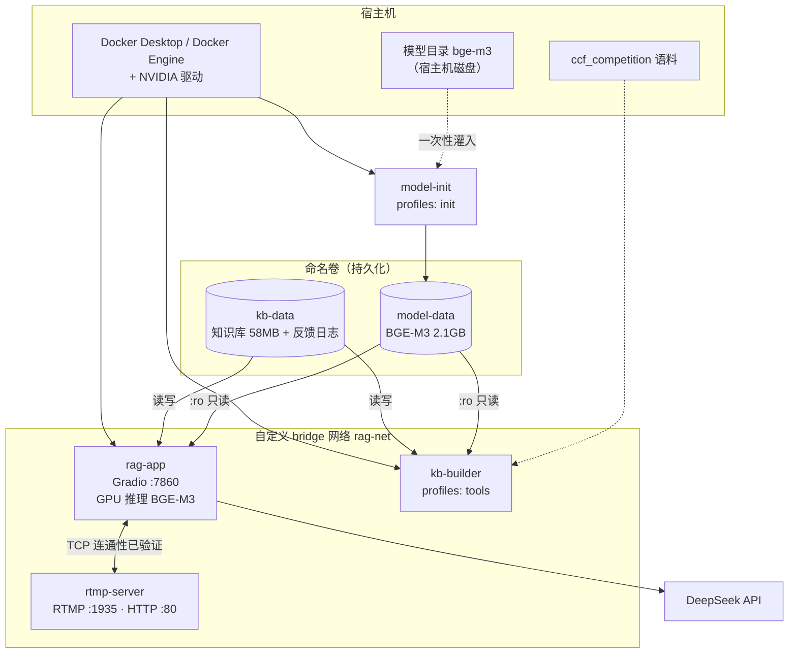

# 设计说明

**工单编号**：人工智能NLP-RAG-金融问答系统部署
**部署对象**：金融问答系统（RAG：检索 + 生成 + Gradio 界面）
**交付形态**：Docker 镜像 `rag-finance:1.0`（3.40 GB）+ Compose 编排

---

## 一、要解决的问题

把已经开发好的金融问答系统**以 Docker 容器的形式部署在服务器中并运行成功**，
便于金融场景下的对话功能。

系统本体（PDF 解析、混合检索、Query 理解、答案生成、界面）来自工单 01-07，
**本工单不改检索链路**，只做容器化与部署。知识库用金融语料：
9 份 A 股上市公司年报（银行/保险/证券），2801 页，7009 个检索块。

---

## 二、技术选型

| 项 | 选择 | 理由 |
|---|---|---|
| 基础镜像 | `python:3.11-slim` | 见下方专节 |
| Python | 3.11 | 与开发环境（conda `rag_gd`，3.11.16）一致 |
| 推理框架 | PyTorch 2.5.1（cu12 构建） | pip 轮子自带 CUDA 12 运行时 |
| GPU 接入 | `--gpus all` + NVIDIA Container Toolkit | Docker Desktop 内置；服务器需另装 |
| 编排 | Docker Compose v2 | 多服务 + 自定义网络 + 命名卷，一文件描述完 |
| 网络验证对端 | 自建 `rag-rtmp:1.0` | 见第四节 |

### 基础镜像为什么不用 nvidia/cuda 或 pytorch/pytorch

这两个是最常见的 CUDA 镜像选择，但本工单没选，原因都是实际踩出来的：

| 方案 | 问题 |
|---|---|
| `pytorch/pytorch:*-cudnn*-runtime` | 单个 3~4GB，本机 registry 加速器拉它反复 TLS 超时、10 分钟零进度 |
| `nvidia/cuda:*-cudnn-runtime-ubuntu22.04` | 同样拉不动；且它带的是 Python 3.10（Ubuntu 22.04 默认），与开发环境的 3.11 不一致，还得再想办法装 3.11 |
| **`python:3.11-slim`** | 基础层只有 189MB，大头（torch + CUDA 运行时）改从 pip 源下载，国内可达 |

关键事实：**Linux 上 PyPI 的 torch 轮子自带 CUDA 12 运行时** ——
依赖里那一串 `nvidia-cuda-runtime-cu12`、`nvidia-cudnn-cu12` 就是它。
容器用 GPU 需要的是「宿主机的驱动 + 容器内的 CUDA 用户态库」，
前者由 NVIDIA Container Toolkit 在 `--gpus all` 时注入，后者 pip 已经装好了。
**所以完全不需要 CUDA 基础镜像。**

---

## 三、部署架构



---

## 四、四个关键设计决策

### 4.1 模型与知识库都放命名卷，不打进镜像

| 维度 | 打进镜像 | 放命名卷（本方案） |
|---|---|---|
| 镜像体积 | +2.2GB，每次改代码都要重传 | 3.40GB，只有代码和依赖 |
| 数据持久化 | 容器删了数据还在镜像里，但更新镜像会覆盖 | **卷独立于容器生命周期**，符合验收要求 |
| 换语料 | 必须重新构建镜像 | 重建卷即可，主服务不用动 |
| 容器间共享 | 做不到 | **同一卷可同时挂给多个容器**，符合验收要求 |

验收标准里的「通过 Docker 卷持久化存储关键数据」和「支持容器间数据共享」两条，
指向的就是这个决策。

### 4.2 知识库种子随镜像分发，入口脚本按需初始化

模型 2.1GB 太大不能进镜像，但知识库只有 58MB —— 塞进镜像完全可行，
而且带来一个实际好处：**`docker run` 不带任何挂载配置也能直接跑起来**。
入口脚本发现数据卷里没有知识库时，自动把 `/app/seed_kb` 复制进去。

这直接对应验收标准第一条「使用 `docker run` 命令能够成功启动容器」——
如果知识库只能靠外部挂载，那 `docker run` 就得带一长串参数，算不上「直接启动」。

### 4.3 模型卷由 `model-init` 灌入，而不是直接挂宿主机目录

Docker Desktop 走 virtiofs 读 Windows 目录，加载 2.1GB 模型会明显变慢；
卷落在引擎原生文件系统上则没有这个问题。而且直接挂宿主机目录会把部署
绑死在某台机器的目录结构上，换服务器就要改 compose。

`model-init` 故意用 `alpine:3.20`（12MB）而不是应用镜像 ——
这一步只是复制文件，不需要 CUDA 和 Python，拉个小镜像快得多。
复制时排除 `onnx/`（2.2GB，给 onnxruntime 用的，FlagEmbedding 走 pytorch 权重）
和 `imgs/`、`long.jpg`（README 配图），**模型体积从 4.3GB 降到 2.1GB**。

### 4.4 RTMP 对端自己构建，不拉第三方镜像

验收标准点名「与其他服务（如 RTMP 服务器）正常通信」。试过的现成镜像
（`alfg/nginx-rtmp`、`tiangolo/nginx-rtmp`、`jasonrivers/nginx-rtmp`）
在本机 registry 加速器上一律 **403 Forbidden**。

改用 Alpine 官方源里的 `nginx-mod-rtmp` 包自己装，镜像只有 **4.2MB**。
好处不只是能拉到：部署到目标服务器时**不依赖任何第三方镜像仓库**，
来源可控，体积也小两个数量级。

---

## 五、容器运行方式

| 服务 | 镜像 | 常驻 | 说明 |
|---|---|---|---|
| `rag-app` | `rag-finance:1.0` | 是 | 主服务，GPU |
| `rtmp-server` | `rag-rtmp:1.0` | 是 | 网络验证对端 |
| `kb-builder` | `rag-finance:1.0` | 否 | `--profile tools`，在共享卷重建知识库 |
| `model-init` | `alpine:3.20` | 否 | `--profile init`，灌模型，只跑一次 |

---

## 六、端口与卷

| 服务 | 容器内端口 | 宿主机默认 | 用途 |
|---|---|---|---|
| rag-app | 7860 | 7860 | Gradio 界面与 API |
| rtmp-server | 1935 | 1935 | RTMP 推流 |
| rtmp-server | 80 | 8080 | RTMP 状态页 / 健康检查 |

容器内端口固定，只暴露宿主机一侧可改（`APP_PORT` / `RTMP_PORT` / `RTMP_HTTP_PORT`），
避免容器内端口变化导致健康检查、文档、脚本三处对不上。

| 卷 | 挂载点 | 读写 | 内容 |
|---|---|---|---|
| `model-data` | `/models` | 只读 | BGE-M3 权重 2.1GB |
| `kb-data` | `/kb` | 读写 | 知识库 + `feedback.jsonl` |

---

## 七、健康检查与入口自检

```dockerfile
HEALTHCHECK --interval=30s --timeout=5s --start-period=180s --retries=3 \
    CMD curl -fsS "http://127.0.0.1:${PORT:-7860}/" >/dev/null || exit 1
```

`start-period` 给到 180 秒，是因为首次启动要加载 BGE-M3（约 3.2GB 显存）
并读入 7009 块的知识库。容器「运行中」不等于「服务可用」——
验收标准写的是「在指定端口提供服务」，用健康检查把这层区分显式化。

`entrypoint.sh` 在起服务前做三项自检，任一不满足就**明确报错退出**
并说明该怎么挂载：模型目录存在且有权重文件、数据卷里有知识库（否则从种子初始化）、
知识库目录可写（不可写只警告不退出，反馈日志写不进去不影响问答）。

---

## 八、明确不做的

| 项 | 原因 |
|---|---|
| 不改检索链路 | 本工单只做部署；01-07 的检索逻辑一行未动 |
| 不把模型打进镜像 | 2.1GB，分发与更新代价过大 |
| 镜像瘦身到极致（多阶段 / distroless） | 需要 CUDA 与大量 Python 依赖，收益有限、维护成本高；已有的优化见《优化说明》 |
| 不做 HTTPS / 反向代理 | 验收标准未要求；生产上应加，已在《部署文档》常见问题里提示 |
| 不把 `feedback.jsonl` 单独拆卷 | 体积小、与知识库同生命周期，合在 `kb-data` 里更简单 |
