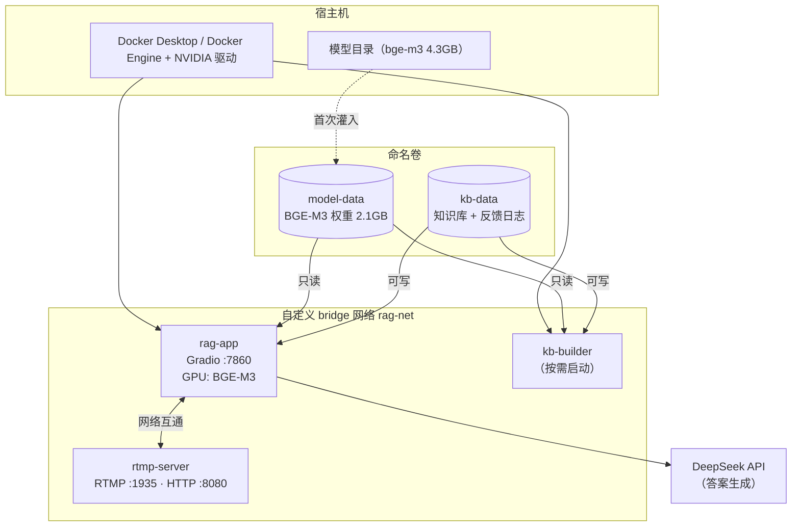

# 部署文档

**工单编号**：人工智能NLP-RAG-金融问答系统部署
**镜像**：`rag-finance:1.0`
**服务**：金融问答（Gradio 界面 + RAG 检索），端口 `7860`

---

## 一、这份文档解决什么问题

把金融问答系统做成 Docker 容器，在服务器上跑起来，对外提供金融场景下的对话服务。

系统本体（检索、生成、界面）来自工单 01-07，本工单只做**容器化与部署**，没有改动检索链路。
知识库用的是金融语料：9 份 A 股上市公司年报（银行/保险/证券三个行业，2801 页，7009 个检索块）。

---

## 二、前置条件

| 项 | 要求 | 说明 |
|---|---|---|
| Docker | Engine 20.10+ / Docker Desktop 4.x | 需支持 `--gpus`（Compose v2 用 `deploy.resources`） |
| NVIDIA 驱动 | ≥ 525（支持 CUDA 12.x） | 容器内 torch 是 cu12 构建 |
| NVIDIA Container Toolkit | 服务器上必装 | **Docker Desktop 已内置，无需安装** |
| 显存 | ≥ 4GB | BGE-M3 约 3.2GB |
| 磁盘 | ≥ 12GB | 镜像 3.40GB + 模型卷 2.1GB + 知识库卷 58MB，另需构建缓存 |
| DeepSeek API | `DEEPSEEK_BASE_URL` + `DEEPSEEK_API_KEY` | 答案生成用 |

**服务器（Linux）上装 NVIDIA Container Toolkit**：

```bash
curl -fsSL https://nvidia.github.io/libnvidia-container/gpgkey \
  | sudo gpg --dearmor -o /usr/share/keyrings/nvidia-container-toolkit-keyring.gpg
curl -s -L https://nvidia.github.io/libnvidia-container/stable/deb/nvidia-container-toolkit.list \
  | sed 's#deb https://#deb [signed-by=/usr/share/keyrings/nvidia-container-toolkit-keyring.gpg] https://#g' \
  | sudo tee /etc/apt/sources.list.d/nvidia-container-toolkit.list
sudo apt-get update && sudo apt-get install -y nvidia-container-toolkit
sudo nvidia-ctk runtime configure --runtime=docker && sudo systemctl restart docker
```

验证：`docker run --rm --gpus all nvidia/cuda:12.4.0-base-ubuntu22.04 nvidia-smi`

---

## 三、快速开始

在**工单10 目录**下执行（构建上下文是工单根目录，不是 部署/）。

### 3.1 配置

```bash
cp 部署/.env.example 部署/.env
vi 部署/.env          # 至少填 DEEPSEEK_API_KEY
```

### 3.2 首次：灌模型 + 起服务

```bash
# ① 构建镜像（首次约 60 分钟，其中约 52 分钟在下载 torch 与 CUDA 依赖）
docker build -f 部署/Dockerfile -t rag-finance:1.0 .

# ② 把宿主机的 BGE-M3 灌进数据卷（只跑一次，约 2.1GB）
docker compose -f 部署/docker-compose.yml --profile init up model-init

# ③ 起服务
docker compose -f 部署/docker-compose.yml up -d
```

浏览器打开 `http://<服务器IP>:7860`。

### 3.3 不带编排的裸跑（验收标准第一条）

```bash
docker run -d --name rag-app --gpus all -p 7860:7860 \
  -v rag-finance_model-data:/models:ro \
  -v rag-finance_kb-data:/kb \
  -e DEEPSEEK_BASE_URL=https://api.deepseek.com \
  -e DEEPSEEK_API_KEY=sk-你的密钥 \
  rag-finance:1.0
```

> 数据卷首次为空时，入口脚本会自动把镜像里自带的知识库种子复制进卷，
> 所以这一条命令**不依赖 compose，也不依赖任何宿主机目录**，可以直接跑起来。
> 模型卷除外 —— 模型有 2.1GB，打进镜像不现实，必须先执行 3.2 的 ②。

### 3.4 常用运维命令

```bash
docker compose -f 部署/docker-compose.yml logs -f rag-app     # 看日志
docker compose -f 部署/docker-compose.yml restart rag-app     # 重启
docker compose -f 部署/docker-compose.yml down                # 停服务（卷保留）
docker compose -f 部署/docker-compose.yml down -v             # 停服务并删卷（数据全丢）
```

---

## 四、目录与文件

```
工单10/
├── 部署/
│   ├── Dockerfile              镜像定义
│   ├── docker-compose.yml      编排：rag-app / rtmp-server / kb-builder / model-init
│   ├── entrypoint.sh           容器入口：前置自检 + 知识库种子初始化
│   ├── .env.example            配置模板（复制成 .env 使用）
│   └── 部署文档.md              本文件
├── 研发/                       金融问答系统本体（工单 01-07 累计）
│   └── kb_cache/ccf_competition/   知识库种子（随镜像分发）
└── 测试/                       部署验收测试与报告
```

---

## 五、架构



### 为什么模型和知识库都放卷、不放镜像

| 理由 | 说明 |
|---|---|
| 镜像体积 | 模型 2.1GB、知识库 58MB，打进镜像后每次改代码都要重传这 2.2GB |
| 验收要求 | 「支持通过 Docker 卷持久化存储关键数据，确保数据不丢失」——知识库必须落卷 |
| 性能 | Docker Desktop 走 virtiofs 读 Windows 目录很慢，卷落在引擎原生文件系统上，模型加载不受影响 |
| 可维护 | 换语料只需重建知识库卷，不动镜像、不重启主服务 |

### 服务说明

| 服务 | 作用 | 何时启动 |
|---|---|---|
| `rag-app` | 金融问答主服务 | 常驻 |
| `rtmp-server` | 流媒体服务，用于验证容器间网络互通 | 常驻 |
| `kb-builder` | 在共享卷里重建知识库 | `--profile tools`，按需 |
| `model-init` | 把宿主机模型灌进数据卷 | `--profile init`，只跑一次 |

---

## 六、配置项

都在 `部署/.env`：

| 变量 | 默认 | 说明 |
|---|---|---|
| `DEEPSEEK_BASE_URL` | — | **必填**，大模型接口地址 |
| `DEEPSEEK_API_KEY` | — | **必填**，缺失时 compose 直接报错停下 |
| `MODELS_DIR` | `D:/Pycharm/yzq/models` | 宿主机模型父目录，需含 `bge-m3/` |
| `CORPUS_DIR` | `D:/BW/RAG 工单/附件/ccf_competition` | 语料目录（含 `pdf/`、`txt/`），只有 `kb-builder` 用 |
| `APP_PORT` | `7860` | 宿主机端口（容器内固定 7860） |
| `RTMP_PORT` / `RTMP_HTTP_PORT` | `1935` / `8080` | RTMP 服务端口 |

容器内的环境变量在 Dockerfile 里设了默认值，一般不用改：
`BGE_M3_PATH=/models/bge-m3`、`KB_CACHE_DIR=/kb`、`PORT=7860`。

---

## 七、重建知识库

换语料或语料有更新时，用 `kb-builder` —— 它和 `rag-app` **挂同一个 `kb-data` 卷**，
这正是验收项「支持容器间数据共享」的实际用法：主服务不用停，重建完重启一下即可。

```bash
# 语料放在 CORPUS_DIR（那一层需含 pdf/ 与 txt/ 子目录）
docker compose -f 部署/docker-compose.yml \
  --profile tools run --rm kb-builder

docker compose -f 部署/docker-compose.yml restart rag-app
```

重建 9 份年报（2801 页）约 6 分钟，其中大部分是 GPU 编码 7009 个块的时间。

---

## 八、验收标准对照

| 验收项 | 落实方式 | 证据 |
|---|---|---|
| `docker run` 能成功启动容器并在指定端口提供服务 | 见 3.3，不依赖 compose | `测试/验收报告.md` |
| 容器运行过程中无异常日志输出 | 压掉 transformers 告警；健康检查探活 | 同上，含 `docker logs` 全文 |
| 通过 Docker 卷持久化存储关键数据 | `kb-data` / `model-data` 两个命名卷 | 同上，含重建容器后数据仍在的验证 |
| 支持容器间数据共享 | `kb-builder` 与 `rag-app` 共用 `kb-data` | 同上 |
| 容器网络配置正确，能与其他服务（如 RTMP 服务器）通信 | 自定义网络 `rag-net` + 真实 RTMP 容器对端 | 同上，含从 `rag-app` 内探测 RTMP 端口的记录 |
| 部署后的金融问答服务测试通过 | 界面上跑金融问题，走完整 RAG 链路 | 同上 + `测试/截图/` |

---

## 九、常见问题

**Q：容器起来了但页面打不开？**
`docker logs rag-app` 看是否卡在模型加载。首次加载 BGE-M3 约 30~60 秒，
健康检查的 `start-period` 设的是 180 秒，期间显示 `starting` 属正常。

**Q：报「模型目录不存在」/「没有权重文件」？**
模型卷是空的。执行 3.2 的 ② 把模型灌进去，或检查 `MODELS_DIR` 是否指向含 `bge-m3/` 的目录。

**Q：日志里有 `CUDA out of memory`？**
BGE-M3 约占 3.2GB 显存。关掉宿主机上其他占显存的进程。

**Q：WSL 里的 Docker 和 Docker Desktop 混着用了？**
两个引擎的镜像、容器、卷**互不可见**。本工单全程在 Windows 侧操作
（`docker context` 为 `desktop-linux`）。若在 WSL 里执行过命令，那些容器在 Docker Desktop 里看不到。

**Q：容器隔一段时间就 Connection refused？**
WSL2 休眠会把 Docker 引擎停掉（本机已知问题）。启动 Docker Desktop 后
`docker compose up -d` 即可恢复，数据卷不受影响。
