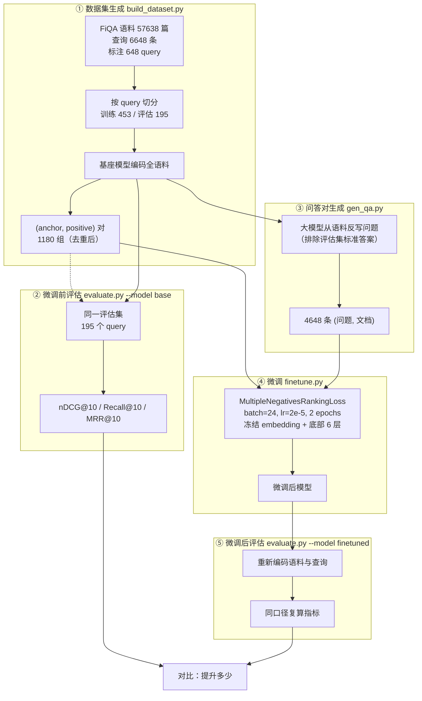

# 设计说明

**工单编号**：人工智能NLP-RAG项目-Embedding 模型微调任务
**基座模型**：`BAAI/bge-base-en-v1.5`
**微调数据**：FiQA-2018（金融领域问答检索数据集，BEIR 基准之一）
**验收目标**：微调后的检索效果优于微调前，且有数据指标支撑

---

## 一、任务理解

工单要求「微调自己领域的 Embedding 模型」，并明确列出要实现的动作：

> 数据集生成、运行问答对生成、数据集与模型加载、定义损失函数、
> 定义训练参数、创建评估器、微调前评估模型、微调后评估模型

本工单把这八步一一落到代码，见第四节的文件对应表。

验收标准是**微调后的检索效果比微调前要好，要有数据指标支撑** ——
所以整套设计围绕一个核心：让「变好了」这件事可被客观测量，
而不是靠肉眼看几个例子。

---

## 二、一个必须说明的前置问题：模型与语料的语言错配

工单点名用 `BAAI/bge-base-en-v1.5`。这是**英文**模型（词表 30522，纯英文词片），
而本项目的语料是中文金融年报。实测：

| 测试句 | `bge-base-en-v1.5` | `bge-m3`（中文，对照） |
|---|---|---|
| 平安银行2019年末的拨备覆盖率是多少？ | token 17 个，**10 个 `[UNK]`（59%）** | 13 个，0 个 UNK |
| 报告期内，公司来自军用领域的收入… | **69% UNK** | 0% |
| 中国平安归属于母公司股东的营运利润… | **48% UNK** | 0% |

```
bge-base-en-v1.5: ['平', '安', '[UNK]', '行', '2019', '年', '[UNK]', '的', '[UNK]'...]
bge-m3:           ['▁', '平安', '银行', '2019', '年末', '的', '拨', '备', '覆盖', '率'...]
```

中文几乎全被切成 `[UNK]`，拿它检索中文语料接近随机，
**微调前后都测不出有意义的结果**，无法满足「要有数据指标支撑」这条验收。

**处理方式**：保留工单指定的 `bge-base-en-v1.5`，改用**英文金融语料**微调（见第三节）。
这是经确认的技术路线，不是自作主张。

---

## 三、数据集选型：FiQA-2018

| 候选 | 是否有查询 | 是否有相关性标注 | 结论 |
|---|---|---|---|
| **FiQA-2018** | 6,648 条 | **648 个 query / 1,706 条标注** | ✅ 选用 |
| SEC EDGAR 财报 | 无 | 无 | 只有语料，做不了检索评估 |
| 自造问卷 | 要人工标注 | — | 2 人日工单不现实 |

选 FiQA 的决定性理由：**它自带 qrels（相关性标注）**，
于是 nDCG@10 / Recall@10 / MRR@10 这些标准检索指标可以直接算出来，
微调前后的对比就有了客观依据。没有标注就只能靠人眼，不满足验收要求。

数据规模：

| 项 | 数量 |
|---|---|
| 语料文档 | 57,638 篇（中位 517 字符） |
| 查询 | 6,648 条 |
| 带标注的查询 | 648 个 |
| 相关性标注 | 1,706 条（每 query 中位 2 个正例） |

---

## 四、数据流



> 图上画的是**最终定稿的数据流**。中间的失败路径（挖难负例、全参数微调、
> 调温度）没有画进来 —— 那些记在 `优化/过程问题记录.md` 第二节。

对应工单要求的八个动作：

| 工单要求 | 落在哪 |
|---|---|
| 数据集生成 | `build_dataset.py` |
| 运行问答对生成 | `gen_qa.py` —— 用大模型从语料反写问题，扩充训练集 |
| 数据集与模型加载 | `data.load_fiqa()` / `SentenceTransformer(BASE_MODEL)` |
| 定义损失函数 | `train_data.py` 的 `mnr_loss()`（MultipleNegativesRankingLoss） |
| 定义训练参数 | `config.py` + `finetune.py` 的命令行参数 |
| 创建评估器 | `retrieval.evaluate()`（nDCG/Recall/MRR） |
| 微调前评估模型 | `evaluate.py --model base` |
| 微调后评估模型 | `evaluate.py --model finetuned` |

---

## 五、五个关键设计决策

### 5.1 按 query 切分，而不是按标注行切分

qrels 有 1,706 条标注，但它们只覆盖 648 个 query。
如果按**标注行**随机切 70/30，同一个 query 的正例会同时落在训练集和评估集里 ——
模型在训练时见过这个问题，评估时自然答得好，指标虚高。
所以按 **query** 切：训练 453 个 query、评估 195 个，两边的问题完全不重叠。

### 5.2 难负例：挖了、存了，但**训练时不用**

随机文档和查询八竿子打不着，模型不用学就能分开。真正难的是「字面很像但答案不对」
的文档 —— 按这个思路，用**微调前**的模型检索整个语料，取 top-50 里
**不在标准答案中**的文档当负例，每个 query 取 4 个，存进了 `train_triples.jsonl`。

**但训练时默认关闭（`USE_HARD_NEGATIVES = False`）**，理由见
`优化/过程问题记录.md` 问题 7：

```
FiQA 标注 1,706 条 / 语料 57,638 篇 = 覆盖率 0.003%
```

检索 top-50 里那些「不在标准答案中」的文档，**绝大多数只是没被标注，
并不是不相关**。拿它们当负例等于教模型把正确答案推开 —— 实测 nDCG@10
从 0.4350 掉到 0.3686（去重修好、冻结底部层之后复测仍是 0.3486）。

所以训练只用 **batch 内负例**（标准 MNRL）：一个 batch 里其他 query 的正例，
跟本 query 几乎不可能相关，不存在假负例问题。难负例的数据仍留在文件里，
换成标注密集的语料时打开 `--use-hard` 即可复用。

### 5.3 指令前缀前后一致

BGE 官方用法：短查询检索长文档（s2p）时，**查询侧**要加
`Represent this sentence for searching relevant passages: `，文档侧不加。
FiQA 正是 s2p 场景。

这个前缀必须**微调前后用同一套**：给基线加、给微调后的模型不加（或反过来），
等于人为抬高（或压低）微调收益，对比就失去意义。
实现见 `config.QUERY_INSTRUCTION` 与 `data.with_instruction()`，
训练时 anchor 也带前缀，与推理口径一致。

### 5.4 损失函数选 MNR 而不是 Triplet

`MultipleNegativesRankingLoss`：一个 batch 里，每条 (anchor, positive) 的 positive 是正样本，
同 batch 内**其他所有样本的 positive** 自动成为负样本。
batch=24 时，每个 anchor 一次前向就对比 23 个 batch 内负例，
比逐个算 triplet 高效得多，也不容易过拟合到少数几个负例上。

### 5.5 冻结底部 6 层，只训顶部（**决定成败的一条**）

训练样本只有约 5.6k 条，而模型有 1.09 亿参数。在这个数据量上做全参数微调，
模型会把预训练阶段学到的通用语义一起改掉 —— 金融领域的增量没学到多少，
通用的语义判别力先损失了，指标反而低于基线。

做法：冻结 embedding 与底部 6 层编码器，只训顶部 6 层（43.1M / 109.5M 参数）。
底层学的是通用的词法/句法特征，本来就没什么可适配的；顶层的语义组合才是领域相关的。

效果上这是**从亏转盈**的那一步：全参数 0.4321（低于基线 0.4350），
冻结 6 层 0.4412。且最优值在中间 —— 冻 4 层 0.4378、冻 8 层 0.4350、
冻 10 层 0.4393，说明这是「通用能力」与「适配空间」的取舍，不是冻得越多越好。
详见 `优化/过程问题记录.md` 问题 9。

---

## 六、评估口径

| 指标 | 含义 |
|---|---|
| `nDCG@k` | 归一化折损累计增益，考虑排序位置，BEIR 主指标 |
| `Recall@k` | 前 k 条里命中了多少比例的标准答案 |
| `MRR@k` | 第一个正确答案排名的倒数，衡量「第一条就对」的能力 |

`k` 取 1 / 5 / 10。评估集、语料、编码方式、指令前缀**两次完全一致**，
唯一变量是模型权重 —— 这样指标差异才能归因到微调本身。

---

## 七、环境与约束

| 项 | 值 |
|---|---|
| GPU | RTX 3060 Laptop 6GB |
| 基座模型 | bge-base-en-v1.5（110M 参数） |
| 训练 batch | 24（fp16，不用难负例时两次前向，显存占用约 3GB） |
| 训练规模 | 2 epochs / 472 步 / 104 秒 |
| 语料编码 | batch 64，max_len 512，实测约 18 分钟/次 |
| Python | 3.11（conda 环境 `rag_gd`） |

---

## 八、明确不做的

| 项 | 原因 |
|---|---|
| 换用中文模型 | 工单点名 bge-base-en-v1.5；中文模型另属一条路线，已在前置说明里讲清取舍 |
| LoRA / Adapter | 工单提到适配器方案只是背景介绍。本工单确实需要「限制可训练参数」，但用的是**直接冻结底部层**（5.5 节），一行 `requires_grad=False` 就够，不必再引入 peft 依赖 |
| 超参数搜索 | 没有做网格搜索，只沿「可训练参数量」一个维度试了 5 个点（全参数 / 冻 4 / 6 / 8 / 10 层）定下 6 层。其余超参固定为业界常用值（lr 2e-5、batch 24、2 epochs）并说明依据；选参口径的局限已在 `优化/过程问题记录.md` 第三节如实记录 |
