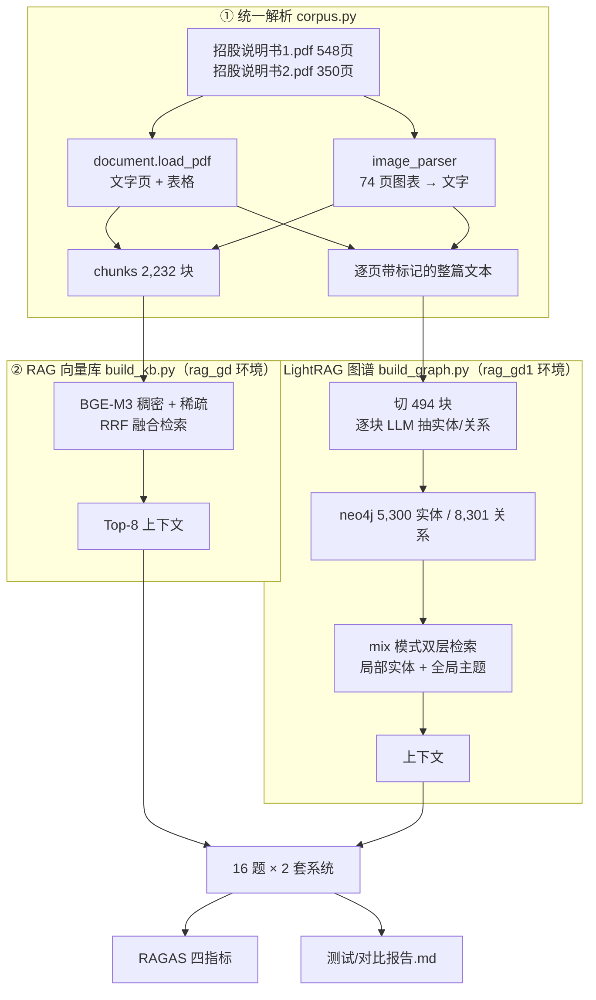

# 设计说明

**工单编号**：人工智能NLP-RAG项目-LightRAG优化
**语料**：《招股说明书1.pdf》（武汉兴图新科电子，548 页）+《招股说明书2.pdf》（武汉力源信息技术，350 页）
**验收目标**：① 抽出准确的实体/关系类型；② 给出 RAG 与 LightRAG 的检索结果对比与 RAGAS 指标对比

---

## 一、任务理解

工单要求「在 RAG 系统的基础上，使用 LightRAG 实现知识图谱构建和检索流程」，
并在同一批测试问题上对比两套系统。落成三件事：

| 要做的 | 落点 |
|---|---|
| 用 LightRAG 建知识图谱 | `研发/build_graph.py` → neo4j（5,300 实体 / 8,301 关系） |
| 优化图谱构建中的实体、关系类型 | `研发/lightrag_engine.py` 的 `ENTITY_TYPES_GUIDANCE` + 追加规则 |
| RAG / LightRAG 可切换检索 | `研发/query.py --kb rag\|lightrag` |
| 检索结果对比 | `测试/compare.py` → `测试/对比报告.md` |
| RAGAS 指标对比 | `测试/ragas_eval.py` → `results/ragas.json` |

---

## 二、三个关键设计决策

### 2.1 两条路读**同一份解析结果**

`corpus.py` 把 PDF 解析一次，两种表征都用它的输出：

```
PDF ──document.load_pdf──┬─→ 文字页 ──┐
                         └─→ 表格     ──┼─→ corpus.parse ──┬─→ chunks  （给 RAG 向量库）
PDF ──image_parser───────→ 图表页    ──┘                  └─→ 整篇文本（给 LightRAG 自切块）
```

**为什么必须共用**：本工单要比的是「图结构检索」与「扁平向量检索」。
两边各解析各的，指标差异里就混进了「谁多读了一段」这个变量，比出来的东西
说不清是谁的功劳。同理，嵌入模型（bge-m3）和生成用的大模型（deepseek-flash）
两边也完全一致，唯一变量只剩检索机制本身。

### 2.2 图表解析这条链路是**必需的**，不是可选项

16 题里第 5 题问组织结构图、第 6 题问 2008 年 IC 市场应用结构与增长图。
实测两题情况还不一样：

| 题 | 图 | 文本层 | 结论 |
|---|---|---|---|
| 5 | 组织结构图（招股书2 第 39 页） | 有内容（图上文字可选中） | 纯文本就能答 |
| 6 | IC 市场结构图（第 72 页） | **无数据**（增长率只在图形里） | 必须多模态解析 |

跳过图像解析，第 6 题两套系统都答不出来，对比就少一个有效样本。
所以本次走完整链路：37 + 37 = 74 页图表经多模态模型转文字后入库。

### 2.3 招股书定制的实体/关系 schema（验收点 1）

LightRAG 默认那套是通用的（Person / Creature / Location / Event / Concept…），
用在招股书上会把「军工资质」「募投项目」「技术标准」全塞进 `Other`，图谱没有区分度。

换成招股书实际会出现的 12 类，**并写明每类的判据**（不写判据模型就乱归类）：

```
Company  Person  Institution  Product  Technology  Qualification
Industry  Project  FinancialMetric  Period  Location  Chart
```

另外追加四条招股书专用规则：

1. **自称消解**（最关键）：招股书通篇用「本公司」「发行人」，
   必须还原成全称 —— 否则图谱里会出现一个叫「本公司」的实体，
   和真实公司名分裂成两个节点，检索时对不上。
2. **中文专名逐字保留**：不翻译、不缩写，`name` 必须是完整法定名称。
3. **图表来源合法**：标了「图表解析」的文本块同样是有效抽取来源。
4. **数字必须写进描述**：金额、比例、日期带上单位逐字写进 `description`，
   否则下游问答读不到数。

**实测效果**（建图完成后 neo4j 里的类型分布）：

```
financialmetric 886   company 793    product 679     technology 530
period 425            project 304    institution 303 industry 267
person 239            location 168   chart 96        qualification 72
```

关系类型（存在边的 `keywords` 属性里）是
`Controlling Shareholder`、`Shareholding`、`Family`、`Commitment Letter`、
`License Revocation` 这类有语义的标签，而不是清一色的泛化标签。

---

## 三、数据流



---

## 四、为什么要两个 conda 环境

这是本工单**成本最高的一条约束**（详见 `优化/过程问题记录.md` 问题 2）：

| 环境 | 用途 | 不能动的版本 |
|---|---|---|
| `rag_gd` | RAG 基座（工单 01-10 在用） | FlagEmbedding 1.3.3 硬锁 `transformers==4.44.2` + `datasets==2.19.0`；gradio 4.44.1 要求 `huggingface-hub<1.0` |
| `rag_gd1` | LightRAG + neo4j + RAGAS | 独立环境，随便装 |

`ragas` 会把 `huggingface-hub` 升到 2.x，装进 `rag_gd` 必然顶翻上面那一组。
**实测过**：装完 FlagEmbedding / transformers / sentence-transformers / gradio
全部 ImportError，整条链路报废（已按快照完整还原）。

所以两条路各跑各的环境，对比在**结果层**（JSON）做，不要求同进程。

---

## 五、评估口径

| 项 | 取值 | 说明 |
|---|---|---|
| RAGAS 指标 | faithfulness / answer_relevancy / context_precision / context_recall | 四个全要，工单写的是「RAGAS 评估指标对比」而不是某一个 |
| 上下文条数 | 两边都取前 **8** 段 | RAG 固定返回 8 段；LightRAG 返回 24~32 段。不拉齐的话 context_precision 面对的候选数不同，比出来的差异里混着「谁给的上下文多」 |
| LightRAG 的图谱数据 | 不计入 contexts | 实测其上下文里混着约 6 万字符的实体/关系 JSON 和召回原文。图谱数据是另一种模态，混进来就没法和 RAG 的「检索到的原文块」同口径比较，单独统计后写进报告 |
| 标准答案 | `研发/testset.py` 的 `gold_answer` | 工单没给，人工从原文逐句核对后写入，来源页记在 `gold_pages` 可回溯 |

> RAGAS 的四个指标都由大模型判分，同一份数据换次运行会有小幅波动，
> 差异小于 0.05 时不宜过度解读。

---

## 六、明确不做的

| 项 | 原因 |
|---|---|
| 做一个 Gradio 界面 | 工单没要求界面，只要求「可以选择使用 RAG 还是 LightRAG 的知识库进行检索」。`query.py --kb rag\|lightrag` 就是那个选择器，不需要为此拉一套 Web UI |
| 把招股书拆成两个独立知识库 | 16 题横跨两家公司，而 RAG 那边没有图结构做实体路由，分库就得先猜问题属于哪家 —— 那是另一套逻辑，会把「检索能力」和「路由准确率」混在一起。合一库、每条 chunk 带 `doc` 字段，统计时再分文档 |
| 超参数搜索 | 2 人日工单。LightRAG 侧只调了两个**有明确依据**的参数：关掉追问式二次抽取（招股书格式规范，首轮召回已够全）、关掉强制摘要（公司名反复出现会触发上千次摘要调用） |
| 增量更新的演示 | 工单提到 LightRAG 支持增量更新，但验收标准里没有这一条。`build_graph.py` 走的就是 LightRAG 的增量接口（重复灌同一份文档不会产生重复节点），能力在，未单独做演示 |
