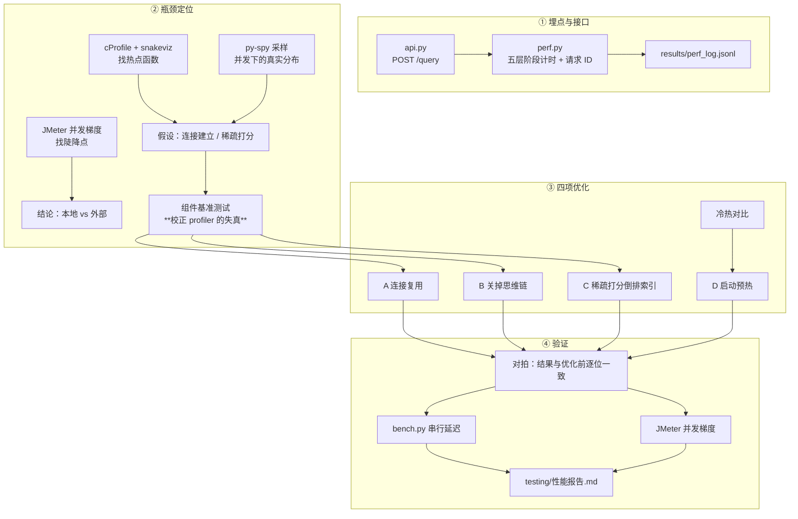

# 设计说明

**工单编号**：人工智能NLP-RAG项目-RAG性能瓶颈识别与优化
**验收标准**：每个会话，用户输入 query 后，返回的检索结果要在 3S 以内
**任务目标**：分析造成检索性能慢的原因，并对应优化，给出优化前后的检索时间对比

---

## 一、任务理解

工单把 RAG 的延迟拆成五段，要求逐段分析运行时间：
**查询处理与增强 → 检索阶段 → 上下文组装与提示工程 → LLM 生成 → 后处理与响应格式化**。

落成三件事：

| 要做的 | 落点 |
|---|---|
| 让系统可被测量 | `研发/perf.py`（分阶段埋点）+ `研发/api.py`（JMeter 能压的接口） |
| 找出瓶颈 | cProfile / snakeviz / py-spy / JMeter / 组件基准 |
| 优化并出对比 | 四项优化 + `测试/性能报告.md` |

---

## 二、三个关键设计决策

### 2.1 为什么必须加一个 HTTP 接口

现有 RAG 只有 Gradio 界面，而 Gradio 的 API 要先拿 session hash、请求体是私有的
`data` 数组格式。压它得到的是 **Gradio 外壳**的数字（它自己还有队列和
`default_concurrency_limit=4`），不是 RAG 本体的。

所以加了最小的 `POST /query`（`研发/api.py`）。**没有引入新依赖** ——
fastapi/uvicorn 环境里本来就有。

**知识库与模型启动时加载一次并常驻** —— 这是压测里最容易把结论带偏的地方：
「每请求重新加载 BGE-M3」和「加载一次复用」差几个数量级。

### 2.2 埋点分五层，并对埋点本身做自检

`perf.py` 按工单对「日志记录」的三条要求实现（阶段时间戳 / 请求 ID / 业务指标）：

```
1-查询理解      （纯规则，微秒级）
2-检索召回      ├─ 2.1-单路检索 ├─ 2.1.1-查询编码（BGE-M3）
                                ├─ 2.1.2-稠密打分
                                ├─ 2.1.3-稀疏打分
                                └─ 2.1.4-RRF 融合
3-上下文组装    （字符串拼接）
4-LLM生成       （调 deepseek-flash）
```

每条记录都算一个 **`unaccounted_seconds`（未归入任何顶层阶段的时间）**。
实测 0.0% —— 这既证明埋点没漏，也说明「没测到的部分」不存在。

### 2.3 三种测量手段分工，各管一段

单靠一种工具会得出错误结论（见 `优化/过程问题记录.md` 问题 3）：

| 手段 | 回答什么问题 | 不回答什么 |
|---|---|---|
| **阶段埋点**（`perf.py`） | 「绝对耗时的构成」—— 报告里所有绝对值出自这里 | 不告诉你函数级热点 |
| **cProfile / snakeviz** | 「哪个函数被调用得异常多」 | **绝对耗时不可信**（插桩开销放大，实测放大了 7 倍） |
| **py-spy**（采样型） | 并发下真实的耗时分布，开销极低 | 需要进程在跑 |
| **JMeter** | 「并发上去了会怎样」—— 吞吐与尾延迟、陡降点 | 不告诉你时间花在哪 |
| **组件基准**（`conn_bench`） | 单项优化的**真实**收益 | 不代表端到端 |

---

## 三、数据流



---

## 四、四个优化项及其依据

| # | 措施 | 依据（哪一步发现的） |
|---|---|---|
| A | 大模型连接复用（线程级 `requests.Session`） | cProfile 标出 `socket.connect` 可疑 → **组件基准测试定量**（真实收益 0.31s，不是 cProfile 说的 2.2s） |
| B | 关掉推理模型的思维链 | 阶段埋点：LLM 占 88% 且方差极大（1.3~9.9s），是 P95 超标的根源 |
| C | 稀疏打分改倒排索引 | cProfile 的**调用次数**视图：`_sparse_score` 7,009 次、字典查找 65 万次 |
| D | 启动预热 | 首请求 9.68s vs 稳态 0.4s，差在 CUDA 上下文与首次前向 |

**优化 C 的正确性验证**：换实现最怕「悄悄算错」—— 分数有偏差会让检索排序变差
却不报错。所以先用原算法逐题对拍（`测试/verify_optimization.py`），
确认最大相对差 1.04e-07（float32 累加顺序）后才比性能。

---

## 五、明确不做的

| 项 | 原因 |
|---|---|
| 分布式追踪（OpenTelemetry/Jaeger） | 工单那一节的前提是「构建为**微服务集合**的 RAG 系统」。本系统是单体进程，请求不出进程边界 |
| 监控与告警（Grafana/Prometheus） | 面向长期运行的生产监控；本工单是一次性瓶颈排查，应用自身埋点已能回答全部问题。搭一套监控栈属于做过头 |
| 缓存已问过的问题 | 能刷指标但不能解决「新问题还是慢」—— 而验收标准针对的是真实提问 |
| 把知识库换小 | 检索段优化前只占 11%，缩小它治不了 88% 的 LLM 段；且那是回避问题不是优化 |

---

## 六、交付的对比口径

| 项 | 说明 |
|---|---|
| 机器 | 同一台（RTX 3060 Laptop 6GB + 同一 conda 环境 `rag_gd`） |
| 知识库 | 同一份 `ccf_competition`（9 份年报，7,009 块） |
| 测试题 | `测试/jmeter/questions.csv` 的 10 道，**轮换提问** |
| 为什么轮换 | 反复问同一题会命中大模型的提示缓存，LLM 段数字虚低 —— 第一版压测就是这么失真的 |
| 复现 | `PERF_OPT=off` 一键回到优化前，两轮都能自己跑（见 `优化/过程问题记录.md` 问题 5） |
| 绝对值的来源 | `perf.py` 埋点 + JMeter；cProfile 只用于定位，**不用于定量** |
