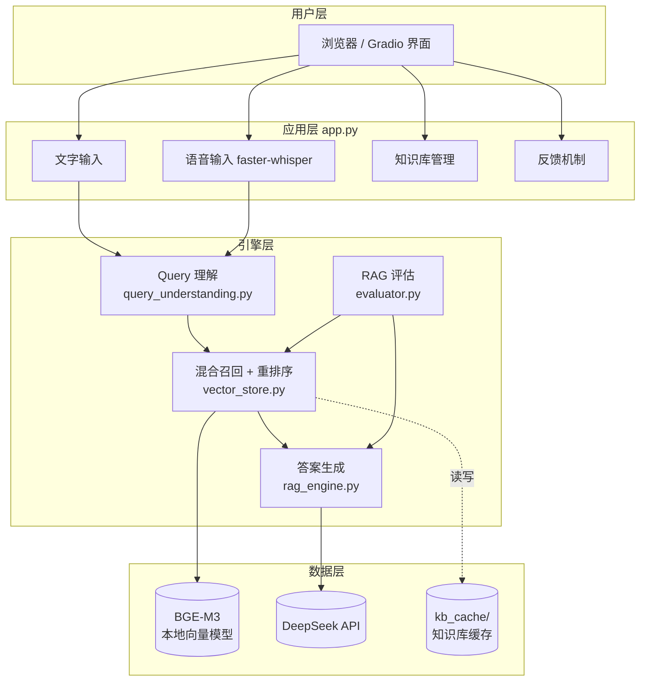
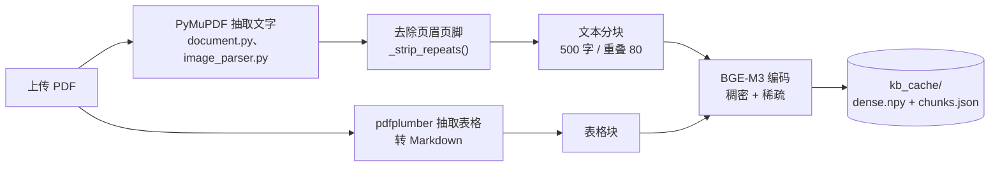
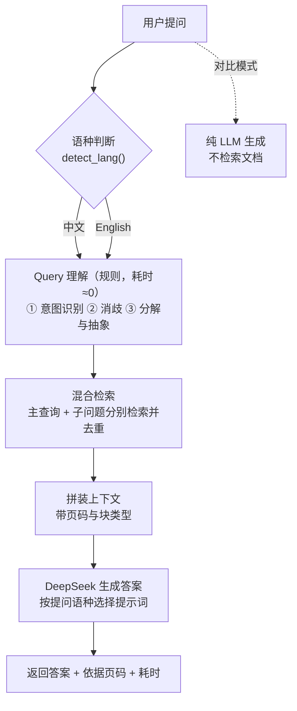

# 设计说明

**工单编号**：人工智能NLP-RAG-图像内容解析及检索优化
**工单名称**：RAG 项目 01 — 基于 PDF 文档的问答系统

---

## 一、技术组件

| 层次 | 组件 | 版本 | 选型理由 |
|---|---|---|---|
| 界面 | Gradio | 4.44.1 | 几十行即可搭出可交互 Web 界面，自带麦克风录音组件 |
| PDF 文字 | PyMuPDF | 1.24.14 | 纯文本抽取速度快，548 页秒级完成 |
| PDF 表格 | pdfplumber | 0.11.4 | 表格结构还原准确，可转 Markdown |
| 向量模型 | BGE-M3（本地） | — | 一个模型同时输出稠密(语义)与稀疏(关键词)向量，中英双语，无需联网 |
| 混合检索 | RRF 融合 | — | 稠密与稀疏分数量纲不同，按名次融合比按分数相加更稳 |
| 大模型 | DeepSeek `deepseek-flash` | — | 实测带 2400 字上下文仍只需约 2 秒，满足 3 秒响应要求 |
| 评估 | LLM-as-Judge | — | RAG 评估主流方案，无需标注数据 |
| 语音识别 | faster-whisper | 1.2.1 | CPU 可跑，中英文自动识别 |

**版本锁定说明**（踩过的坑，改动会导致服务起不来）：

- `fastapi==0.115.6` + `starlette==0.41.3`：starlette ≥0.46 删除了 gradio 4.x 仍在使用的旧 `TemplateResponse` 签名
- `pydantic==2.9.2`：pydantic ≥2.10 生成的 JSON Schema 会让 gradio_client 1.3.0 解析崩溃
- `huggingface-hub==0.25.2`：0.26 删除了 `HfFolder`，gradio 4.x 直接 ImportError

---

## 二、技术架构



---

## 三、数据处理流程（离线，初始化知识库时执行）



**为什么必须去页眉**：招股书每页页眉都是「公司名 + 招股意向书」。实测 1396 个文字块中有 548 个（39%）以公司名开头，而工单的 10 个问题全都含公司名——等于近四成的块都吃到同等匹配加分，检索排序被拉平。去掉后正确答案才能排到第 1 位。

---

## 四、问答流程（在线，每次提问）



**为什么 Query 理解用规则而不是大模型**：原来调用大模型做 Query 理解要 3~10 秒，仅这一项就超过了工单 3 秒的响应要求。改用规则后耗时接近于 0，而本领域（招股说明书问答）的意图、歧义词、并列结构都很固定，规则足够准确。

---

## 五、目录结构

```
工单1/
├── 设计/            设计文档（本目录）
├── 研发/            源代码 + 技术文档 + 用户手册
├── 测试/            测试脚本 + 测试报告 + 截图
├── 优化/            性能优化说明
└── 部署/            Linux 部署脚本（安装 / 启动 / 结束）
```
