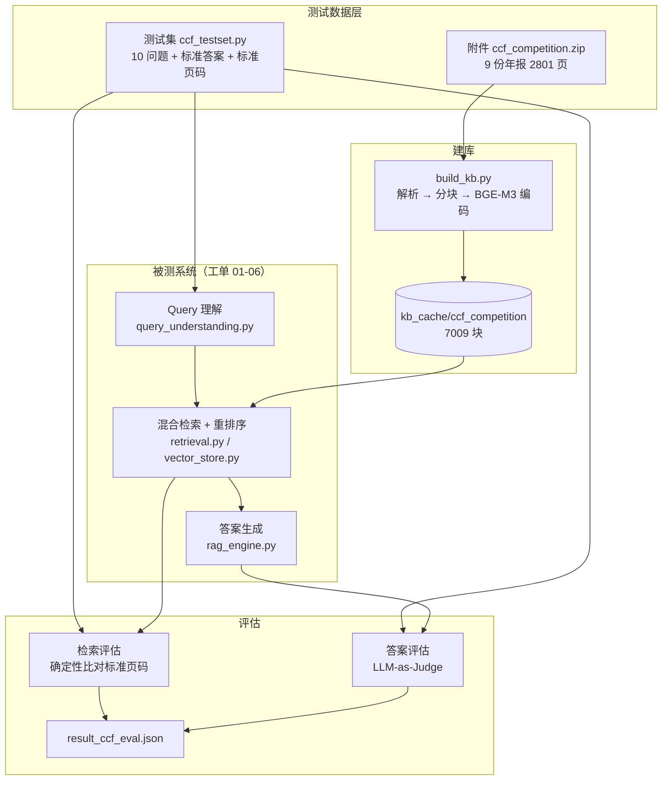
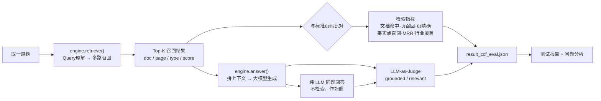

# 设计说明

**工单编号**：人工智能NLP-RAG-功能测试及评估
**工单名称**：RAG 项目 07 — 功能测试及评估
**被测对象**：工单 01-06 实现的 RAG 问答系统（`研发/`）
**测试语料**：附件 `ccf_competition.zip` 中的 9 份 A 股上市公司年报（2801 页）

---

## 一、技术组件

本工单不新建检索链路，被测系统直接沿用 01-06。下表新增部分是**测试侧**的选型。

| 层次 | 组件 | 版本 | 选型理由 |
|---|---|---|---|
| 被测系统 | 工单 01-06 RAG | — | 工单验收标准第 2 条明确要求「使用 01-06 任务工单实现的 RAG 系统进行测试」 |
| 向量模型 | BGE-M3（本地） | — | 沿用，不做替换：替换模型等于换掉被测对象，测出来的结论不成立 |
| 生成模型 | DeepSeek `deepseek-flash` | — | 沿用 |
| 裁判模型 | DeepSeek `deepseek-flash` | — | LLM-as-Judge，与生成同源；同源会带来偏好，故另设确定性指标兜底（见第四节） |
| 标准页码核对 | PyMuPDF | 1.24.14 | 逐页回原文验证标准答案页码，见 `测试/测试报告.md` 的核对说明 |

**与 01-06 的差异（都只为「测试」这一个目的）**

| 差异 | 原因 |
|---|---|
| 9 份年报建**一个**统一知识库 | 语料跨银行/保险/证券三个行业，示例问题里有跨公司比较；分成 9 个库就没法互相检索 |
| 每块附加 `doc` / `company` / `year` 字段 | 检索结果要能追溯到「哪份年报的哪一页」，否则跨文档召回出了问题看不出来 |
| **不做**图表页多模态解析 | 工单4 的链路要对每份文档最多 40 页图表逐页调多模态大模型，9 份文档要几百次请求。本工单 10 个问题的答案都落在正文和财务表格上，用不到图里的信息。此限制已写入测试报告的「测试范围」一节 |

---

## 二、测试架构

---

## 三、测试与评估流程

关键设计：**检索指标从 `answer()` 实际用到的那次召回上算**。为此在 `RAGEngine`
上抽出了 `retrieve()`，`answer()` 内部调用它。若另起一条「只用原始问句」的简化
路径去测检索，测的就不是系统真实行为（Query 理解会做改写和子问题拆解，
对召回结果影响很大）。

---

## 四、指标定义

### 4.1 检索指标（确定性，不依赖大模型判断，可复现）

| 指标 | 定义 | 说明 |
|---|---|---|
| 文档命中率 | 标准答案所在文档被召回的比例 | 跨文档题必须 = 100%，否则答案注定只覆盖一半 |
| 页召回率 | 标准答案页中被召回的比例 | 衡量「答案有没有被捞上来」 |
| 页精确率 | 召回块中落在标准答案页上的比例 | 衡量「捞上来多少噪声」 |
| 事实点召回 | 题目事实点出现在召回上下文中的比例 | 等价于「模型有没有机会答对」 |
| MRR | 首个命中标准页的块的名次倒数 | 衡量正确结果排得够不够靠前 |
| 行业覆盖 | 召回块覆盖的行业（银行/保险/证券） | 跨文档题专用 |

### 4.2 答案指标（LLM-as-Judge）

| 指标 | 定义 |
|---|---|
| grounded | 回答中的事实性内容能否在检索到的上下文中找到依据（衡量有没有编造） |
| relevant | 回答是否正面回答了问题 |

同一裁判、同一份上下文，对 **RAG 回答**与**纯 LLM 回答**分别打分，用于说明检索
到底起了多大作用。

> 裁判与生成同源（都是 `deepseek-flash`），存在自我偏好风险。因此设计上要求
> 检索指标必须独立成立 —— 如果检索没把标准页捞回来而裁判仍判 grounded=1，
> 说明裁判失准，以检索指标为准。实测未出现该情况（见测试报告第六节）。

### 4.3 性能指标

检索耗时（Query 理解 + 召回 + 融合）、生成耗时、端到端耗时。

---

## 五、测试集设计

### 5.1 题目来源

| 来源 | 题号 | 说明 |
|---|---|---|
| `sample_questions.pdf` 示例问题 | Q1、Q2、Q10 | 工单要求「使用《sample_questions.pdf》中的示例问题进行问题的整理及测试」 |
| 按同口径新增 | Q3-Q9 | 把 9 份年报**全部覆盖到** |

示例问题里写的是「xx银行」这类占位符，且未指明是哪一家。整理时按年报原文比对
把主体补全：

- 示例问题 1 的三条要点（业务结构优化 / 盈利增长趋势 / 风险可控）与**平安银行**
  2019 年报第 5 页董事长致辞逐字对应
- 示例问题 2 的「逾越者联盟」在整批附件里**只出现于招商银行** 2019 年报第 5 页

补全后题目才可复现、可评分。示例问题 3、4 是跨文档分析题，合并整理为 Q10。

### 5.2 题目分布

| 题号 | 类型 | 目标文档 | 标准页 |
|---|---|---|---|
| 1 | 分析型 | 平安银行2019 | 5 |
| 2 | 分析型 | 招商银行2019 | 5 |
| 3 | 事实型 | 平安银行2019 | 22, 27 |
| 4 | 事实型 | 邮储银行2019 | 13, 18, 22 |
| 5 | 事实型 | 中国平安2019 | 7, 8 |
| 6 | 事实型 | 中国人寿2020 | 7 |
| 7 | 分析型 | 中国太保2021 | 133 |
| 8 | 事实型 | 中信证券2020 | 11, 17 |
| 9 | 跨文档 | 招商证券2021 + 国泰君安2021 | 17/20/22/34, 16/19 |
| 10 | 跨文档 | 银行×3 + 保险×3 | 6 份各 1 页 |

9 份年报全部被覆盖（自查见 `研发/ccf_testset.py::coverage()`）。

### 5.3 标准页码的确定

标准页 = 年报中**明确给出该题答案数值/条目**的页面，逐条用 PyMuPDF 回原文核对。
不是「提到相关词的所有页」—— 例如「不良贷款率」在平安银行年报里出现 8 页，
但只有第 22、27 页给出了本题要的数值，标准页就只取这两页。

---

## 六、测试范围与边界

**在范围内**：文字检索、表格检索、混合检索、Query 理解、答案生成、跨文档召回。

**不在范围内**（并说明原因，不作隐瞒）：

| 项 | 不测的原因 |
|---|---|
| 图表页多模态解析（工单4） | 见第一节差异表，2801 页逐页调多模态模型不划算，且本工单题目不需要 |
| 语音输入（faster-whisper） | 与检索/评估链路无关，工单7 考察的是检索与答案质量 |
| 多轮对话改写（工单5） | 10 道题均为单轮独立提问，不构成多轮场景 |
| 反馈自适应重排（工单6） | 需要真实用户反馈数据积累，1 人日工单内无法形成有效样本 |
| 演示视频 | 按甲方要求本次不提交 |
