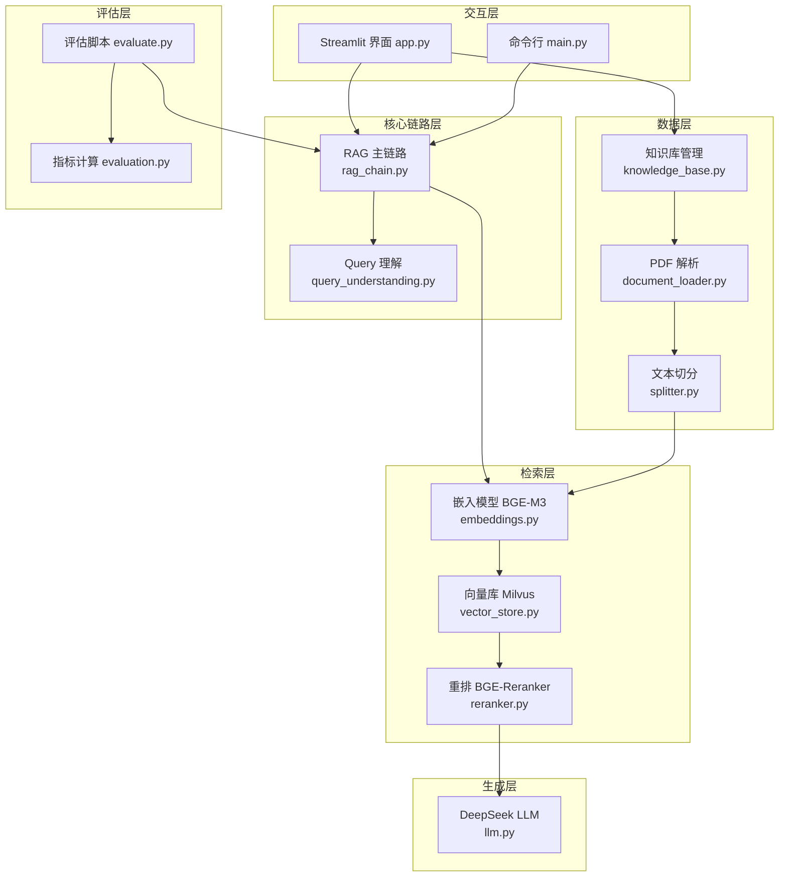
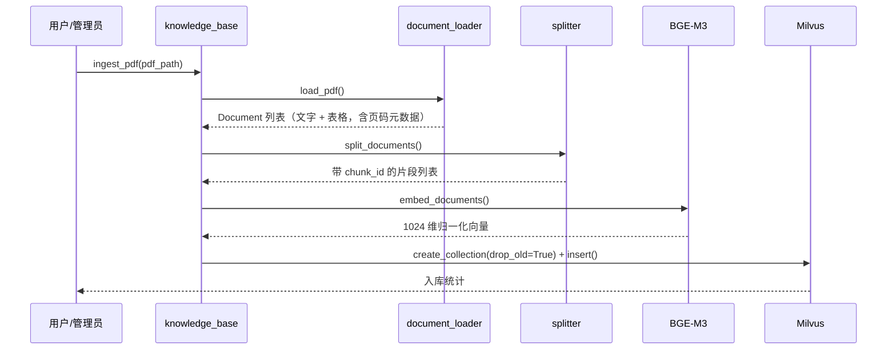
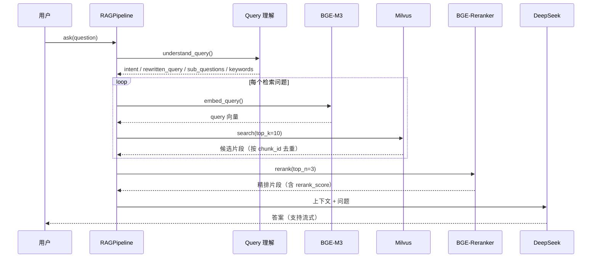

# 技术文档 —— 基于 PDF 文档的问答系统

> 工单编号：**人工智能NLP-RAG-基于PDF文档的问答系统**
> 对应工单：《人工智能NLP-RAG项目-01-基于PDF文档的问答系统任务工单V1.1》

---

## 1. 项目概述

本项目是一个基于大语言模型（LLM）与检索增强生成（RAG）技术的文档问答系统，面向《招股说明书1.pdf》
（武汉兴图新科电子股份有限公司）提供准确、可溯源的问答能力。

### 1.1 核心功能

| 功能 | 说明 |
| --- | --- |
| Query 理解 | 意图识别、消歧、分解与抽象、关键词抽取 |
| 文档解析 | 解析 PDF 正文文字与表格，剔除页眉页脚与页码 |
| 向量检索 | BGE-M3 稠密向量 + Milvus 相似度检索 |
| 结果重排 | BGE-Reranker 精排，提升上下文相关性 |
| 答案生成 | DeepSeek 大模型基于检索上下文生成答案，支持流式输出 |
| 知识库管理 | 入库、统计、清空、增量追加 |
| 交互界面 | Streamlit 界面，支持文字 / 语音提问、来源溯源与用户反馈 |
| 效果评估 | RAG 与纯 LLM 对照，RAGAS 指标评估（可降级为内置 LLM 评审） |
| 多语言 | 中文、英文提问与回答 |

### 1.2 验收指标映射

| 工单验收项 | 实现位置 |
| --- | --- |
| PDF 解析（文字 + 表格） | [document_loader.py](../src/document_loader.py) |
| 问答准确性（基于文档返回答案） | [rag_chain.py](../src/rag_chain.py) 的提示词约束 + 来源引用 |
| RAG vs 纯 LLM 对比 | [evaluate.py](../evaluate.py) |
| 交互友好性 | [app.py](../app.py) |
| 多语言支持 | 提示词显式要求与用户问题同语言作答 |
| 响应时间 ≤ 3 秒 | 计时统计见 [evaluation.py](../src/evaluation.py) 与评估报告 |
| 容错机制 | 各模块的异常捕获与降级策略（见 §9） |

---

## 2. 系统架构



### 2.1 分层职责

- **交互层**：接收用户输入（文字 / 语音），展示答案、引用来源与耗时，收集用户反馈。
- **核心链路层**：组织 Query 理解与检索生成流程。
- **检索层**：负责语义表示、相似度检索与相关性精排。
- **数据层**：负责 PDF 解析、切分与知识库读写。
- **生成层**：调用 DeepSeek 生成受上下文约束的答案。
- **评估层**：量化评估检索与生成质量，输出评估报告。

---

## 3. 技术选型

| 组件 | 选型 | 版本建议 | 选型理由 |
| --- | --- | --- | --- |
| 开发语言 | Python | 3.10+ | 生态成熟，NLP/LLM 工具链完善 |
| 应用框架 | LangChain | ≥ 0.2 | 统一 LLM / 提示词 / 输出解析抽象，LCEL 支持流式链路 |
| 向量数据库 | Milvus | ≥ 2.4 | 高性能、支持海量向量、可扩展，便于后续混合检索优化 |
| 嵌入模型 | BAAI/bge-m3 | - | 中文语义表现优秀，支持长文本与多语言 |
| 重排模型 | BAAI/bge-reranker-v2-m3 | - | 与 BGE-M3 同源，跨语言精排效果稳定 |
| 大语言模型 | DeepSeek-Chat | - | OpenAI 兼容接口，中文金融文本理解与生成能力强，成本低 |
| 前端界面 | Streamlit | ≥ 1.38 | 快速构建交互式 Web 界面，支持 `st.audio_input` 语音录入 |
| 语音识别 | SpeechRecognition | ≥ 3.10 | 调用 Google Web Speech API，实现语音转文字 |
| 评估框架 | RAGAS | ≥ 0.1 | 业界通用的 RAG 评估体系；不可用时自动降级为内置 LLM 评审 |
| PDF 解析 | PyMuPDF | ≥ 1.24 | 解析速度快，支持文本块与表格提取 |

---

## 4. 目录结构

```
新建文件夹/
├── config.py                 # 全局配置（路径、模型、检索参数）
├── main.py                   # 命令行入口（ingest / ask / chat / search / stats / reset）
├── app.py                    # Streamlit 交互界面
├── evaluate.py               # 评估脚本（RAG 对比 + 指标评估）
├── requirements.txt          # 依赖清单
├── .env.example              # 环境变量模板
├── data/
│   ├── raw/招股说明书1.pdf    # 原始 PDF 文档
│   └── questions.json        # 工单给定的 10 条问题
├── docs/
│   ├── 技术文档.md
│   └── 用户手册.md
├── output/                   # 评估结果输出（JSON / CSV）
└── src/
    ├── document_loader.py    # PDF 解析
    ├── splitter.py           # 文本切分
    ├── embeddings.py         # BGE-M3 嵌入
    ├── vector_store.py       # Milvus 向量库
    ├── reranker.py           # BGE-Reranker 重排
    ├── query_understanding.py# Query 理解
    ├── llm.py                # DeepSeek LLM
    ├── rag_chain.py          # RAG 主链路
    ├── knowledge_base.py     # 知识库管理
    ├── evaluation.py         # 评估指标
    └── utils.py              # 日志、计时、文本清洗
```

---

## 5. 核心流程

### 5.1 入库链路（离线）



### 5.2 问答链路（在线）



### 5.3 评估链路

1. 读取 `data/questions.json` 中的 10 条问题；
2. 对每个问题分别执行 RAG 问答与纯 LLM 问答；
3. 记录答案、检索上下文、引用页码与响应时间；
4. 计算 RAGAS 四项指标（忠实度 / 答案相关性 / 上下文精确率 / 上下文召回率）；
5. 导出 `output/eval_result_*.json` 与 `*.csv`，并在控制台打印对比报告。

---

## 6. 模块说明

| 模块 | 关键接口 | 说明 |
| --- | --- | --- |
| `document_loader` | `load_pdf(path)` | 逐页提取文本块，剔除上下 5% 页眉页脚；可选提取表格为 Markdown |
| `splitter` | `split_documents(docs)` | 递归字符切分（500/80），生成 `chunk_id = 文件名_页码_序号` |
| `embeddings` | `get_embedding_model()` | BGE-M3 封装，输出 L2 归一化向量；单例复用 |
| `vector_store` | `MilvusStore.search()` | Milvus 集合管理、批量写入、向量检索 |
| `reranker` | `Reranker.rerank()` | Cross-Encoder 精排，结果写入 `metadata.rerank_score` |
| `query_understanding` | `understand_query()` | 输出 `QueryAnalysis`（意图 / 规范问题 / 子问题 / 关键词） |
| `llm` | `get_cached_llm()` | DeepSeek 实例，支持流式 |
| `rag_chain` | `RAGPipeline.ask()/stream_ask()` | 串联完整问答流程，返回含耗时与证据的 `RAGResult` |
| `knowledge_base` | `ingest_pdf()` / `clear_knowledge_base()` | 知识库入库、统计与清空 |
| `evaluation` | `evaluate_records_builtin()` | RAGAS 指标计算，自动降级 |
| `utils` | `get_logger()` / `timer()` | 统一日志（含工单编号）与计时 |

---

## 7. 数据模型

### 7.1 Milvus 集合结构

集合名：`pdf_qa_prospectus`，度量方式：`IP`（内积，向量已归一化，等价余弦相似度）。

| 字段 | 类型 | 说明 |
| --- | --- | --- |
| `chunk_id` | VARCHAR(512) | 主键，`文件名_页码_片段序号` |
| `vector` | FLOAT_VECTOR(1024) | BGE-M3 稠密向量 |
| `content` | VARCHAR(65535) | 片段原文 |
| `source` | VARCHAR(512) | 来源文件名 |
| `page` | INT64 | 页码（用于答案溯源） |
| `type` | VARCHAR(32) | `text` 或 `table` |
| `chunk_index` | INT64 | 片段序号 |

### 7.2 检索片段结构（应用内）

```json
{
  "content": "片段原文",
  "score": 0.83,
  "metadata": {
    "chunk_id": "招股说明书1.pdf_118_2",
    "source": "招股说明书1.pdf",
    "page": 118,
    "type": "text",
    "chunk_index": 2,
    "rerank_score": 0.97
  }
}
```

---

## 8. 配置说明

所有可调参数集中在 [config.py](../config.py)。

| 参数 | 默认值 | 含义 |
| --- | --- | --- |
| `PAGE_MARGIN_RATIO` | 0.05 | 页眉页脚剔除比例 |
| `ENABLE_TABLE_PARSING` | True | 是否解析表格 |
| `CHUNK_SIZE` / `CHUNK_OVERLAP` | 500 / 80 | 切分窗口与重叠 |
| `MILVUS_URI` | http://localhost:19530 | Milvus 地址 |
| `MILVUS_COLLECTION` | pdf_qa_prospectus | 集合名 |
| `RETRIEVE_TOP_K` | 10 | 向量召回数量 |
| `RERANK_TOP_N` | 3 | 重排后保留数量 |
| `SCORE_THRESHOLD` | 0.35 | 相似度下限 |
| `EMBEDDING_MODEL_NAME` | BAAI/bge-m3 | 嵌入模型 |
| `RERANKER_MODEL_NAME` | BAAI/bge-reranker-v2-m3 | 重排模型 |
| `LLM_MODEL` | deepseek-chat | 大模型名称 |
| `MAX_SUB_QUESTIONS` | 4 | 问题分解上限 |
| `RESPONSE_TIME_TARGET` | 3.0 | 响应时间目标（秒） |

**敏感信息（API Key / 服务地址）通过 `.env` 注入**，参见 [.env.example](../.env.example)：
`DEEPSEEK_API_KEY`、`DEEPSEEK_BASE_URL`、`MILVUS_URI`、`MILVUS_TOKEN` 等。

---

## 9. 容错与性能设计

### 9.1 容错机制

| 异常场景 | 处理策略 |
| --- | --- |
| PDF 文件不存在 / 加密 / 损坏 | 抛出 `DocumentParseError`，界面提示明确原因 |
| PDF 无文字层（扫描件） | 解析结果为空时给出“请确认是否包含文字层”提示 |
| PDF 单页表格解析失败 | 记录警告，跳过该页表格，不影响正文解析 |
| Query 理解调用失败 | 自动降级为“原问题直接检索”，保证问答可用 |
| Milvus 未启动 | 抛出 `VectorStoreError`，提示启动命令 |
| 知识库为空 | 检索返回空列表，界面提示先执行入库 |
| 未检索到相关片段 | 直接返回“根据提供的文档内容，无法回答该问题”，避免编造 |
| 未配置 API Key | `LLMConfigError` 提示配置 `.env` |
| RAGAS 依赖冲突不可用 | 自动降级为内置 LLM 评审实现 |
| 语音识别失败 | 捕获异常并提示，不影响文字输入 |

### 9.2 性能设计

- **单例复用**：嵌入模型、重排模型、LLM、向量库均以单例缓存，避免重复加载。
- **向量归一化 + IP**：减少在线计算开销。
- **两阶段检索**：先向量粗排（top_k=10）再精排（top_n=3），在精度与耗时之间取得平衡。
- **流式生成**：`stream_ask` 边生成边展示，降低用户感知延迟。
- **分页入库**：写入按 500 条批量提交，降低 Milvus 压力。

---

## 10. 评估体系

采用 **RAGAS** 评估体系，四项核心指标：

| 指标 | 含义 | 是否需要参考答案 |
| --- | --- | --- |
| Faithfulness 忠实度 | 答案是否完全由检索上下文支持 | 否 |
| Answer Relevancy 答案相关性 | 答案与问题的相关程度 | 否 |
| Context Precision 上下文精确率 | 检索片段中与问题相关的比例 | 否 |
| Context Recall 上下文召回率 | 检索片段是否覆盖参考答案所需信息 | 是（可选） |

- **优先使用 RAGAS 官方实现**（`ragas.evaluate`）；
- 当环境中 RAGAS 因依赖冲突无法导入时，**自动降级为内置的 LLM-as-a-Judge 实现**，
  指标定义与 RAGAS 保持一致，保证评估流程始终可运行；
- 同时输出 **RAG 与纯 LLM 的答案对比**，用于验证检索带来的增益；
- 结果导出至 `output/eval_result_<时间戳>.json / .csv`。

---

## 11. 开发流程

1. **需求分析**：拆解工单任务描述、功能需求与验收标准；
2. **环境准备**：安装依赖、启动 Milvus、配置 `.env`；
3. **数据准备**：解析 PDF、切分、向量化入库；
4. **链路开发**：按 Query 理解 → 检索 → 重排 → 生成顺序开发；
5. **界面开发**：Streamlit 交互与来源展示；
6. **联调验证**：针对工单 10 条问题逐条验证；
7. **评估优化**：运行评估脚本，依据指标调整切分、top_k、top_n 与提示词；
8. **文档交付**：技术文档、用户手册、演示材料。

---

## 12. 后续优化方向

本工单为系列工单的第 01 项，后续可沿以下方向演进：

| 工单 | 方向 | 本项目预留的扩展点 |
| --- | --- | --- |
| 02 | 问答系统优化 | 提示词与切分参数集中在 `config.py` |
| 03 | 表格解析与检索优化 | `document_loader` 已支持表格 Markdown 提取 |
| 04 | 图像内容解析 | 可在 `document_loader` 中扩展 OCR 分支 |
| 05 | Query 理解优化 | `query_understanding.py` 独立可替换 |
| 06 | 混合检索 | `vector_store` 可扩展稀疏向量与 BM25；`EMBEDDING_USE_SPARSE` 已预留 |
| 07 | 功能测试与评估 | `evaluation.py` 已实现四项 RAGAS 指标 |
| 08-09 | Graph + RAG | 检索层可平替为图检索 |
| 10 | 系统部署 | 单例与配置化设计便于容器化 |
| 11 | Embeddings 微调 | `EMBEDDING_MODEL_PATH` 支持指向本地微调模型 |
| 12 | LightRAG 优化 | RAG 主链路与存储解耦 |

---

## 附：代码注释规范

按工单备注要求，**所有源码文件头部注释均包含工单编号**：

```
工单编号：人工智能NLP-RAG-基于PDF文档的问答系统
```

同时日志输出也会携带该工单编号，便于交付验收与问题追溯。
