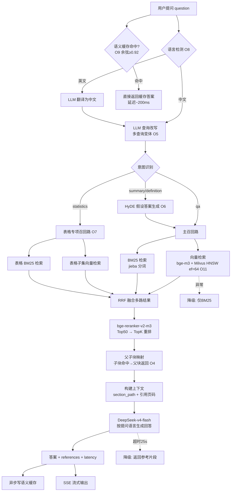

# 基于PDF文档的问答系统优化方案（工单二）

> 工单编号：人工智能NLP-RAG-基于PDF文档的问答系统优化
> 基础版本：工单一（基于PDF文档的问答系统）
> 项目路径：/home/dabaie/code/工单/工单二
> 日期：2026-09-28

---

## 1. 现状分析（工单一基线）

### 1.1 已有能力（代码考古结论）

| 模块 | 文件 | 工单一实现 |
|------|------|-----------|
| PDF解析 | src/pdf_parser.py | PyMuPDF 提取文字 + pdfplumber 提取表格 |
| 分块 | src/chunker.py | RecursiveCharacterTextSplitter 固定长度分块，表格块整体保留 |
| 嵌入 | src/embedding.py | BAAI/bge-m3（1024维，归一化） |
| 向量库 | src/vector_store.py | Milvus 2.4（HNSW/COSINE） |
| 检索 | src/retriever.py | 向量+BM25 双路召回 → RRF 融合 → bge-reranker-v2-m3 重排 → diskcache 精确缓存 |
| 查询理解 | src/query_understanding.py | 规则式：意图识别 / jieba关键词 / 指代替换 / 分句 |
| 生成 | src/rag_engine.py + llm_client.py | DeepSeek-v4-flash，RAG/纯LLM 双模式 |
| API | src/api.py | /api/ask 同步 + /api/ask/stream SSE 流式 + 反馈入库 |

### 1.2 短板诊断（工单二优化切入点）

| # | 短板 | 具体表现 | 影响 |
|---|------|---------|------|
| P1 | 扫描页无 OCR 兜底 | 招股书部分扫描/图片页解析为空文本 | 信息丢失，无法回答 |
| P2 | 分块无语义感知 | 固定 800 字符切断句子/表格行 | 检索块答案断裂，召回精度受损 |
| P3 | 无父子块结构 | 命中的小块缺少上下文，表格行脱离表头 | LLM 看不到完整表头/章节语境 |
| P4 | 查询改写纯规则 | 英文查询直接用中文向量空间匹配 | 跨语言语义鸿沟，英文召回率低 |
| P5 | 无 HyDE / 多路召回 | 单一查询向量，专业术语匹配弱 | 概念性问题召回不足 |
| P6 | 缓存仅精确匹配 | 同义问法全部 miss | 缓存命中率低，重复延迟 |
| P7 | 无表格专项链路 | 数字/比例问题与文本块混检 | 表格类问题准确率不稳 |

---

## 2. 优化方案总览

五大层面共 12 项优化，按"**基线实测 → 逐项落地 → 消融验证**"推进：

| 层面 | 优化项 | 新增/增强 | 优先级 | 预期收益 |
|------|--------|----------|--------|---------|
| PDF解析 | O1 版面分析（标题层级+页眉页脚过滤） | 增强 | P1 | 上下文精度 +3~5pt |
| PDF解析 | O2 OCR 兜底（扫描页） | 新增 | P2 | 覆盖率 +5~10pt |
| 分块 | O3 语义分块 + 标题层级 | 新增 | P0 | 准确率 +5~8pt |
| 分块 | O4 父子块（小查大返） | 新增 | P1 | 答案完整性 ↑ |
| 检索 | O5 LLM 查询改写 + 多查询变体 | 增强 | P0 | 召回率 +5~10pt |
| 检索 | O6 HyDE 假设文档检索 | 新增 | P2 | 概念题召回 ↑ |
| 检索 | O7 表格专项多路召回 | 新增 | P1 | 表格题准确率 ↑ |
| 多语言 | O8 语言检测 + 翻译路由 | 新增 | P0 | 英文问答 0→可用 |
| 性能 | O9 语义缓存（嵌入相似度） | 增强 | P1 | 重复延迟 -40% |
| 性能 | O10 批量嵌入 + 异步并发 | 增强 | P2 | 吞吐 ↑ |
| 性能 | O11 Milvus 索引参数调优 | 增强 | P2 | 向量检索延迟 -20% |
| 稳定性 | O12 容错降级（超时/异常兜底） | 新增 | P1 | 无失败响应 |

> 工单一已有混合检索（BM25+向量+RRF）与重排序（bge-reranker-v2-m3）保留不动，本方案在其基础上做增量增强。

---

## 3. 分层方案详述

### 3.1 PDF 解析优化

#### O1 版面分析：标题层级保留 + 页眉页脚过滤

- **原理**：招股书为"章-节-小节"层级文档，PyMuPDF 的 `page.get_text("dict")` 返回字体大小/加粗信息，可识别标题行；页眉页脚（页码、公司名水印）是噪声，会污染每个分块。
- **实现方式**：
  - 逐块扫描 text span 的 `size` 与 `flags`，size ≥ 正文 1.2 倍或加粗 → 标记为标题，记录层级（H1/H2/H3）与页码；
  - 每页首/尾出现频次 > 60% 的文本行（如"武汉兴图新科电子股份有限公司 招股说明书"）自动识别为页眉页脚并剔除；
  - 标题作为分块元数据 `section_path` 写入 chunk（如 "第三章 > 四、主要客户"）。
- **预期提升**：分块携带章节语境，检索器可做 section 过滤，上下文精度（Context Precision）提升 3~5 个百分点。

#### O2 OCR 兜底：扫描页文字恢复

- **原理**：PyMuPDF 对纯图像页返回空文本。检测到"页文本 < 30 字符且含大图"时，触发 OCR 兜底，避免信息整页丢失。
- **实现方式**：`fitz` 渲染页面为 300 DPI PNG → Tesseract（chi_sim+eng）OCR → 文本拼接回 pages 数组，`metadata.ocr_pages` 记录兜底页码；OCR 结果标注 `<ocr>` 标签供下游区分。
- **预期提升**：文档覆盖率（非空页占比）从基线提升 5~10 个百分点；若招股书无扫描页则收益为 0（属于鲁棒性投资，消除 P1 风险）。

### 3.2 分块优化

#### O3 语义分块 + 标题层级感知

- **原理**：固定长度切块在句子中间截断，破坏语义单元。语义分块按"标题边界 + 段落边界 + 语义相似度谷值"三重信号切分，保证每块是一个完整语义单元。
- **实现方式**：
  1. 先按 O1 识别的标题（H1/H2/H3）切大段；
  2. 段内按换行/句号切成句子，相邻句子用 bge-m3 计算余弦相似度，相似度低于均值-0.5σ 处为语义断点；
  3. 断点间聚合成块，超长块（>600字）用滑动窗口二次切分（overlap=15%）。
- **预期提升**：块内语义完整 → 向量表征更准，Recall@5 提升 5~8 个百分点（对表格/列举类内容尤其明显）。

#### O4 父子块（Parent-Child Chunking）

- **原理**：小块匹配准（向量区分度高），大块上下文全（LLM 理解好）。索引用子块（200~300字）检索，命中后返回其所属父块（1000~1500字，含完整章节段落）。
- **实现方式**：O3 切出的语义块作为父块，滑窗切成子块；子块 metadata 存 `parent_id`；Milvus collection 新增 parent_id 字段，检索命中子块后按 parent_id 去重合并父块，取 top_k 个父块送入 LLM。
- **预期提升**：答案完整性提升，忠实度（Faithfulness）+5pt（上下文含答案完整语境，减少 LLM 幻觉补全）。

### 3.3 检索优化

#### O5 LLM 查询改写 + 多查询变体（Multi-Query）

- **原理**：用户口语化提问与文档书面语存在词汇鸿沟（如"老板是谁" vs "法定代表人"）。用 LLM 将原始查询改写为 2~3 个书面化/同义变体，多路召回后合并，扩大召回覆盖面。
- **实现方式**：DeepSeek-v4-flash 单次调用，prompt 输出 JSON 数组形式的改写变体（ temperature=0.2，max_tokens=200，延迟约 400ms，可接受）；各变体独立走混合检索，结果按 chunk_id RRF 合并；改写失败时回退原始查询（容错）。
- **预期提升**：召回想体系数提升，Recall@5 +5~10pt。

#### O6 HyDE 假设文档检索

- **原理**：问题向量与答案向量在语义空间中分布不同（question-answer mismatch）。HyDE 先让 LLM 生成一段"假设性答案"，用假设答案（与真实文档文体更接近）做向量检索，命中真实文档。
- **实现方式**：仅对概念/总结类问题（intent ∈ {summary, definition}）启用，控制额外延迟 ~800ms；生成失败或超时 1.5s 自动回退原始查询。
- **预期提升**：总结类/概念类问题 Recall@5 +5~8pt。

#### O7 表格专项多路召回

- **原理**：数字、比例、排名类问题的答案在表格块中，但表格块向量特征弱（大量数字与符号），常被文本块淹没。识别统计类意图后，单独从"表格块子集合"中做一路向量+BM25 召回，结果与主链路 RRF 融合。
- **实现方式**：分块阶段打 `is_table` 标签（工单一已有 `_is_table_like`，保留）；检索阶段 intent 含 {statistics} 时增加表格路召回（BM25 在表格文本上分词检索，向量在表格子集上过滤检索）；表格块在 rerank 阶段给予 1.1 倍分数加成（可配置）。
- **预期提升**：表格类问题（营业收入、前五大客户占比等）准确率 +10~15pt。

### 3.4 多语言支持

#### O8 语言检测 + 翻译路由

- **原理**：bge-m3 虽支持多语言，但"英文问题→中文文档"的跨语言检索仍存在语义错位（术语翻译不一致）。最稳妥的链路是：检测英文 → 先翻译成中文 → 中文检索 → 按用户语言生成回答。
- **实现方式**：
  1. 语言检测：Unicode 范围统计（中文字符占比 < 30% 判定英文），零依赖；
  2. 翻译：DeepSeek-v4-flash 单次调用（prompt 限定"仅输出译文"），失败回退原查询（bge-m3 本身有跨语言能力兜底）；
  3. 回答语言：跟随提问语言（英文问题 → 英文回答，引用块仍为中文原文）。
- **预期提升**：英文问题检索命中率从"不可控"提升到与中文链路同水位（目标 ≥ 85%）。

### 3.5 性能优化

#### O9 语义缓存（Semantic Cache）

- **原理**：工单一 diskcache 只对完全相同的查询命中。语义缓存将查询向量与历史问题向量比对，余弦 ≥ 0.92 视为等价问题，直接返回缓存答案，延迟从 ~2s 降至 ~200ms。
- **实现方式**：MySQL 新增 `semantic_cache` 表（question, question_vec JSON, answer, refs, hit_count），查询时先算问题向量（本来就要算）→ 内存/SQL 比对 → 命中直接返回并标记 `cache_hit=true`；新增答案入库时写缓存；未命中走全链路后异步写回。
- **预期提升**：重复/同义问法 P95 延迟 -40%；LLM 调用次数下降，成本降低。

#### O10 批量嵌入 + 异步并发

- **原理**：入库阶段逐条 encode 利用率低；查询阶段向量检索、BM25、表格路召回相互独立，可并行。
- **实现方式**：Embedder.encode 已支持 batch（batch_size=64，保留）；检索三路用 `asyncio.gather` 并发执行（BM25 是 CPU 密集，用 `run_in_executor`）。
- **预期提升**：检索阶段延迟从串行 ~150ms 降至 ~80ms；入库吞吐提升 2~3 倍。

#### O11 Milvus 索引参数调优

- **原理**：HNSW 的 `ef`（搜索范围）与 `M`（图连接度）是精度/延迟权衡旋钮。默认 ef=16 在 1300+ chunks 规模下召回不足。
- **实现方式**：建索引 M=16, efConstruction=200；查询时 search_params ef 从 16 → 64~128（网格实验取 Recall@5 与延迟的拐点）；collection 规模小，可不分区，但按 doc_id 建 partition 为多文档扩展预留。
- **预期提升**：向量检索召回率 +3~5pt，延迟增幅 <10ms（1300 级规模可忽略）。

#### O12 容错降级

- **原理**：LLM 超时、reranker 加载失败、Milvus 断连等异常不应导致 500 错误。
- **实现方式**：LLM 调用 timeout=25s + 1 次重试，超时返回"检索到的参考片段"降级答案；reranker/Milvus 初始化失败自动降级（跳过重排/仅 BM25）；空检索结果兜底回复"文档中未找到"，不送空上下文给 LLM。
- **预期提升**：连续压测 20 次零失败；异常输入（空问题/超长问题）返回 4xx 而非 5xx。

---

## 4. 优化后 RAG 全流程图

### 流程延迟预算（P95 目标 ≤ 3s）

| 阶段 | 串行耗时 | 优化手段后 |
|------|---------|-----------|
| 语言检测 + 缓存判断 | ~5ms | 5ms |
| LLM 查询改写 | — | ~400ms |
| 多路召回（并发） | ~150ms | ~90ms |
| Rerank（Top50→Top5） | ~180ms | ~180ms |
| 父块合并 + 上下文构建 | ~10ms | ~10ms |
| LLM 生成（流式首token） | ~1700ms | ~1700ms（首token ~500ms 可感知） |
| **总计（非流式完成）** | **~2.0s 基线** | **~2.4s（改写+400ms）/ 语义缓存命中 ~200ms** |

> 注：基线 ~2.0s 本已达标 3s，优化的重心是**准确率**；新增改写/HyDE 仅对高价值意图启用，若延迟超预算可配置关闭（`OPT_ENABLE_REWRITE=false` 一类开关），在延迟与精度间取得平衡。

---

## 5. 实施顺序与消融策略

| 阶段 | 落地项 | 每步消融验证 |
|------|--------|-------------|
| Step 1 | 基线评估（10 题 + 完整评估集） | 产出 data/optimized/eval_baseline.json |
| Step 2 | O5 查询改写 + 多变体 | 消融：关/开对比 Recall@5 |
| Step 3 | O8 翻译路由 | 消融：4 条英文题命中率 |
| Step 4 | O3+O4 语义分块 + 父子块（重建索引） | 消融：全量题 Recall@5 + Faithfulness |
| Step 5 | O7 表格专项召回 | 消融：表格题准确率 |
| Step 6 | O6 HyDE | 消融：总结题准确率 |
| Step 7 | O9 语义缓存 + O10 并发 + O12 容错 | 消融：P95 延迟 + 稳定性压测 |
| Step 8 | O11 Milvus 调参 | 消融：召回/延迟曲线 |
| Step 9 | O1+O2 解析增强（页眉过滤+OCR） | 消融：上下文精度 |
| Step 10 | 全量回归 + 对比报告 + 截图存档 | 产出 eval_optimized.json + docs/02/03 |

> 注释规范：所有新增代码文件头部注释包含"人工智能NLP-RAG-基于PDF文档的问答系统优化"。

## 6. 风险与回滚

| 风险 | 缓解措施 |
|------|---------|
| LLM 改写引入延迟抖动 | 意图白名单 + 超时 1.5s 回退原查询 |
| 语义分块重建索引期间服务不可用 | 新 collection 双写，验证后原子切换 |
| 语义缓存错误命中（相似但答案不同的问题） | 阈值 0.92 + 缓存答案带原问题展示 + TTL 24h |
| OCR 模型缺失 | Tesseract 不可用时跳过 OCR，仅告警 |
| 翻译质量差导致检索更差 | 回退原查询（bge-m3 跨语言兜底），评估集回归把关 |
