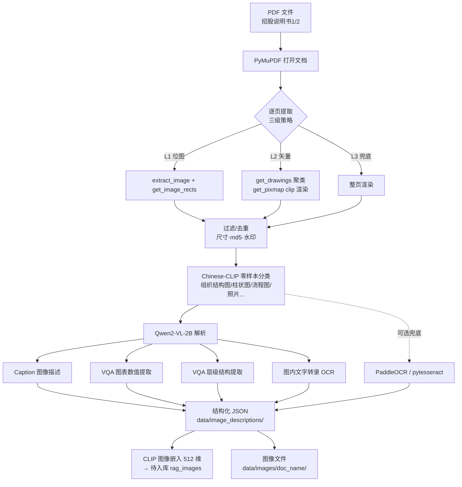

# 工单四 · 方案一：PDF 图像解析方案

> 工单编号：人工智能NLP-RAG-图像内容解析及检索优化
>
> 本文档为 Step 1 设计产出，对应代码落地为 `src/image_parser/`（Step 2 实现）。

## 一、目标与输入

- **目标**：从两份招股说明书 PDF 中提取图像（组织结构图、图表、流程图、照片等），使用多模态模型生成图像描述、结构化信息与 VQA 数据，产出可供检索入库的结构化 JSON。
- **输入**：`/home/dabaie/code/工单/附件/招股说明书1.pdf`（武汉兴图新科）、`招股说明书2.pdf`（武汉力源信息）；若附件目录文件名不同，自动扫描全部 PDF 按顺序命名。
- **输出**：
  - 图像文件：`data/images/{doc_name}/img_p{page:03d}_{idx}.png`
  - 描述 JSON：`data/image_descriptions/{doc_name}_images.json`

## 二、环境勘察结论（Step 1 实测）

| 项 | 现状 | 方案决策 |
|----|------|----------|
| GPU | RTX 5060 Laptop 8GB，CUDA 可用 | VL 模型 fp16 上 GPU，batch=1，防 OOM（沿用工单三显存经验） |
| Python | `/home/dabaie/code/my_project/.venv`，torch 2.11+cu128，transformers 5.17 | transformers 原生 `ChineseCLIPModel` / `Qwen2VLForConditionalGeneration`，**免装 cn_clip** |
| PyMuPDF | 1.28.2（`import pymupdf` 新 API） | 图像提取主引擎 |
| OCR | tesseract 未装、paddleocr 未装 | **Qwen2-VL 文字转录为主通道**，PaddleOCR 可选兜底，pytesseract 检测到才启用 |
| 本地模型 | `/home/dabaie/models` 仅 bge-m3、bge-reranker-v2-m3 | 需下载 chinese-clip-vit-base-patch16（约 0.8GB）、Qwen2-VL-2B-Instruct（约 4.4GB）至该目录 |

## 三、图像提取（PyMuPDF）

### 3.1 三级提取策略

招股说明书中的组织结构图/流程图可能是**位图 XObject、矢量绘图、或整页扫描图**，单一 `page.get_images()` 无法覆盖矢量图，因此设计三级提取：

1. **L1 位图提取**：`page.get_images(full=True)` + `doc.extract_image(xref)`，按 `page.get_image_rects(xref)` 记录页面位置 bbox。
2. **L2 矢量区域渲染**：`page.get_drawings()` 聚类矢量图元（矩形/曲线密集且面积 > 阈值的连通区域），`page.get_pixmap(clip=rect, dpi=200)` 渲染为 PNG——覆盖"用矢量线条画的组织结构图/流程图"。
3. **L3 整页兜底**：对文字极少（<30 字符，复用工单二阈值）且含图像/绘图的页面，整页渲染后由后续分类环节裁剪判定。

### 3.2 过滤与去重

- 尺寸过滤：宽或高 < 100px 的图标/装饰线剔除；
- 色彩过滤：纯黑白且面积极小（页眉 Logo、签章条）降权保留；
- 内容去重：PNG 字节 md5 去重；跨页重复水印剔除（招股说明书1 含水印层，取"无水印"版本解析时注意一致性）；
- 元数据记录：`page`、`bbox(x0,y0,x1,y1)`、`width`、`height`、提取来源（L1/L2/L3）、md5。

## 四、图像分类

两级分类：

1. **规则粗分**：长宽比、色彩数、边缘密度（照片 vs 示意图初判）。
2. **Chinese-CLIP 零样本细分**：候选标签集
   `["组织结构图", "流程图", "柱状图", "折线图", "饼图", "表格截图", "示意图", "产品照片", "人物照片", "印章", "地图", "其他"]`
   ，图像编码与各标签文本编码算余弦相似度取 Top-1；置信度 < 0.25 时标记 `uncertain`，交由 Qwen2-VL 描述修正。

## 五、多模态解析

### 5.1 Chinese-CLIP 图像嵌入（检索主向量）

- 模型：`OFA-Sys/chinese-clip-vit-base-patch16`（transformers `ChineseCLIPModel`），输出 **512 维**图像向量；
- 预处理：短边缩放至 224、中心裁剪、归一化（与 text encoder 同空间，查询时文本向量可直接检索图像向量）；
- 落盘：向量存 Milvus `rag_images.clip_vector`（见方案二），JSON 中不重复存大数组，仅存 sha1 校验。

### 5.2 Qwen2-VL 图像描述与 VQA（语义解析主引擎）

- 模型：`Qwen/Qwen2-VL-2B-Instruct`，fp16、batch=1、max_new_tokens≤512；
- 四类任务 prompt（中文，输出 JSON）：
  1. **Caption**：`用一段中文描述这张图的内容、类型与关键信息`；
  2. **VQA（图表类）**：柱状图/折线图/饼图 → `提取图中的数据系列、坐标轴含义与每个类别的数值，输出结构化列表`（解决 IMG-06"2008年中国IC市场应用结构与增长"的数值读取）；
  3. **VQA（组织/流程图）**：`提取图中的层级结构：每个节点的名称、父节点、子节点列表`（解决 IMG-05"销售部由几个部门构成、大客户销售部下设几个销售处"）；
  4. **文字转录（OCR 替代）**：`逐字转录图中出现的全部文字，保持原始顺序`。
- 显存策略：解析为**离线批处理阶段**，运行时卸载 bge-m3/reranker 的 GPU 占用（它们常驻 CPU），8GB 显存足够 Qwen2-VL-2B fp16；OOM 时自动降级 CPU（batch=1）。
- 容错：单图解析失败重试 1 次，仍失败则写入 `parse_status: failed`，不阻塞流水线。

### 5.3 OCR 辅助（三级降级）

| 优先级 | 引擎 | 条件 |
|--------|------|------|
| 1 | Qwen2-VL 文字转录（5.2 任务4） | 默认主通道，无额外安装 |
| 2 | PaddleOCR（PP-OCRv4 mobile） | `pip install paddleocr` 后自动启用，长图/多栏更稳 |
| 3 | pytesseract（chi_sim+eng） | 检测到系统 tesseract 才启用（当前未装，跳过） |

三者结果合并去重后写入 `ocr_text`，与 Qwen2-VL 转录互相校验（字符重合率 < 60% 时在 metadata 标记 `ocr_conflict`）。

## 六、输出 JSON 结构

`data/image_descriptions/{doc_name}_images.json`：

```json
{
  "doc_id": "招股说明书2",
  "work_order": "人工智能NLP-RAG-图像内容解析及检索优化",
  "images": [
    {
      "image_id": "img_005",
      "doc_id": "招股说明书2",
      "page": 38,
      "path": "data/images/招股说明书2/img_p038_001.png",
      "bbox": [72.1, 210.5, 523.4, 690.2],
      "width": 1128,
      "height": 1216,
      "extract_source": "L1",
      "image_type": "组织结构图",
      "type_confidence": 0.71,
      "caption": "武汉力源信息技术股份有限公司组织结构图，展示总经理下设销售部、研发部等，销售部下设大客户销售部等部门",
      "ocr_text": "总经理 销售部 研发部 ... 大客户销售部 华东销售处 华南销售处 ...",
      "vqa_qa": [
        {"q": "销售部由几个部门构成？", "a": "由4个部门构成：大客户销售部、区域销售一部、区域销售二部、海外销售部"},
        {"q": "大客户销售部下设几个销售处？", "a": "下设3个销售处"}
      ],
      "structure": {"nodes": [{"name": "销售部", "children": ["大客户销售部", "..."]}]},
      "embedding_sha1": "3f2a...",
      "parse_status": "ok"
    }
  ],
  "stats": {"total_pages": 246, "extracted": 57, "parsed_ok": 55, "failed": 2}
}
```

字段与工单要求的 `image_id、doc_id、page、path、caption、ocr_text、vqa_qa、embedding` 一一对应（embedding 本体入 Milvus，JSON 存 sha1 溯源）。

## 七、图像解析流程图



## 八、验收标准（本方案对应 Step 2/3 落地后）

1. 两份 PDF 图像提取覆盖：组织结构图（招股说明书2）、2008 中国 IC 市场应用结构图（招股说明书2）必须命中；
2. `image_type` 分类 Top-1 命中人工标注 ≥ 80%；
3. IMG-05/IMG-06 相关 VQA 答案与图中事实一致（人工核对）；
4. 全流程失败图不阻塞，`parse_status` 可追踪；
5. 每步运行截图存 `docs/screenshots/`。
