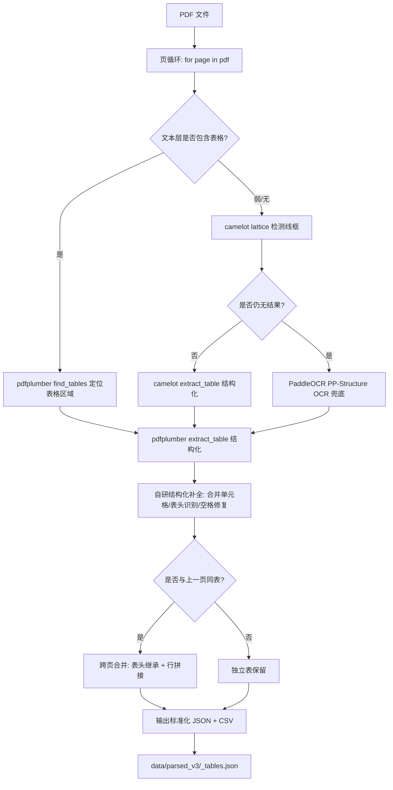

# 表格解析方案（工单三）

> 工单编号：人工智能NLP-RAG-PDF文档的表格解析及检索优化
> 基础版本：工单二（基于 PDF 文档的问答系统优化）
> 项目路径：/home/dabaie/code/工单/工单三
> 源文档：招股说明书1.pdf（武汉兴图新科电子股份有限公司）、招股说明书2.pdf（武汉力源信息技术股份有限公司）
> OCR 环境：`/home/dabaie/code/my_project/.venv-mineru-paddle`（PaddleOCR / MinerU 兜底）

## 一、目标

针对工单二中文本检索在表格类问题（发行股数、募集资金、关联方、持股比例、军用领域收入等）上召回不足的问题，工单三新增**表格结构化解析**能力：

1. 从 PDF 中定位并抽取所有表格区域
2. 还原表格结构（表头、行列、合并单元格）
3. 跨页表格合并、表头继承
4. 扫描版 / 低质量表格用 PaddleOCR 兜底
5. 输出标准化 JSON，供下游表格感知检索使用

## 二、技术选型

| 组件 | 选型 | 用途 | 备注 |
|------|------|------|------|
| 表格定位 | pdfplumber `find_tables` | 文本层表格区域检测 | 主路径，速度快 |
| 结构还原 | pdfplumber `extract_table` + 自研规则 | 行列、单元格、合并 | 修补缺线、空格合并 |
| 兜底解析 | camelot（lattice + stream） | 复杂线框表 / 无线框表 | 备用路径 |
| OCR 兜底 | PaddleOCR（PP-Structure） | 扫描版 / 图片化表格 | 使用 `.venv-mineru-paddle` 环境 |
| 跨页合并 | 自研规则 | 同表头连续页拼接 | 表头指纹匹配 |
| 输出 | JSON + CSV | 结构化存储 + 人工校验 | `data/parsed_v3/`、`data/tables/` |

## 三、解析流程



## 四、表格结构化规则（自研）

### 4.1 单元格合并识别

- pdfplumber 默认返回二维字符串数组，丢失合并信息
- 自研规则：用 `boundingbox` 与 `columns` 边界比对，跨多列的 `spanning` 单元格在 JSON 中以 `rowspan/colspan` 标注，内容仅保留在起始格
- 同一单元格内多行文本用 `\n` 保留

### 4.2 表头识别

- **首行指纹**：若首行出现"项目/类别/期间/金额/比例/公司/姓名"等关键词，判定为表头
- **跨页继承**：若当前页表格首行与上一页表格表头指纹相似度 ≥ 0.85（Jaccard），则复用上一页表头并丢弃当前首行
- **空表头补全**：缺表头时，按"列1、列2…"自动命名并加 `header_inferred=true` 标记

### 4.3 跨页表格合并

- 触发条件：相邻页表格列数相同 & 首行相似度 ≥ 0.85
- 合并策略：表头只保留一次，数据行按页序拼接，`page_range=[start, end]` 记录跨页跨度
- 在 JSON 中以同一 `table_id` 跨多页存储

### 4.4 空格与数字修复

- 数字被空格切碎（如 "1 234.56"）→ 正则 `(\d)\s+(\d)` 拼接
- 百分号脱列（"12.3 %"）→ 与前一列数字合并
- 货币单位单独成行 → 上提到所属数值

## 五、OCR 兜底策略

### 5.1 触发条件

- pdfplumber + camelot 双双返回空表
- 或返回的表格单元格文本长度总和 < 10（疑似图片化）

### 5.2 执行环境

```bash
# 激活独立 OCR 环境（避免与主环境依赖冲突）
source /home/dabaie/code/my_project/.venv-mineru-paddle/bin/activate
python -m paddleocr_ppstruct --image <page_png> --output <json_path>
```

### 5.3 结果归一化

- PP-Structure 输出 HTML 表格 → 解析为统一 JSON 结构
- 保留 `ocr_confidence` 字段，< 0.6 的单元格加 `low_confidence=true` 标记，供下游检索降权

## 六、输出 JSON 结构

```json
{
  "doc_id": "招股说明书1",
  "company": "武汉兴图新科电子股份有限公司",
  "doc_type": "招股说明书",
  "tables": [
    {
      "table_id": "tbl_001_003",
      "page_range": [3, 4],
      "caption": "发行股数与募集资金",
      "headers": ["项目", "金额", "比例"],
      "rows": [
        {"项目": "发行股数", "金额": "12 345 678", "比例": "100%"},
        {"项目": "募集资金总额", "金额": "98 765 432 元", "比例": "-"}
      ],
      "cells": [
        {"r": 0, "c": 0, "text": "项目", "rowspan": 1, "colspan": 1},
        {"r": 0, "c": 1, "text": "金额", "rowspan": 1, "colspan": 1}
      ],
      "merged_cells": [],
      "header_inferred": false,
      "ocr_source": "pdfplumber",
      "ocr_confidence": null,
      "low_confidence": false,
      "raw_bbox": [72.0, 350.2, 540.0, 410.5]
    }
  ]
}
```

## 七、存储路径

| 产出 | 路径 | 说明 |
|------|------|------|
| 结构化 JSON | `data/parsed_v3/<doc_id>_tables.json` | 全量表，含所有表格 |
| 单表 CSV | `data/tables/<doc_id>_<table_id>.csv` | 人工校验用 |
| 抽取日志 | `data/logs/table_extract.log` | 失败页、OCR 兜底记录 |
| 抽取报告 | `data/parsed_v3/<doc_id>_tables_report.md` | 表格数、跨页数、OCR 兜底数 |

## 八、容错与降级

| 异常 | 处理 |
|------|------|
| pdfplumber 抛异常 | 记录页号，跳过该页，继续下一页 |
| camelot Ghostscript 缺失 | 跳过 lattice，直接进 PaddleOCR |
| PaddleOCR 环境不可用 | 该表标记 `parse_status=failed`，下游从纯文本中抽取数字兜底 |
| 单元格全空 | 表格保留但 `empty=true`，检索时过滤 |

## 九、与工单二的对比

| 维度 | 工单二（文本检索） | 工单三（表格解析） |
|------|------------------|------------------|
| 表格处理 | pdfplumber 抽纯文本，丢失行列关系 | 结构化 JSON，保留表头/行列/合并 |
| 跨页表格 | 拆为多段文本块 | 合并为单表，表头继承 |
| OCR 兜底 | 无 | PaddleOCR 兜底扫描版 |
| 检索粒度 | 文本 chunk | 表格独立索引 + 文本 chunk |
| 表格类问题召回 | 低（行列错位） | 高（结构化匹配） |

## 十、验收

1. ✅ 招股说明书1、招股说明书2 均产出 `_tables.json`
2. ✅ JSON 结构符合第六节定义
3. ✅ 跨页表格至少合并 1 例
4. ✅ OCR 兜底路径有触发记录（如有扫描页）
5. ✅ 抽取报告含表格数、跨页数、OCR 兜底数
