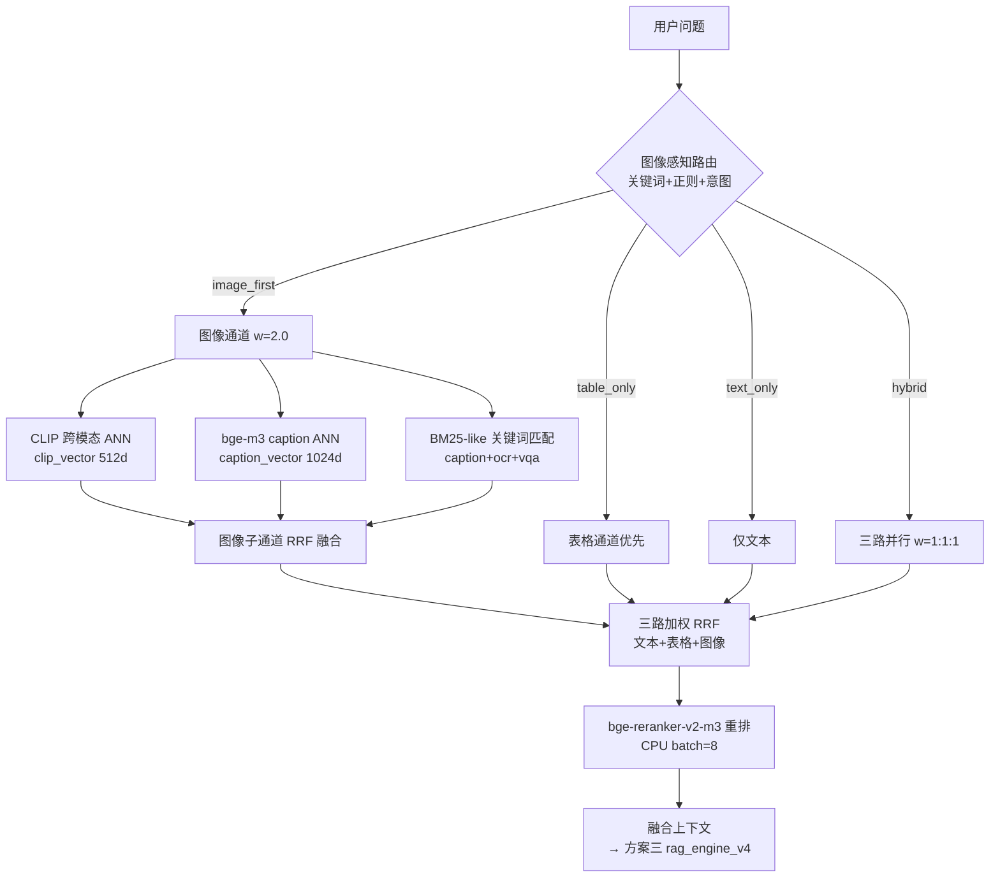

# 工单四 · 方案二：图像检索优化方案

> 工单编号：人工智能NLP-RAG-图像内容解析及检索优化
>
> 本文档为 Step 1 设计产出，对应代码落地为 `src/image_parser/image_embedding.py`、`image_store.py`、`image_retriever.py`（Step 4/5 实现）。

## 一、目标

1. 图像内容独立向量化，存入 Milvus 新 collection **`rag_images`**；
2. 实现**图像感知检索**：识别问题是否涉及图像，图像类问题优先检索图像内容；
3. 文本 + 表格 + 图像三路召回，统一 RRF 融合 + bge-reranker 重排序，整体准确率 ≥ 90%、图像类问题准确率 ≥ 90%、响应 ≤ 3 秒。

## 二、rag_images Collection 设计

沿用 `table_store.py` 的连接模式：优先远程 Milvus（`http://host:19530`），失败降级 Milvus Lite（`./data/milvus_local.db`，与 `rag_tables` 共存）。

```python
# schema（与 rag_tables 风格一致）
id            INT64    自增主键
doc_id        VARCHAR(64)   文档名（招股说明书1/2，与文本/表格库统一）
image_id      VARCHAR(128)  图像编号（img_005）
page          INT32         页码
image_type    VARCHAR(32)   组织结构图/柱状图/...
caption       VARCHAR(2048) Qwen2-VL 图像描述
ocr_text      VARCHAR(4096) 图内文字转录
vqa_text      VARCHAR(8192) VQA 结构化结果序列化（供检索与上下文）
clip_vector   FLOAT_VECTOR(512)    Chinese-CLIP 图像向量（图像-文本共享空间）
caption_vector FLOAT_VECTOR(1024)  bge-m3 对 caption+ocr+vqa 拼接文本的向量
metadata      JSON          bbox/path/width/height/type_confidence...
```

**双通道向量说明**：

- `clip_vector`：Chinese-CLIP 图像侧向量；查询侧用同一模型的 text encoder 编码问题，跨模态直接检索，擅长"语义相似但字面不同"（如问"公司架构"命中组织结构图）；
- `caption_vector`：bge-m3 编码 `caption + ocr_text + vqa_text` 拼接文本，与查询文本同构，擅长精确语义匹配；
- 沿用工单三教训：短文本（caption 数十字）纯向量召回率低，必须叠加 **BM25-like 关键词通道**（对 `caption+ocr_text` 分词倒排匹配，得分归一化）提升字面召回。

## 三、图像感知路由

扩展 `table_parser/query_router.py` 的路由信号，新增图像维度，输出四种路由：

| 路由 | 触发条件 | 检索行为 |
|------|----------|----------|
| `image_first` | 图像关键词命中 且 无强表格信号 | 图像通道优先 + 文本辅助 |
| `text_only` | 无图像/表格信号（沿用工单三） | 仅文本 |
| `table_only` | 表格信号强（沿用工单三） | 表格优先 |
| `hybrid` | 表格+文本（沿用工单三）/ 多信号并存 | 三路并行 |

**图像关键词（中文）**：`图、图片、图表、组织结构、组织架构、结构图、架构图、流程图、示意图、增长图、柱状图、折线图、饼图、分布图、曲线图、框图、图中、如图、看图`
**图像关键词（英文）**：`chart、diagram、figure、graph、org、organization、structure、flow、pie、bar、line、illustration、shown in the figure`

**图像意图正则**：`(组织|公司|销售)?(结构|架构)图` / `.{0,12}增长(情况)?图` / `从.{0,20}图(中)?可以看出` / `(哪|什么)图`
—— IMG-05（"组织结构图中…销售部…"）、IMG-06（"从2008年中国IC市场应用结构与增长图中可以看出…"）两条重点题必须被 `image_first` 命中。

注意：IMG-05/IMG-06 同时含数值追问（"几个""哪个行业"），路由为 `image_first` 后仍并行召回文本/表格作为佐证上下文，防止 LLM 只靠图像描述作答缺佐证。

## 四、三路召回与融合

### 4.1 图像召回（image_retriever_v4）

对每个查询并行执行三个子通道：

1. **CLIP 跨模态通道**：问题 → Chinese-CLIP text encoder（512 维）→ `rag_images.clip_vector` ANN Top-K（K=召回扩 3 倍，沿用工单三扩召经验）；
2. **Caption 语义通道**：问题 → bge-m3（1024 维）→ `rag_images.caption_vector` ANN Top-K；
3. **关键词通道**：问题分词 → 对 `caption/ocr_text/vqa_text` BM25-like 匹配 Top-K（n-gram + 同义扩展，如"架构图"↔"组织结构图"）。

三子通道 **RRF 融合**（`score = Σ 1/(60+rank)`），得到图像候选集。

### 4.2 统一融合与重排序

- 文本（text_retriever_v3）、表格（table_retriever）、图像（image_retriever）三路结果做 **加权 RRF**：`image_first` 时图像权重 w=2.0、文本 1.0、表格 0.8；`hybrid` 时 1.0/1.0/1.0（权重入 config，可调）；
- 融合 Top-N 候选统一构造可读文本（文本 chunk 原文 / 表格 markdown / 图像 `caption+ocr+vqa`），送 **bge-reranker-v2-m3** 重排（CPU，batch=8，沿用工单三配置）；
- 重排后按类型回填：图像命中项携带 `image_id/page/path`，供前端展示原图与答案引用。

### 4.3 响应时间预算（≤3s）

| 阶段 | 预算 |
|------|------|
| 查询理解+路由（正则+关键词） | ~5ms |
| CLIP text encode（GPU 一次前向） | ~30ms |
| bge-m3 query encode（CPU，max_seq≤512） | ~150ms |
| Milvus 三路 ANN（Lite/远程） | ~50ms |
| BM25-like 关键词匹配 | ~10ms |
| bge-reranker（CPU，候选≤20） | ~600ms |
| DeepSeek-v4-flash 生成（流式） | ~1.5-2s |
| **合计** | **≈2.4-2.9s** ✅ |

查询期**不加载** Qwen2-VL（图像描述/VQA 离线预计算入库），这是满足 3s 时延的关键设计。

## 五、图像检索流程图



## 六、验收标准

1. IMG-05、IMG-06 路由为 `image_first`，图像候选 Top-5 内命中正确图像（组织结构图 / IC 市场增长图）；
2. 16 题整体检索准确率 ≥ 90%，图像类准确率 ≥ 90%（keyword-hit + 人工核对双口径）；
3. 端到端 P95 响应 ≤ 3 秒；
4. `rag_images` 与 `rag_tables`、文本库 `doc_id` 一致（招股说明书1/2），支持单文档过滤检索；
5. pytest 单测覆盖路由、三通道召回、RRF 融合；截图存 `docs/screenshots/`。
