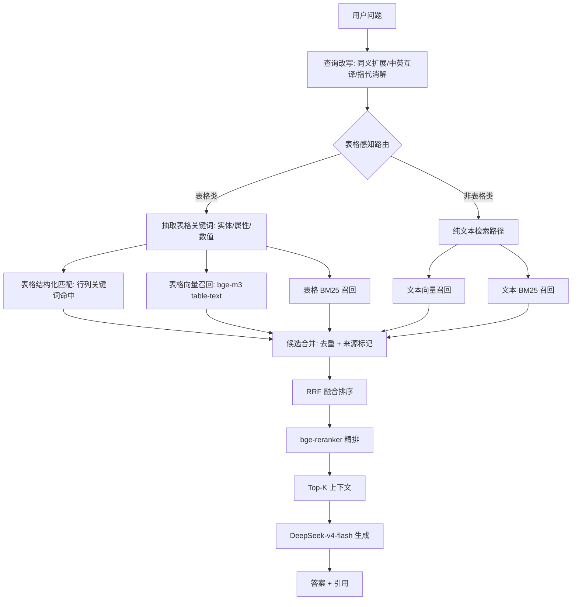

# 表格检索优化方案（工单三）

> 工单编号：人工智能NLP-RAG-PDF文档的表格解析及检索优化
> 基础版本：工单二（混合检索 BM25+向量 + bge-reranker + 查询改写）
> 项目路径：/home/dabaie/code/工单/工单三
> 依赖文档：docs/01_表格解析方案.md（表格结构化 JSON）

## 一、目标

工单二已实现"BM25 + 向量（bge-m3）+ RRF + bge-reranker + 查询改写"的混合检索链路，但在表格类问题上召回不足：

- 文本 chunk 化后表格行列关系错位（如"发行股数"与"募集资金"被切到不同 chunk）
- 数字、比例、表头与数据行分离，纯向量相似度难以匹配
- 表格问答需要结构化匹配（如"前五大股东持股比例"需要按列定位）

工单三在工单二基础上新增**表格感知检索**，将表格作为一等公民纳入召回与排序。

## 二、核心思路

1. **Table-to-Text**：每张表生成自然语言描述（行列摘要 + caption），用于向量化
2. **独立向量化**：表格块（table chunk）与文本块（text chunk）分库存储，便于按类型过滤
3. **表格感知路由**：识别问题是否涉及表格，表格问题优先检索表格库
4. **混合召回**：BM25（稀疏）+ 向量（稠密）+ 表格结构化匹配（行列关键词）
5. **统一重排**：bge-reranker 对合并候选精排，输出 Top-K

## 三、表格检索流程



## 四、Table-to-Text 生成

### 4.1 生成规则

每张结构化表格生成三段文本，拼接后向量化：

1. **caption + 上下文**：表标题 + 所属章节（如"第一节 发行情况"）
2. **行摘要**：每行转为自然语句（如"发行股数为 12 345 678 股，占比 100%"）
3. **列摘要**：列出列名（如"本表包含列：项目、金额、比例"）

### 4.2 示例

表格：
| 项目 | 金额 | 比例 |
|------|------|------|
| 发行股数 | 12 345 678 | 100% |
| 募集资金总额 | 98 765 432 元 | - |

生成的 table-text：
```
表标题: 发行股数与募集资金
所属章节: 第一节 发行情况
列: 项目、金额、比例
行1: 发行股数 为 12 345 678，占比 100%
行2: 募集资金总额 为 98 765 432 元
```

### 4.3 优势

- 数字、关键词、列名都进入向量化文本，提高召回
- 自然语言化后 bge-m3 / bge-reranker 效果更稳
- 与文本 chunk 共用同一向量空间，便于统一重排

## 五、表格感知路由

### 5.1 路由信号

| 信号 | 权重 | 说明 |
|------|------|------|
| 表格关键词 | 0.4 | "发行股数/募集资金/关联方/持股比例/营业收入/比例/金额/前后五大" |
| 数字查询 | 0.3 | 问题含"多少/数量/金额/比例/百分比"或数字 |
| 对比查询 | 0.2 | "变化/对比/前后/构成" |
| 表名命中 | 0.1 | 问题中出现表 caption 关键词 |

得分 ≥ 0.5 → 走表格优先路径；< 0.5 → 走纯文本路径（仍会查表格库，只是权重低）。

### 5.2 路由输出

```json
{
  "is_table_query": true,
  "table_score": 0.7,
  "extracted_entities": ["发行股数", "募集资金"],
  "extracted_attributes": ["金额", "比例"],
  "route": "table_priority"
}
```

## 六、表格结构化匹配

### 6.1 行列关键词命中

- **行匹配**：问题中的实体（如"发行股数"）与表格 `rows[*].项目` 字段精确匹配 → 命中行加 1.0 分
- **列匹配**：问题中的属性（如"金额"）与 `headers[*]` 匹配 → 命中列加 0.5 分
- **数值匹配**：问题含数字时，与表格单元格数值匹配 → 加 1.0 分

### 6.2 与 BM25/向量融合

- 三路召回结果都带 `source` 标签（`text_bm25` / `text-vec` / `table-bm25` / `table-vec` / `table-struct`）
- 用 RRF（Reciprocal Rank Fusion）融合，参数 `k=60`
- 表格类问题在融合时对 `table-*` 来源加权 ×1.2

## 七、独立向量化与分库存储

### 7.1 Milvus collection 设计

| Collection | 内容 | 向量 | 主键 | 备注 |
|-----------|------|------|------|------|
| `rag_text_chunks` | 文本 chunk | bge-m3 (1024) | chunk_id | 工单二已有 |
| `rag_table_chunks` | 表格 table-text | bge-m3 (1024) | table_chunk_id | 工单三新增 |
| `rag_table_struct` | 表格结构化 JSON（不向量化） | - | table_id | 用于结构化匹配 |

### 7.2 字段

`rag_table_chunks`：
```json
{
  "table_chunk_id": "tc_001_003",
  "table_id": "tbl_001_003",
  "doc_id": "招股说明书1",
  "company": "武汉兴图新科",
  "page_range": [3, 4],
  "caption": "发行股数与募集资金",
  "table_text": "<table-to-text>",
  "vector": [/* bge-m3 */],
  "headers": ["项目","金额","比例"],
  "row_count": 2
}
```

## 八、重排序

- 模型：`BAAI/bge-reranker-base`（工单二已加载，复用）
- 输入：`(query, candidate)` 对，candidate 用 table-text 或 text chunk 文本
- 表格类问题：table candidate 与 text candidate 一起进 reranker，由 reranker 输出统一分数
- Top-K = 5（与工单二一致）

## 九、查询改写增强

工单二已支持同义扩展 / 指代消解 / 中英互译。工单三新增：

- **表格实体扩展**：识别到"发行股数"后扩展为"发行股数 / 发行数量 / 股票发行数量 / 发行规模"
- **中英表格词表**：维护 `{shares issued: 发行股数, raised funds: 募集资金, related parties: 关联方, shareholding ratio: 持股比例}` 映射，英文问题先翻译表格关键词再检索

## 十、对比实验设计（工单二 vs 工单三）

### 10.1 实验组

| 组 | 检索链路 | 表格处理 | 备注 |
|----|---------|---------|------|
| A（工单二基线） | BM25 + 向量 + RRF + reranker | 无表格解析 | 复用 `data/optimized/eval_optimized.json` |
| B（工单三优化） | BM25 + 向量 + RRF + reranker + 表格感知 | 结构化表格 + table-text + 独立索引 | 本工单产出 |

### 10.2 评估问题

14 条（见 docs/00_工单三任务说明.md），其中 T01–T10 为表格类、T11–T14 为英文表格类。

### 10.3 评估指标

| 指标 | 计算方式 | 目标 |
|------|---------|------|
| 准确率 (Accuracy) | 答案含标准关键词的比例 | ≥ 90% |
| 表格准确率 | T01–T10 命中比例 | ≥ 90% |
| 响应时间 (P95) | 端到端含 LLM | ≤ 3 秒 |
| 忠实度 (Faithfulness) | 答案是否仅来自上下文（LLM 评判） | ≥ 0.9 |
| 答案相关性 (Answer Relevance) | 答案与问题相关性（LLM 评判） | ≥ 0.9 |
| 上下文精度 (Context Precision) | Top-K 中相关块占比 | ≥ 0.8 |
| 上下文召回 (Context Recall) | 标准答案关键事实在 Top-K 中比例 | ≥ 0.9 |

### 10.4 评估数据

- 标准答案 + 关键词：`data/optimized/eval_questions_v3.json`
- A 组结果：`data/optimized/eval_baseline_v3.json`（跑工单二链路）
- B 组结果：`data/optimized/eval_optimized_v3.json`（跑工单三链路）
- 对比报告：`docs/04_检索优化对比.md`

## 十一、容错与降级

| 异常 | 降级 |
|------|------|
| 表格库为空（解析失败） | 仅走文本检索，等价工单二 |
| reranker 加载失败 | 用 RRF 分数排序 |
| 表格感知路由判错 | 路由权重 < 阈值时仍双路并行召回 |
| LLM 超时 | 返回 Top-K 上下文 + 模板答案 |

## 十二、验收

1. ✅ 表格感知路由对 T01–T10 判定 `is_table_query=true` 命中率 ≥ 90%
2. ✅ 表格类问题 Top-5 含正确表格块比例 ≥ 90%
3. ✅ 工单三 vs 工单二：表格准确率提升 ≥ 20 个百分点
4. ✅ 端到端 P95 ≤ 3 秒
5. ✅ 英文表格问题（T11–T14）全部命中
