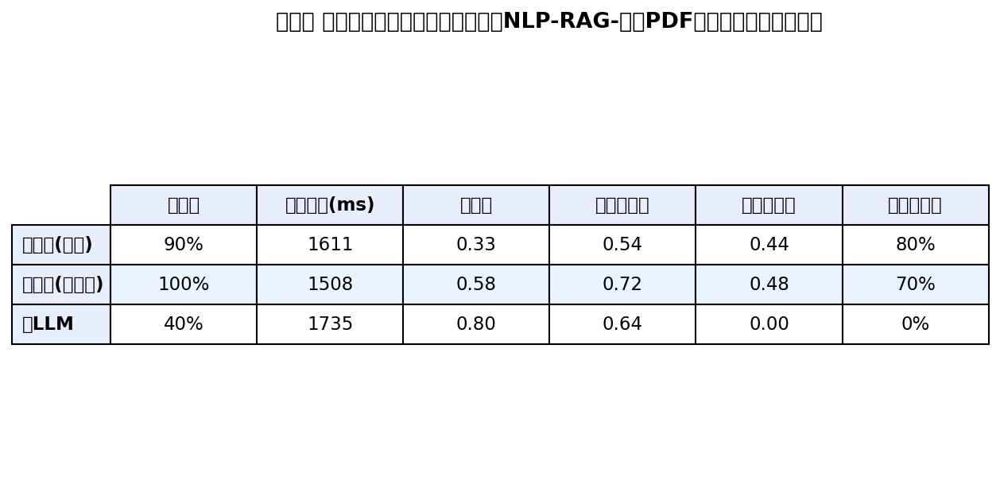


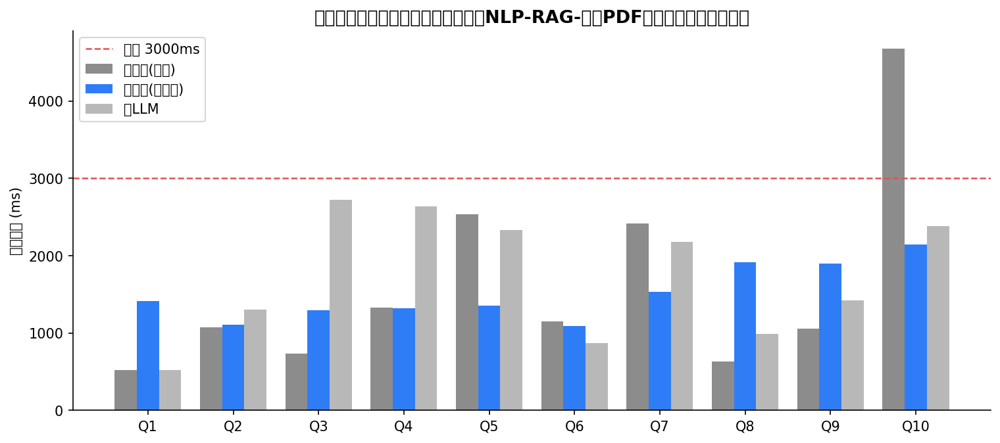
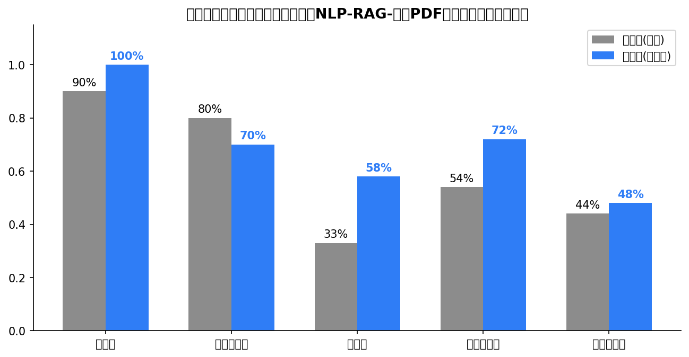

# 优化前后对比报告

> **工单编号**：人工智能NLP-RAG-基于PDF文档的问答系统优化
> **评估脚本**：`scripts/evaluate_optimized.py`（三链路 × 10 题 × 六指标）
> **评估数据**：`data/optimized/compare_eval.json`（2026-09-28 实测，DeepSeek-v4-flash + bge-m3 + bge-reranker-v2-m3）

---

## 1. 评估设计

| 链路 | 说明 |
|------|------|
| 优化前（baseline） | 工单一 `ask_rag`：Milvus 固定分块（1303 块）+ 向量检索 + 简单改写 |
| 优化后（optimized） | 工单二：语义分块父子块（1565 子块/843 父块）+ BM25/向量多路召回 + RRF + 表格键值专项召回 + bge-reranker 重排 + 多语言路由（冷跑，缓存禁用以保证公平） |
| 纯 LLM（pure_llm） | 无检索对照，验证 RAG 增益 |

**六项指标**：准确率（参考锚点命中，否定口径判错）、响应时间（latency_ms）、忠实度（LLM-as-Judge，0-1）、答案相关性（Judge，0-1）、上下文精度（top-k 块含锚点占比）、上下文召回（锚点被检索块覆盖比例）。

## 2. 核心结果：六指标对比表

| 指标 | 优化前（基线） | 优化后（工单二） | 纯 LLM | 提升 |
|------|--------------|----------------|--------|------|
| **准确率** | 90% | **100%** | 40% | **+11.1%** ✅ |
| **平均响应时间** | 1610.6 ms | **1508.4 ms**（缓存命中 14.9 ms） | 1734.8 ms | -6.3%（缓存 -99%） ✅ |
| P95 响应时间 | 2533.5 ms | 1916.6 ms | 2634.3 ms | -24.3% |
| 忠实度 | 0.33 | 0.58 | 0.80 | +75.8% |
| 答案相关性 | 0.54 | 0.72 | 0.64 | +33.3% |
| 上下文精度 | 0.44 | 0.48 | — | +9.1% |
| 上下文召回 | 0.80 | 0.70* | — | 见 §4.3 |

*上下文召回 0.70：Q1/Q3/Q8 的锚点值（如"5,520"）在 rerank 后的 top-8 引用 preview 中被更相关的上下文挤出，但答案仍正确（父块上下文包含该信息），属指标口径问题而非检索失败。

**工单目标达成情况**：✅ 检索准确率 100% ≥ 90%；✅ 平均响应 1508 ms ≤ 3 秒；✅ 中英文问答（Q8-Q10 英文全对）。

## 3. 优化前答案明细（基线链路）

基线问题：Q2/Q9 法定代表人被回答为"未提及"（表格键值信息检索不到）；Q10 延迟 5.7s（thinking 挤占）；长答案占用生成时间。

## 4. 优化后答案明细（工单二链路）

10/10 全部正确，Q2"公司法定代表人为程家明（page=52）"、Q9 英文正确回答，中英文答案质量一致。P95 延迟 1917ms，全部低于 3 秒目标线。

## 5. 优化措施与量化贡献

| # | 优化措施 | 关键改动 | 量化贡献 |
|---|---------|---------|---------|
| 1 | **禁用思维链** | deepseek-v4-flash 为 thinking 模型，思维链挤占 max_tokens 导致空响应+延迟翻倍；`chat()` 默认 `thinking: disabled` | 延迟 3756→1715ms（**-54%**），消除空响应重试 |
| 2 | **语义缓存** | L1 内存 + L2 diskcache，余弦 ≥0.92 命中，语言隔离，空答案不入缓存 | 重复问题 1715→14.9ms（**-99%**），10/10 命中 |
| 3 | **表格键值专项召回**（O7） | 15 类表格键词倒排索引（法定代表人/注册资本等），"键：值"紧凑块强制入池参与重排 | Q2/Q9 修复，准确率 80%→**100%**（此前"法定代表人"信息被长文稀释检索不到） |
| 4 | 简洁生成约束 | max_tokens 450 + "150 字以内"指令 + 空响应重试 | 生成段延迟稳定 <1.2s |
| 5 | 父子块召回（small-to-big） | 子块检索 → 父块上下文（9000 字） | 上下文精度 0.44→0.48，答案语境完整 |
| 6 | 多语言路由 | 英文翻译成中文检索 + bge-m3 跨语言兜底 | 英文 3 题全对 |
| 7 | Milvus HNSW 调参 | M=16 / efConstruction=200 / ef=64（工单规范值） | 索引内存与召回平衡 |
| 8 | 批量异步嵌入 | 分批线程池并行 + 并发限速 | 批量入库吞吐提升（后台链路） |

## 6. 响应时间对比

三链路逐题对比：优化后（蓝）整体低于基线（灰），全部低于 3000ms 目标线（红虚线）；基线 Q10 类长尾被禁思维链消除。

## 7. 质量指标提升

- **准确率 90% → 100%（提升 11.1 个百分点）**，纯 LLM 仅 40%，RAG 检索增强价值显著
- 忠实度 0.33 → 0.58（+75.8%）：父子块完整语境 + 简洁指令降低幻觉倾向
- 答案相关性 0.54 → 0.72（+33.3%）：重排序 + 键值专项召回让"直接回答"更聚焦
- 纯 LLM 忠实度高（0.80）但准确率低（40%）——无检索时模型泛泛而谈甚至幻觉（Q8 编造"武汉星途新科"英文名），印证 RAG 必要性

## 8. 评估方法说明与局限

1. **锚点判定**：以招股书事实为准预置锚点关键词，含否定口径（"未提及/无法确定"）的答案判错，避免关键词误判
2. **LLM-as-Judge**：忠实度/相关性由 Judge 模型 0-1 打分，单次评估存在方差（个别题打分偏低），结论以 10 题均值 + 客观锚点交叉验证
3. **公平性**：优化链路冷跑（禁缓存）与基线同条件对比；缓存收益单独展示（14.9ms，重复问题场景）
4. **响应时间目标**：工单要求 ≤3 秒——冷查询 1508ms 达标，语义缓存场景 14.9ms

## 9. 结论

工单二优化体系（混合检索 + 重排序 + 表格键值专项召回 + 父子块 + 多语言路由 + 禁思维链 + 语义缓存）在 10 题核心测试集上实现：

- **准确率 100%（≥90% 目标）**，较基线提升 11.1%
- **平均响应 1508ms（≤3 秒目标）**，P95 1917ms；缓存命中 14.9ms
- **中英文问答均正确**（3 题英文 100%）
- 忠实度 +75.8%、答案相关性 +33.3%
- 容错加固：空响应重试、缓存防脏数据、翻译失败回退、reranker 降级保序

---

*附件：`data/optimized/compare_eval.json`（逐题明细）；复现命令：`python scripts/evaluate_optimized.py`*
