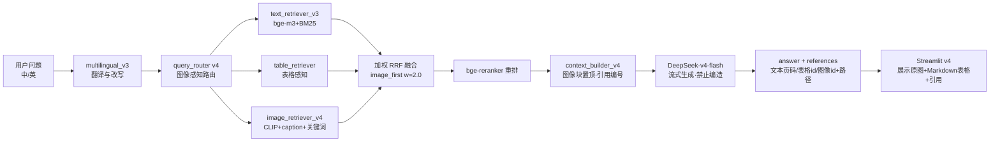

# 工单四 · 方案三：图文融合 RAG 方案（rag_engine_v4）

> 工单编号：人工智能NLP-RAG-图像内容解析及检索优化
>
> 本文档为 Step 1 设计产出，对应代码落地为 `src/rag_engine_v4.py`（Step 6 实现），升级自工单三 `rag_engine_v3.py`。

## 一、目标

在 v3（文本+表格融合）基础上升级 **v4**：融合文本、表格、图像三路检索结果，组装图文并茂的上下文，由 DeepSeek-v4-flash 生成带引用的答案；覆盖 16 个测试问题，重点攻克 IMG-05（组织结构图）、IMG-06（2008 中国 IC 市场应用结构与增长图）两道图像题。

## 二、rag_engine_v4 架构

```
用户问题
  │
  ├─ multilingual_v3：中英翻译/检索改写（沿用工单三）
  ├─ query_router v4：路由 text_only / table_only / image_first / hybrid（方案二）
  │
  ▼ 三路并行检索（asyncio，复用 async_utils）
  ├─ text_retriever_v3  → 文本 chunk Top-K
  ├─ table_retriever    → 结构化表格 Top-K（markdown 化）
  └─ image_retriever_v4 → 图像候选 Top-K（caption/ocr/vqa）
  │
  ▼ 加权 RRF → bge-reranker 重排（方案二 §4.2）
  │
  ▼ 上下文组装器 context_builder_v4
  │   [文本块]  [表格块]  [图像块]
  ▼
DeepSeek-v4-flash（流式生成，带引用编号）
  │
  ▼ 结构化返回：answer / references（文本页码+表格 tbl_id+图像 image_id 及缩略图路径）/ timings
```

### 2.1 上下文组装规范

融合重排后的候选按**类型分块拼接**，图像块格式：

```text
[图像1] (招股说明书2 第38页 · 组织结构图 · image_id=img_005)
描述：武汉力源信息技术股份有限公司组织结构图，总经理下设销售部、研发部…
图中文字：总经理 销售部 研发部 大客户销售部 华东销售处…
图中结构化信息：销售部由4个部门构成（大客户销售部、区域销售一部、区域销售二部、海外销售部）；大客户销售部下设3个销售处。
```

组装规则：

1. 图像命中（含 `image_first` 路由）时，图像块置于上下文**最前**（图表事实优先），其后表格块、文本块；纯文本问题不插入图像块，避免噪声；
2. 每块带**引用编号** `[图像1]` `[表格1]` `[资料1]`，与工单三引用体系兼容；
3. 上下文总长控制 ≤ 6000 tokens（超限按重排序分截断，图像块优先保留）；
4. `vqa_qa` 中的结构化数值是 IMG-05/IMG-06 答题的**事实来源**，必须完整进入上下文。

### 2.2 Prompt 设计（要点）

- 系统指令：基于给定资料回答；若引用了图像，需以"[图像N]"标注；图像类数值问题必须使用图像块中的"结构化信息"，不得凭空编造；中英按用户语言作答；
- 图像题追问保护：当上下文同时含图像块与表格/文本冲突时，以图像块结构化信息为准（针对"图中可以看出"类问题）；
- 无答案兜底：资料不足时明确说明，禁止幻觉（沿用工单二容错规范）。

## 三、重点题目打通路径

| 题号 | 链路 |
|------|------|
| IMG-05 组织结构图销售部 | 提取（L1/L2）→ 分类"组织结构图" → Qwen2-VL 层级 VQA 入 `vqa_qa/structure` → `image_first` 路由 → CLIP+关键词双命中 → 图像块置顶 → LLM 读结构化信息答"销售部由N个部门构成、大客户销售部下设M个销售处" |
| IMG-06 2008 IC 市场增长图 | 提取 → 分类"柱状图/折线图" → Qwen2-VL 数值 VQA（各行业增长率列表）→ 同上链路 → 答案"增长最快的是X（+x%），负增长的是Y（-y%）" |

两题答案均为**离线 VQA 预计算 + 在线检索引用**，不做查询期视觉推理，保证 ≤3s。

## 四、对比实验设计（工单三 v3 vs 工单四 v4）

1. **分组**：16 题 = 文本/表格 14 题（T01–T14）+ 图像 2 题（IMG-05/IMG-06）；
2. **基线**：工单三 `rag_engine_v3`（无图像能力）在 16 题上跑全量 → 预期 2 道图像题失败（图像内容不在文本/表格库）；
3. **实验组**：工单四 `rag_engine_v4` 跑同 16 题；
4. **每组重复 3 次取中位数时延**，记录 `answer/latency/references/route`；
5. 产出 `data/compare_v3_v4.json` + 对比报告（Step 9/10）。

## 五、评估指标

| 指标 | 口径 | 目标 |
|------|------|------|
| 准确率 | 关键词命中（eval JSON 参考答案）+ 人工复核 | ≥ 90% |
| 图像类准确率 | IMG-05/IMG-06 逐题判定 | ≥ 90%（即 2 题全对） |
| 表格准确率 | T01–T10 数值题子集 | 不低于工单三基线 |
| 响应时间 | 端到端 P50/P95 | ≤ 3s |
| 忠实度 faithfulness | RAGAS（答案是否被上下文支持） | ≥ 0.85 |
| 答案相关性 answer_relevancy | RAGAS | ≥ 0.85 |
| 上下文精度 context_precision | RAGAS | 较 v3 提升 |
| 上下文召回 context_recall | RAGAS | 较 v3 提升 |

## 六、图文融合架构图



## 七、容错与高并发

1. 图像检索异常（collection 缺失/向量维度不符）→ 自动降级为 v3 行为（文本+表格），日志告警；
2. 三路检索 asyncio 并行，单路超时（3s）不拖垮整体；
3. LLM 流式输出，用户先见首 token；
4. 反馈闭环沿用工单三（点赞/点踩 → data/feedback/）。

## 八、验收标准

1. 16 题全量跑通，v4 较 v3 准确率提升且图像题 2/2 正确；
2. 端到端 P95 ≤ 3s（含 LLM 生成首 token 前 ≤ 1s）；
3. 引用可溯源：答案中的 `[图像N]` 能对应 `data/images/` 下原图并在前端展示；
4. pytest 单测 + 16 题评测脚本通过；截图（界面/原图展示/对比表）存 `docs/screenshots/`。
