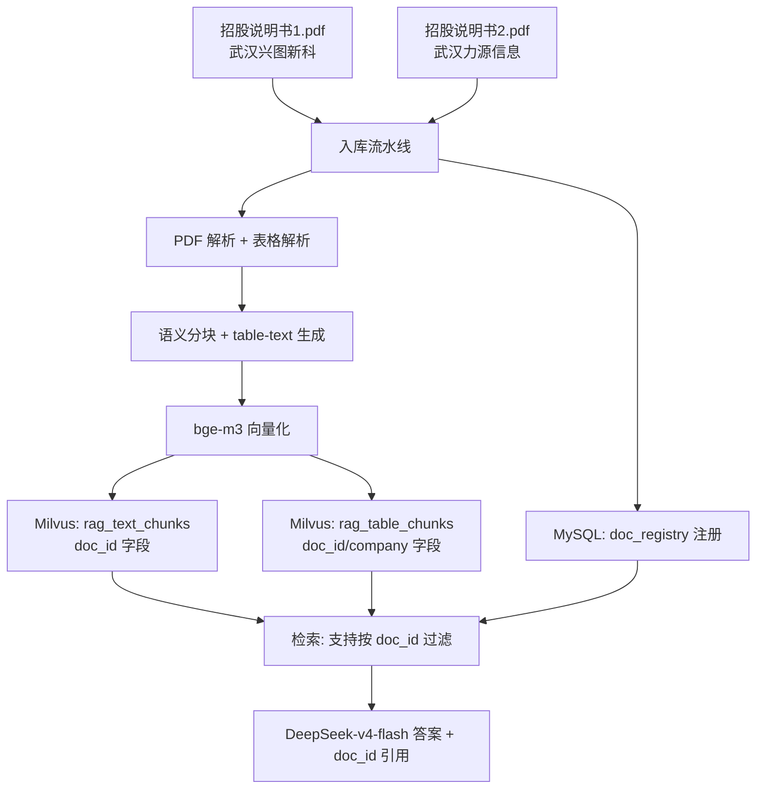

# 多文档知识库方案（工单三）

> 工单编号：人工智能NLP-RAG-PDF文档的表格解析及检索优化
> 基础版本：工单二（单文档知识库：招股说明书1）
> 项目路径：/home/dabaie/code/工单/工单三
> 源文档：
> - 招股说明书1.pdf（武汉兴图新科电子股份有限公司）
> - 招股说明书2.pdf（武汉力源信息技术股份有限公司）

## 一、目标

工单二仅入库招股说明书1，单文档知识库无法回答跨文档问题（如"力源信息的发行股数"）。工单三扩展为多文档知识库：

1. 支持多 PDF 入库，doc_id 隔离
2. 按公司名、文档类型分类
3. 检索时支持按 doc_id / company / doc_type 过滤
4. 答案引用标注来源文档

## 二、文档注册表（doc_registry）

每入库一份 PDF，向 MySQL `doc_registry` 表注册一条元数据：

| 字段 | 类型 | 说明 |
|------|------|------|
| doc_id | VARCHAR(64) PK | 主键，如 `招股说明书1` |
| company | VARCHAR(128) | 公司名，如 `武汉兴图新科电子股份有限公司` |
| doc_type | VARCHAR(32) | 文档类型，如 `招股说明书` |
| file_name | VARCHAR(256) | 原始 PDF 文件名 |
| file_hash | CHAR(64) | SHA256，去重 |
| page_count | INT | 总页数 |
| table_count | INT | 表格数（工单三新增） |
| chunk_count | INT | 文本 chunk 数 |
| ingested_at | DATETIME | 入库时间 |
| status | VARCHAR(16) | `success` / `failed` / `partial` |

## 三、多文档架构



## 四、入库流水线

### 4.1 步骤

1. **扫描附件**：`/home/dabaie/code/工单/附件/*.pdf`，按文件名自然排序
2. **去重**：计算 `file_hash`，已入库的跳过（支持增量入库）
3. **注册元数据**：写 `doc_registry`，状态 `partial`
4. **PDF 解析**：复用工单二 `pdf_parser_optimized`，提取文本 + 页码
5. **表格解析**：工单三新增模块（见 docs/01_表格解析方案.md）
6. **语义分块**：文本走工单二 chunker；表格生成 table-text 单独入库
7. **向量化**：bge-m3
8. **写 Milvus**：`rag_text_chunks`、`rag_table_chunks`，均带 `doc_id` / `company` / `doc_type`
9. **更新注册**：状态置 `success`，回填 `page_count` / `table_count` / `chunk_count`

### 4.2 命名约定

| 产出 | 命名 | 示例 |
|------|------|------|
| doc_id | `招股说明书1` / `招股说明书2` | - |
| 解析 JSON | `data/parsed/<doc_id>.json` | `招股说明书1.json` |
| 表格 JSON | `data/parsed_v3/<doc_id>_tables.json` | `招股说明书1_tables.json` |
| chunk JSON | `data/chunks/<doc_id>_chunks.json` | `招股说明书2_chunks.json` |

### 4.3 自动扫描规则

按工单要求，附件目录文件名可能不同：

```python
import glob, os
files = sorted(glob.glob("/home/dabaie/code/工单/附件/*.pdf"))
for i, f in enumerate(files, 1):
    doc_id = f"招股说明书{i}"  # 按顺序命名
```

## 五、按 doc_id 过滤检索

### 5.1 过滤接口

检索接口增加可选 `doc_ids` / `company` / `doc_type` 参数：

```python
def retrieve(
    query: str,
    top_k: int = 5,
    doc_ids: list[str] | None = None,  # 限定文档
    company: str | None = None,        # 限定公司
    doc_type: str | None = None,       # 限定类型
):
    expr = build_filter(doc_ids, company, doc_type)
    # Milvus query with expr
```

### 5.2 自动公司识别

当问题包含公司名关键词（"兴图新科" / "力源信息" / "力源"），自动路由到对应 `doc_id` 过滤，提升精度。

### 5.3 引用标注

答案末尾输出引用列表：

```
引用:
[1] 招股说明书1, 第3-4页, 表格 tbl_001_003
[2] 招股说明书1, 第12页, 文本 chunk
```

## 六、Milvus Schema 更新

### 6.1 rag_text_chunks（工单二已有，新增字段）

| 字段 | 类型 | 说明 |
|------|------|------|
| chunk_id | VARCHAR PK | - |
| doc_id | VARCHAR | 工单三新增 |
| company | VARCHAR | 工单三新增 |
| doc_type | VARCHAR | 工单三新增 |
| page | INT | - |
| text | VARCHAR | - |
| vector | FLOAT_VECTOR(1024) | bge-m3 |

### 6.2 rag_table_chunks（工单三新增）

见 docs/02_表格检索优化方案.md 第七节。

## 七、对比实验（多文档维度）

| 组 | 知识库 | 检索 | 验证问题 |
|----|-------|------|---------|
| A（工单二） | 仅招股说明书1 | 文本混合检索 | T08–T10 关于力源信息的问题应失败 |
| B（工单三） | 招股说明书1 + 招股说明书2 | 表格 + 文本混合检索 + doc_id 过滤 | T08–T10 应命中招股说明书2 表格 |

预期：工单三在 T08–T10 上由 0% 提升到 ≥ 90%。

## 八、容错与降级

| 异常 | 降级 |
|------|------|
| 某份 PDF 解析失败 | 该 doc_id 状态 `failed`，其他文档正常入库 |
| 表格解析失败 | 状态 `partial`，文本部分仍可用 |
| Milvus 过滤表达式错误 | 退化为全库检索 + 后置过滤 |
| 公司名识别错误 | 不过滤，全库检索，由 reranker 兜底 |

## 九、验收

1. ✅ doc_registry 表含 2 条记录，状态 `success`
2. ✅ Milvus `rag_text_chunks` / `rag_table_chunks` 中 doc_id 分布在 2 个文档
3. ✅ T08–T10（力源信息相关问题）在工单三命中 ≥ 90%
4. ✅ 答案引用列表正确标注 doc_id / 页码 / 表格 id
5. ✅ 重复入库同一 PDF 会被 `file_hash` 去重
