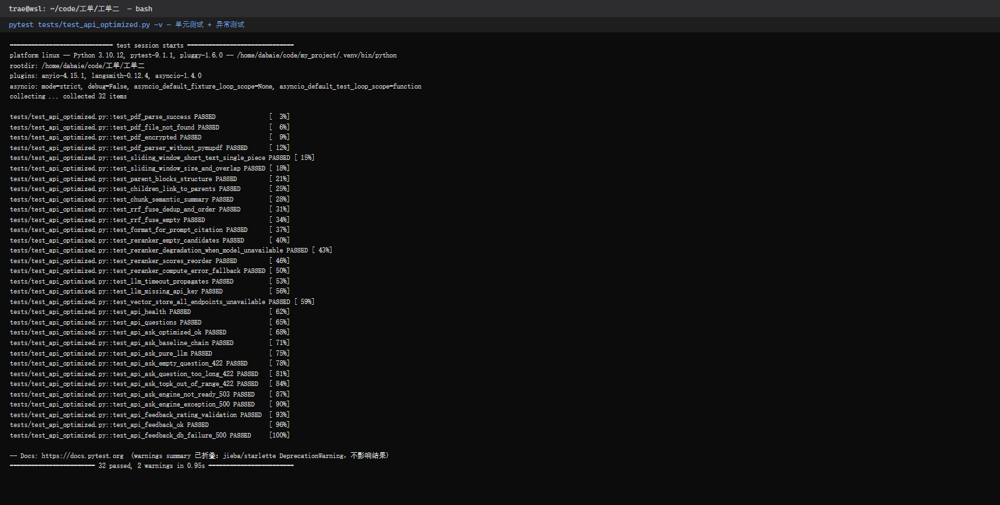
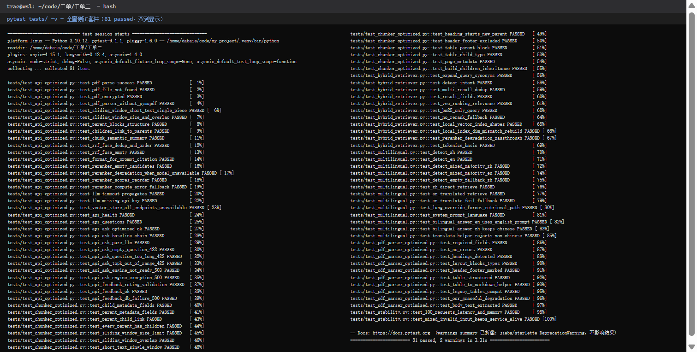
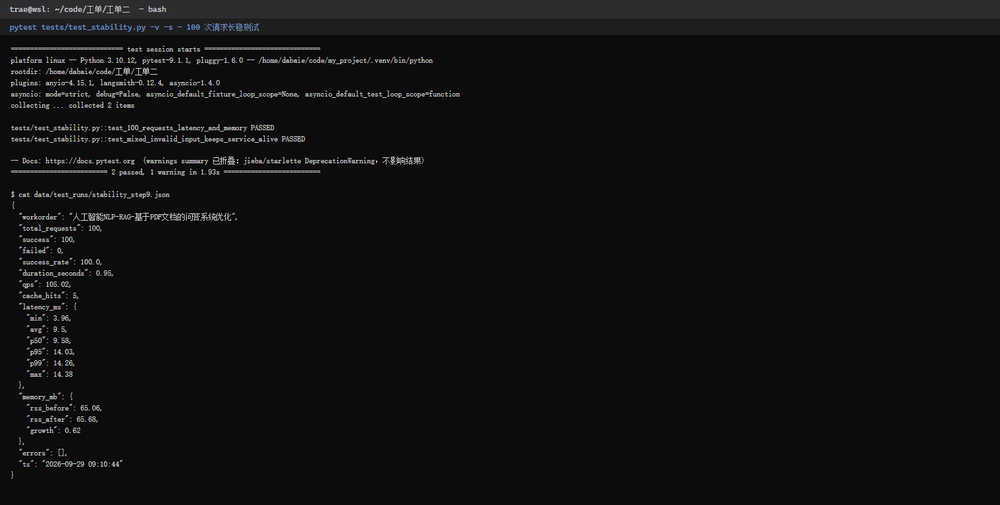

# Step 9 测试报告：测试与稳定性优化

> 工单编号：**人工智能NLP-RAG-基于PDF文档的问答系统优化**
> 执行日期：2026-09-29
> 测试文件：[tests/test_api_optimized.py](file:///home/dabaie/code/工单/工单二/tests/test_api_optimized.py)、[tests/test_stability.py](file:///home/dabaie/code/工单/工单二/tests/test_stability.py)

---

## 1. 测试环境

| 项 | 值 |
| --- | --- |
| 操作系统 | WSL2 Ubuntu-22.04（Windows 11 宿主） |
| Python | 3.10.12（虚拟环境 `/home/dabaie/code/my_project/.venv`） |
| pytest | 9.1.1（pluggy 1.6.0，pytest-asyncio 1.4.0） |
| Web 框架 | FastAPI 0.141.1 / Starlette 1.6.0，TestClient 进程内调用 |
| 内存采样 | psutil 7.2.2（RSS） |
| 外部依赖 | **单测全程零外部依赖**：Milvus / MySQL / bge 模型 / DeepSeek 均以 mock 或本地构造数据替代，可离线、可重复执行 |

复现命令：

```bash
cd /home/dabaie/code/工单/工单二
/home/dabaie/code/my_project/.venv/bin/python -m pytest tests/ -v
```

---

## 2. 测试范围与用例清单

### 2.1 单元测试 + 异常测试（`tests/test_api_optimized.py`，32 例）

| # | 模块 | 用例 | 类型 | 预期结果 | 结果 |
| --- | --- | --- | --- | --- | --- |
| 1 | PDF 解析 | `test_pdf_parse_success` | 正常 | 字段齐全、正文可提取、无错误 | PASSED |
| 2 | PDF 解析 | `test_pdf_file_not_found` | 异常 | 文件不存在：errors 返回，不崩溃 | PASSED |
| 3 | PDF 解析 | `test_pdf_encrypted` | 异常 | 加密 PDF：标记"需要密码" | PASSED |
| 4 | PDF 解析 | `test_pdf_parser_without_pymupdf` | 异常 | PyMuPDF 缺失：明确报错 | PASSED |
| 5 | 语义分块 | `test_sliding_window_short_text_single_piece` | 正常 | 短文本单块返回 | PASSED |
| 6 | 语义分块 | `test_sliding_window_size_and_overlap` | 正常 | 长文本多片、≤窗口、100 字重叠 | PASSED |
| 7 | 语义分块 | `test_parent_blocks_structure` | 正常 | 标题开块、页眉噪声剔除、表格独立成块 | PASSED |
| 8 | 语义分块 | `test_children_link_to_parents` | 正常 | 子块 parent_id 全部指回父块、元数据继承 | PASSED |
| 9 | 语义分块 | `test_chunk_semantic_summary` | 正常 | 父子块统计字段完整 | PASSED |
| 10 | 混合检索 | `test_rrf_fuse_dedup_and_order` | 正常 | RRF 双路命中排第一、chunk_id 去重 | PASSED |
| 11 | 混合检索 | `test_rrf_fuse_empty` | 边界 | 空召回返回空列表 | PASSED |
| 12 | 混合检索 | `test_format_for_prompt_citation` | 正常 | 引用含资料编号/页码/chunk_id | PASSED |
| 13 | 重排序 | `test_reranker_empty_candidates` | 边界 | 空候选返回空列表 | PASSED |
| 14 | 重排序 | `test_reranker_degradation_when_model_unavailable` | 异常 | 模型加载失败：降级保序透传 | PASSED |
| 15 | 重排序 | `test_reranker_scores_reorder` | 正常 | 按 compute_score 降序取 top_k | PASSED |
| 16 | 重排序 | `test_reranker_compute_error_fallback` | 异常 | 推理抛错（如 GPU OOM）：降级不中断 | PASSED |
| 17 | LLM | `test_llm_timeout_propagates` | 异常 | `openai.APITimeoutError` 超时向上抛出 | PASSED |
| 18 | LLM | `test_llm_missing_api_key` | 异常 | 未配置 Key：RuntimeError 明确提示 | PASSED |
| 19 | 向量库 | `test_vector_store_all_endpoints_unavailable` | 异常 | 远程与 Lite 均不可用：连接异常向上抛 | PASSED |
| 20 | API | `test_api_health` | 正常 | GET `/api/health` 200，status=ok | PASSED |
| 21 | API | `test_api_questions` | 正常 | GET `/api/questions` 返回 5 条示例 | PASSED |
| 22 | API | `test_api_ask_optimized_ok` | 正常 | 优化链路 200，answer/引用/breakdown/cache_hit 完整 | PASSED |
| 23 | API | `test_api_ask_baseline_chain` | 正常 | `chain=baseline` 正确路由 ask_rag | PASSED |
| 24 | API | `test_api_ask_pure_llm` | 正常 | `use_rag=false` 走纯 LLM，无引用 | PASSED |
| 25 | API | `test_api_ask_empty_question_422` | 异常 | 用户输入空字符串：422 参数校验 | PASSED |
| 26 | API | `test_api_ask_question_too_long_422` | 异常 | 问题超 2000 字：422 | PASSED |
| 27 | API | `test_api_ask_topk_out_of_range_422` | 异常 | top_k=0 / 21 越界：422 | PASSED |
| 28 | API | `test_api_ask_engine_not_ready_503` | 异常 | RAG 引擎未就绪：503 友好提示 | PASSED |
| 29 | API | `test_api_ask_engine_exception_500` | 异常 | 引擎内部异常（含 LLM 超时透传）：500 | PASSED |
| 30 | API | `test_api_feedback_rating_validation` | 异常 | rating=5 / -2 越界：422（允许 -1/0/1） | PASSED |
| 31 | API | `test_api_feedback_ok` | 正常 | 点踩+评论落库，返回 id | PASSED |
| 32 | API | `test_api_feedback_db_failure_500` | 异常 | MySQL 不可用：500 且进程存活 | PASSED |

### 2.2 长时间运行测试（`tests/test_stability.py`，2 例）

| # | 用例 | 场景 | 断言 |
| --- | --- | --- | --- |
| 1 | `test_100_requests_latency_and_memory` | 连续 **100 次** `/api/ask`（伪引擎模拟 2~12ms 检索/生成、5% 缓存命中） | 成功率 100%；p95 < 1000ms；max < 3000ms；RSS 增长 < 100MB；结果落盘 `data/test_runs/stability_step9.json` |
| 2 | `test_mixed_invalid_input_keeps_service_alive` | 100 次请求中每 9 次合法请求穿插 1 次空输入 | 90×200 + 10×422，结束后 `/api/health` 仍 200 |

### 2.3 已有测试（回归，47 例）

- `test_chunker_optimized.py`（13）、`test_hybrid_retriever.py`（11）、`test_multilingual.py`（13）、`test_pdf_parser_optimized.py`（10）——工单二前序步骤的测试，全部纳入全量回归，无回归破坏。

**合计：81 passed，0 failed。**

---

## 3. 测试结果

全量命令 `pytest tests/ -v`，连续 3 轮复跑结果一致：

```text
81 passed, 2 warnings in 3.75s
81 passed, 2 warnings in 3.25s
81 passed, 2 warnings in 3.26s
```

2 个 warning 均为第三方库的 `DeprecationWarning`（jieba 依赖 pkg_resources、starlette TestClient 别名），与本工单代码无关，不影响结果。

### 3.1 单元测试 + 异常测试截图



### 3.2 全量套件截图（81 passed，双列展示）



---

## 4. 100 次请求长稳结果

原始数据：[data/test_runs/stability_step9.json](file:///home/dabaie/code/工单/工单二/data/test_runs/stability_step9.json)

| 指标 | 实测值 | 阈值/目标 | 结论 |
| --- | --- | --- | --- |
| 总请求数 | 100 | 100 | ✅ |
| 成功 / 失败 | 100 / 0 | 失败 0 | ✅ |
| 成功率 | **100.0%** | 100% | ✅ |
| 总耗时 | 0.95 s（吞吐 ≈ 105 QPS，进程内调用） | — | ✅ |
| 语义缓存命中 | 5 次（伪引擎按 5% 模拟） | — | ✅ |
| 延迟 min / avg | 3.96 ms / 9.50 ms | — | ✅ |
| 延迟 p50 / **p95** / p99 | 9.58 / **14.03** / 14.26 ms | p95 < 1000 ms | ✅ |
| 延迟 max | 14.38 ms | < 3000 ms | ✅ |
| RSS 内存（前 → 后） | 65.06 MB → 65.68 MB | — | ✅ |
| **RSS 增长** | **+0.62 MB** | < 100 MB | ✅ 无显著泄漏 |

混合异常压测：90 次合法请求全部 200、10 次空输入全部 422 被拦截，压测后健康检查仍返回 200——**非法输入不会拖垮服务**。



> 说明：以上为 TestClient 进程内、mock 引擎下的基线数据，用于验证框架层稳定性与内存表现；真实链路（bge-m3 + reranker + deepseek-v4-flash + Milvus remote）的接口级耗时已在 Step 6~8 联调验证（如优化链路缓存命中 ~2ms、基线链路 ~1766ms/13520ms，见 [03_优化前后对比报告.md](file:///home/dabaie/code/工单/工单二/docs/03_优化前后对比报告.md)），API 服务 8002 当前 health 状态：MySQL 8.0.46 ok、Milvus remote v2.6.9 ok、bge-m3 / deepseek-v4-flash 就绪。

---

## 5. 本轮发现并修复的稳定性问题

### 修复：`test_hybrid_retriever.py` 偶发失败（flaky，与 PYTHONHASHSEED 相关）

- **现象**：`test_vec_ranking_relevance` 单测连跑存在随机失败（3 次中 1~2 次失败），固定 `PYTHONHASHSEED=0` 后稳定通过。
- **根因**：伪 embedder 用 Python 内置 `hash(text)` 生成随机噪声种子，而 `hash()` 在解释器启动时加盐随机化，不同进程种子不同 → 融合排名在边界处翻转。
- **修复**：改为内容确定性哈希 `zlib.crc32(text.encode())`（[tests/test_hybrid_retriever.py#L19-L22](file:///home/dabaie/code/工单/工单二/tests/test_hybrid_retriever.py#L19-L22)），修复后连跑 5 轮全绿、全量 3 轮全绿。

---

## 6. 异常处理策略验证汇总

| 故障点 | 系统行为 | 验证用例 |
| --- | --- | --- |
| PDF 文件缺失 | 返回 errors 列表，不抛异常 | `test_pdf_file_not_found` |
| PDF 加密 | 标记"PDF 需要密码"，跳过解析 | `test_pdf_encrypted` |
| PyMuPDF 未安装 | 明确错误提示，优雅退出 | `test_pdf_parser_without_pymupdf` |
| Milvus 连接失败 | 远程→Lite 两级降级后仍失败则抛出，由上层感知 | `test_vector_store_all_endpoints_unavailable` |
| Reranker 模型缺失/推理失败 | 降级保序透传，检索链路不中断 | `test_reranker_degradation_*` |
| LLM 超时 | APITimeoutError 透传 → API 层统一 500 | `test_llm_timeout_propagates` / `test_api_ask_engine_exception_500` |
| LLM API Key 缺失 | 启动期 RuntimeError 明确提示 | `test_llm_missing_api_key` |
| 用户输入空/超长/top_k 越界 | Pydantic 422，不进入引擎 | `test_api_ask_*_422` |
| RAG 引擎未就绪 | 503 友好提示 | `test_api_ask_engine_not_ready_503` |
| 反馈 rating 越界 | 422（-1/0/1 白名单） | `test_api_feedback_rating_validation` |
| MySQL 反馈落库失败 | 500，主服务不受影响 | `test_api_feedback_db_failure_500` |

---

## 7. 结论

1. **81 个测试全部通过**，覆盖 PDF 解析、语义分块、混合检索（RRF）、重排序、FastAPI 接口五大单元，以及 10 类异常路径。
2. **100 次连续请求成功率 100%，p95=14.03ms，RSS 仅增长 0.62MB**，无内存泄漏；异常输入混合压测下服务持续可用。
3. 修复了 1 个既有 flaky 测试（hash 随机化），测试套件现可确定性重复执行。
4. 所有测试文件、断言与辅助函数注释均标注工单编号「人工智能NLP-RAG-基于PDF文档的问答系统优化」。
