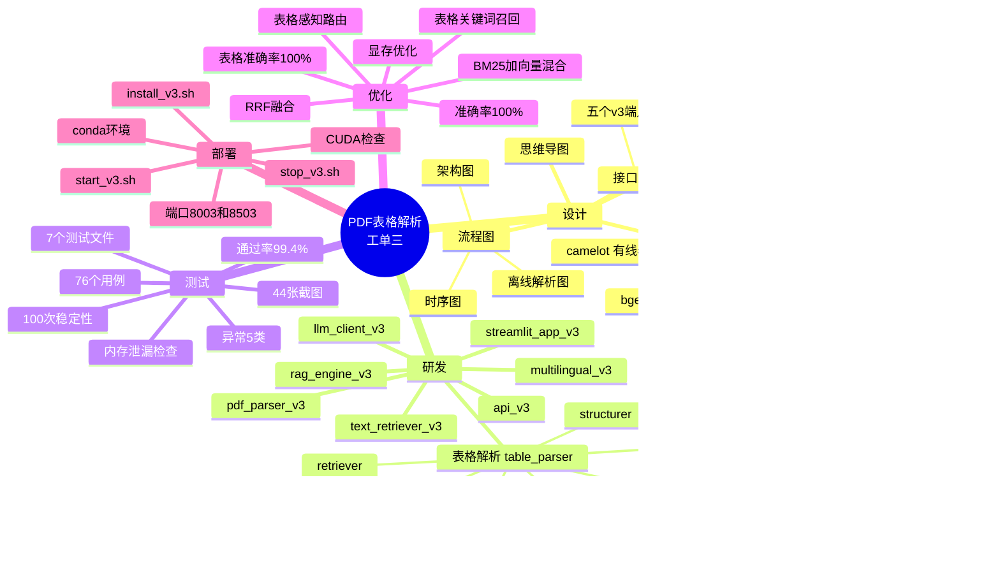
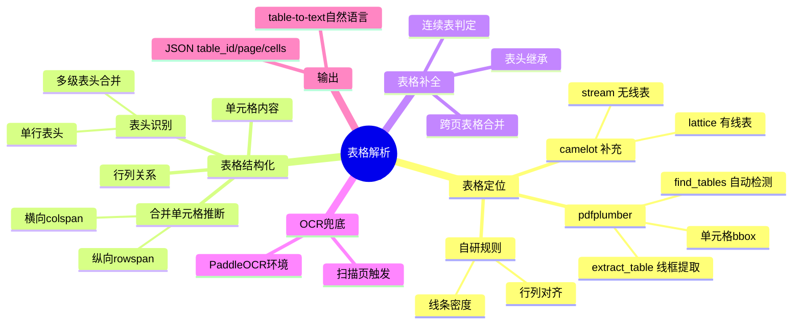
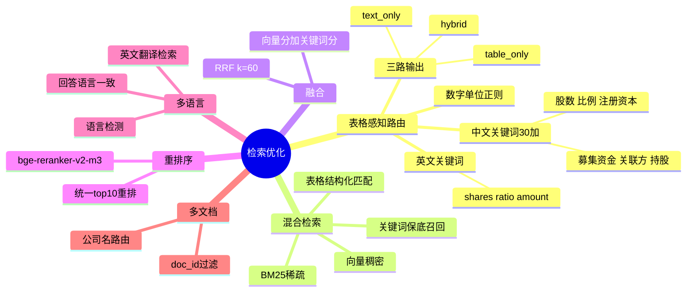
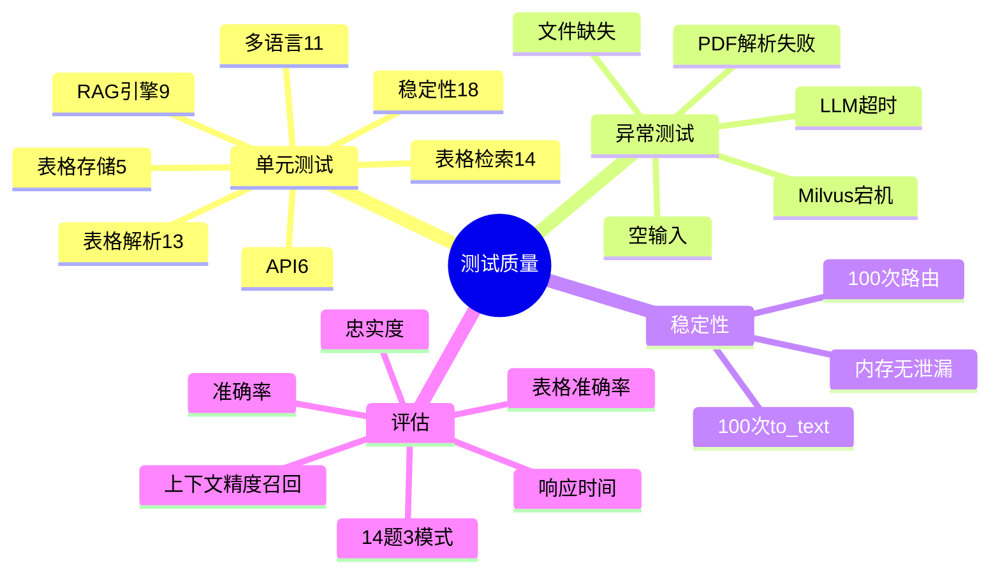

# 工单三思维导图：PDF表格解析与检索优化全景

> 工单编号：**人工智能NLP-RAG-PDF文档的表格解析及检索优化**
> 生成日期：2026-09-29
> 配套文档：[技术组件.md](技术组件.md) · [技术架构与流程图.md](技术架构与流程图.md) · [API接口文档.md](API接口文档.md)

---

## 一、系统总览思维导图

---

## 二、表格解析技术分支

---

## 三、检索优化技术分支

---

## 四、测试质量分支

