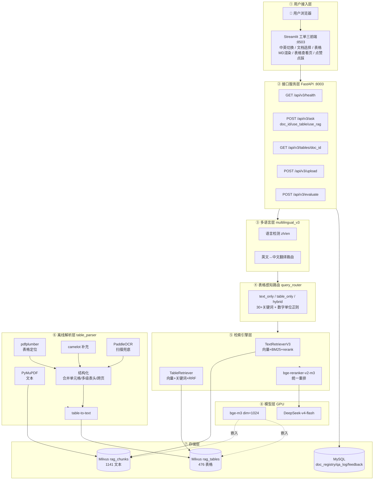
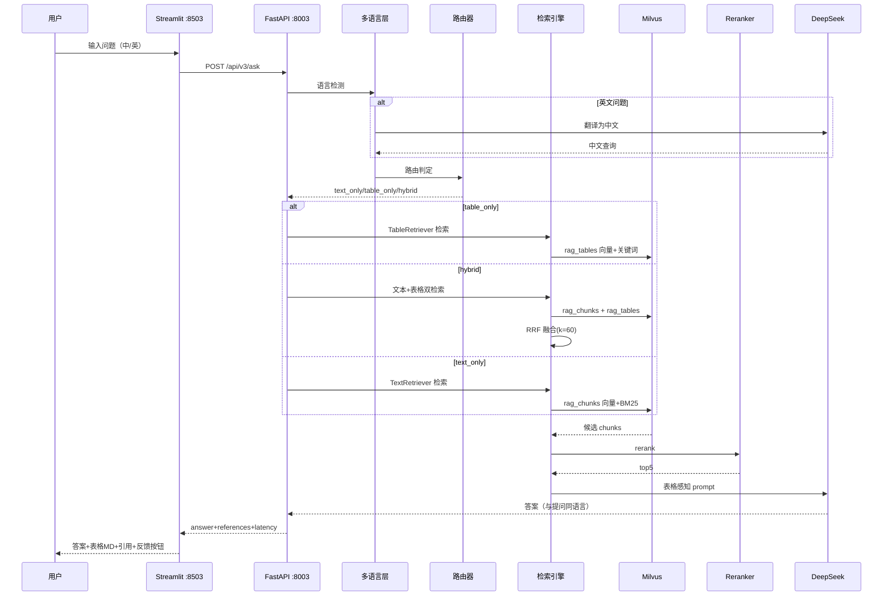
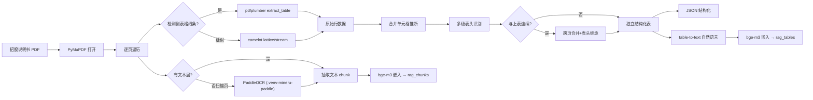
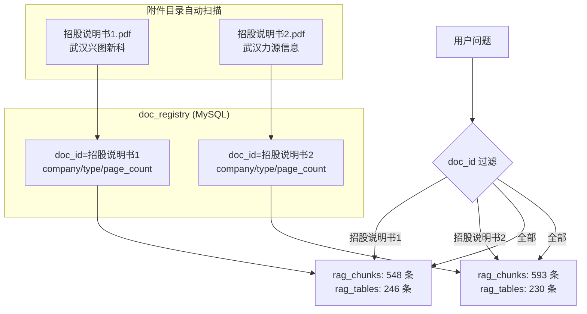

# 技术架构与流程图（工单三）

> 工单编号：**人工智能NLP-RAG-PDF文档的表格解析及检索优化**
> 生成日期：2026-09-29
> 图形语法：Mermaid（VS Code / GitHub / mermaid.live 可直接渲染）

---

## 一、系统总体技术架构（分层）

---

## 二、在线问答全链路时序图

---

## 三、离线表格解析流程图

---

## 四、多文档隔离架构

---

## 五、数据流与端口

| 流向 | 组件 | 端口/路径 |
|------|------|----------|
| 用户 → 前端 | Streamlit | :8503 |
| 前端 → API | FastAPI | :8003 |
| API → Milvus | pymilvus | :19530 |
| API → MySQL | pymysql | :3306 |
| API → DeepSeek | httpx | api.deepseek.com |
| 离线产出 | 文件系统 | data/parsed_v3、data/tables |
