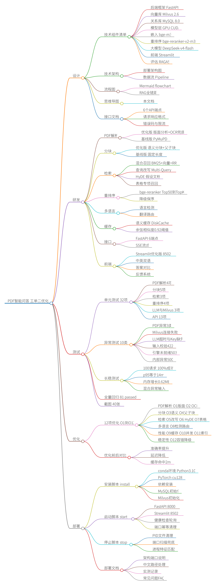
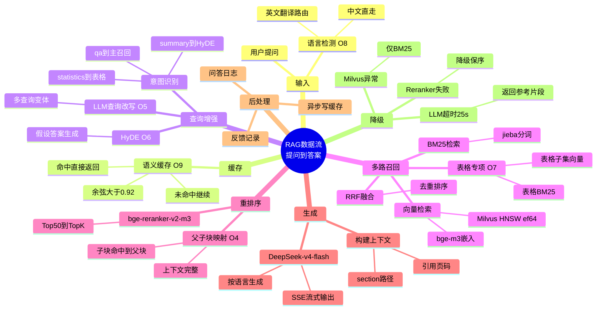
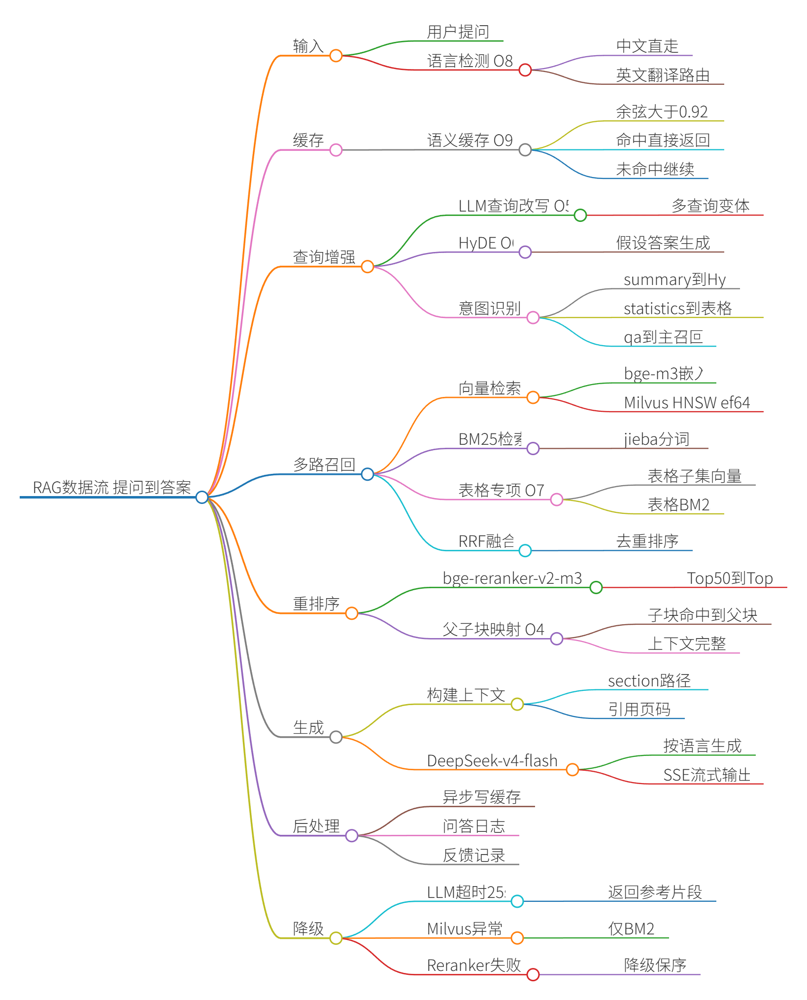
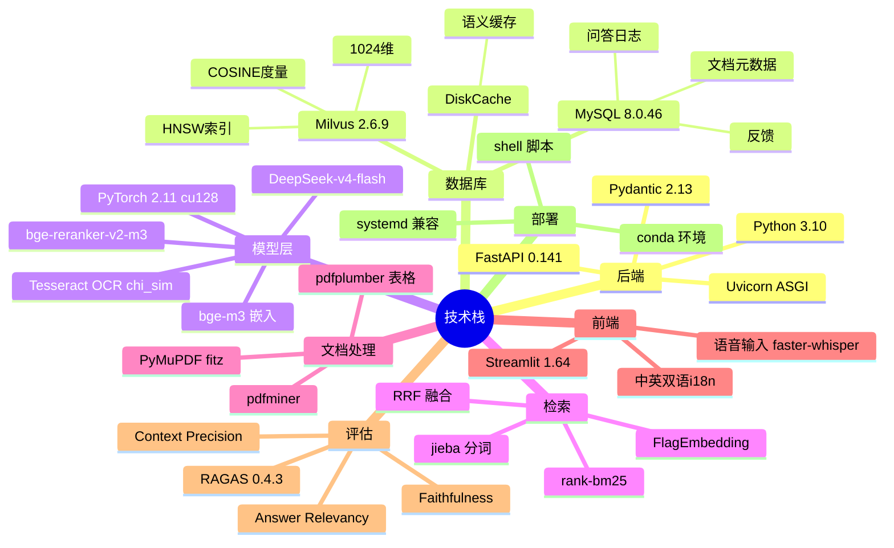
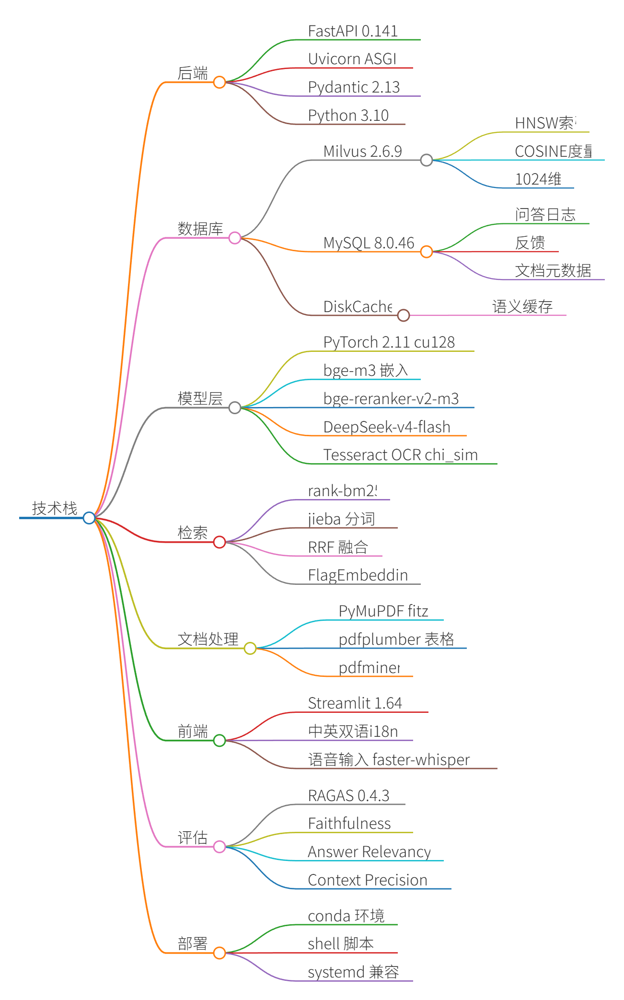
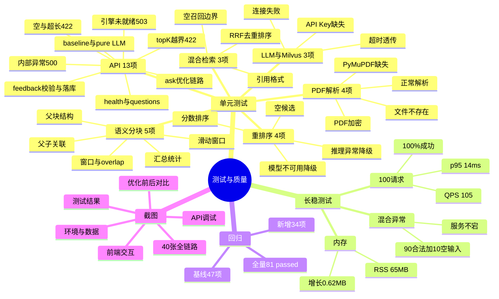
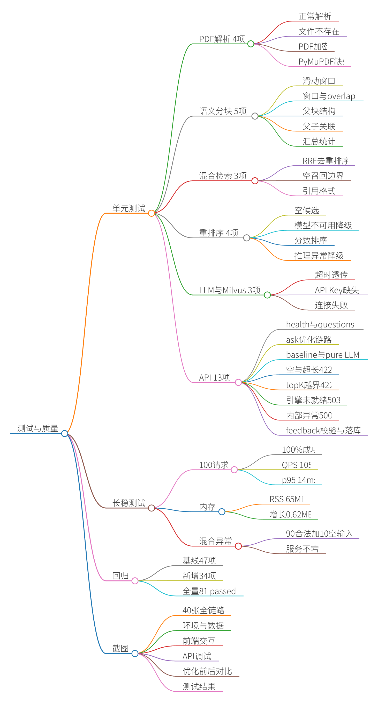
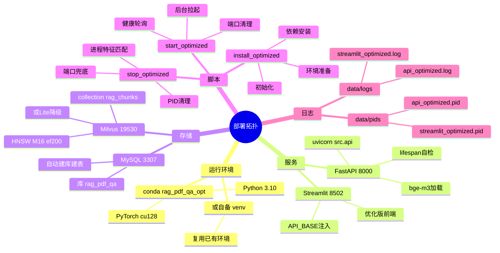
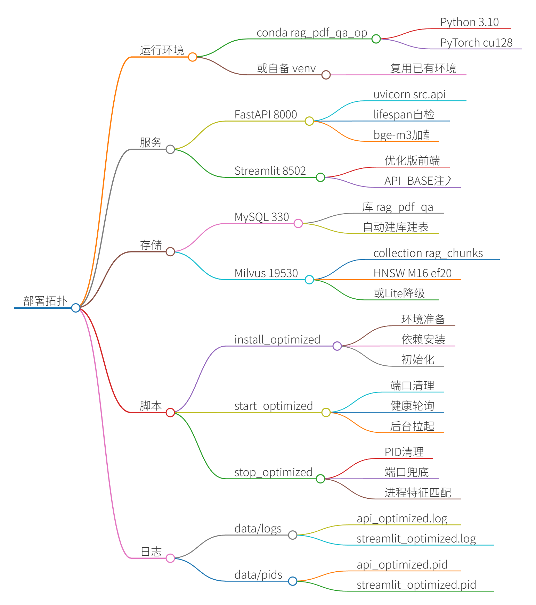

# 工单二思维导图：基于PDF文档的问答系统优化全景

> 工单编号：**人工智能NLP-RAG-基于PDF文档的问答系统优化**
> 生成日期：2026-09-29
> 配套文档：[技术组件.md](技术组件.md) · [01_优化方案.md](01_优化方案.md) · [API接口文档.md](API接口文档.md) · [05_部署文档.md](05_部署文档.md) · [04_测试报告.md](04_测试报告.md)

---

## 一、系统总览思维导图

```mermaid
mindmap
  root((PDF智能问答<br/>工单二优化))
    设计
      技术组件清单
        后端框架 FastAPI
        向量库 Milvus 2.6
        关系库 MySQL 8.0
        模型层 GPU CUDA
        嵌入 bge-m3
        重排序 bge-reranker-v2-m3
        大模型 DeepSeek-v4-flash
        前端 Streamlit
        评估 RAGAS
      技术架构
        部署架构图
        数据流 Pipeline
      流程图
        Mermaid flowchart
        RAG全链路
      思维导图
        本文档
      接口文档
        6个API端点
        请求响应格式
        错误码与限流
    研发
      PDF解析
        优化版 版面分析+OCR兜底
        基线版 PyMuPDF
      分块
        优化版 语义分块+父子块
        基线版 固定长度
      检索
        混合召回 BM25+向量+RRF
        查询改写 Multi-Query
        HyDE 假设文档
        表格专项召回
      重排序
        bge-reranker Top50到TopK
        降级保序
      多语言
        语言检测
        翻译路由
      缓存
        语义缓存 DiskCache
        余弦相似度0.92阈值
      接口
        FastAPI 6端点
        SSE流式
      前端
        Streamlit优化版 8502
        中英双语
        答案对比
        反馈系统
    测试
      单元测试 32项
        PDF解析4项
        分块5项
        检索3项
        重排序4项
        LLM与Milvus 3项
        API 13项
      异常测试 10类
        PDF异常3类
        Milvus连接失败
        LLM超时与Key缺失
        输入校验422
        引擎未就绪503
        内部异常500
      长稳测试
        100请求 100%成功
        p95等于14ms
        内存增长0.62MB
        混合异常输入
      全量回归 81 passed
      截图 40张
    优化
      12项优化 O1到O12
        PDF解析 O1版面 O2 OCR
        分块 O3语义 O4父子块
        检索 O5改写 O6 HyDE O7表格
        多语言 O8检测路由
        性能 O9缓存 O10并发 O11索引
        稳定性 O12容错降级
      优化前后对比
        准确率提升
        延迟降低
        缓存命中2ms
    部署
      安装脚本 install
        conda环境 Python3.10
        PyTorch cu128
        依赖安装
        MySQL初始化
        Milvus初始化
      启动脚本 start
        FastAPI 8000
        Streamlit 8502
        健康检查轮询
        端口幂等清理
      停止脚本 stop
        PID文件清理
        端口扫描兜底
        进程特征匹配
      部署文档
        架构端口说明
        中文路径处理
        实测记录
        常见问题FAQ
```

> 📌 渲染图（PNG，由 markmap 引擎导出；同名 SVG 矢量图见 [diagrams/](diagrams/)）：
>
> 

---

## 二、RAG 数据流思维导图



> 📌 渲染图：
>
> 

---

## 三、技术栈思维导图



> 📌 渲染图：
>
> 

---

## 四、测试与质量思维导图



> 📌 渲染图：
>
> 

---

## 五、部署拓扑思维导图



> 📌 渲染图：
>
> 

---

## 附：Mermaid 渲染说明

本文档使用 Mermaid `mindmap` 语法，支持渲染的环境：

- **VS Code**：安装 `Markdown Preview Mermaid Support` 插件
- **GitHub**：原生支持 Mermaid mindmap（2024 年后）
- **Streamlit**：`st.mermaid()` 或 `streamlit-mermaid` 组件
- **在线预览**：[Mermaid Live Editor](https://mermaid.live)

如需导出为图片，可在 Mermaid Live Editor 中粘贴任意一段 mindmap 代码，导出 PNG/SVG。
