# 技术架构与流程图

> 工单编号：**人工智能NLP-RAG-基于PDF文档的问答系统优化**
> 生成日期：2026-09-29
> 配套：[技术组件.md](技术组件.md) · [01_优化方案.md](01_优化方案.md) · [API接口文档.md](API接口文档.md) · [思维导图.md](思维导图.md)
> 图形语法：Mermaid（VS Code 装 Markdown Preview Mermaid Support 插件 / GitHub / [mermaid.live](https://mermaid.live) 可直接渲染）

---

## 一、系统总体技术架构（分层）

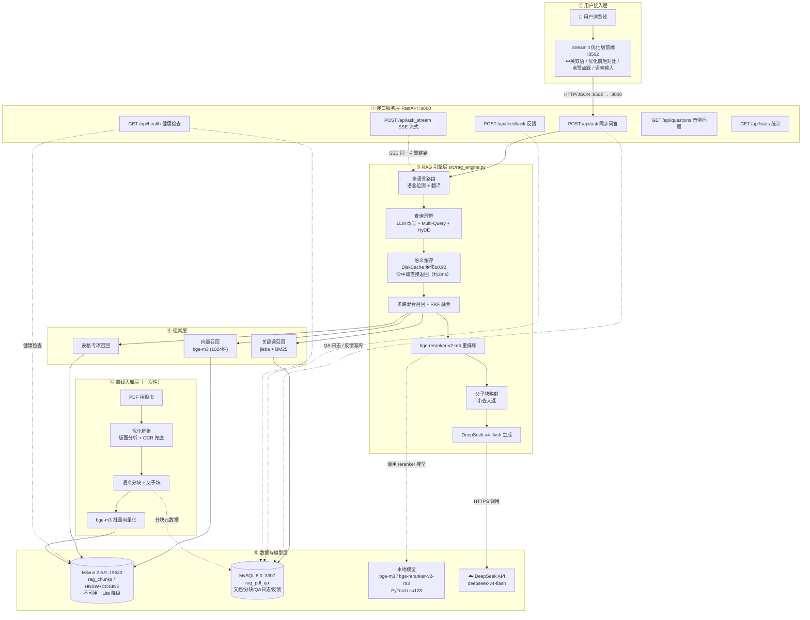

> 📌 渲染图（PNG，同名 SVG 矢量图见 [diagrams/](diagrams/)）：
>
> 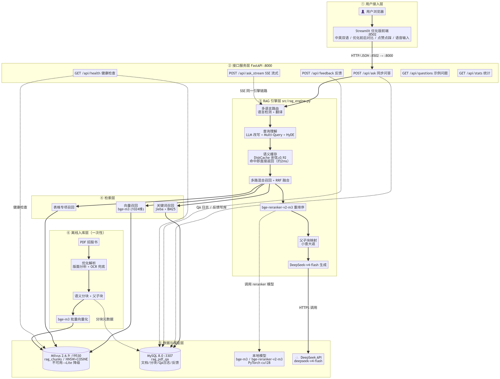

---

## 二、部署架构图

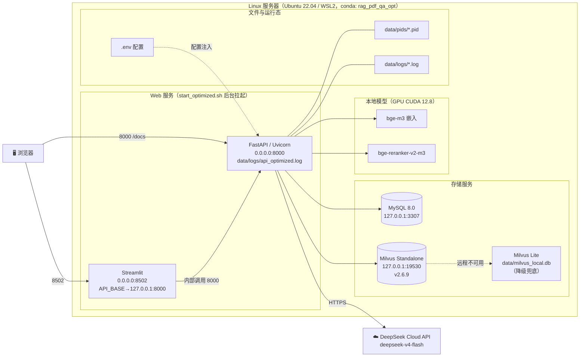

> 📌 渲染图：
>
> 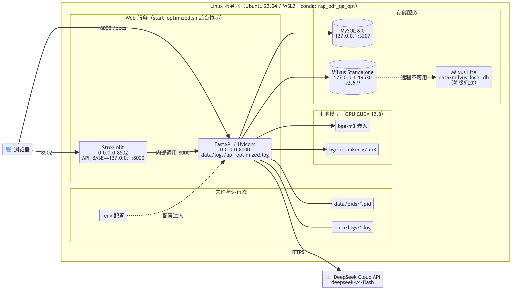

---

## 三、RAG 全流程时序图

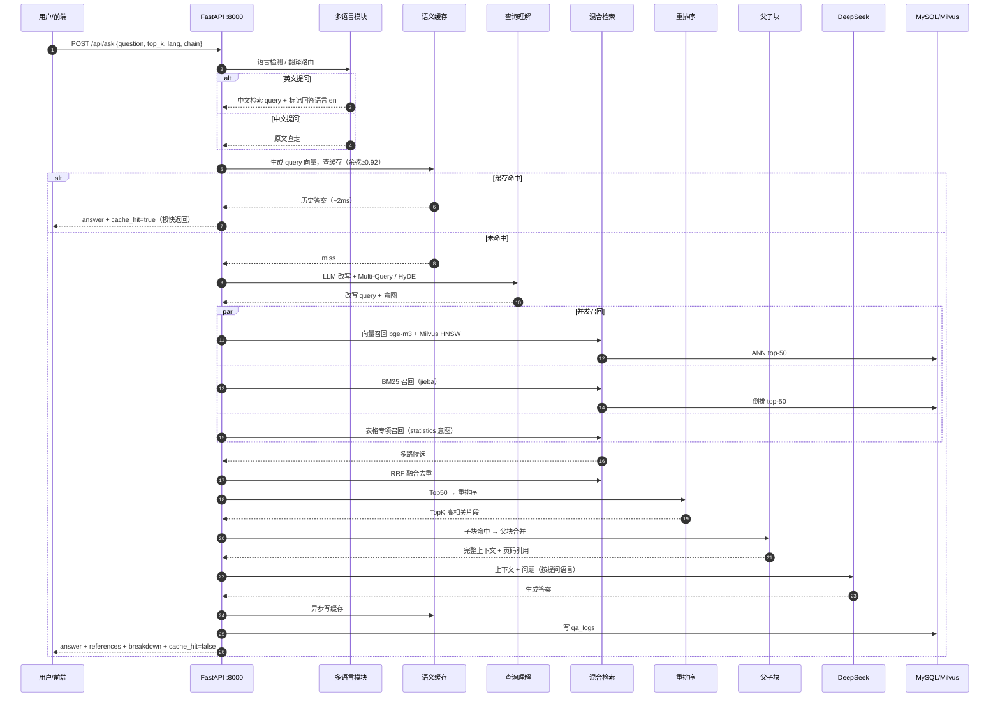

> 📌 渲染图：
>
> 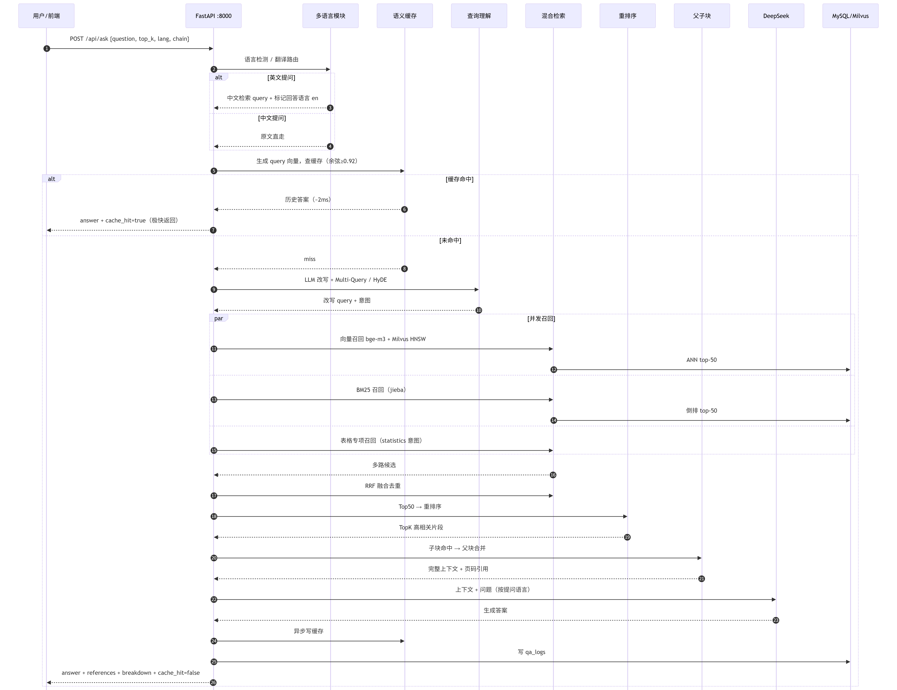

---

## 四、RAG 全流程流程图（含优化点 O1~O12 与降级分支）

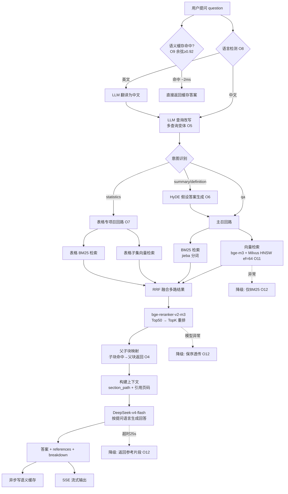

> 📌 渲染图：
>
> 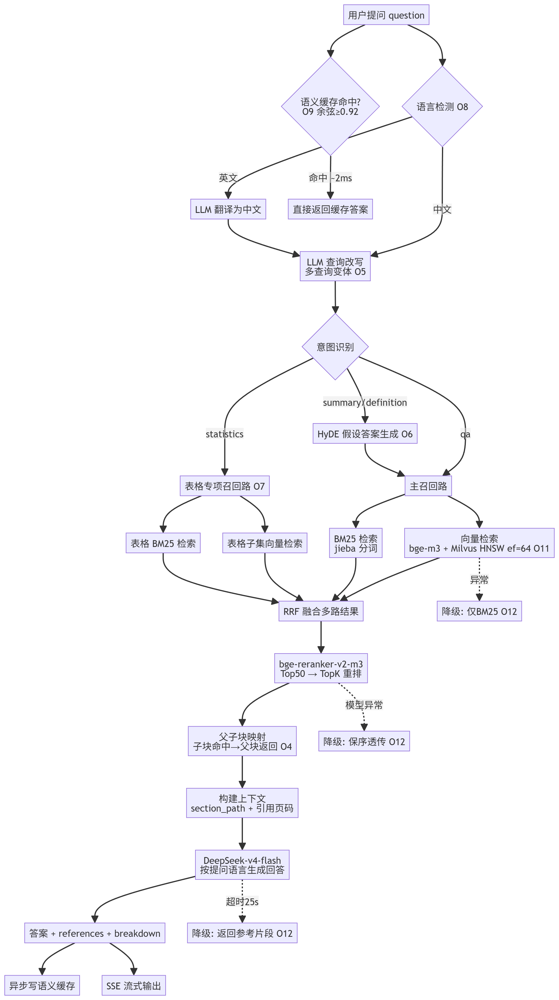

---

## 五、离线数据入库流程（PDF → 向量库）

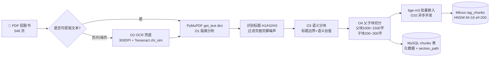

> 📌 渲染图：
>
> 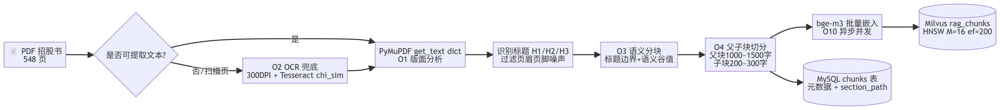

---

## 六、缓存与降级机制

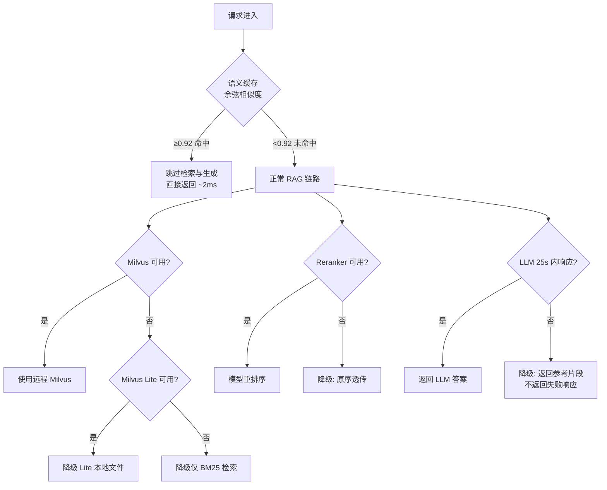

> 📌 渲染图：
>
> 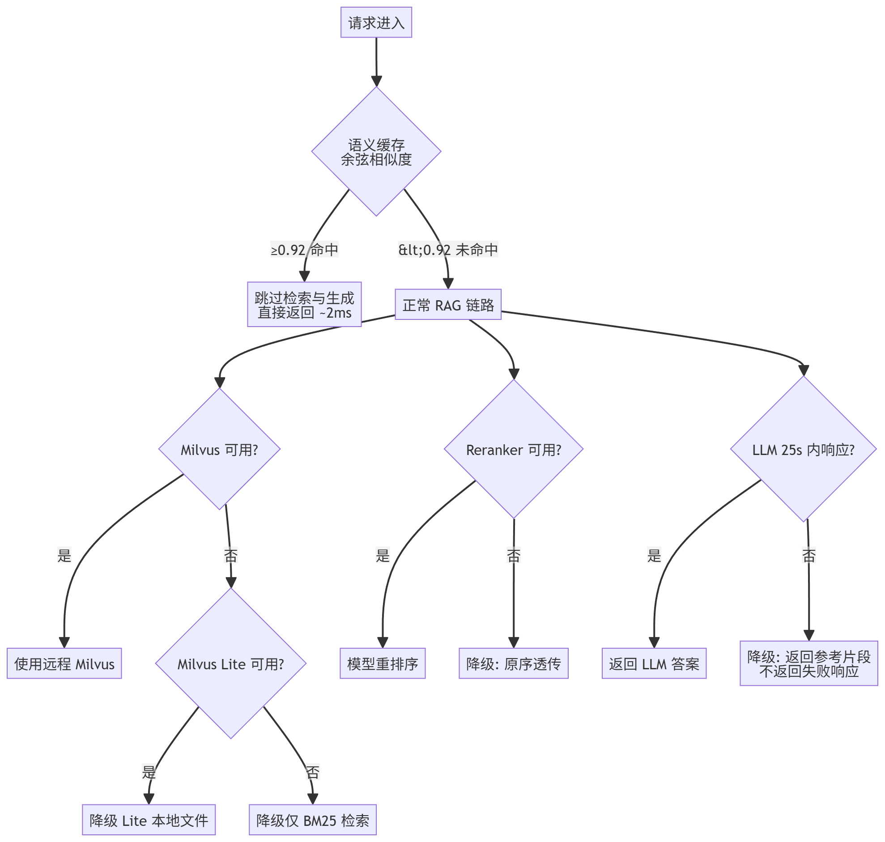

---

## 七、服务启停与端口关系

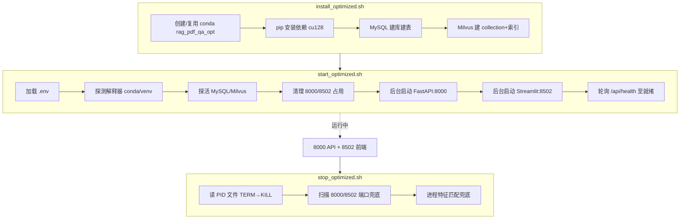

> 📌 渲染图：
>
> 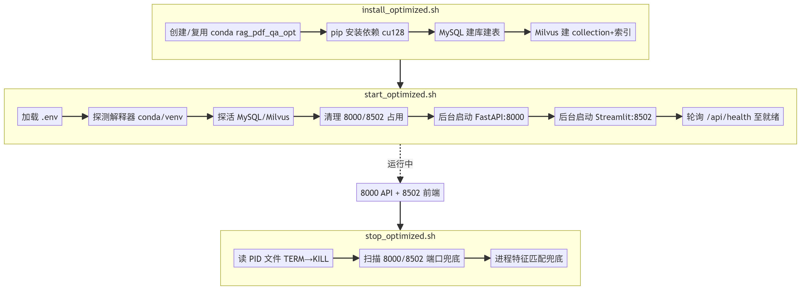

---

## 八、技术架构分层说明

| 层 | 组件 | 关键职责 | 优化点 |
|----|------|----------|--------|
| ① 用户接入层 | Streamlit :8502 | 中英双语界面、优化前后对比、点赞点踩反馈、语音输入 | 前端对比体验 |
| ② 接口服务层 | FastAPI :8000 | 6 个 REST/SSE 端点、参数校验（422/503/500） | — |
| ③ RAG 引擎层 | rag_engine.py | 多语言、查询理解、缓存、融合、重排、父子块、生成 | O4~O9, O12 |
| ④ 检索层 | retriever / hybrid_retriever | 向量 + BM25 + 表格专项，RRF 融合 | O5~O7, O11 |
| ⑤ 数据与模型层 | Milvus / MySQL / 本地模型 / DeepSeek | 向量存储、关系存储、嵌入重排、答案生成 | O11, O12 |
| ⑥ 离线入库层 | pdf_parser / chunker / ingest | PDF 解析、语义分块、向量化入库 | O1~O4, O10 |

---

*本文档为工单设计交付物 | 工单编号：人工智能NLP-RAG-基于PDF文档的问答系统优化 | 流程实现见 [src/](file:///home/dabaie/code/工单/工单二/src) 各模块*
