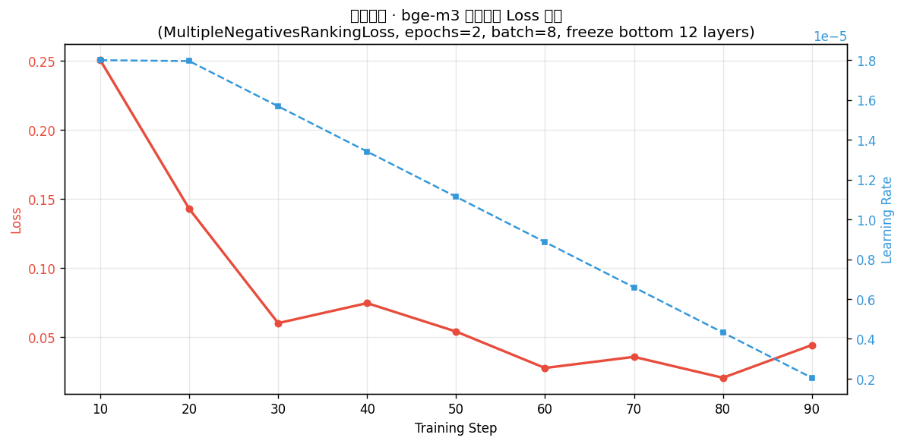
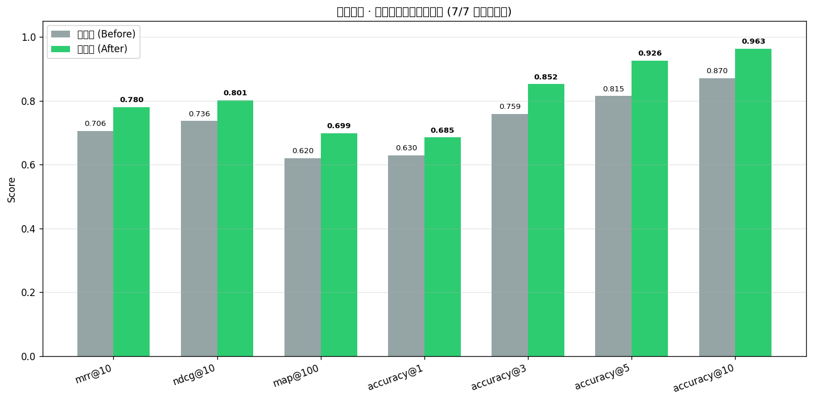

# 工单十一 · 微调实现步骤与过程问题记录

> 工单编号：人工智能NLP-RAG-Embedding模型微调任务
> 环境：WSL2 Ubuntu-22.04，RTX 5060 Laptop 8GB，sentence-transformers 6.0.1 + transformers 5.17 + torch(cuda)

## 一、实现步骤（对应工单规定流程）

### 1. 数据集生成
- 语料：`data/ccf_reports/chunks/` 9 份 A 股年报，过滤 ≥200 字 chunk 共 7178 个
- `qa_dataset.py` 实现：按 doc_id 分层抽样（每份 24 个，seed=42）→ 构造金融领域问答 prompt（营收/净利润/股息/风险指标等角度）→ 解析 LLM JSON 输出为问题列表 → 组成 `(query, positive)` 正例对

### 2. 运行问答对生成
- `scripts/gen_qa_pairs_v11.py` 调 DeepSeek 逐 chunk 生成 2 题
- 实测：216 chunk 抽样 → **432 对**，LLM 零失败，耗时 3.3 分钟
- 按 chunk_id 防泄漏切分：**train 388 / dev 44**（同一 chunk 的题不跨集）
- 评估语料 = 216 抽样 chunk + 800 干扰 chunk（排除已出题 chunk）= **1016 chunks**
- 产物：`data/finetune_v11/{qa_pairs_train.jsonl, qa_pairs_dev.jsonl, qa_corpus_chunks.json, gen_report.json}`

### 3. 数据集与模型加载
- `read_jsonl` 加载 train/dev；基线模型从本地 `/home/dabaie/models/bge-m3` 加载（离线，无下载）

### 4. 定义损失函数
- `MultipleNegativesRankingLoss`（对比损失，scale=20）：以批内其他样本的 positive 作为负例，天然适配 (query, positive) 格式，无需人工构造负例

### 5. 定义训练参数
| 参数 | 值 | 说明 |
| --- | --- | --- |
| epochs | 2 | 98 步（388 对 / batch 8） |
| batch_size | 8 | 8GB 显存适配 |
| learning_rate | 2e-5 | warmup 10% 后线性衰减 |
| max_seq_length | 256 | 年报 chunk 截断，控制显存 |
| bf16 | 开 | RTX 50 系原生支持 |
| 冻结层 | 嵌入层 + 底部 12 层 | 可训练 152.2M / 568M，显存减半且领域适配足够 |
| seed | 42 | 可复现 |

### 6. 创建评估器
- `InformationRetrievalEvaluator`：查询 = 44 道 dev 生成题（chunk 级相关）+ 工单七 10 道真实金标题（doc 级相关，该文档全部 chunk 视为相关），共 **54 个查询**；语料 1016 chunks
- 指标：mrr@10 / ndcg@10 / map@100 / accuracy@1/3/5/10

### 7. 微调前评估（基线）
| mrr@10 | ndcg@10 | map@100 | acc@1 | acc@3 | acc@5 | acc@10 |
| --- | --- | --- | --- | --- | --- | --- |
| 0.7055 | 0.7363 | 0.6204 | 0.6296 | 0.7593 | 0.8148 | 0.8704 |

### 8. 训练过程
- 实测 **19.4 秒**（GPU），loss 0.2506 → 0.0441 单调收敛（完整 log_history 见 `docs/finetune_v11_results.json`）
- 模型保存：`models/bge-m3-ft-v11/`（sentence-transformers 格式，2.2GB，含 tokenizer/Pooling/Normalize，可直接 `SentenceTransformer(path)` 加载）



### 9. 微调后评估（同口径复测）与验收结论

| 指标 | 微调前 | 微调后 | Δ |
| --- | --- | --- | --- |
| mrr@10 | 0.7055 | 0.7798 | **+0.0743** |
| ndcg@10 | 0.7363 | 0.8015 | **+0.0652** |
| map@100 | 0.6204 | 0.6989 | **+0.0785** |
| accuracy@1 | 0.6296 | 0.6852 | **+0.0556** |
| accuracy@3 | 0.7593 | 0.8519 | **+0.0926** |
| accuracy@5 | 0.8148 | 0.9259 | **+0.1111** |
| accuracy@10 | 0.8704 | 0.9630 | **+0.0926** |



**验收结论：7/7 项指标全部提升，微调后检索效果优于微调前**（数据来源 `docs/finetune_v11_results.json`，全程端到端 1.3 分钟，seed 固定可复现）。

## 二、过程问题与解决

### 问题 1：transformers v5 梯度检查点不兼容（阻塞）
- **现象**：`trainer.train()` 抛 `TypeError: BaseModel.gradient_checkpointing_enable() got an unexpected keyword argument 'every_n_layers'`
- **原因**：sentence-transformers 6.0.1 开启 `gradient_checkpointing=True` 时向底层模型传 `every_n_layers`，transformers 5.17 的 XLM-RoBERTa 已移除该参数
- **解决**：默认关闭梯度检查点（`--grad-ckpt` 显式开启才用）；显存靠"冻结底部 12 层 + bf16 + batch 8 + max_seq 256"已足够，实测训练无 OOM
- **排查干扰项**：后台命令 `python ... | tail -30` 管道使退出码恒为 0，首次失败被误报为"成功"；改用 `set -o pipefail` 后真实退出码可见

### 问题 2：8GB 显存训练大模型的 OOM 风险（预防）
- **措施**：冻结嵌入层 + 底部 12/24 层 Transformer（可训练参数 568M→152M，优化器状态与梯度显存同步减半）；bf16 混合精度；max_seq 截断 256
- **结果**：全程未触发 OOM，训练 19.4s 完成

### 问题 3：评估集泄漏风险（设计规避）
- **风险**：同一 chunk 生成的多道题若分跨 train/dev，模型可能"背答案"虚高指标
- **解决**：`split_train_dev` 按 chunk_id 分组切分；干扰 chunk 也从"未出题"池中抽取

### 问题 4：LLM 输出格式不稳定（健壮性）
- **解决**：`parse_questions` 双通道解析——优先提取 ```json 围栏/JSON 数组，失败则按编号列表行兜底；实测 216 次调用零失败

## 三、质量

- 新增单测 14 用例（prompt 构造/解析/抽样/切分防泄漏/评估器输入/指标对比）全过
- 全量回归 **300 passed / 1 skipped**（基线 286 + 新增 14），无回归
- 新增代码注释均含工单编号：**人工智能NLP-RAG-Embedding模型微调任务**
