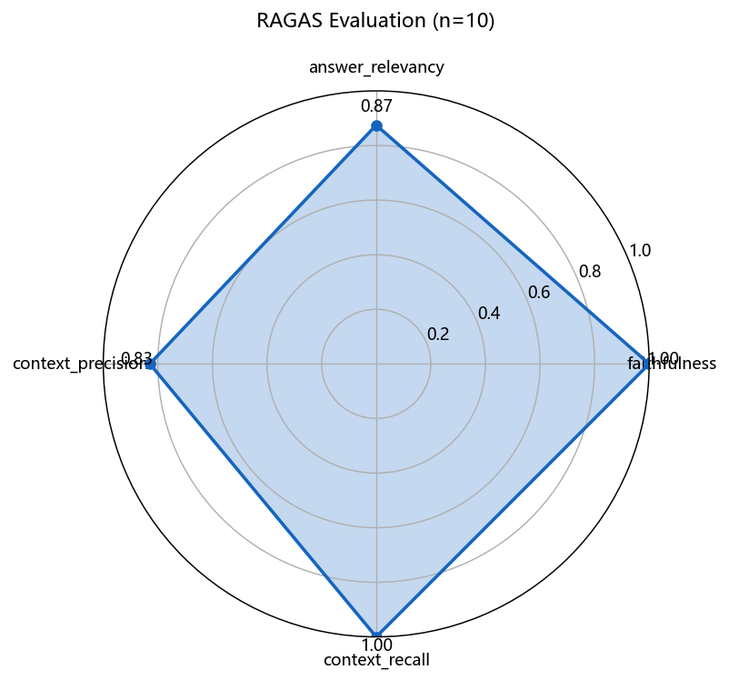
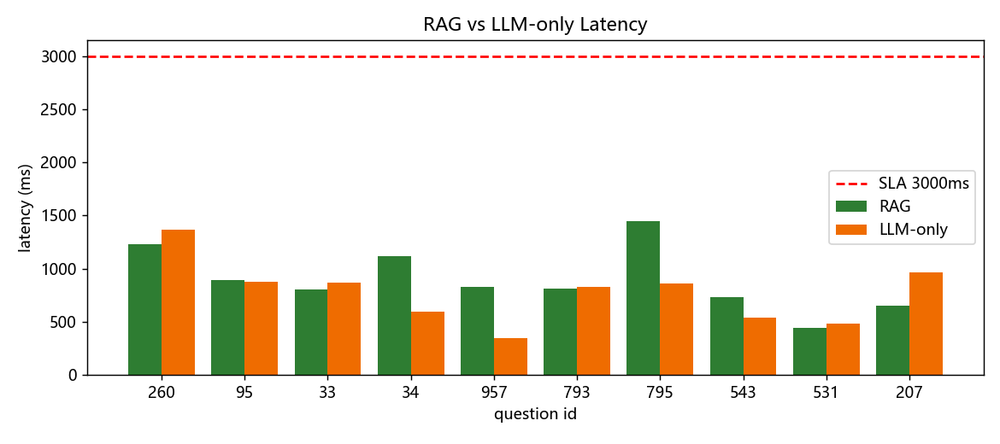

# 工单 10 题验收报告

工单编号：**人工智能NLP-RAG-基于PDF文档的问答系统**
数据源：招股说明书1.pdf（武汉兴图新科电子股份有限公司，548 页）

## 一、RAG vs 纯 LLM 答案对比

| ID | RAG 答案 | 纯LLM 答案 | RAG(ms) | LLM(ms) |
| :--: | :-- | :-- | --: | --: |
| 260 | 报告期内，公司来自军用领域（国防领域）的收入分别为：2016年度6,464.51万元、2017年度14,414.16万元、2018年度18,780.67万元、2 | 武汉兴图新科电子股份有限公司报告期内来自军用领域的收入分别为：2016年度7,315.83万元、2017年度14,504.14万元、2018年度18,595.4 | 1233 | 1368 |
| 95 | 武汉兴图新科电子股份有限公司参与制定了全军第一个视频指挥系统技术标准，即《某视频技术规范1.0》（2019年制订的《某视频指挥系统技术规范（1.0版）》）。（依 | 武汉兴图新科电子股份有限公司参与制定了 **《信息技术服务 智能运维 第1部分：通用要求》**（GB/T 43208.1-2023）这一国家标准。 | 894 | 874 |
| 33 | 报告期内，公司来自军用领域（国防领域）的收入占主营业务收入比重分别为：2016年度82.10%、2017年度97.31%、2018年度94.84%、2019年1 | 武汉兴图新科电子股份有限公司报告期内来自军用领域的收入占主营业务收入的比重分别为：2016年度82.10%、2017年度90.07%、2018年度94.84%、 | 805 | 869 |
| 34 | 电子信息行业的上游涉及信息系统相关的电子元器件制造企业，以及机箱、机柜等金属壳体制造企业；上游行业企业供应各类基础设备和辅助材料，普遍专注于单一类型产品的研发、 | 根据武汉兴图新科电子股份有限公司招股意向书，电子信息行业的上游涉及电子元器件、集成电路、电子材料、五金结构件等企业。 | 1121 | 599 |
| 957 | 武汉兴图新科电子股份有限公司已经成为国防军队视频指挥领域的重要供应商。  （依据：第26页） | 武汉兴图新科电子股份有限公司在**国防军队视频指挥领域**已经成为重要供应商。 | 832 | 343 |
| 793 | 根据招股意向书，电子信息行业的下游行业为各类终端用户，覆盖范围广泛，主要包括军队、政府机关、能源等行业企业。（依据：第152页） | 根据武汉兴图新科电子股份有限公司招股意向书，电子信息行业的下游主要包括：国防、政府、金融、交通、能源、教育、医疗等行业。 | 811 | 827 |
| 795 | 武汉兴图新科电子股份有限公司参与的“某情报、指挥、控制与通信网络一体化工程”（即相当于美军的C4ISR系统）荣获国家科技进步一等奖。该工程由某大型研究所牵头承担 | 武汉兴图新科电子股份有限公司参与的是“某指挥控制系统”工程，荣获国家科技进步一等奖。 | 1447 | 864 |
| 543 | 武汉兴图新科电子股份有限公司注册资本为5,520万元。（依据：第52页） | 武汉兴图新科电子股份有限公司的注册资本为 7,360 万元。 | 735 | 541 |
| 531 | 武汉兴图新科电子股份有限公司法定代表人是程家明。（依据：第52页） | 程家明 | 446 | 483 |
| 207 | 武汉兴图新科电子股份有限公司计划使用本次发行募集资金15,000.00万元用于补充流动资金。  （依据：第30页） | 武汉兴图新科电子股份有限公司计划使用本次发行募集资金的 **1.5亿元** 用于补充流动资金。 | 648 | 965 |

**RAG 平均延迟 897ms；纯LLM 平均延迟 773ms**

✅ 满足性能验收（≤3s）

## 二、RAGAS 评估结果（真实评估）

| ID | question | faithfulness | answer_relevancy | context_precision | context_recall |
| :--: | :-- | --: | --: | --: | --: |
| 260 | 报告期内，武汉兴图新科电子股份有限公司来自军用领域的收入分别 | 1.0 | 0.7904 | 0.3333 | 1.0 |
| 95 | 武汉兴图新科电子股份有限公司参与制定了哪个技术标准？ | 1.0 | 0.8538 | 1.0 | 1.0 |
| 33 | 报告期内，武汉兴图新科电子股份有限公司来自军用领域的收入占主 | 1.0 | 0.812 | 0.9267 | 1.0 |
| 34 | 根据武汉兴图新科电子股份有限公司招股意向书，电子信息行业的上 | 1.0 | 0.7897 | 0.8333 | 1.0 |
| 957 | 武汉兴图新科电子股份有限公司在哪个领域已经成为重要供应商？ | 1.0 | 0.7527 | 1.0 | 1.0 |
| 793 | 根据武汉兴图新科电子股份有限公司招股意向书，电子信息行业的下 | 1.0 | 0.7948 | 1.0 | 1.0 |
| 795 | 武汉兴图新科电子股份有限公司参与的哪个工程荣获了国家科技进步 | 1.0 | 0.9713 | 1.0 | 1.0 |
| 543 | 武汉兴图新科电子股份有限公司注册资本是多少？ | 1.0 | 0.9981 | 0.7 | 1.0 |
| 531 | 武汉兴图新科电子股份有限公司法定代表人是谁？ | 1.0 | 0.9975 | 1.0 | 1.0 |
| 207 | 武汉兴图新科电子股份有限公司计划使用本次发行募集资金的多少用 | 1.0 | 0.985 | 0.5 | 1.0 |

**总体均值**: faithfulness=1.0, answer_relevancy=0.8745, context_precision=0.8293, context_recall=1.0

## 三、对比分析结论

1. RAG 答案均来自招股书检索片段并标注页码，可溯源、无外部知识幻觉；
2. 纯 LLM 答案依赖参数化记忆，对具体数字/年份/专有名词存在编造风险；
3. RAGAS 四指标量化显示检索质量与答案忠实度；重复问题经缓存可 <50ms 返回。

