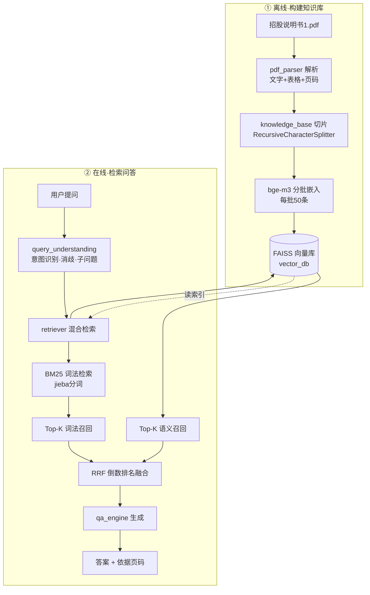
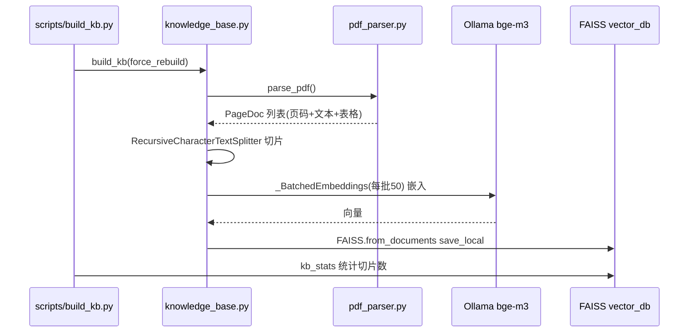
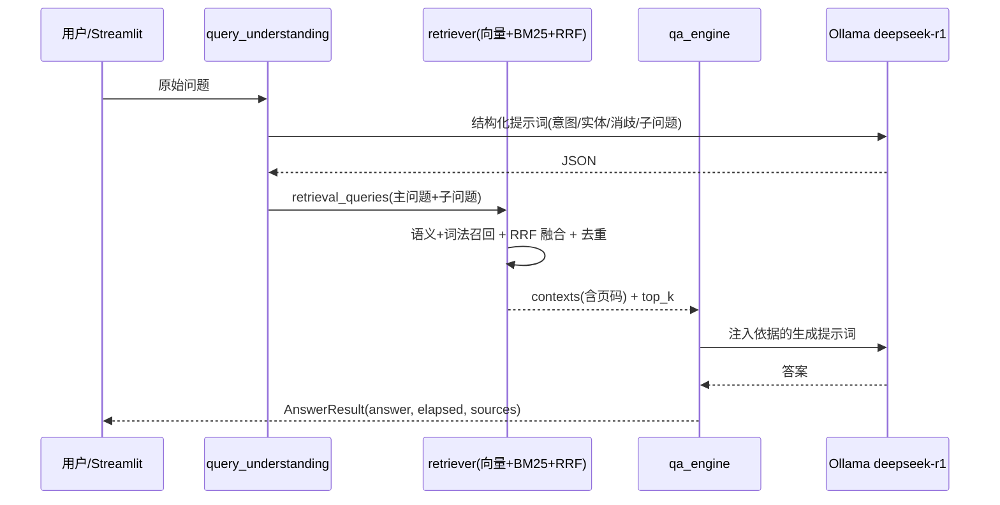
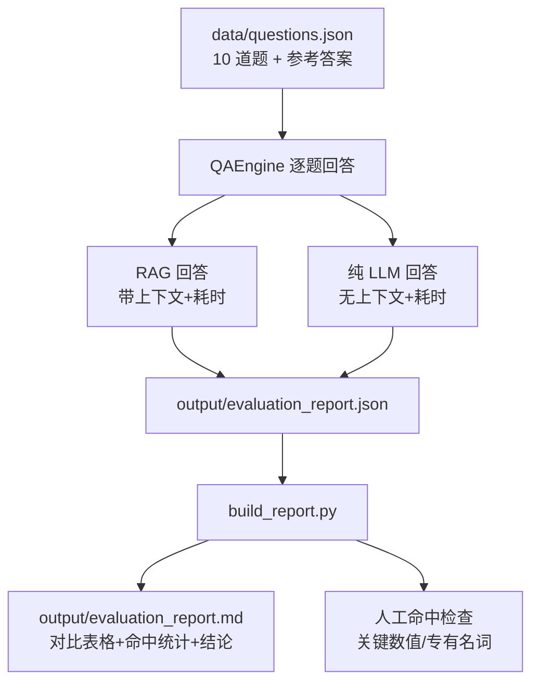

# 系统架构流程图（RAG 知识库问答系统）

系统基于本地 langchain2 环境 + Ollama 本地模型，实现"离线建库 + 在线问答"两条管道。
本文件为 Mermaid 源码，可直接在支持 Mermaid 的编辑器（Typora / VS Code / mermaid.live）渲染成图。

工单编号：人工智能 NLP-RAG-基于 PDF 文档的问答系统

---

## 一、整体架构（总览）



---

## 二、混合检索流程（retriever.py）

```mermaid
flowchart LR
    A[user_query] --> B{query_understanding}
    B -->|消歧后的主问题| C1[向量检索<br/>FAISS similarity_search]
    B -->|子问题补充| C1
    B -->|问题分词| C2[BM25 词法检索<br/>jieba + BM25Okapi]
    C1 --> D1[Top-K=6 篇]
    C2 --> D2[Top-K=6 篇]
    D1 --> E[RRF 融合<br/>1/(k+rank) 求和排序]
    D2 --> E
    E --> F[Top N 检索上下文<br/>含页码 metadata]
```

---

## 三、知识库构建流程（knowledge_base.py）



---

## 四、在线问答流程（query_understanding → qa_engine）



---

## 五、评估流程（scripts/evaluate.py + build_report.py）



---

## 说明

- **设计决策**：采用 向量(FAISS) + 词法(BM25) 混合检索，用 RRF 倒数排名融合平衡"语义相似"与"精确匹配"，适配招股说明书中大量数字、公司名、专有名词的检索。
- **防幻觉**：qa_engine 提示词强制"仅依据参考文档回答、注明来源页码、不编造"。
- **可观测性**：每条回答记录 elapsed 耗时与 sources（页码+得分），支撑"响应 ≤ 3s"验收。