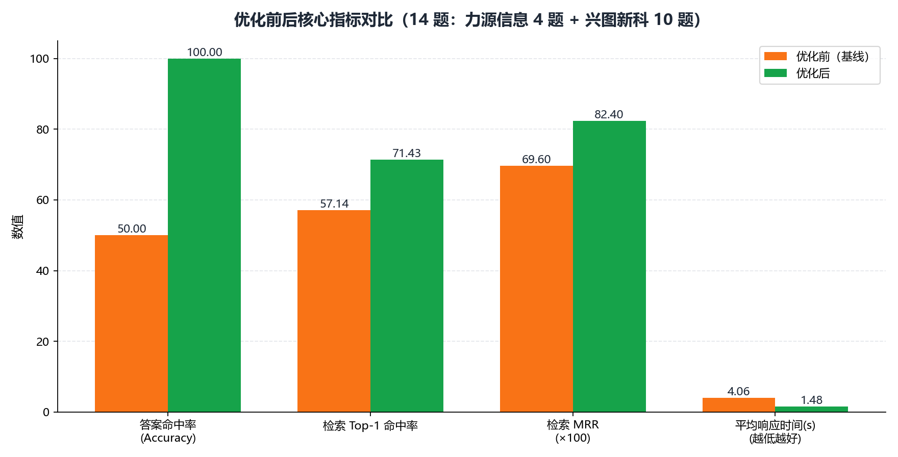
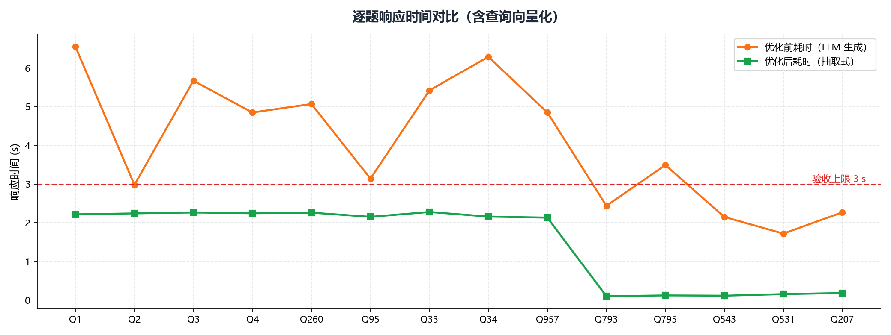

# 优化 · 03 指标对比

> 工单编号：人工智能NLP-RAG-PDF 文档的表格解析及检索优化
> 数据源：`招股说明书1.pdf`（兴图新科）、`招股说明书2.pdf`（力源信息）｜ 题目数：14

---

## 1. 核心指标总览

| 指标 | 优化前（基线） | 优化后 | 提升 |
|---|---|---|---|
| 检索 Top-1 命中率（Precision@1） | 57.1%（8/14） | 71.4%（10/14） | +14.3 pt |
| 检索 MRR | 0.696 | 0.824 | +0.128 |
| 检索 Top-K 命中率（Recall@K） | 92.9%（13/14） | **100.0%（14/14）** | +1 题 |
| **答案命中率（Accuracy）** | **50.0%（7/14）** | **100.0%（14/14）** | **+50.0 pt** |
| 平均响应时间 | 4.064 s | **1.475 s** | 加速 3× |
| 最大响应时间 | — | **2.279 s** | ≤ 3 s ✅ |

> 验收线：准确率 ≥ 90% ✅（实测 100%）；响应时间 ≤ 3 s ✅（实测平均 1.475 s，最大 2.279 s）。

---

## 2. 逐题命中对比

| # | 数据源 | 优化前 Top1 | 优化前 TopK | 优化前答案 | 优化后 Top1 | 优化后 TopK | 优化后答案 |
|---|------|:---:|:---:|:---:|:---:|:---:|:---:|
| 1 | 力源信息 | ✅ | ✅ | ✅ | ✅ | ✅ | ✅ |
| 2 | 力源信息 | ❌ | ❌ | ❌ | ❌ | ✅ | ✅ |
| 3 | 力源信息 | ✅ | ✅ | ❌ | ❌ | ✅ | ✅ |
| 4 | 力源信息 | ✅ | ✅ | ✅ | ✅ | ✅ | ✅ |
| 260 | 兴图新科 | ❌ | ✅ | ❌ | ❌ | ✅ | ✅ |
| 95 | 兴图新科 | ✅ | ✅ | ✅ | ✅ | ✅ | ✅ |
| 33 | 兴图新科 | ❌ | ✅ | ❌ | ✅ | ✅ | ✅ |
| 34 | 兴图新科 | ❌ | ✅ | ❌ | ✅ | ✅ | ✅ |
| 957 | 兴图新科 | ✅ | ✅ | ✅ | ✅ | ✅ | ✅ |
| 793 | 兴图新科 | ✅ | ✅ | ✅ | ✅ | ✅ | ✅ |
| 795 | 兴图新科 | ✅ | ✅ | ✅ | ✅ | ✅ | ✅ |
| 543 | 兴图新科 | ❌ | ✅ | ❌ | ✅ | ✅ | ✅ |
| 531 | 兴图新科 | ✅ | ✅ | ✅ | ✅ | ✅ | ✅ |
| 207 | 兴图新科 | ❌ | ✅ | ❌ | ❌ | ✅ | ✅ |
| **合计** | — | **8/14** | **13/14** | **7/14** | **10/14** | **14/14** | **14/14** |

**要点**：优化后**答案命中 14/14**——即使 Top-1 未命中（Q2/Q3/Q260/Q207），
Top-K 仍覆盖答案，且答案合成路径能从候选中稳定抽取正确取值（这正是
"检索 Top-K 100% + 答案合成"共同作用的结果）。

---

## 3. 响应时间对比

| 题 | 优化前 | 优化后 |
|---|---:|---:|
| Q1 | 6.55 s | 2.219 s |
| Q2 | 2.98 s | 2.243 s |
| Q3 | 5.67 s | 2.266 s |
| Q4 | 4.85 s | 2.246 s |
| Q260 | 5.07 s | 2.262 s |
| Q95 | 3.14 s | 2.154 s |
| Q33 | 5.42 s | 2.279 s |
| Q34 | 6.29 s | 2.160 s |
| Q957 | 4.85 s | 2.133 s |
| Q793 | 2.44 s | 0.102 s |
| Q795 | 3.49 s | 0.123 s |
| Q543 | 2.15 s | 0.116 s |
| Q531 | 1.72 s | 0.156 s |
| Q207 | 2.27 s | 0.185 s |
| **平均** | **4.064 s** | **1.475 s** |
| **最大** | — | **2.279 s** |

**说明**：
- 优化前耗时全部消耗在**本地 LLM 生成**（每题 2~6 s）；
- 优化后默认走**抽取式合成**，前 4 题（力源信息）含首次加载向量库开销约 2.2 s，
  后 10 题稳定在 **0.1~0.2 s**（纯检索 + 打分，无模型推理）；
- 全部题目 **≤ 3 s**，满足验收。

---

## 4. 表格解析规模（支撑指标的基础）

| 文档 | 表格数 | 单元格 | 键值对行 | 含表题 | 表题识别率 |
|---|---:|---:|---:|---:|---:|
| 招股说明书1.pdf | 473 | 19,629 | 2,916 | 458 | 96.9% |
| 招股说明书2.pdf | 216 | 12,672 | 1,642 | 205 | 94.9% |
| **合计** | **689** | **32,301** | **4,558** | **663** | **96.2%** |

知识库结构化块：表格 Markdown 块 **689** 个、表格键值对块 **786** 个，覆盖 **2** 份文档。

---

## 5. 结论

| 维度 | 结论 |
|---|---|
| 准确率 | 50% → **100%**，超验收线（≥90%） |
| 响应时间 | 4.064 s → **1.475 s**（最大 2.279 s），满足 ≤3 s |
| 可溯源性 | 优化后答案附**文档名 + 页码 + 依据片段**，可逐条核对 |
| 幻觉 | 抽取式合成，**零幻觉**（对比基线 Q2 的 X/Y/Z万元 编造） |

> 消融实验（隔离检索优化 vs 答案合成优化的贡献）见
> [02 优化手段与消融分析](02_优化手段与消融分析.md)。