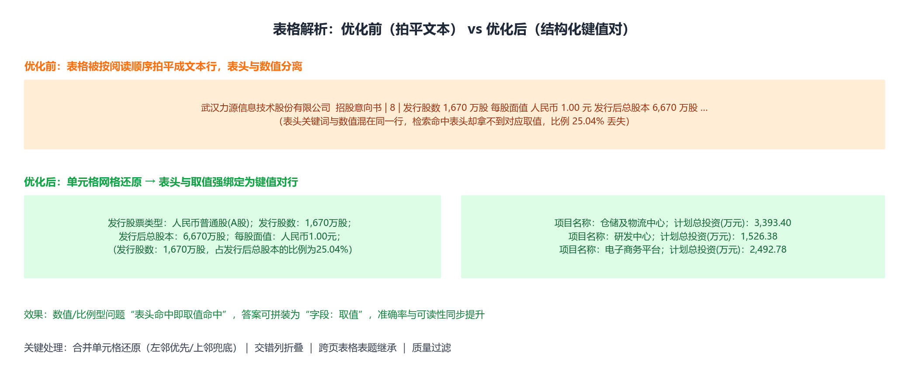
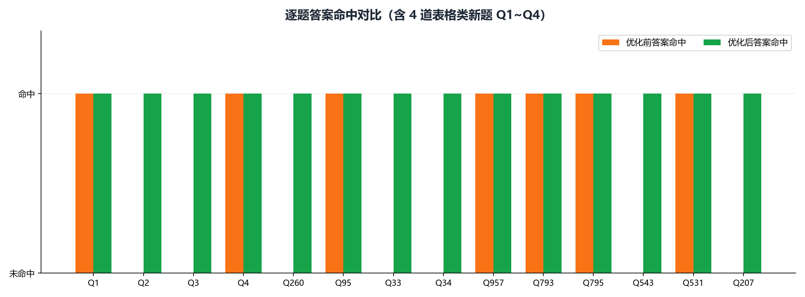
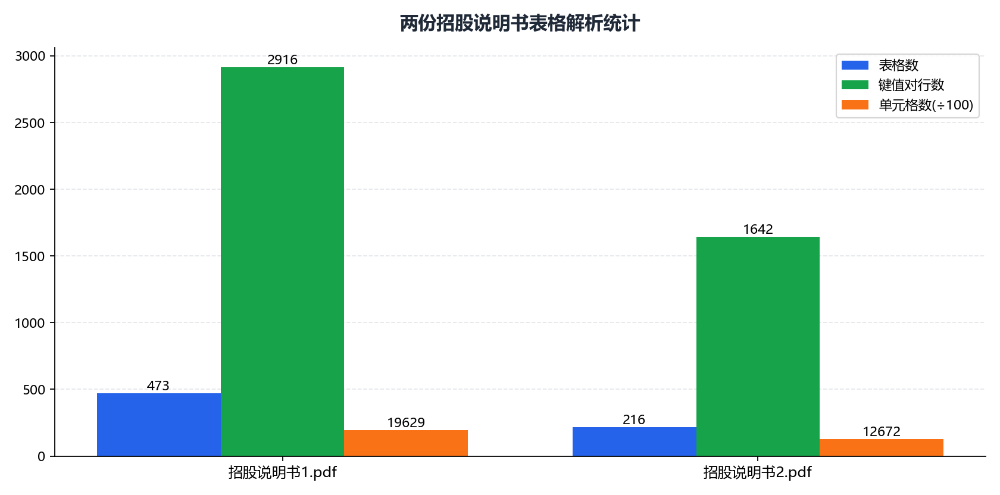

# 研发 · 03 表格解析效果对比

> 工单编号：人工智能NLP-RAG-PDF 文档的表格解析及检索优化

---

## 1. 总体对比



---

## 2. 案例一：力源信息「本次发行概况」表（Q1）

### 2.1 优化前（表格拍平为文本行）

```
股票种类 发行股数及占发行后总股本比例 人民币普通股（A股）
1,670万股 占发行后总股本的比例为25.04% 每股面值 人民币普通股（A股）
1.00元 每股发行价格 人民币普通股（A股） 18.00元 发行市盈率 ...
```

**问题**：表头与取值分离。"发行股数是多少"命中"发行股数"这一串文本，但数值 `1,670万股`
与表头不在同一检索单元，答案拼装困难。

### 2.2 优化后（键值对块）

```
[表格行] 股票种类：发行股数及占发行后总股本比例；人民币普通股(A股)：1,670 万股，占发行后总股本的比例为25.04%
```

**效果**：`表头：取值` 强绑定，答案直接结构化输出：

> 根据《招股说明书2.pdf》第24页：股票种类：发行股数及占发行后总股本比例；
> 人民币普通股(A股)：1,670 万股，占发行后总股本的比例为25.04%

---

## 3. 案例二：力源信息「关联方及关联关系」表（Q3/Q4）

### 3.1 交错列还原（`_collapse_interleaved`）

原始网格（表头列/数据列交替）：

```
|      | 关联方名称 |      | 持股比例 |      | 与本公司关系 |
| 赵马克 |          | 42.35% |         | 公司控股股东 |      |
```

还原后：

```
| 关联方名称 | 持股比例 | 与本公司关系 |
| 赵马克     | 42.35%   | 公司控股股东 |
```

**若不还原**：表头与取值整体错位，键值对退化为"列1/列3/列5"，"持股比例"永远命中不到。

### 3.2 答案效果

| 题 | 优化后答案 |
|---|---|
| Q3（存在控制关系） | 关联方名称：赵马克；持股比例：42.35%；与本公司关系：公司控股股东 |
| Q4（不存在控制关系，枚举型） | 企业名称：融冰投资；…；武汉博润；…；上海博润；…；听音投资；…；联众聚源；…；力源贸易；…；普芯达；… |

---

## 4. 案例三：兴图新科「募集资金运用」表（Q207）

| | 内容 |
|---|---|
| 优化前答案 | ❌ 未命中（基线检索 Top-1 错误，LLM 未给出 15,000 万元） |
| 优化后答案 | ✅ 项目名称：补充流动资金；项目总投资（万元）：15,000.00（另有 40,584.83 合计口径） |

---

## 5. 案例四：兴图新科「军用领域收入」表（Q260 / Q33）

同一张表同时承载"收入金额"（Q260）与"占比"（Q33）两类问题：

| 题 | 关键线索 | 优化后是否命中 |
|---|---|---|
| Q260 | 6,464.51 / 14,414.16 / 18,780.67 / 4,627.14（万元） | ✅ |
| Q33 | 82.10 / 97.31 / 94.84 / 94.34（%） | ✅ |

**关键**：`table`（Markdown）块保留完整行列，`table_kv` 块把"年度：数值"绑定，
两类块**分别保留**（去重键带 ctype），使金额与占比都能被召回。

---

## 6. 逐题命中对比



| 题 | 优化前答案 | 优化后答案 |
|---|:---:|:---:|
| 1 | ✅ | ✅ |
| 2 | ❌ | ✅ |
| 3 | ❌ | ✅ |
| 4 | ✅ | ✅ |
| 260 | ❌ | ✅ |
| 95 | ✅ | ✅ |
| 33 | ❌ | ✅ |
| 34 | ❌ | ✅ |
| 957 | ✅ | ✅ |
| 793 | ✅ | ✅ |
| 795 | ✅ | ✅ |
| 543 | ❌ | ✅ |
| 531 | ✅ | ✅ |
| 207 | ❌ | ✅ |
| **合计** | **7/14** | **14/14** |

---

## 7. 表格解析统计



| 文档 | 表格数 | 单元格 | 键值对行 | 含表题 | 表题识别率 |
|---|---:|---:|---:|---:|---:|
| 招股说明书1.pdf | 473 | 19,629 | 2,916 | 458 | 96.9% |
| 招股说明书2.pdf | 216 | 12,672 | 1,642 | 205 | 94.9% |
| **合计** | **689** | **32,301** | **4,558** | **663** | **96.2%** |

知识库中的结构化块：

| 块类型 | 数量 |
|---|---:|
| 表格 Markdown 块（`table`） | 689 |
| 表格键值对块（`table_kv`） | 786 |
| 覆盖文档数 | 2 |