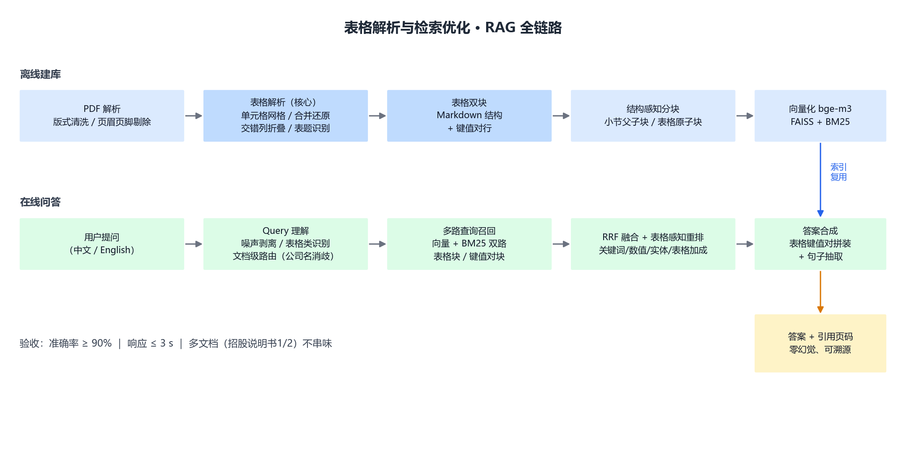
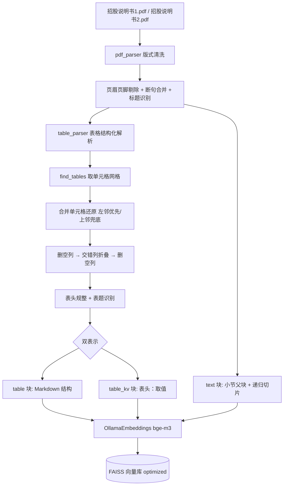
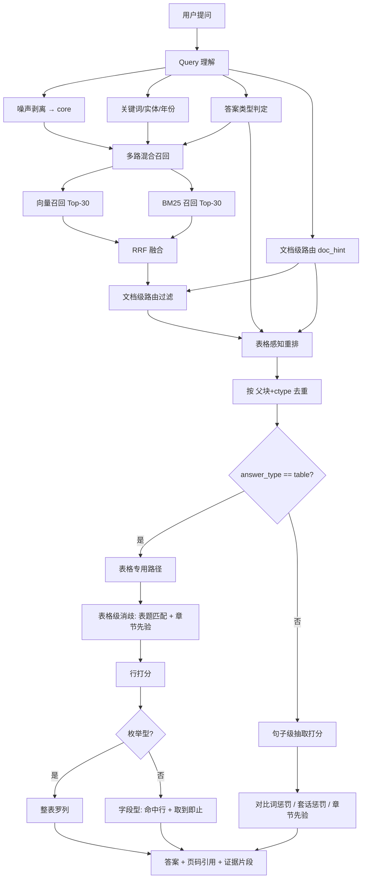
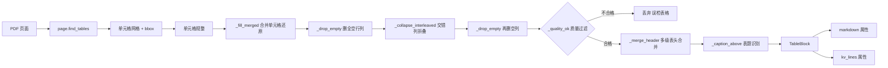
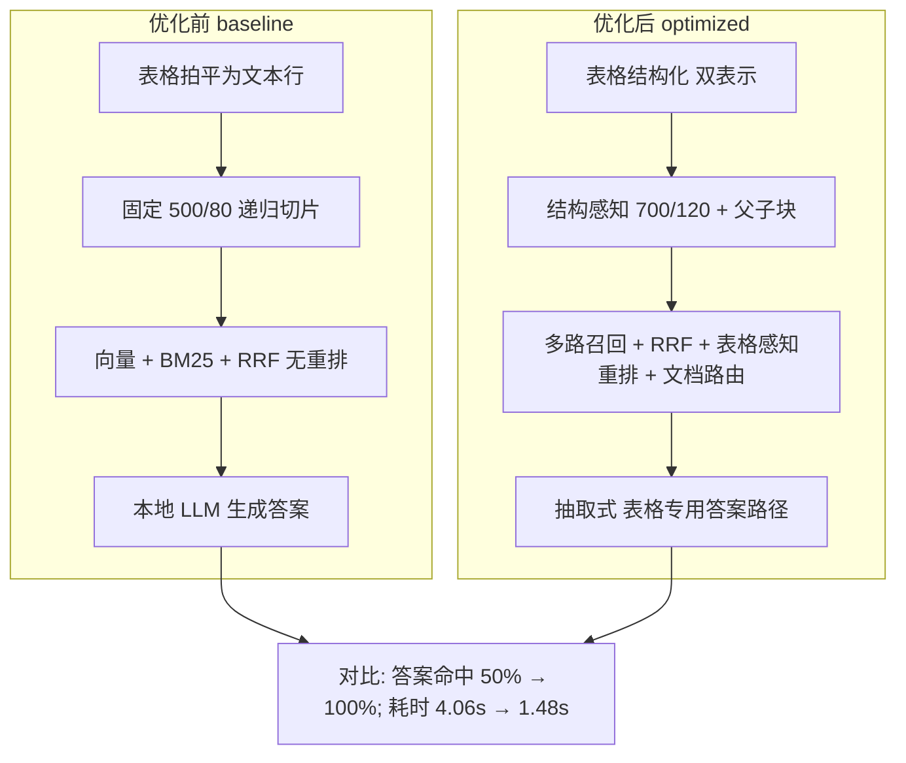
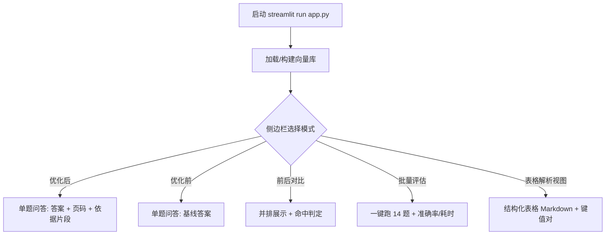
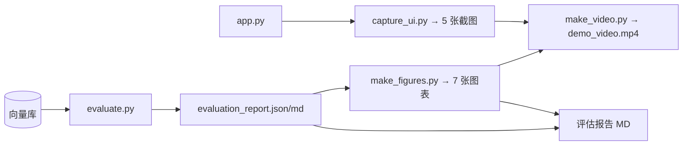

# 设计 · 05 系统流程图

> 工单编号：人工智能NLP-RAG-PDF 文档的表格解析及检索优化

---

## 1. 全链路流程图

---

## 2. 离线建库流程（Mermaid）

---

## 3. 在线问答流程（Mermaid）

---

## 4. 表格解析子流程（Mermaid）

---

## 5. 前后对比链路（Mermaid）

---

## 6. 界面交互流程

---

## 7. 文档产出流程

