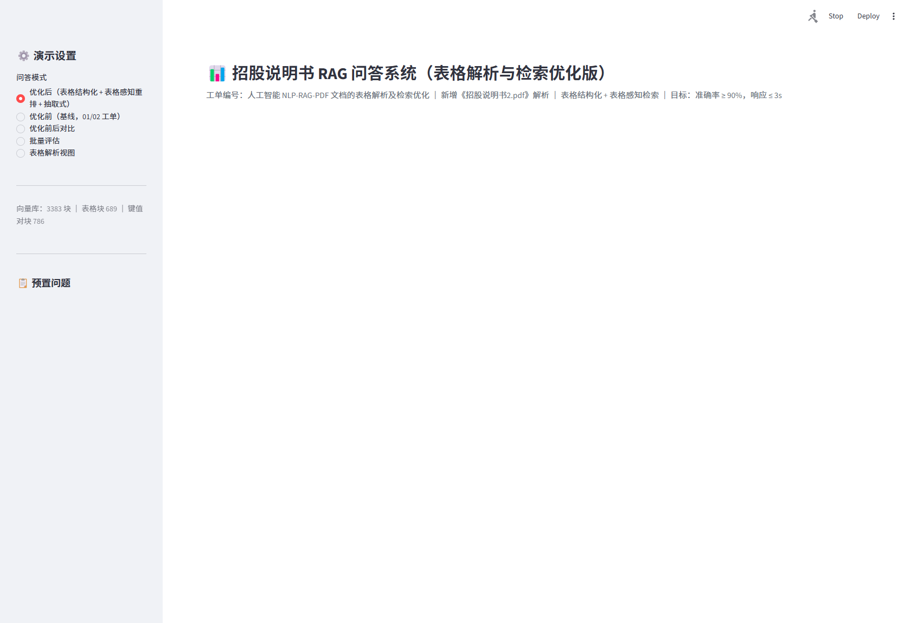
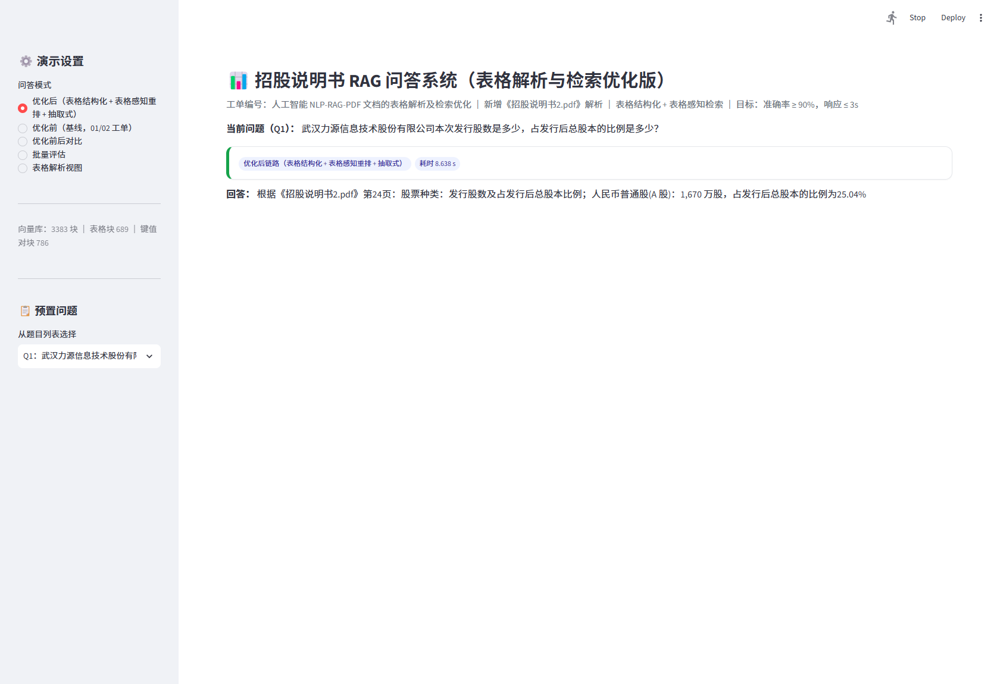
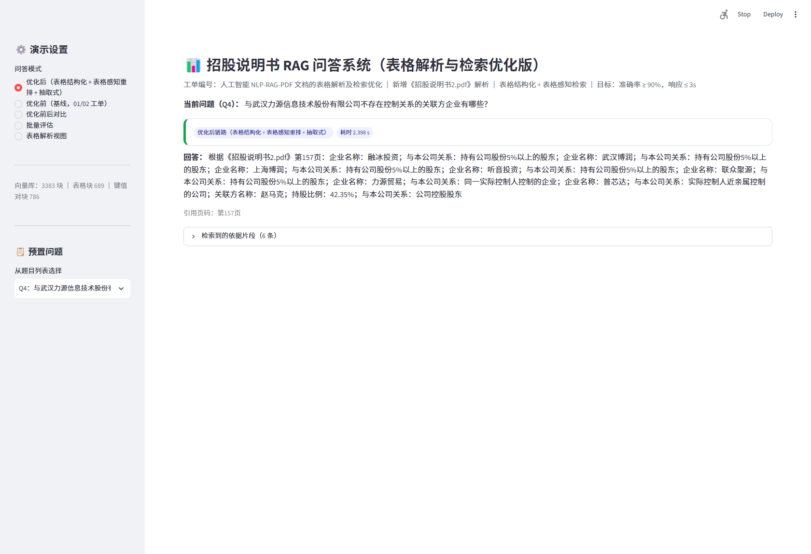
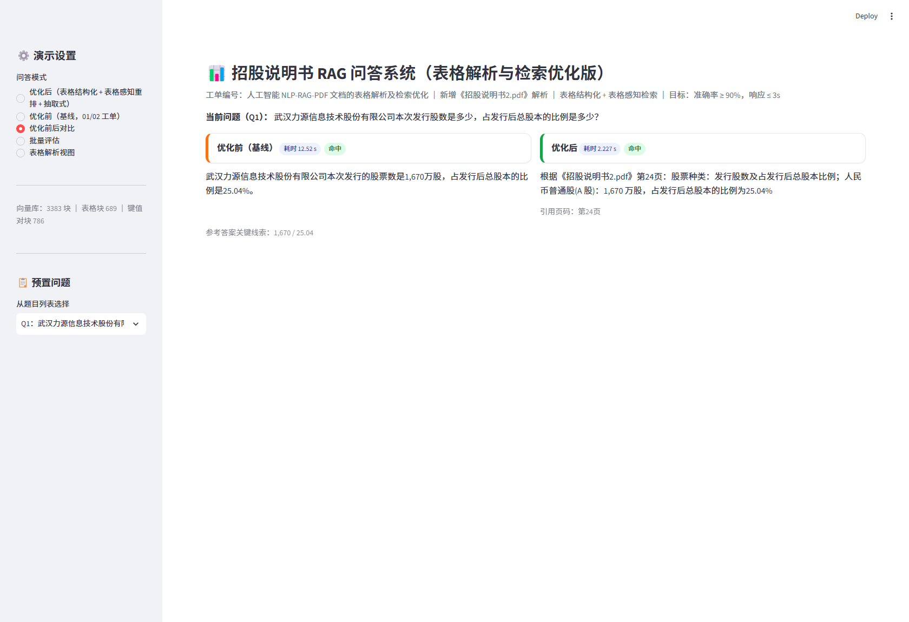
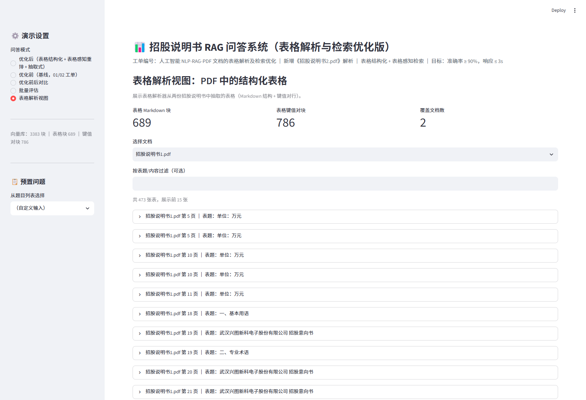

# 部署 · 03 用户手册

> 工单编号：人工智能NLP-RAG-PDF 文档的表格解析及检索优化

---

## 1. 界面总览

启动 `streamlit run app.py` 后打开 `http://localhost:8501`。
左侧为**演示设置**（问答模式 + 预置问题），右侧为主工作区。

侧边栏底部实时显示向量库规模：`N 块 ｜ 表格块 N ｜ 键值对块 N`。

---

## 2. 五种问答模式

| 模式 | 说明 | 适用 |
|---|---|---|
| **优化后（表格结构化 + 表格感知重排 + 抽取式）** | 本工单最终链路 | 日常问答、验收演示 |
| 优化前（基线，01/02 工单） | 表格拍平 + LLM 生成 | 对比参照 |
| 优化前后对比 | 同题并排 + 命中判定 | 展示优化效果 |
| 批量评估 | 一键跑 14 题，实时准确率/耗时 | 验收、回归 |
| 表格解析视图 | 浏览知识库结构化表格 | 展示表格解析能力 |

---

## 3. 单题问答（优化后）

1. 左侧「问答模式」选 **优化后**；
2. 从「预置问题」下拉选择一题（或直接输入问题）；
3. 主区返回：
   - **回答**：按"字段：取值"结构化拼装；
   - **引用页码**：如"第24页"；
   - **依据片段**（可折叠）：来源文档、页码、块类型、得分。

**示例（Q1）**：

> 根据《招股说明书2.pdf》第24页：股票种类：发行股数及发行后总股本比例；
> 人民币普通股(A 股)：1,670 万股，占发行后总股本的比例为25.04%

**枚举型示例（Q4 · 不存在控制关系的关联方）**：整表罗列，零幻觉可溯源。

---

## 4. 前后对比

选「优化前后对比」，同题并排展示：

- 左（橙）：优化前基线答案 + 耗时 + 命中/未命中标签；
- 右（绿）：优化后答案 + 耗时 + 命中/未命中标签；
- 底部给出"参考答案关键线索"。

---

## 5. 批量评估

选「批量评估」→ 点「开始批量评估（14 题）」：
表格逐题列出优化前/后命中与耗时，底部三项指标卡：

- 优化前答案准确率（含 x/14）；
- 优化后答案准确率（含 x/14）；
- 优化后平均耗时（含总耗时）。

---

## 6. 表格解析视图

选「表格解析视图」：

- 顶部三指标：表格 Markdown 块数 / 键值对块数 / 覆盖文档数；
- 选择文档 → 过滤框（按表题/内容）→ 展开查看每张表的 Markdown 结构；
- 底部展示键值对块示例（"表头：取值"强绑定）。

---

## 7. 提问技巧

| 技巧 | 示例 |
|---|---|
| **带公司名**（多文档消歧的关键） | "武汉力源信息技术股份有限公司本次发行股数是多少？" |
| 问数值带单位语境 | "注册资本是多少？" / "占比分别是多少？" |
| 枚举用"哪些" | "不存在控制关系的关联方企业有哪些？" |
| 中英文均可 | "What is the registered capital?"（以中文为主） |

> **重要**：知识库同时含两份招股说明书。提问时带上公司名（或其简称"力源/兴图"），
> 系统据此**路由到正确文档**，避免"问力源却答兴图"的跨文档串味。

---

## 8. 答案可信度判定

| 信号 | 含义 |
|---|---|
| 引用页码 | 答案出处，可翻 PDF 核对 |
| 依据片段（score） | 检索得分，越高越相关 |
| 块类型 `table_kv` | 来自表格键值对，适合数值型问题 |
| "根据招股说明书内容无法回答" | 知识库确无答案，**未编造** |