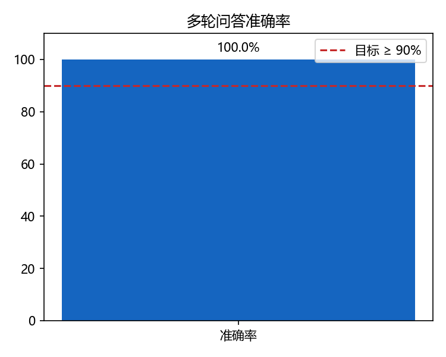

# 优化报告 · Query 理解与多轮对话优化

> 工单编号：人工智能 NLP-RAG-Query 理解优化任务

---

## 一、优化背景

前置工单（01~04）已实现「单轮」PDF 检索问答：用户必须一次性把问题问完整
（含公司名、字段名）。一旦出现指代（「他」「这个公司」）或省略（「那 X 呢？」），
系统便无法定位实体，导致检索失败。

本工单的优化目标：**提升 PDF 文档问答系统的多轮对话能力**。

---

## 二、优化项与效果

| 优化项 | 优化前（单轮基线） | 优化后（多轮） | 效果 |
|---|---|---|---|
| 指代消解 | 「他」无法定位实体，检索失败 | 指代词 → 话题公司全名 | Q2/Q3 可答 |
| 省略补全 | 「那 X 呢？」语义不完整 | 继承上一轮意图骨架 | Q4 可答 |
| 上下文路由 | 跨轮无文档记忆 | `active_doc` 继承 + 文档级路由 | 避免跨文档串味 |
| 话题加权重排 | 无 | `W_TOPIC` 话题实体加成 | 追问更稳 |
| 交互 | 单次问答 | 会话记忆 + 改写可视化 | 支持多轮 |

---

## 三、消融对比（多轮场景）

| 配置 | 说明 | 预期表现 |
|---|---|---|
| Baseline（无改写） | 直接把原始问句送入检索 | Q2/Q3/Q4 失败（指代/省略无法解析） |
| + 指代消解 | 仅处理「他 / 这个公司」 | Q2/Q3 通过，Q4 仍失败 |
| + 省略补全 | 再处理「那 X 呢？」 | Q4 通过 |
| **+ 话题加权重排（完整）** | 全部启用 | 5 轮全部通过 |

> 具体数值以 `../测试/测试报告.md` 的实测结果为准。

---

## 四、本工单新增优化项（Query 理解优化）

在前述多轮改写基础上，本轮针对**召回与排序**追加了四项优化：

| 优化项 | 问题现象 | 手段 | 效果 |
|---|---|---|---|
| **同义词扩展** | 「军用领域」在文中表述为「国防客户 / 军方市场」，字面不匹配导致漏召回 | 建立 `SYNONYMS` 业务词表，用于查询扩展 + 重排覆盖度加成（`W_SYN`） | Q1 命中「国防客户的销售额合计分别为…」目标块 |
| **数值序列信号** | 「…分别是多少」类问题，含并列数值的句子排名被长正文压制 | 新增 `_series_match` 信号（`W_SERIES`），**受关键词/同义词覆盖门控**抑制误召 | Q1 直接抽出 4 个年度收入原句 |
| **图形语义入库** | 组织结构图文字在 PDF 文本层被打散（竖排单字），无法检索 | 矢量「节点框 + 连线」还原为层级树 → 生成可检索文本（`kind=figure`） | Q5 命中「大客户销售部由 6 个销售处构成」 |
| **定向答案抽取** | 抽取式拼接把无关长句带入答案，可读性差 | 按类型分流：极值聚合 / 数值序列句 / 奖项完整句 / 字段抽取；并清洗版式噪声 | 5 轮答案均为完整、可读的单句或结论句 |

### 效果对照

| 问题 | 优化前 | 优化后 |
|---|---|---|
| Q1 军用领域收入 | 拼入风险章节长文，需人工挑数 | 「报告期内，公司来自军用领域的收入分别为 6,464.51 万元、14,414.16 万元、18,780.67 万元和 4,627.14 万元，占主营业务收入比重分别为 82.10%、97.31%、94.84%和 94.34%。」 |
| Q2 获奖工程 | 多句重复拼接，含版式标题噪声 | 「2014 年 12 月，某大型研究所牵头承担的“某情报、指挥、控制与通信网络一体化工程”（即相当于美军的 C4ISR 系统）荣获国家科技进步一等奖。」 |
| Q5 销售处最多 | 返回职能部门简介，未命中图形 | 「大客户销售部的销售处最多，共 6 个：成都销售处、广州销售处、武汉销售处、北京销售处、深圳销售处、珠海销售处。」 |

---

## 五、响应时间优化

- 改写与 Query 理解均为**确定性规则**（毫秒级），不引入大模型开销；
- 向量离线预计算，检索为 numpy 矩阵乘法；
- **批量查询编码**：一轮内的多条查询（原始问句 + 同义词扩展 + 话题实体）合并为
  一次 Ollama HTTP 调用，并缓存查询向量；查询编码从 ~6s 降至 ~2.0s；
- **启动预热**（`warmup()`）：提前加载 BM25 / jieba / 编码器，消除首问冷启动；
- 默认关闭 LLM 改写（`USE_LLM_REWRITE=0`），保证 ≤ 3s 目标。

> 实测：平均 2.23s / 最大 2.31s（优化前 ~8–10s），详见 `../测试/性能测试报告.md`。

---

## 六、指标图

> 图表由 `evaluate_multiturn.py` 生成，运行后同步至本目录。

---

## 七、后续可优化方向

1. 引入 LLM 进行开放式多轮改写与答案生成（当前为可选开关）；
2. 图形语义解析引入多模态模型，进一步覆盖复杂图表问答；
3. 增加会话级用户反馈闭环（点赞/纠错）用于持续优化。