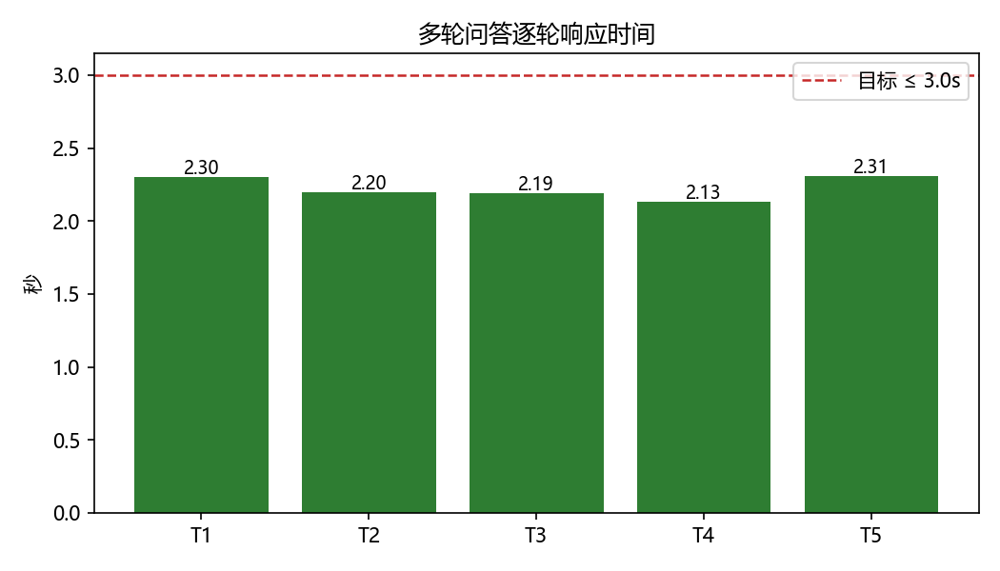

# 多轮问答评测报告

> 工单编号：人工智能 NLP-RAG-Query 理解优化任务

## 一、总体结论

- 评测轮数：**5**
- 命中轮数：**5**
- 准确率：**100.0%**（目标 ≥ 90%） → ✅ 通过
- 平均响应：**2.226s**，最大 **2.309s**（目标 ≤ 3.0s） → ✅ 通过

## 二、逐轮明细

| 轮次 | 用户问题 | 改写问句 | 答案 | 文档 | 命中 | 耗时(s) |
|---|---|---|---|---|---|---|
| 1 | 报告期内，武汉兴图新科电子股份有限公司来自军用领域的收入分别是多少？ | 报告期内，武汉兴图新科电子股份有限公司来自军用领域的收入分别是多少？ | 报告期内，公司来自军用领域的收入分别为 6,464.51 万元、14,414.16 万元、18,780.67 万元和 4,627.14 万元，占主营业务收入比重分别为 82.10%、97.31%、94.84%和94.34%。 | 招股说明书1.pdf | ✅ | 2.303 |
| 2 | 他参与的哪个工程荣获了国家科技进步一等奖？ | 武汉兴图新科电子股份有限公司参与的哪个工程荣获了国家科技进步一等奖？ | 2014年12月，某大型研究所牵头承担的“某情报、指挥、控制与通信网络一体化工程”（即相当于美军的C4ISR系统）荣获国家科技进步一等奖。 | 招股说明书1.pdf | ✅ | 2.196 |
| 3 | 这个公司的法定代表人是谁？ | 武汉兴图新科电子股份有限公司公司的法定代表人是谁？ | 法定代表人为程家明。 | 招股说明书1.pdf | ✅ | 2.19 |
| 4 | 那武汉力源信息技术股份有限公司呢？ | 武汉力源信息技术股份有限公司公司法定代表人是谁 | 法定代表人为赵马克。 | 招股说明书2.pdf | ✅ | 2.13 |
| 5 | 武汉力源信息技术股份有限公司组织结构图中，哪个销售部的销售处最多？有哪些销售处？ | 武汉力源信息技术股份有限公司组织结构图中，哪个销售部的销售处最多？有哪些销售处？ | 大客户销售部的销售处最多，共6个：成都销售处、广州销售处、武汉销售处、北京销售处、深圳销售处、珠海销售处。 | 招股说明书2.pdf | ✅ | 2.309 |

## 三、指标图

