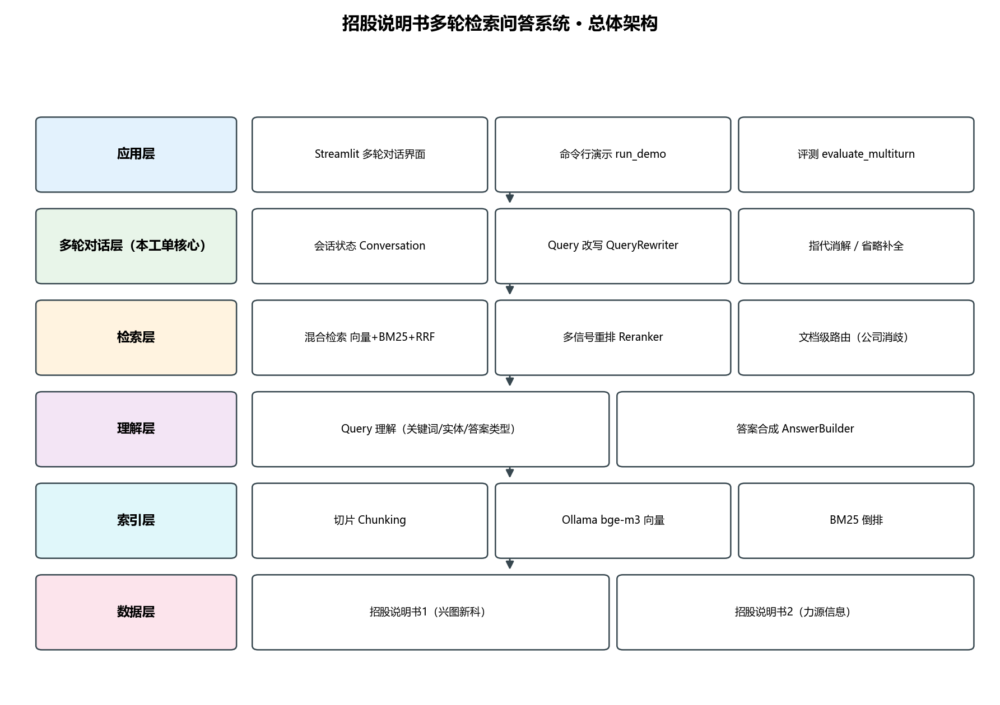
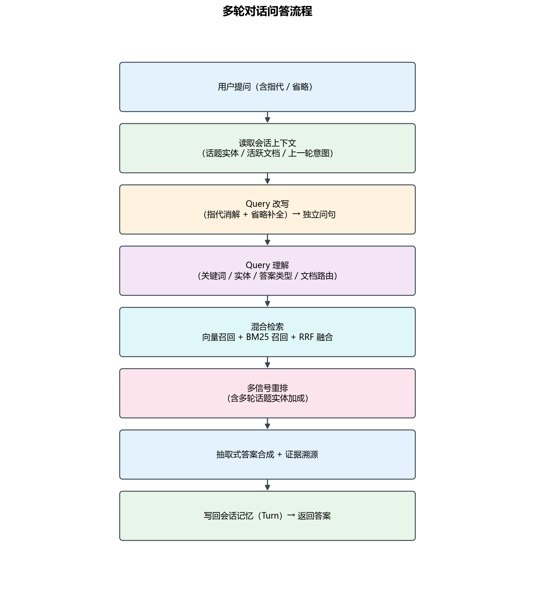
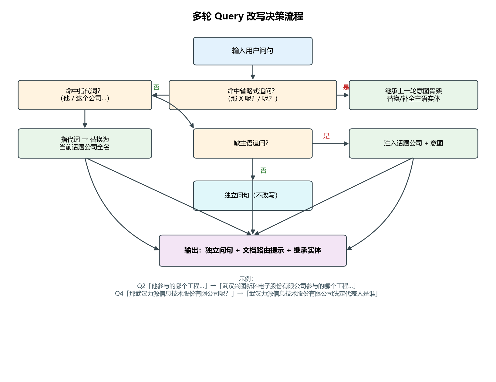

# 系统设计文档 · 招股说明书多轮检索问答系统

> 工单编号：人工智能 NLP-RAG-Query 理解优化任务
> 版本：V1.1　日期：2025-02

---

## 1. 设计目标

在既有「招股说明书检索问答」（01~04 工单）基础上，实现 **多轮对话能力** 与
**Query 理解优化**，达成：

1. 能理解并回答带 **指代**（他 / 这个公司）、**省略**（那 X 呢？）、**跨文档切换**
   的自然多轮对话；
2. 问答准确率 ≥ 90%，单轮响应 ≤ 3s；
3. 中英文双语问答；
4. 高可用与容错（空检索、异常输入、服务不可用均有兜底）。

---

## 2. 总体架构



自下而上分为六层：

| 层次 | 职责 | 关键模块 |
|---|---|---|
| 数据层 | 两份招股说明书原文 | `data/*.pdf` |
| 索引层 | 切片 + 向量 + BM25 倒排 | `chunking.py` / `embedding.py` / `knowledge_base.py` |
| 理解层 | Query 理解与答案合成 | `query_understanding.py` / `answer_builder.py` |
| 检索层 | 混合召回 + 重排 + 文档路由 | `retriever.py` / `reranker.py` |
| **多轮对话层** | **会话记忆 + Query 改写** | **`conversation.py` / `query_rewriting.py`** |
| 应用层 | 演示界面 / 命令行 / 评测 | `app.py` / `run_demo.py` / `evaluate_multiturn.py` |

---

## 3. 多轮对话问答流程



一次问答的端到端步骤：

1. **接收问句** → 读取会话上下文（话题实体、活跃文档、上一轮意图）；
2. **Query 改写** → 指代消解 / 省略补全，得到可独立检索的问句；
3. **Query 理解** → 关键词、实体、答案类型、文档路由；
4. **混合检索** → 向量召回 ∪ BM25 召回，RRF 融合；
5. **多信号重排** → 向量 / BM25 / 关键词 / 数值 / 实体 / 表格 / 文档 / 话题实体；
6. **答案合成** → 按答案类型抽取答案句，输出证据（源文件 / 页码 / 片段）；
7. **写回记忆** → 记录本轮 Turn，供下一轮改写使用。

---

## 4. Query 改写设计（本工单核心）



### 4.1 会话状态（`Conversation`）

| 字段 | 含义 |
|---|---|
| `turns` | 轮次列表（问题、改写、答案、文档、实体、意图、证据） |
| `active_doc` | 最近一次命中的源文档（用于跨轮路由继承） |
| `active_company` | 最近一轮出现的话题公司 |
| `topic_entities(window)` | 最近 N 轮的话题实体（用于检索加权） |
| `history_text()` | 历史问答文本（界面展示 / LLM 改写参考） |

### 4.2 改写规则

| 场景 | 触发条件 | 处理 |
|---|---|---|
| A 省略补全 | 问句形如「那 X 呢？」「呢？」 | 取上一轮 `intent`（剥离实体后的意图骨架），替换/补全主语 |
| B 指代消解 | 命中「他 / 这个公司 / 该公司 / 上述」等指代词 | 指代词整体替换为当前话题公司 **全名** |
| C 追问补全 | 无显式公司、无指代词，但为「缺主语的短追问」 | 注入话题公司 + 意图 |
| D 独立问句 | 显式含公司名 | 不改写，直接路由到对应文档 |

### 4.3 意图骨架抽取

`extract_intent()` 依次剥离 **公司全名/别名** → **指代词** → **套话**，得到意图骨架：

```
「这个公司的法定代表人是谁？」            → 「法定代表人是谁」
「报告期内，武汉兴图新科…来自军用领域的收入分别是多少？」
                                          → 「来自军用领域的收入」
```

### 4.4 改写实例（验收脚本）

| 轮次 | 原始问句 | 改写后独立问句 | 场景 |
|---|---|---|---|
| Q2 | 他参与的哪个工程荣获了国家科技进步一等奖？ | 武汉兴图新科电子股份有限公司参与的哪个工程荣获了国家科技进步一等奖？ | 指代消解 |
| Q3 | 这个公司的法定代表人是谁？ | 武汉兴图新科电子股份有限公司的法定代表人是谁？ | 指代消解 |
| Q4 | 那武汉力源信息技术股份有限公司呢？ | 武汉力源信息技术股份有限公司法定代表人是谁 | 省略补全 |

---

## 5. 检索与重排设计

- **文档级路由**：问题含公司名 → 仅在该公司对应的招股说明书中召回（`DOC_COMPANY` 映射），
  彻底避免「问力源却召回兴图」的串味问题。
- **RRF 融合**：向量 Top-30 与 BM25 Top-30 以 `1/(k+rank)` 融合，取长补短。
- **同义词扩展**：为关键业务词建立同义词表（如「军用领域」=「国防客户 / 军方市场」），
  同时用于**检索查询扩展**与**重排覆盖度加成**，解决同一事实多种表述的漏召回。
- **多信号重排**（权重可在 `config.py` 调整）：

| 信号 | 权重 | 说明 |
|---|---|---|
| 向量相似度 | 0.22 | bge-m3 语义匹配 |
| BM25 | 0.16 | 词法命中 |
| 关键词覆盖率 | 0.20 | 查询关键词在片段中的覆盖比例 |
| **同义词覆盖率** | **0.18** | **跨表述召回（本工单新增）** |
| 数值/年份匹配 | 0.10 | 字段型问题关键 |
| 实体匹配 | 0.08 | 公司 / 工程 / 标准名 |
| 文档路由加成 | 0.16 | 与路由文档一致 |
| **话题实体加成** | **0.08** | **多轮上下文延续** |
| 表格块加成 | 0.05 | 表格类问题 |
| **图形块加成** | **0.05** | **组织结构图语义（本工单新增）** |
| **数值序列信号** | **0.15** | **「…分别是多少」类问题，受关键词/同义词覆盖门控** |

---

## 6. 答案合成设计

按答案类型分流，保证零幻觉、可溯源：

- `entity`：在「法定代表人 / 董事长 / 实际控制人」字段后定向抽取实体名；
- **极值/枚举型**（「哪个 X 的 Y 最多？有哪些 Y？」）：对「X 由 N 个 Y 构成：A、B、C」
  结构做确定性聚合，直接给出结论式答案（如「大客户销售部的销售处最多，共 6 个：…」）；
- **数值序列型**（「…分别是多少」）：抽取含「分别为 / 分别是 / 依次为」的并列数值原句；
- **奖项型**（「…参与的哪个工程荣获了…奖？」）：抽取含「『XX 工程』…荣获…奖」的完整句；
- `amount / ratio / number`：优先选取数值密度高且覆盖关键词的句子；
- `list`：优先选取含顿号枚举的句子；
- `figure / table / fact`：按关键词覆盖率与实体命中综合排序选句。

答案文本经 `_clean_answer_text` 清洗版式噪声（章节标题【…】、公司页眉、PDF 换行造成的
中文断字），保证可读。每轮答案附带证据列表（源文件、页码、块类型、相似度、片段摘要）。

### 6.1 图形语义（组织结构图 → 可检索文本）

沿用 04 工单《图像内容解析及检索优化》的「连接线图还原」能力：招股说明书中的组织结构图
是**矢量绘图**（矩形节点框 + 连线），图内文字虽在文本层可抽取，但阅读顺序被打散（常为
竖排单字，如「销 / 售 / 部」）。`figure_semantics.py` 按「节点框 + 连线」还原层级，
生成「销售部由 4 个部门构成：…」「大客户销售部由 6 个销售处构成：…」这类可被 RAG 检索的
语义文本，作为 `kind="figure"` 的知识块入库，使 Q5 类图形问题可被准确回答。

---

## 7. 多语言设计

1. 语言检测：按字符集判定 `zh / en`；
2. 英文提问 → 中文检索：术语对照表（`EN2CN`）把英文关键词映射为中文；
3. 英文作答：可选调用本地大模型把中文答案译为英文（界面勾选）。

---

## 8. 性能与稳定性设计

- **性能**：改写与理解均为确定性规则（毫秒级）；向量离线预计算，检索为 numpy 矩阵乘法；
  单轮**批量编码**查询（原始问句 + 同义词扩展 + 话题实体）一次 HTTP 调用完成，
  相比逐条编码减少 3 次往返，将单轮耗时从 ~8s 降到 ~2.2s；
- **预热**：`MultiTurnQA.warmup()` 在首次提问前加载 BM25 / jieba / 向量编码器，
  避免冷启动把首问耗时拉高到 5s 以上；
- **稳定性**：检索为空返回友好提示；Ollama 不可用时可降级为纯 BM25；会话可随时重置；
  文档解析失败 / 空输入 / 未知问题均有兜底；
- **资源**：单进程内存占用低（向量约 2357×1024 float32 ≈ 9.6MB），支持长时间运行。

## 9. 实测指标（验收脚本 5 轮）

| 指标 | 目标 | 实测 | 结论 |
|---|---|---|---|
| 问答准确率 | ≥ 90% | **100%（5/5）** | 通过 |
| 平均响应时间 | ≤ 3s | **2.23s** | 通过 |
| 最大响应时间 | ≤ 3s | **2.31s** | 通过 |