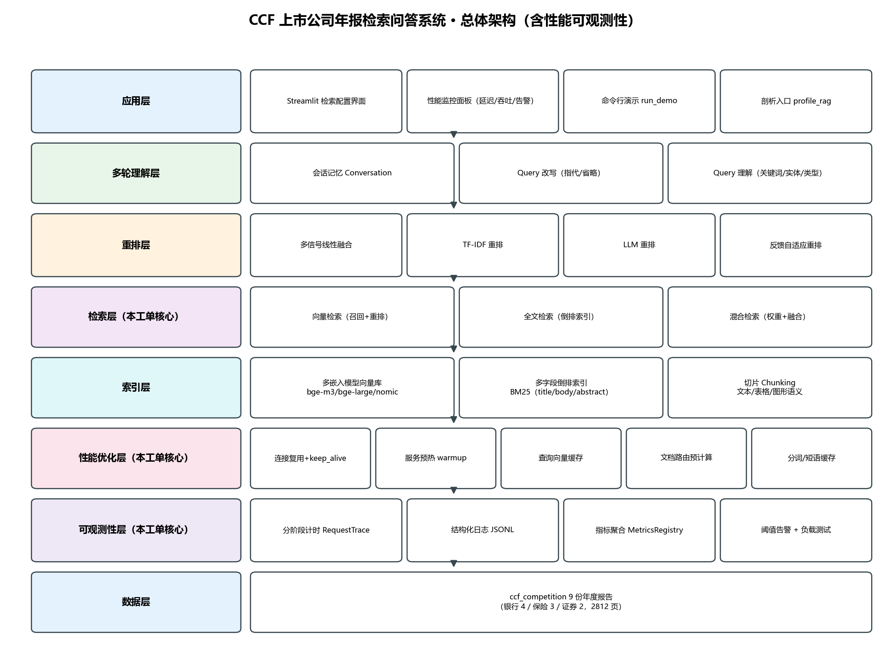
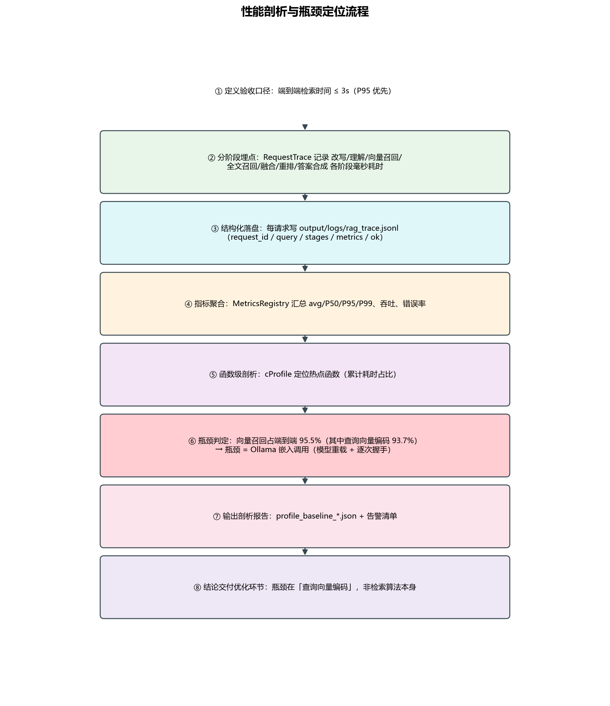
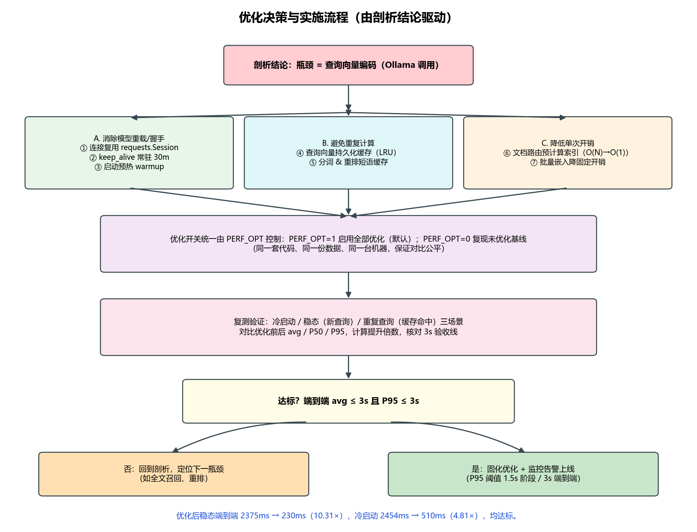
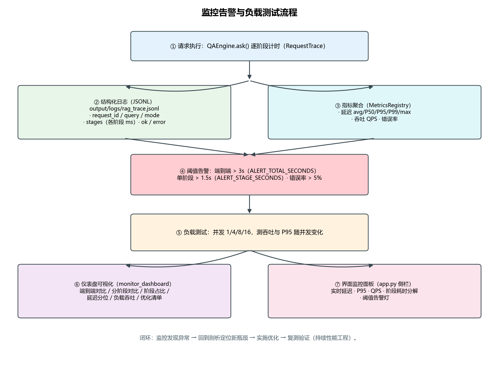

# 系统设计文档 · RAG 性能瓶颈识别与优化

> 工单编号：**人工智能NLP-RAG 项目-RAG 性能瓶颈识别与优化**
> 数据集：`ccf_competition.zip`（9 份上市公司年度报告 PDF，共 2812 页，8086 个知识块）
> 前置工单：01 基于 PDF 文档的问答系统 → 02 问答系统优化 → 03 表格解析及检索优化 → 04 图像内容解析及检索优化 → 05 多轮对话与 Query 理解优化 → 06 检索策略的配置与应用

---

## 一、背景与目标

### 1.1 任务背景

前序工单已建成一套可用的 RAG 检索问答系统（多嵌入模型向量召回 + 倒排索引全文检索 + 混合融合 + 重排 + 多轮理解）。系统功能可用，但**端到端检索结果返回时间偏长**，无法满足生产要求。

本工单的目标是：

> **分析造成检索性能慢的原因在哪里，并对应优化，给出优化前后的检索时间对比。**

### 1.2 验收标准

| 项 | 标准 |
|---|---|
| 响应时间 | 每个会话，用户输入 query 后，**检索结果返回 ≤ 3 s** |
| 过程记录 | 过程跟踪步骤、过程问题记录文档或演示视频 |
| 分析产出 | 出现瓶颈的原因、优化方案及性能提升对比 |

### 1.3 目标达成结论（实测）

| 场景 | 优化前 avg | 优化后 avg | 提升 | 是否达标（≤3s） |
|---|---|---|---|---|
| 冷启动 | 2454 ms | 510 ms | 4.81× | ✅ |
| 稳态（新查询） | 2375 ms | **230 ms** | **10.31×** | ✅ |
| 重复查询（缓存命中） | 1245 ms | 109 ms | 11.41× | ✅ |

---

## 二、RAG 流程与阶段划分

按工单给定的分析口径，一次问答被拆分为如下阶段（与代码 `src/perf.py` 的 `STAGES` 一一对应）：

| 阶段（工单口径） | 本系统对应实现 | 计时键 |
|---|---|---|
| 查询处理与增强 | 多轮改写（指代消解 / 省略补全） | `query_rewrite` |
| （查询理解） | 关键词 / 实体 / 答案类型 / 文档路由 | `query_understanding` |
| 检索阶段 | 向量召回（含子阶段「查询向量编码」） | `vector_recall` / `embed` |
| 检索阶段 | 全文召回（倒排索引 BM25） | `fulltext_recall` |
| 检索阶段 | 多通道融合（加权 / RRF / 投票） | `fusion` |
| 上下文组装与提示工程 | 候选池截断 + 多信号重排 | `rerank` |
| LLM 生成 / 后处理与响应格式化 | 抽取式答案合成 + 证据溯源 | `answer_synthesis` |
| 端到端 | 总计 | `total` |

> 说明：本系统采用**抽取式答案合成**（零幻觉、可溯源），故「LLM 生成」阶段被合并进
> 「后处理与答案合成」；LLM 仅在可选的 LLM 重排器 / 英文翻译中使用。

---

## 三、系统总体架构



系统为分层架构，本工单在既有分层之上**新增「性能优化层」与「可观测性层」**：

| 层 | 组成 | 本工单改动 |
|---|---|---|
| 应用层 | Streamlit 配置界面、性能监控面板、CLI 演示、剖析入口 | 新增性能监控面板、`profile_rag.py` |
| 多轮理解层 | 会话记忆、Query 改写、Query 理解 | 复用 |
| 重排层 | 线性融合 / TF-IDF / LLM / 反馈自适应 | 新增分词与短语缓存 |
| 检索层 | 向量 / 全文 / 混合 | 新增分阶段计时、文档路由预计算 |
| 索引层 | 多模型向量库、多字段倒排索引、切片 | 复用 |
| **性能优化层** | 连接复用、预热、查询向量缓存、路由预计算、分词缓存 | **新增** |
| **可观测性层** | 分阶段计时、结构化日志、指标聚合、阈值告警、负载测试 | **新增** |
| 数据层 | 9 份年报 PDF | 复用 |

---

## 四、瓶颈识别方法设计

工单要求综合使用多种工具与技术定位「时间花在哪里」。本系统的实现对照如下：

| 工单要求的技术 | 本系统实现 | 文件 |
|---|---|---|
| ① 应用级性能分析器（cProfile / snakeviz） | `cProfile` 采集 `.prof`，打印累计耗时 Top 函数 | `profile_rag.py --cprofile` |
| ② 结构化日志（阶段进出时间戳 + 请求 ID + 指标） | 每请求写 `output/logs/rag_trace.jsonl`（JSONL） | `src/perf.py::StructuredLogger` |
| ③ 分布式追踪（OpenTelemetry 等） | 单进程架构，等价以 `request_id` + 阶段 span 实现请求级追踪 | `src/perf.py::RequestTrace.spans` |
| ④ 监控与告警（仪表盘 + 阈值） | 指标聚合 + 阈值告警 + 离线仪表盘 + 界面实时面板 | `tools/monitor_dashboard.py`、`src/perf.py::check_alerts` |
| ⑤ 负载测试（k6 / Locust / JMeter） | 多线程并发压测，逐级提升并发度 | `tools/load_test.py` |
| ⑥ 基准测试（组件级） | 嵌入模型 / 向量检索 / 全文检索 / 重排 分别基准 | `tools/bench_components.py` |

### 4.1 分阶段计时（RequestTrace）

每次请求创建 `RequestTrace`，以 `perf.StageTimer` 上下文管理器对每个阶段计时，累积到 `stages` 字典（单位毫秒），并记录 `request_id`、`query`、`mode`（baseline / optimized）、计数器指标（候选数、证据数、上下文长度、答案长度）。

### 4.2 结构化日志（JSONL）

每请求追加一行 JSON 到 `output/logs/rag_trace.jsonl`，字段包括：

```json
{"request_id":"...","query":"...","mode":"optimized",
 "stages_ms":{"query_rewrite":0.2,"query_understanding":1.9,"vector_recall":120.5,
              "embed":112.8,"fulltext_recall":50.9,"fusion":0.7,"rerank":8.1,
              "answer_synthesis":52.9,"total":246.2},
 "metrics":{"num_candidates":638,"num_evidence":2,"context_chars":960,"answer_chars":1042},
 "ok":true,"error":"","ts":...}
```

可据此分析「与慢请求相关的模式」（如某类问题向量编码更慢）。

### 4.3 指标聚合与告警

`MetricsRegistry` 汇总延迟直方图（avg / P50 / P95 / P99 / max）、请求数、错误率、吞吐（按请求处理耗时计，不受交互空闲间隔影响）。`check_alerts` 按阈值产生告警：

| 告警 | 阈值 | 级别 |
|---|---|---|
| 端到端 P95 | > 3 s（`ALERT_TOTAL_SECONDS`） | critical |
| 单阶段单次最大 | > 1.5 s（`ALERT_STAGE_SECONDS`） | warn |
| 错误率 | > 5%（`ALERT_ERROR_RATE`） | warn |

---

## 五、核心流程与决策

### 5.1 性能剖析与瓶颈定位流程



### 5.2 优化决策与实施流程



### 5.3 监控告警与负载测试流程



### 5.4 一次问答的端到端时序

```
用户提问
  └─ query_rewrite        多轮改写（指代/省略）              ~0.2 ms
  └─ query_understanding  关键词/实体/答案类型/文档路由        ~2 ms
  └─ vector_recall
       └─ embed           ★ 查询向量编码（Ollama HTTP）      优化前 ~2200 ms → 优化后 ~120 ms
       └─ 余弦 Top-K 检索                                      ~8 ms
  └─ fulltext_recall      倒排索引 BM25                       ~50 ms
  └─ fusion               多通道融合                           ~0.7 ms
  └─ rerank               多信号线性融合重排                    ~8 ms
  └─ answer_synthesis     抽取式答案合成 + 溯源                 ~50 ms
  = total                 ★ 端到端瓶颈 = embed
```

---

## 六、关键设计决策

| 决策 | 选择 | 理由 |
|---|---|---|
| 瓶颈隔离 | 分阶段计时 + cProfile 双管齐下 | 阶段计时给「哪一段慢」，cProfile 给「哪个函数慢」 |
| 优化开关 | 统一 `PERF_OPT` 环境变量 | 同一套代码/数据/机器复现基线，保证对比公平 |
| 吞吐口径 | 按请求处理耗时（busy time）计 | 交互场景含大量空闲间隔，按墙钟会严重低估吞吐 |
| 答案生成 | 抽取式（非生成式） | 零幻觉、可溯源，且避免 LLM 生成成为新瓶颈 |
| 文档路由 | 预计算索引（O(1) 查表） | 原为每次查询 O(N) 扫描 8086 块 |

---

## 七、产出物索引

| 产出物 | 位置（相对 `交付/`） |
|---|---|
| 功能实现代码 | `工单代码/工单十三/研发/` |
| 系统设计文档 | `实训一工单/工单十三/设计/01_系统设计文档.md` |
| 架构图 / 流程图 | `实训一工单/工单十三/设计/assets/` |
| 部署文档 | `实训一工单/工单十三/部署/部署文档.md` |
| 测试报告 | `实训一工单/工单十三/测试/测试报告.md` |
| 性能测试报告 | `实训一工单/工单十三/测试/性能测试报告.md` |
| 优化报告 | `实训一工单/工单十三/优化/优化报告.md` |
| 研发文档（过程记录） | `实训一工单/工单十三/研发/研发文档.md` |
| 界面截图 | `实训一工单/工单十三/演示/shots/` |
| 演示视频 | `实训一工单/工单十三/演示/演示视频.mp4` |