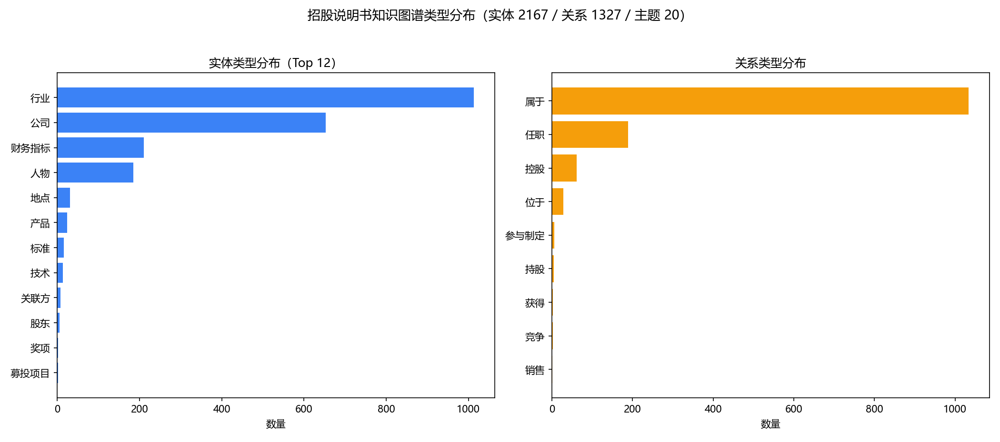

# 知识图谱说明（招股说明书领域图谱）

- 工单编号：人工智能NLP-RAG项目-LightRAG优化
- 构建时间：2026-10-08 19:23:33
- 规模：实体 **2167** 个，关系 **1327** 条，主题（社区）**20** 个
- 嵌入模型：bge-m3（1024 维）
- 覆盖文档：兴图新科、力源信息
- 抽取方式：规则抽取（全量 2357 块）+ LLM 抽取（精选 150 块，deepseek-r1:1.5b）

## 1. 实体类型分布

| 实体类型 | 数量 |
|---|---|
| 行业 | 1013 |
| 公司 | 653 |
| 财务指标 | 210 |
| 人物 | 185 |
| 地点 | 31 |
| 产品 | 24 |
| 标准 | 16 |
| 技术 | 14 |
| 关联方 | 8 |
| 股东 | 5 |
| 奖项 | 2 |
| 募投项目 | 2 |
| 客户 | 2 |
| 资质 | 1 |
| 供应商 | 1 |

## 2. 关系类型分布

| 关系类型 | 数量 |
|---|---|
| 属于 | 1033 |
| 任职 | 189 |
| 控股 | 61 |
| 位于 | 28 |
| 参与制定 | 6 |
| 持股 | 5 |
| 获得 | 2 |
| 竞争 | 2 |
| 销售 | 1 |

## 3. 领域 Schema（受控类型）

- 实体类型 16 类：公司、人物、产品、技术、行业、募投项目、标准、资质、奖项、地点、财务指标、股东、关联方、客户、供应商、政府机构
- 关系类型 18 类：控股、参股、持股、任职、生产、研发、采购、销售、竞争、位于、属于、获得、参与制定、投资、上游、下游、关联交易、担保

## 4. 落盘文件

- `graph_db/nodes.jsonl`：实体节点（名称/类型/描述/关键词/来源块/度）
- `graph_db/edges.jsonl`：关系边（起点/类型/终点/描述/关键词/来源块/权重）
- `graph_db/themes.jsonl`：高层次主题（社区）
- `graph_db/entity_vectors.npy` / `relation_vectors.npy` / `theme_vectors.npy`：三类描述向量
- `graph_db/graph_meta.json`：图谱元信息

