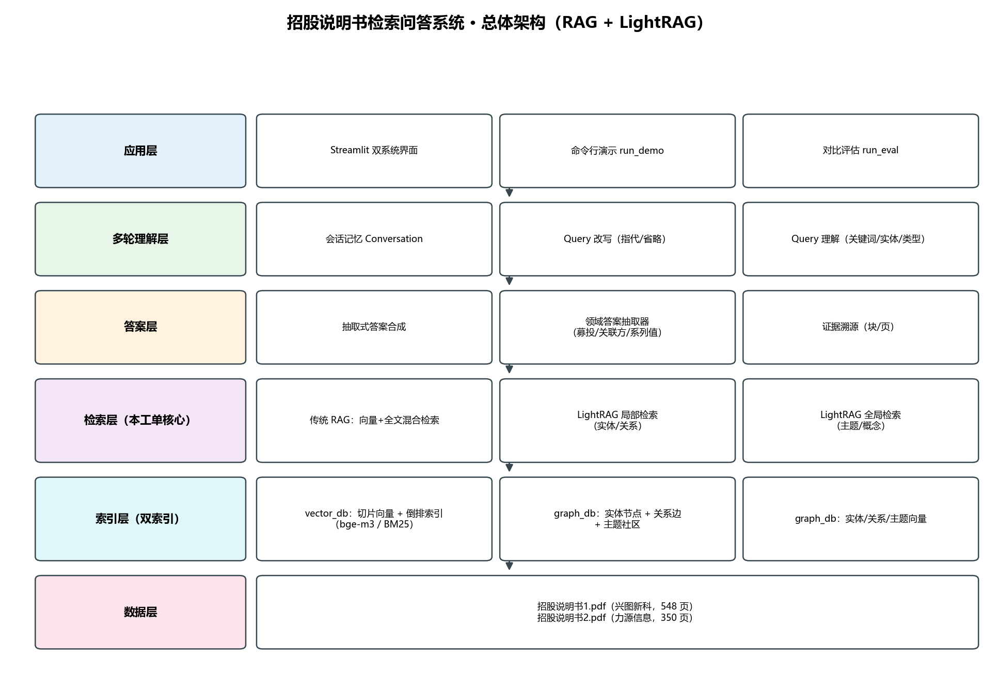
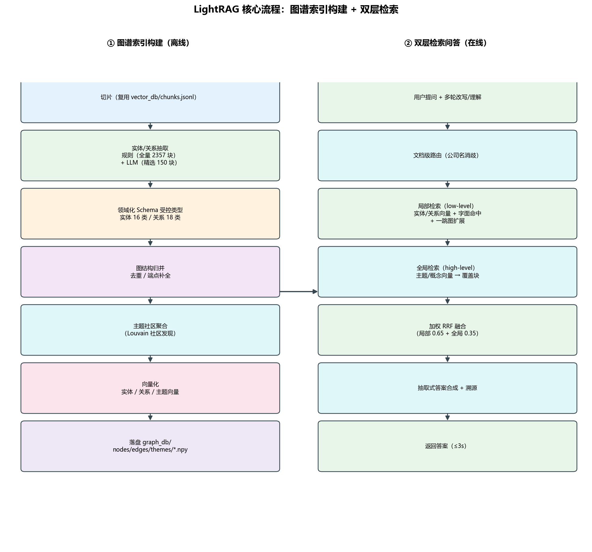
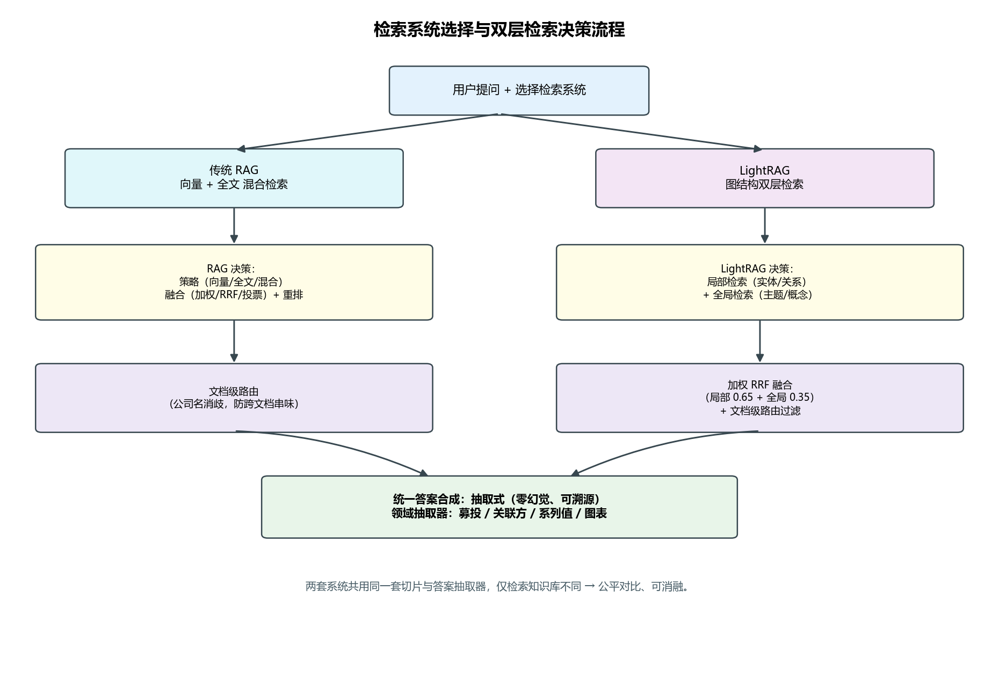

# 招股说明书多轮检索问答系统（LightRAG 优化）— 系统设计文档

- 工单编号：人工智能NLP-RAG项目-LightRAG优化
- 项目名称：RAG
- 创建时间：2025 年 8 月 26 日
- 交付日期：2026 年 10 月
- 数据集：《招股说明书1.pdf》（武汉兴图新科电子股份有限公司，548 页）、《招股说明书2.pdf》（武汉力源信息技术股份有限公司，350 页）

---

## 1. 任务背景与目标

传统 RAG 采用基于向量的扁平化数据表示，难以建模实体之间的复杂语义关系，在多实体关联推理中容易出现逻辑断层；且全量更新机制使知识库维护成本随数据规模增长。本工单在既有《01~07》所构建的**传统 RAG 系统**（多嵌入模型向量召回 + 倒排索引全文检索 + 混合融合 + 重排）之上，引入 **LightRAG** 思路：

1. **图结构索引**：从两份招股说明书中抽取**领域化的实体类型与关系类型**，构建知识图谱（本工单“优化”的核心）；
2. **双层检索**：低层次（具体实体/属性）+ 高层次（主题/概念）联合检索；
3. **增量更新**：新数据到来时按图差异（graph diff）只更新受影响部分，无需重建整库；
4. **对比评估**：对 16 道验收问题，比对传统 RAG 与 LightRAG 的检索结果，并用 **RAGAS 口径指标**整理二者差异。

**验收目标**：响应时间 ≤ 3s；图谱实体/关系抽取准确；给出 RAG 与 LightRAG 的检索结果与 RAGAS 指标对比。

---

## 2. 数据集与预处理

| 文档 | 公司 | 简称 | 页数 |
|---|---|---|---|
| 招股说明书1.pdf | 武汉兴图新科电子股份有限公司 | 兴图新科 | 548 |
| 招股说明书2.pdf | 武汉力源信息技术股份有限公司 | 力源信息 | 350 |

预处理链路（复用前序工单，针对本数据集校准）：

1. **PDF 解析**（`src/pdf_parser.py`）：pdfplumber 抽取正文与表格，保留页码、块类型（text/table）；
2. **图形语义**（`src/figure_semantics.py`）：把组织结构图等图内文本转成可检索文本（如“销售部由 N 个部门构成：……”）；
3. **结构感知切片**（`src/chunking.py`）：按 600 字符 / 100 重叠切块，过短片段合并；表格单独成块；
4. **多嵌入向量化**（`src/embedding.py`）：bge-m3（1024 维，默认）等，经 Ollama HTTP 离线推理；
5. **倒排索引**（`src/inverted_index.py`）：jieba 分词 + BM25，支持布尔/短语/模糊检索。

> 两公司同处“武汉·电子/信息”语境，故设计**文档级路由**（`config.DOC_COMPANY`）：问句中出现公司名或别名时，检索范围锁定到该文档，避免跨文档“串味”。

---

## 3. 系统总体架构



系统分为四层：

- **数据层**：PDF 原文 → 切片/表格/图形语义文本 → 向量库 `vector_db/` + 图谱库 `graph_db/`；
- **索引层**：
  - 传统 RAG 索引：多模型稠密向量 + 倒排索引；
  - **LightRAG 索引（本工单新增）**：实体节点 / 关系边 / 高层次主题，及实体、关系、主题三类向量；
- **检索层**：
  - 传统 RAG：向量通道 + 全文通道 → 融合（加权/RRF/投票）→ 线性融合重排；
  - LightRAG：局部（实体/关系 + 一跳扩展）+ 全局（主题）→ **三通道 RRF 融合** → 同一线性融合重排器；
- **应用层**：Streamlit 多轮对话界面（RAG/LightRAG 切换、检索证据与图证据展示、反馈重排）。

---

## 4. LightRAG 索引构建流程



对齐 LightRAG 的 index pipeline，落地为 `src/lightrag/`：

### 4.1 切片与知识抽取
复用 RAG 侧 `chunks.jsonl`；抽取采用**规则 + LLM 混合**（见 §6）。

### 4.2 图结构归并（`extractor.merge_triples` + `graph_store`）
- 实体按规范化 `name` 归并，类型取“首次出现且非兜底”的类型，来源块（chunk ids）累加；
- 关系按 `(source, type, target)` 归并，来源块累加；
- 关系端点若未成节点则**自动补节点**，保证图连通；
- `__SELF__` 占位端点解析为所在块所属公司名（发行人）。

### 4.3 主题（社区）聚合（`graph_store.build_themes`）
招股说明书实体图高度连通，若用“连通分量”会把全图并成 1~2 个巨簇，失去“广泛主题”区分度。故采用**社区发现**：

```
Louvain 社区发现（networkx.community.louvain_communities, seed=42）
  → 回退：贪心模块度 greedy_modularity_communities
  → 回退：连通分量
每个社区（≥ LR_THEME_MIN_SIZE 个节点）作为一个主题：
  title   = 社区内「度最高 / 名称最长」的核心实体
  summary = 社区内核心实体描述 + 关系描述拼接（供全局检索向量化）
  chunks  = 社区内实体来源块集合
```

### 4.4 向量化
- **实体描述向量**：`名称（类型）描述 关键词` → 局部检索；
- **关系描述向量**：`source 类型 target 描述` → 局部检索；
- **主题向量**：`title。summary` → 全局检索。

### 4.5 落盘（`graph_db/`）
`nodes.jsonl`、`edges.jsonl`、`themes.jsonl`、`entity_vectors.npy`、`relation_vectors.npy`、`theme_vectors.npy`、`graph_meta.json`。

### 4.6 增量更新（`LightRAGIndex.incremental_update`）
只对**新增切片**抽取，计算与既有图的差异（`GraphStore.diff`：新增/受影响节点与边），仅更新差异部分并重建主题与受影响向量（`apply_diff` + `_rebuild_vectors_incremental`），**无需重跑全量抽取**。

---

## 5. 领域化 Schema（本工单“优化图谱构建”的核心）

官方 LightRAG 默认通用类型（organization/person/concept/event…）粒度粗，易把“募投项目”当“产品”、“关联方”当“公司”。本工单显式定义招股说明书领域类型（`src/config.py`，受控类型）：

**实体类型（16 类）**

| 类型 | 含义 |
|---|---|
| 公司 | 发行人或其它企业法人（含子公司、控股/参股、同业公司） |
| 人物 | 自然人（董监高、核心技术人员、股东、法定代表人） |
| 产品 | 发行人提供的产品或服务 |
| 技术 | 核心技术、专利技术、工艺方法 |
| 行业 | 所处行业或下游应用领域（国防军工、电子信息、集成电路） |
| 募投项目 | 本次募集资金拟投资的项目 |
| 标准 | 技术标准、行业标准、国家标准、参与制定的标准 |
| 资质 | 业务资质、认证、许可（军工资质、高新技术企业） |
| 奖项 | 所获荣誉奖项（国家科技进步一等奖） |
| 地点 | 注册地、经营地、生产地 |
| 财务指标 | 发行股数、募集资金、注册资本、营业收入、军用领域收入等 |
| 股东 | 控股股东、实际控制人、持股 5% 以上股东 |
| 关联方 | 与发行人存在控制/非控制关系的关联企业或自然人 |
| 客户 | 主要客户或下游客户 |
| 供应商 | 主要供应商或上游供应商 |
| 政府机构 | 政府主管部门、监管机构 |

**关系类型（18 类）**：控股、参股、持股、任职、生产、研发、采购、销售、竞争、位于、属于、获得、参与制定、投资、上游、下游、关联交易、担保。

抽取后做**受控类型校验**（`schema.canon_entity_type / canon_relation_type`），把 LLM 自由文本类型收敛到受控集合，避免类型漂移。

---

## 6. 混合抽取：规则（全量）+ LLM（精选）

`src/lightrag/extractor.py`：

- **规则抽取 `RuleExtractor`（覆盖全量切片，零 LLM 成本，图谱“骨架”）**
  面向证券发行文本的强模式：公司全称、董监高/法定代表人、标准号（GB/GJB/…）、奖项、财务指标（指标名 + 邻近数值）、组织结构图（“X 由 N 个 Y 构成：A、B、C”）、持股比例、地点、行业/上下游。
- **LLM 抽取 `LLMExtractor`（精选高信息密度切片，图谱“血肉”）**
  补充规则难覆盖的语义关系（研发/生产/竞争/关联交易）。调用本地 Ollama（deepseek-r1:1.5b）。LLM 输出为不稳定 JSON，故 `_parse_json_loose` 做**三级容错解析**：代码块剥离 → 平衡括号截取 → 正则兜底。
- **块选择 `_select_llm_chunks`**：按命中章节关键词/公司名/董监高/标准/奖项/表格打分，取 Top-N（默认 260 块），并发 2，控制 CPU 预算且保证两公司均被覆盖。

---

## 7. 双层检索与三通道融合

`src/lightrag/retriever.py`：



### 7.1 局部检索（low-level，具体实体/属性）
1. **实体向量召回**：查询向量 ↔ 实体描述向量 Top-K；
2. **字面命中**：查询中出现图实体名 → 直接命中（长度加权）；
3. **关系向量召回**：查询向量 ↔ 关系描述向量 Top-K；
4. **一跳图扩展**：命中实体 → 邻接关系 → 来源块（限制邻接宽度，避免巨节点稀释）。

### 7.2 全局检索（high-level，广泛主题/概念）
主题（社区）向量召回 → 主题覆盖块；块贡献按 `主题相似度 / log(1+主题规模)` 衰减，避免巨簇把整库拉进候选。

### 7.3 三通道 RRF 融合
图结构决定“召回哪些块”（LightRAG 与传统 RAG 的本质区别），而对候选块的**打分沿用与 RAG 同口径的信号**，由**同一线性融合重排器**给出 0~1 最终分，保证可比的 RAGAS 指标：

```
候选池 = 图召回块 ∪ BM25 Top-60（字面）∪ 稠密 Top-60（语义）
三通道 RRF：
    稠密通道  权重 0.5
    关键词通道 权重 0.5
    图结构通道 权重 LR_GRAPH_CHANNEL_W=0.25
→ 线性融合重排（与 RAG 同款）→ Top-K
```

> 数值型/枚举型事实（如“军用领域收入分别为多少”）常落在未与实体强绑定的表格块上，仅靠图遍历会漏召，故把 BM25 与稠密 Top-N 并入低层次候选池，实现图召回与语义/字面召回互补。

---

## 8. 多轮对话与答案生成

- **多轮改写**（`src/query_rewriting.py` + `src/conversation.py`）：指代消解（“它/其/该”）、省略补全（“那……呢”），维护最近话题与实体；`MAX_TURNS=8`。
- **查询理解**（`src/query_understanding.py`）：判定答案类型（ratio/amount/entity/fact…）、抽取关键词/实体/数值，供重排器使用。
- **答案生成**（`src/answer_builder.py`）：抽取式答案。按问句类型依次匹配专用抽取器：
  - 结构/字段/关系类：`_enum_answer`（组织结构枚举）、`_multi_field_answer`、`_relation_answer`；
  - 领域清单类：`_issue_answer`（发行股数/占比）、`_stake_answer`（持股）、`_project_answer`（募投项目清单）、`_related_party_answer`（关联方清单）；
  - 指标序列类：`_field_answer`、`_money_field_answer`、`_duration_answer`、`_metric_pair_answer`、`_series_answer`、`_metric_answer`；
  - 其他：`_award_answer`、`_supplier_answer`、`_updown_answer`；
  - 兜底：`_general_answer`（抽取式摘要）。
  > 领域清单类抽取器必须排在通用指标类之前，否则“募集资金拟投资哪些项目”会被通用指标抽取器抢先命中并原样吐出整张财务表。

---

## 9. 模块清单

```
研发/
├─ app.py                  # Streamlit 多轮对话界面（RAG/LightRAG 切换）
├─ build_kb.py             # 构建传统 RAG 索引（切片+向量+倒排）
├─ build_lightrag.py       # 构建 LightRAG 图谱索引（本工单核心）
├─ run_demo.py             # 多轮对话演示（落盘 multiturn_demo.json）
├─ src/
│  ├─ config.py            # 全局配置 + 领域 Schema + LightRAG 参数
│  ├─ pdf_parser.py / chunking.py / figure_semantics.py
│  ├─ knowledge_base.py / embedding.py
│  ├─ inverted_index.py / fulltext_retriever.py / vector_retriever.py
│  ├─ hybrid_retriever.py / rerankers.py
│  ├─ query_understanding.py / query_rewriting.py / conversation.py
│  ├─ answer_builder.py / feedback.py / i18n.py
│  ├─ qa_engine.py         # 传统 RAG 引擎
│  └─ lightrag/            # ★ 本工单新增
│     ├─ schema.py         # 领域 Schema 与规范化
│     ├─ extractor.py      # 规则+LLM 混合抽取
│     ├─ graph_store.py    # 图存储 + 主题(社区) + 增量 diff
│     ├─ index.py          # 图谱构建/向量化/增量更新/落盘
│     ├─ retriever.py      # 双层检索 + 三通道 RRF
│     └─ engine.py         # LightRAG 引擎（对齐 QAEngine 接口）
├─ tools/                  # 评估/测试/基准/图表/截图/视频
├─ data/                   # 招股说明书 PDF、评测集
├─ vector_db/              # RAG 索引
└─ graph_db/               # LightRAG 图谱索引
```

---

## 10. 关键参数（节选）

| 参数 | 值 | 说明 |
|---|---|---|
| CHUNK_SIZE / OVERLAP | 600 / 100 | 切片大小/重叠（字符） |
| DEFAULT_EMBEDDING | bge-m3（1024 维） | 默认嵌入模型 |
| LLM_MODEL | deepseek-r1:1.5b | 本地抽取/重排/判分 |
| TOP_K / RECALL_K | 8 / 60 | 展示片段数 / 单通道召回 |
| LR_ENTITY_TOP_K | 12 | 局部：命中实体数 |
| LR_REL_TOP_K | 12 | 局部：命中关系数 |
| LR_THEME_TOP_K | 8 | 全局：命中主题数 |
| LR_NEIGHBOR_LIMIT | 12 | 局部：每实体一跳邻接上限 |
| LR_GRAPH_CHANNEL_W | 0.25 | 三通道 RRF 中图通道权重 |
| LR_MAX_LLM_CHUNKS | 260 | LLM 抽取最大块数 |
| LR_THEME_MIN_SIZE | 2 | 主题最小节点数 |
| TARGET_RESPONSE_SECONDS | 3.0 | 响应时间目标 |

---

## 11. 关联文档

- 部署：`../部署/部署文档.md`
- 测试：`../测试/测试报告.md`、`../测试/性能测试报告.md`
- 优化：`../优化/优化报告.md`
- 研发过程：`../研发/研发文档.md`、`../研发/过程问题记录.md`
- 检索对比：`../测试/检索结果对比.md`、`../测试/RAGAS评估指标对比.md`