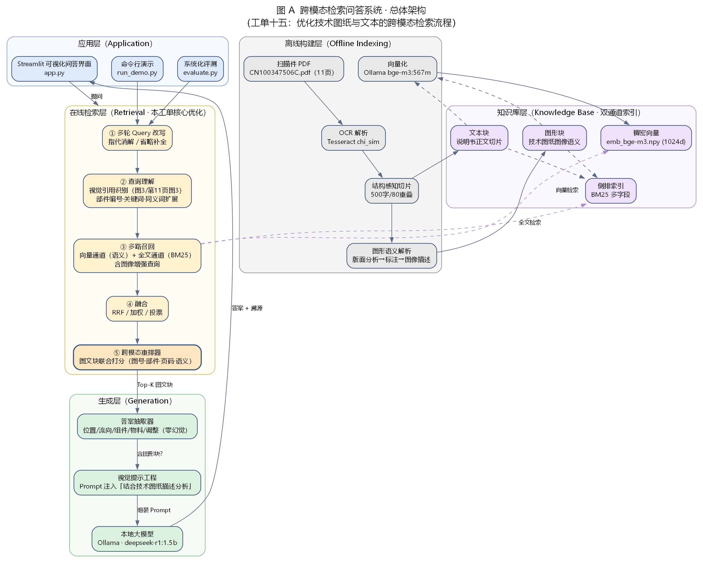
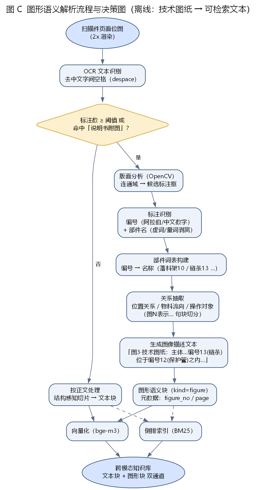
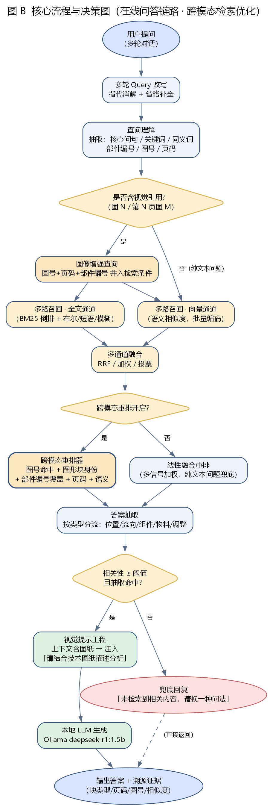

# 跨模态检索问答系统 · 系统设计文档

> **工单编号**：人工智能NLP-RAG-优化技术图纸与文本的跨模态检索流程工单（简称「工单十五」）
> **项目**：人工智能 NLP-RAG 项目
> **目标文档**：CN100347506C.pdf《用于分配块状散料的装置和相应的分散装置》（扫描件，11 页）
> **编制日期**：2026-10-09

---

## 1. 项目背景与目标

### 1.1 背景

本工单承接「工单14（修复低质量工业 PDF 的解析与信息丢失）」，在已成功构建知识库的基础上，
针对 IMDR 数据集中大量**「文本—图像混合」**问题的特性，诊断并优化 RAG 系统在工业文档场景下的
**多模态检索**能力。

目标文档为一份**扫描件专利说明书**（无文本层，每页为整页位图），其结构为：

| 页码 | 内容 |
| --- | --- |
| 第 1 页 | 扉页（著录信息 + 摘要） |
| 第 2–8 页 | 权利要求书 + 说明书正文（含「附图说明」与「具体实施方式」） |
| 第 9 页 | 说明书附图 第 1/3 页 → **图 1** |
| 第 10 页 | 说明书附图 第 2/3 页 → **图 2** |
| 第 11 页 | 说明书附图 第 3/3 页 → **图 3**（本工单图文强关联问题全部指向该图） |

### 1.2 待解决的故障（工单描述）

- **故障 1（检索无关）**：仅凭「部件 / 编号」等泛文本关键词检索，返回大量**提及部件编号但不含图 3**
  的文本块，遗漏关键图纸所在页 / 图文块。
- **故障 2（图文割裂）**：即使召回了含图 3 的页面，也无法把「编号 13」「位置关系」等查询词与图纸的
  图像特征关联，LLM 拿不到必要的视觉信息。

### 1.3 设计目标（对应工单验收标准）

| 指标 | 目标值 |
| --- | --- |
| 6 道测试题问答准确率 | **100%**（6/6） |
| 4 道图文题 Top-1 / Top-3 命中「图 3」 | **100%**（4/4） |
| 端到端响应时间 | **≤ 3~5 s** |
| 提示工程 | 上下文含图纸时，Prompt 显式指示「请结合以下技术图纸的描述进行分析」 |
| 答案质量 | 零幻觉、可溯源（标注块类型 / 页码 / 图号 / 相似度） |

---

## 2. 需求分析

### 2.1 功能需求

1. **扫描件解析**：对无文本层的工业 PDF 做 OCR，恢复正文文本；
2. **图形语义解析**：把技术图纸（位图）解析为**可检索的图像描述文本**（部件编号、名称、空间关系）；
3. **查询理解**：识别问题中的**视觉引用**（「图 3」「第 11 页图 3」）与部件编号（「编号 13」）；
4. **多路召回**：文本查询 + 图像增强查询，向量通道 + 全文通道并行召回；
5. **融合与重排**：多通道融合（RRF / 加权 / 投票）+ **跨模态重排**（图文块联合打分）；
6. **答案合成**：按问题类型分流抽取，保证零幻觉与可溯源；
7. **提示工程**：上下文含图形块时注入视觉增强前缀；
8. **可视化界面**：检索策略切换、优化前 / 优化后一键对比、检索过程可视化。

### 2.2 非功能需求

- **性能**：端到端 ≤ 3~5 s（含向量编码）；
- **可复现**：所有指标可由 `evaluate.py` 一键复现；
- **可对比**：支持「优化前基线 / 优化后」消融对照；
- **本地化**：模型能力由本地 Ollama 提供，不依赖外部 API。

---

## 3. 系统总体架构



系统分为四层（离线构建层、知识库层、在线检索层、生成层）与一个应用层：

| 层 | 职责 | 关键模块 |
| --- | --- | --- |
| **离线构建层** | 扫描件 → OCR → 切片 → 图形语义 → 向量化 / 倒排 | `pdf_parser` `ocr_engine` `chunking` `figure_semantics` `embedding` |
| **知识库层** | 文本块 + 图形块双通道，向量 + 倒排双索引 | `knowledge_base` `inverted_index` |
| **在线检索层**（本工单核心） | 改写 → 查询理解 → 多路召回 → 融合 → 跨模态重排 | `query_rewriting` `query_understanding` `hybrid_retriever` `rerankers` |
| **生成层** | 答案抽取 + 视觉提示工程 + 本地 LLM | `answer_builder` `qa_engine` `config.build_prompt` |
| **应用层** | 可视化界面 / 命令行演示 / 系统化评测 | `app.py` `run_demo.py` `evaluate.py` |

---

## 4. 模块设计

### 4.1 离线构建层

#### 4.1.1 扫描件解析（`src/ocr_engine.py` + `src/pdf_parser.py`）

- 用 PyMuPDF 以 **2.0× 倍率**（≈144 dpi）渲染每页为位图；
- 用 Tesseract（`chi_sim` 语言包）OCR 识别正文；
- **关键处理**：OCR 在「中文部件名」与「阿拉伯数字编号」之间会残留空格（如「落 料 架 10」），
  统一 **despace**（剔除所有空白）后再解析，避免漏掉全部「部件—编号」对。

#### 4.1.2 结构感知切片（`src/chunking.py`）

- 按「权利要求 / 段落」结构切分正文，切片大小 **500 字**、重叠 **80 字**，过短片段合并；
- 每块派生 `title / body / abstract` 三字段，供倒排索引多字段加权检索。

#### 4.1.3 图形语义解析（`src/figure_semantics.py`）—— 本工单关键



流程：页面位图 → 版面分析（OpenCV 连通域找候选标注框）→ 标注识别（编号 + 部件名）→
部件词表构建 → 关系抽取 → **生成图像描述文本** → 图形语义块。

部件名抽取的关键规则：

```python
# 名词前常见的虚词/量词/修饰词：非贪婪匹配会把它们并进部件名（如「在一个落料架10」），
# 故在解析后从名称左端剥离这些字符，还原真实部件名（落料架 / 保护管 / 紧固机构 …）。
_LEAD_NOISE = set("在的了个根条种一二年三多和与及或且以由从对向为是这那其又再很最均皆"
                  "合适设通过把将到")
# 部件名不能以「纯虚词/动词」收尾（过滤「设置了1」「有2」这类误匹配）。
# 注意：不含「个/根/条/种」等量词——「链条」等真实部件名正以「条」收尾。
_BAD_TAIL = set("了有是为和与及或且将把通过设")
# 真实部件名至少包含一个「物性/机构」字，进一步过滤噪声
_NOUN_CHARS = set("架管链机构件装置器槽槽口板杆轴轮环栓钉点座体头面")
```

解析产出的**图 3 图形语义块**（真实运行结果）：

```
【图3·技术图纸】文档第11页
图像描述（解析模块生成）：该图为一种分散装置的技术图纸，主体呈倾斜细长的杆状/臂状结构、
主轴线相对水平方向倾斜约 69°。
部件标注：1-体实施方式图、2-粉生装置、3-供氧装置、4-放渣和出铁口、5-体的排气装置、6-装置、
8-落料架、10-落料架、11-紧固机构、12-保护管、13-链条、14-输入管
空间关系：紧固机构11位于落料架10之内；链条13位于保护管12之内；输入管14为物料入口，位于装置顶部；
调整链条13的位置需操作紧固机构11；散料从输入管14进入后经过链条13
原文依据：…在一个落料架10里通过合适的紧固机构11在一个保护管12里设置了一根或多根链条13…
检索关键词：图3 第11页 附图3 编号13 部件13 链条 保护管 紧固机构 …
```

正是这段「图像语义文本」使图纸变得**可被检索**，是跨模态检索的基础。

### 4.2 知识库层（`src/knowledge_base.py` + `src/inverted_index.py`）

知识库为**双通道**结构：

| 通道 | 内容 | 数量（真实） |
| --- | --- | --- |
| `text` | 说明书正文切片 | 17 |
| `figure` | 图形语义块（技术图纸） | 3 |
| **合计** | | **20** |

持久化文件（`vector_db/`）：

| 文件 | 说明 |
| --- | --- |
| `chunks.jsonl` | 知识块文本与元数据（source / page / kind / figure_no / title / abstract） |
| `emb_bge-m3.npy` | 稠密向量（20 × 1024，已 L2 归一化） |
| `inverted_index.pkl` | 多字段倒排索引（BM25） |
| `meta.json` | 索引元信息（块数 / 维度 / 词表规模 / 构建时间） |

倒排索引支持：**布尔查询**（AND/OR/NOT）、**短语匹配**（`"..."`）、**模糊匹配**（编辑距离）、
**多字段加权 BM25**（title 2.0 / body 1.0 / abstract 1.5）。

### 4.3 在线检索层（本工单核心）



#### 4.3.1 多轮 Query 改写（`src/query_rewriting.py`）

对「它 / 该图 / 那呢」等指代与省略做消解，把口语问句还原为独立问句。

#### 4.3.2 查询理解 · 视觉引用识别（`src/query_understanding.py`）

识别三类视觉信号：

| 信号 | 正则（节选） | 示例 |
| --- | --- | --- |
| 图号 | `第\s*(\d+)\s*页\s*(?:的)?\s*(?:图|附图)\s*(\d+)` / `(?:图|附图)\s*(\d+)` | 「图 3」→ `figure_nos=[3]` |
| 页码 | `第\s*(\d+)\s*页` | 「第 11 页」→ `page_refs=[11]` |
| 部件编号 | `编号\s*(\d+)` / `部件\s*(\d+)` / `标号\s*(\d+)` | 「编号 13」→ `part_refs=[13]` |

同时做**领域同义词扩展**（散料↔块状散料/DRI、组件↔部件/机构…），提升召回。

#### 4.3.3 多路召回（`src/hybrid_retriever.py`）

- **多路** = [原始问题] + [查询理解产出的扩展查询（含图像增强查询）]；
- **向量通道**：对每一路分别召回后取并集（同块取最大相似度）；
- **全文通道**：把多路查询一并送入倒排检索（取并集）；
- **图像增强查询**：把「图号 / 页码 / 部件编号」并入检索条件（如「图3 第11页 编号13」）。

#### 4.3.4 融合（`src/hybrid_retriever.py`）

支持三种融合：**加权平均**、**RRF（倒数排名融合，默认）**、**投票机制**。

#### 4.3.5 跨模态重排（`src/rerankers.py`）—— 本工单核心

`CrossModalReranker` 对「文本块 + 图形块」联合打分，信号与权重：

| 信号 | 权重（`config.WCM_*`） | 含义 |
| --- | --- | --- |
| 视觉引用命中 | 0.30 | 用户所指图号（如「图 3」）是否出现在该块 |
| 图形块身份 | 0.18 | 候选本身是否为该图号的图形语义块 |
| 部件编号覆盖 | 0.22 | 查询中的「编号 13」等在该块中的覆盖率 |
| 页码命中 | 0.12 | 用户所指页码与该块页码是否一致 |
| 语义相似度 | 0.18 | 向量召回分（兜底） |

对**目标图形块**额外 `+0.5` 强加成，确保「第 N 页图 M」所指的图纸块稳定进入 Top-K。

> **设计要点**：当查询**不含**任何视觉引用（纯文本问题）时，跨模态重排器自动**退化为
> `LinearFusionReranker`**（多信号线性融合），既保证纯文本问题稳健，又使分数尺度与
> `MIN_ANSWER_SCORE` 阈值一致，避免被误判为「无相关内容」。

### 4.4 生成层

#### 4.4.1 答案抽取（`src/answer_builder.py`）

按问题类型**分流**，取首个命中的专用抽取器（**先图文强关联、后纯文本**，避免泛化抽取器抢占图文问题）：

```
位置关系 → 部件位置 → 物料流向 → 操作对象 → 物料 → 组件 → 通用兜底
```

#### 4.4.2 视觉提示工程（`src/config.py`）

当检索上下文包含图形块时，组装带**视觉增强前缀**的 Prompt：

```
【重要】以下参考资料包含与问题相关的技术图纸描述（图纸的图像语义），
请结合以下技术图纸的描述进行分析，重点核对图中部件的编号、位置关系与物料流向。
```

系统角色提示强调**只依据给定上下文作答、零幻觉、可溯源**：

```
你是一个工业专利文档问答助手。请严格依据「参考资料」中的原文作答，
不要引入资料之外的知识，也不要编造部件编号或位置关系。
若资料不足以回答，请明确说明「资料中未提及」。回答需简洁、准确、可溯源。
```

### 4.5 应用层

- `app.py`：Streamlit 可视化界面（检索策略面板 + 跨模态四项开关 + 一键基线/优化切换 + 检索过程可视化）；
- `run_demo.py`：命令行演示（打印检索过程 + 答案 + 溯源完整轨迹）；
- `evaluate.py`：系统化评测（优化前 / 优化后对比）。

---

## 5. 关键数据结构

```python
@dataclass
class Chunk:                 # 知识块
    id: int
    text: str
    source: str              # 源文件名
    page: int                # 页码
    kind: str                # "text" | "figure"
    figure_no: int | None    # 图号（图形块）
    title: str               # 倒排字段
    abstract: str            # 倒排字段

@dataclass
class QueryAnalysis:         # 查询理解结果
    question: str
    core: str                # 核心问句
    keywords: List[str]
    entities: List[str]
    synonyms: List[str]
    figure_nos: List[int]    # 视觉引用：图号
    page_refs: List[int]     # 视觉引用：页码
    part_refs: List[int]     # 视觉引用：部件编号
    visual_ref: bool
    visual_span: str         # 视觉引用原文
    answer_type: str
    expand_queries: List[str]

@dataclass
class QAResult:              # 单轮问答结果
    question: str
    answer: str
    latency: float
    candidates: List[dict]   # Top-K（含 kind/page/figure_no/各通道分数）
    retrieval: dict          # 本次检索策略信息
    visual_ref: bool
    figure_nos: List[int]
    page_refs: List[int]
    part_refs: List[int]
    prompt: str              # 含视觉增强的 LLM Prompt
    prompt_has_visual: bool
    evidence: List[dict]     # 溯源
```

---

## 6. 配置参数（`src/config.py` 关键项）

| 参数 | 值 | 说明 |
| --- | --- | --- |
| `DEFAULT_STRATEGY` | `hybrid` | 默认混合检索 |
| `DEFAULT_RERANKER` | `crossmodal` | 默认跨模态重排 |
| `DEFAULT_FUSION` | `rrf` | 默认 RRF 融合 |
| `DEFAULT_EMBEDDING` | `bge-m3` | 默认嵌入模型（1024 维） |
| `LLM_MODEL` | `deepseek-r1:1.5b` | 本地大模型 |
| `TOP_K` / `RECALL_K` | 6 / 30 | 返回数 / 单通道召回数 |
| `WCM_VISUAL_REF` | 0.30 | 跨模态重排：视觉引用权重 |
| `WCM_PART_HIT` | 0.22 | 跨模态重排：部件编号覆盖权重 |
| `USE_VISUAL_QUERY` | 1 | 查询理解·视觉引用识别开关 |
| `USE_FIGURE_RECALL` | 1 | 图像增强查询·多路召回开关 |
| `USE_CROSSMODAL_RERANK` | 1 | 跨模态重排开关 |
| `USE_VISUAL_PROMPT` | 1 | 视觉提示工程开关 |

---

## 7. 运行与交付

- **代码目录**：`交付\工单代码\工单十五\研发\`（`src\`、`data\`、`vector_db\`、入口 `.py`、`README.md`）
- **产出物目录**：`交付\实训一工单\工单十五\`（`设计\`、`部署\`、`测试\`、`优化\`、`演示\`、`研发\`）

详见《部署文档》与《研发文档》。