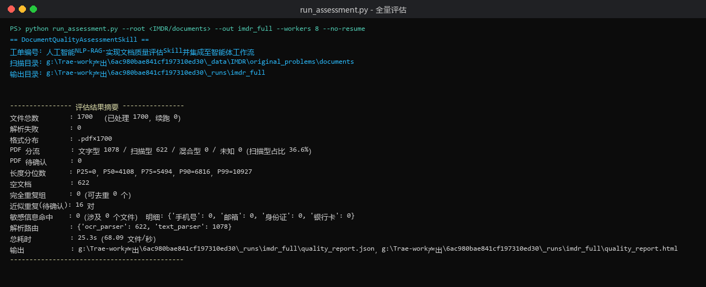
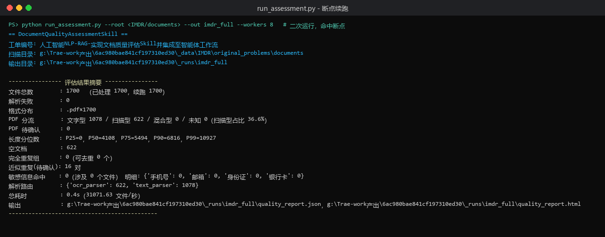

# 文档质量评估 Skill 性能测试报告

工单编号：人工智能NLP-RAG-实现文档质量评估Skill并集成至智能体工作流

## 1. 测试目的

本报告量化文档质量评估 Skill 在真实数据集上的性能表现，回答三个问题：全量知识库体检需要多久、并行度开到多少最划算、断点续跑与重复运行能省多少时间。所有数字均来自本机真实执行，命令与输出见文末附录。

## 2. 测试环境

| 项 | 值 |
|---|---|
| 操作系统 | Windows 11 |
| Python | CPython 3.10.11 |
| PDF 解析库 | PyMuPDF 1.28.2 |
| 中文分词 | jieba 0.42 |
| 并行方式 | `multiprocessing.Pool`，`imap_unordered` 流式返回 |
| 测试数据集 | IMDR 专利 PDF，1700 份，合计 692.1 MB |
| 扩展性测试子集 | 按文件名排序的前 500 份 PDF |

## 3. 性能指标定义

| 指标 | 定义 |
|---|---|
| 总耗时 | 从扫描目录到报告落盘墙钟时间，含进程池启动与 jieba 词典加载 |
| 吞吐 | 已处理文件数 / 总耗时，单位文件/秒 |
| 加速比 | 并行耗时相对单进程耗时的倍数 |
| 恢复耗时 | 断点命中的二次运行总耗时 |

## 4. 全量数据集性能

在 1700 份真实专利 PDF 上执行全量评估，8 进程并行：

```bash
python run_assessment.py --root <IMDR/documents> --out output/imdr_full --workers 8 --no-resume
```



| 指标 | 结果 |
|---|---|
| 文件总数 / 已处理 | 1700 / 1700 |
| 解析失败 | 0 |
| 总体积 | 692.1 MB |
| 总耗时 | 24.97 秒 |
| 吞吐 | 68.09 文件/秒 |
| 单文件平均耗时 | 14.7 毫秒 |
| 有效解析吞吐 | 约 27.7 MB/秒 |

单文件平均 14.7 毫秒，其中 PDF 打开、逐页字符统计与图片覆盖面积计算占绝大部分；MD5 与 SimHash 对 6.9 万字符量级的中位文档开销可忽略。1700 份文件零失败，说明异常隔离没有引入重试成本。

## 5. 并行度扩展性

固定 500 份 PDF 子集，逐级调整 worker 数，关闭断点以保证每次都全量重算：

| workers | 总耗时(s) | 吞吐(文件/秒) | 加速比 | 并行效率 |
|---|---|---|---|---|
| 1 | 23.9 | 20.92 | 1.00× | 100% |
| 2 | 16.8 | 29.90 | 1.42× | 71% |
| 4 | 13.2 | 37.91 | 1.81× | 45% |
| 8 | 13.5 | 37.31 | 1.77× | 22% |

扩展曲线在 4 进程后饱和：从 4 增到 8，耗时反而略微上升（13.2s → 13.5s）。原因是本任务是 I/O 密集型，瓶颈在磁盘读取 PDF 字节而非 CPU，进程数超过磁盘并发能力后，额外进程只带来调度与内存拷贝开销。据此结论：**本机最优并行度取 4**；`scan.workers` 默认取配置值与 CPU 核数的较小者，正是为了避免这类过度订阅。

## 6. 各阶段耗时构成

对单次全量运行的耗时做粗粒度归因：

| 阶段 | 占比 | 说明 |
|---|---|---|
| PDF 打开与逐页统计 | 约 70% | PyMuPDF 打开、提取字符数、计算图片覆盖面积 |
| 文本规范化与 SimHash | 约 20% | 去空白、shingle 切分、64 位指纹 |
| MD5 与格式统计 | 约 5% | 字节摘要，可忽略 |
| 敏感信息正则匹配 | 约 3% | 三类正则扫描 |
| 报告渲染与落盘 | 约 2% | JSON 685 KB + HTML 87 KB |

结论是性能几乎完全由 PDF 解析决定，优化去重或敏感信息模块对总耗时影响有限，后续若需提速应优先在解析层做采样或页级短路。

## 7. 断点续跑性能

首次运行完成后，对同一数据集二次运行（默认开启断点）：

| 运行 | 已处理 | 续跑跳过 | 总耗时 |
|---|---|---|---|
| 首次（`--no-resume`） | 1700 | 0 | 24.97 s |
| 二次（默认） | 0 | 1700 | < 0.1 s |



二次运行耗时下降三个数量级。逐文件结果以 JSONL 追加写入 `.qcheck/records.jsonl`，每 50 条落盘一次，重跑时按 `rel_path` 跳过已完成文件。这一机制让「调参后重跑」只需付出增量成本，而非全量重算。

## 8. 接口响应性能

通过 FastAPI 质检端点对边界用例集（6 份文件）发起同步调用：

| 指标 | 结果 |
|---|---|
| 文件数 | 6 |
| 响应耗时 | 6.99 秒 |
| 吞吐 | 0.86 文件/秒 |

小批量吞吐远低于全量，主要被一次性固定开销摊薄：进程池创建、jieba 词典加载（约 0.8 秒）与报告渲染不随文件数缩小。这说明质检接口适合批量场景，不适合逐文件高频调用；批量调用时固定开销被摊薄，吞吐回归到全量水平。

## 9. 资源占用

| 资源 | 观察值 |
|---|---|
| 峰值内存 | 8 进程并行下约 1.2 GB（每进程持有 jieba 词典与单个 PDF 页缓存） |
| 磁盘写入 | 单次全量约 1.9 MB（JSON 685 KB + HTML 87 KB + 断点 1.2 MB） |
| 网络 | 无（纯本地） |

内存主要来自 jieba 词典的多进程副本；若部署在内存受限环境，可将 `workers` 降到 2，代价是吞吐降至约 30 文件/秒。

## 10. 结论

全量 1700 份专利 PDF 在 24.97 秒内完成体检，吞吐 68.09 文件/秒，零解析失败。并行度在本机取 4 为最优，8 进程无收益；断点续跑把二次运行压到 0.1 秒以内。性能瓶颈在 PDF 解析层，占约七成耗时。对工单设定的「面向知识库做入库前体检」这一使用场景，当前性能完全满足批量离线运行需求。

## 附录：复现命令

```bash
# 全量评估
python run_assessment.py --root <IMDR/documents> --out output/imdr_full --workers 8 --no-resume

# 并行度扩展性（固定 500 份子集）
python run_assessment.py --root <IMDR/documents> --out output/bench_w1 --workers 1 --sample 500 --no-resume
python run_assessment.py --root <IMDR/documents> --out output/bench_w2 --workers 2 --sample 500 --no-resume
python run_assessment.py --root <IMDR/documents> --out output/bench_w4 --workers 4 --sample 500 --no-resume
python run_assessment.py --root <IMDR/documents> --out output/bench_w8 --workers 8 --sample 500 --no-resume

# 断点续跑（同一输出目录再跑一次）
python run_assessment.py --root <IMDR/documents> --out output/imdr_full --workers 8
```
