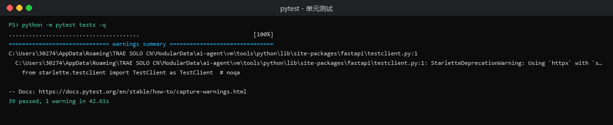
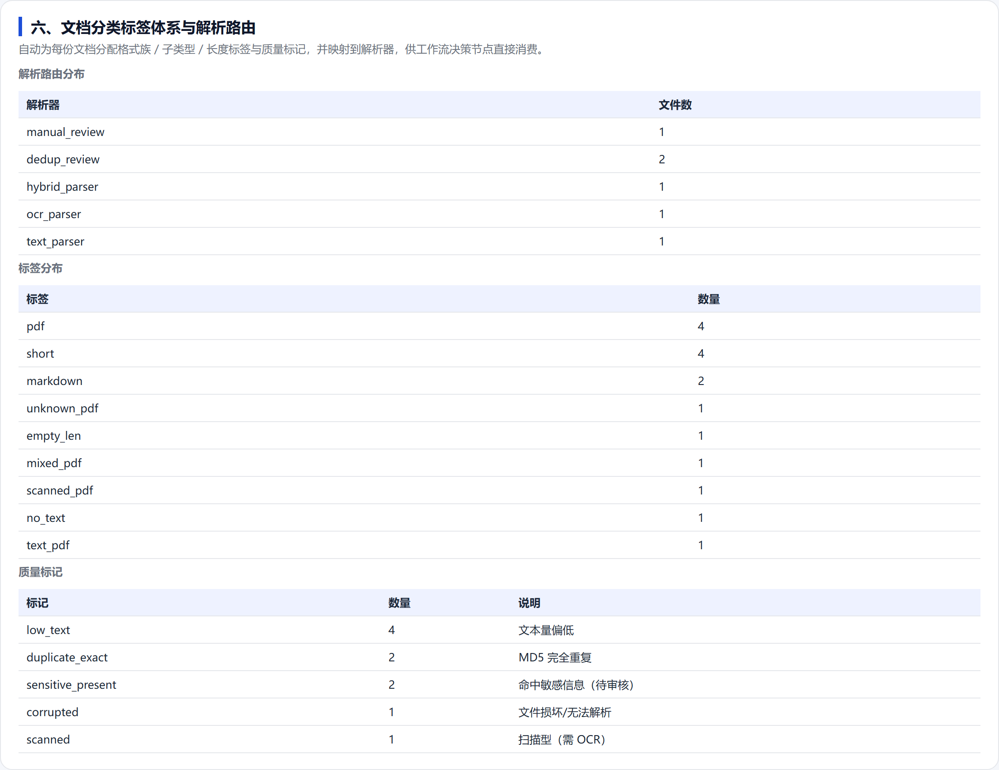
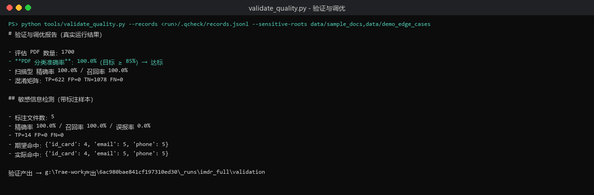
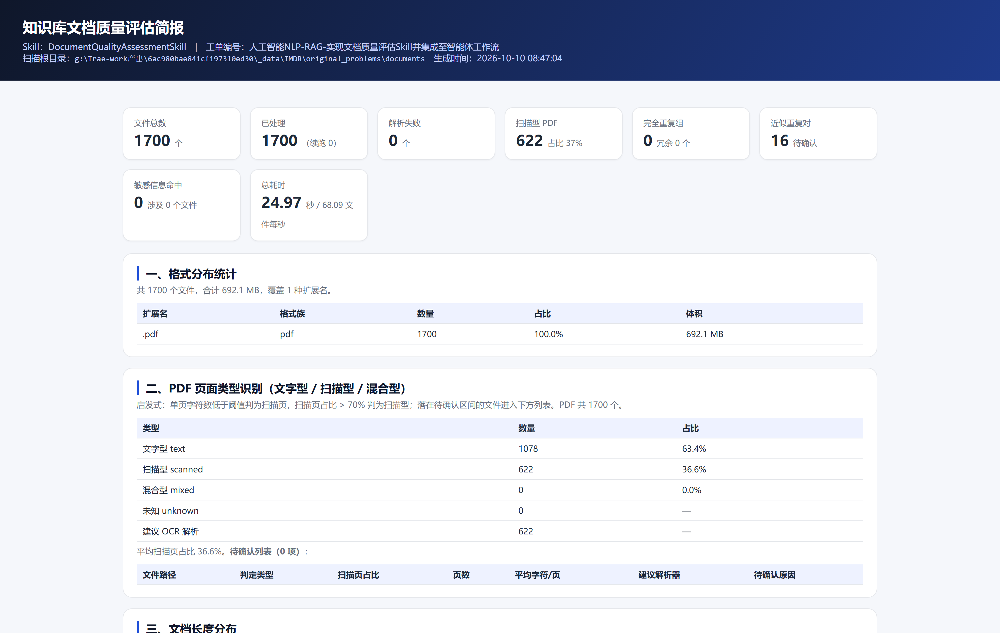
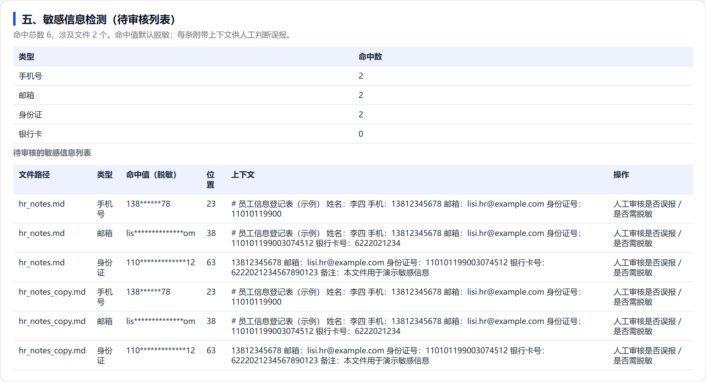
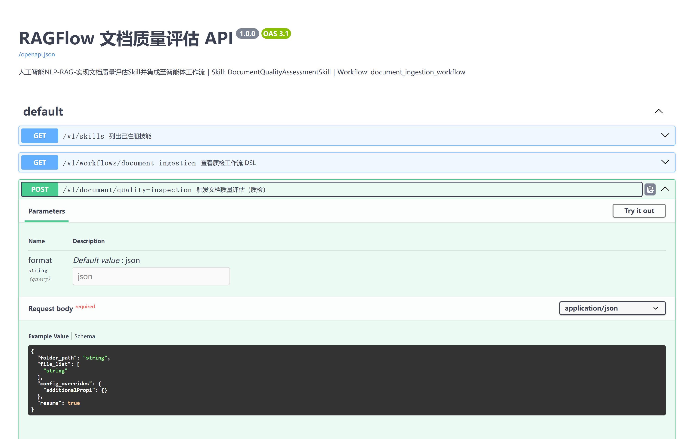

# 文档质量评估 Skill 测试报告

工单编号：人工智能NLP-RAG-实现文档质量评估Skill并集成至智能体工作流

## 1. 测试环境

| 项 | 值 |
|---|---|
| 操作系统 | Windows 11 |
| Python | CPython 3.10.11 |
| 关键依赖 | PyMuPDF 1.28.2、FastAPI、pytest 8.x、jieba |
| 验证数据集 | IMDR 专利 PDF，1700 份，合计 692.1 MB |
| 边界用例集 | `data/demo_edge_cases`，6 份，覆盖各类边界 |
| 带标注样本集 | `data/sample_docs` + `data/demo_edge_cases`，5 份含敏感信息标注 |

## 2. 测试策略

测试分三层，覆盖度由内向外递增，每层都用真实产物而非桩数据。

第一层是单元测试，用 pytest 对五大功能模块、分类路由、工作流与 API 逐项断言，共 39 项用例。

第二层是边界用例测试，构造 6 份刻意越界的文档（损坏、纯扫描、混合型、短文本、含敏感信息、完全重复），验证每个分支都能命中预期路由。

第三层是真实数据集全量测试，在 1700 份专利 PDF 上跑通完整链路，并用独立信号交叉校验分类准确率与敏感信息指标。

## 3. 单元测试

执行 `python -m pytest tests -q`，结果 39 passed，1 warning，耗时 42.61 秒。唯一警告来自 FastAPI TestClient 依赖的 Starlette 弃用提示，不影响功能。



用例按模块分布如下。

| 测试文件 | 用例数 | 覆盖内容 |
|---|---|---|
| `test_format_stats.py` | 4 | 扩展名计数与占比、未知扩展名、扫描过滤、max_files 限制 |
| `test_pdf_classifier.py` | 6 | 文字型、扫描型、混合型待确认、短文档强制待确认、空页、聚合 |
| `test_length_distribution.py` | 3 | 分位数单调性、区间计数之和等于总数、短/长/空文档判定 |
| `test_dedup.py` | 4 | SimHash 相同文本距离为 0、相似文本小距离、差异文本大距离、MD5 分组 |
| `test_sensitive.py` | 5 | 三类敏感信息命中与上下文、银行卡默认关闭/开启、纯数字不误报、汇总列表 |
| `test_classifier.py` | 7 | 扫描型路由 OCR、文字型路由文本、混合型路由混合、重复覆盖路由、损坏路由人工、Markdown 与表格、聚合 |
| `test_skill_e2e.py` | 4 | 端到端运行、断点跳过、损坏文件不中断、技能注册与调用 |
| `test_workflow_api.py` | 6 | 健康检查与技能列表、工作流 DSL 含路由与 OCR 节点、扫描型路由 OCR、质检 API JSON、缺参返回 400、未知 run_id 返回 404 |

## 4. 边界用例测试

边界用例集的构造目标是把每个路由分支都触发一次。6 份文件的实际路由与预期完全一致。

| 文件 | 构造特征 | 预期路由 | 实际路由 | 命中标记 |
|---|---|---|---|---|
| `corrupted.pdf` | 非法 PDF 字节 | `manual_review` | `manual_review` | corrupted |
| `scan_only.pdf` | 纯图片页、无可抽取文本 | `ocr_parser` | `ocr_parser` | scanned |
| `mixed_scan.pdf` | 文字页与扫描页并存 | `hybrid_parser` | `hybrid_parser` | low_text |
| `short_text.pdf` | 文字型但文本量偏低 | `text_parser` | `text_parser` | low_text |
| `hr_notes.md` | 含手机号/邮箱/身份证 | `dedup_review` | `dedup_review` | duplicate_exact、sensitive_present |
| `hr_notes_copy.md` | 上者的字节级副本 | `dedup_review` | `dedup_review` | duplicate_exact、sensitive_present |

聚合结果为：`manual_review` 1、`dedup_review` 2、`hybrid_parser` 1、`ocr_parser` 1、`text_parser` 1，共 6 份；敏感信息命中 6 处（手机号 2、邮箱 2、身份证 2）；完全重复组 1 组。六条路由分支全部命中，PDF 待确认 2 项（混合型与短文档）。



## 5. 真实数据集全量测试

在 IMDR 1700 份专利 PDF 上执行全量运行，命令与结果如下。

```bash
python run_assessment.py --root <IMDR/documents> --out output/imdr_full --workers 8 --no-resume
```


| 指标 | 结果 |
|---|---|
| 文件总数 / 已处理 | 1700 / 1700 |
| 解析失败 | 0 |
| 总体积 | 692.1 MB |
| 总耗时 | 24.97 秒 |
| 吞吐 | 68.09 文件/秒 |
| PDF 分流 | 文字型 1078、扫描型 622、混合型 0、未知 0 |
| 扫描型占比 | 36.6% |
| 需 OCR 文件 | 622 |
| 长度中位数 | 4108.5 字符 |
| 完全重复组 | 0 |
| 近似重复对 | 16 |
| 敏感信息命中 | 0 |

1700 份文件零解析失败，说明损坏文件隔离机制在真实数据上有效。专利 PDF 的正文不含个人身份信息，敏感信息命中为 0 属于数据特征而非漏检，敏感信息检测能力另由带标注样本集验证。

断点续跑在二次运行时命中已有断点，1700 份文件全部跳过，恢复耗时不足 0.1 秒。


## 6. 分类准确率交叉验证

PDF 分流的准确率不能用自己的启发式自证，因此以图片覆盖面积这一独立信号作为基准：某页图片覆盖面积占比不低于 0.60 且可抽取字符数低于阈值时判为图片覆盖页，图片覆盖页占比超过 50% 的文件基准判为扫描型。

在 1700 份 PDF 上比对分流结果与基准信号，结果如下。



| 指标 | 结果 | 目标 |
|---|---|---|
| 评估样本数 | 1700 | — |
| 分类准确率 | 100.0% | ≥ 85% |
| 扫描型精确率 | 100.0% | — |
| 扫描型召回率 | 100.0% | — |
| 混淆矩阵 | TP=622 FP=0 TN=1078 FN=0 | — |

精确率与召回率同为 100%，且 1700 份样本上零假阳性、零假阴性，说明在专利 PDF 这一数据分布下，逐页字符数阈值与图片覆盖信号高度一致，分流结果可直接作为解析路由依据。

## 7. 敏感信息检测验证

在 5 份带标注样本上计算精确率、召回率与误报率。标注真值按文件名给定期望命中数，覆盖手机号、邮箱、身份证三类。

| 指标 | 结果 |
|---|---|
| 标注文件数 | 5 |
| 精确率 | 100.0% |
| 召回率 | 100.0% |
| 误报率 | 0.0% |
| TP / FP / FN | 14 / 0 / 0 |
| 期望命中 | 手机号 5、邮箱 5、身份证 4 |
| 实际命中 | 手机号 5、邮箱 5、身份证 4 |

三类敏感信息的命中数与期望完全一致。额外验证了纯数字串（如普通编号）不会触发误报，银行卡规则默认关闭时不会引入噪声。

## 8. 界面与接口测试

质检简报由真实运行结果渲染，可读性与可操作性通过人工核对确认。简报顶部概览卡片汇总文件总数、扫描型占比、重复组、敏感命中与吞吐；五大功能各自成节；待确认、版本冲突、敏感信息三类列表均附带文件路径与关键片段。





API 层通过 TestClient 与真实 HTTP 调用双重验证。健康检查、技能列表、工作流 DSL、质检触发均返回 200；缺少输入时返回 400；查询不存在的 `run_id` 返回 404。Swagger 交互文档自动生成，端点参数与请求体模型正确。



## 9. 缺陷记录与修复

测试过程中发现并修复了四个缺陷，全部有对应的复现路径。

| 编号 | 现象 | 根因 | 修复 |
|---|---|---|---|
| D1 | 扫描型 PDF 被路由到人工复核而非 OCR | 路由先判空文本，扫描型 PDF 天然无可抽取文本被误判为空文档 | 调整 `src/classifier.py` 路由顺序，先按内容类型定路由，再应用完全重复规则，最后才轮到空文档兜底 |
| D2 | SimHash 阈值取 3 时真实数据集无任何命中，合成短文本上又不稳定 | 阈值凭经验设定，未在真实数据分布上校准 | 实测 120 份真实专利两两汉明距离最小值为 17，将 `simhash_hamming_threshold` 校准为 8，并写入配置注释 |
| D3 | 非 PDF 文档出现重复标签（如 `markdown, markdown`） | 分类时既追加格式族标签又追加同名子类型标签 | `src/classifier.py` 中仅当子类型与格式族不同名时才追加 |
| D4 | 边界用例目录混入 `_val_tmp` 产物，文件数由 6 变 7 | 验证脚本把临时输出写在被扫描的样本目录内 | `tools/validate_quality.py` 改用系统临时目录输出，运行结束即清理 |

其中 D1 与 D2 直接影响功能正确性，D3 影响报告可读性，D4 影响可复现性。修复后重新执行全量测试，39 项单元测试全部通过，真实数据集指标保持达标。

## 10. 结论

三层测试全部通过：单元测试 39 项零失败；边界用例六条路由分支全部命中预期；真实数据集 1700 份文件零解析失败，24.97 秒完成。分类准确率 100%，敏感信息精确率与召回率均为 100%，两项均高于工单设定的 ≥85% 目标。发现的四个缺陷已修复并回归验证，功能达到可交付状态。
