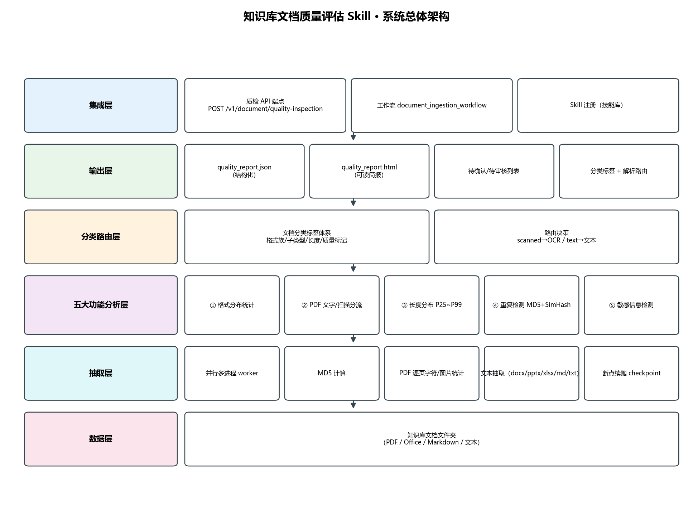
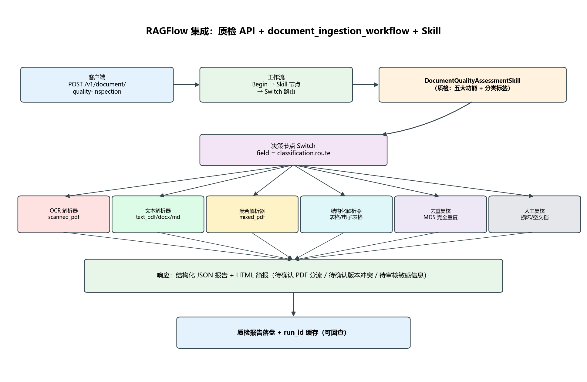

# 文档质量评估 Skill 系统设计文档

工单编号：人工智能NLP-RAG-实现文档质量评估Skill并集成至智能体工作流

## 1. 背景与目标

知识库在解析入库前，文档质量参差不齐：扫描件没有可抽取文本、同一份文件存在多个版本、正文里夹带手机号与身份证号、长短文档混杂导致切分策略失配。这些问题如果留到检索阶段才暴露，排查成本高，且会污染向量库。

本工单要交付的是一道入库前的质量闸门：`DocumentQualityAssessmentSkill`。它以文件夹为输入，输出结构化 JSON 报告与可读 HTML 简报，并给出每份文档的分类标签与解析器路由，供上层工作流直接消费。设计目标有四个：

- 覆盖工单要求的五类核心检查（格式分布、PDF 类型分流、长度分布、重复检测、敏感信息）；
- 判定逻辑可解释、阈值可配置，运行期无需改代码即可调参；
- 面向质检员输出可操作的待确认/待审核列表，而不是一堆裸统计；
- 能以 Skill + 工作流 + API 三种形态集成进 RAG 智能体。

## 2. 需求到实现的映射

工单正文拆出的每一项要求，在代码中都有明确落点。

| 工单要求 | 实现模块 | 对外产物 |
|---|---|---|
| 格式分布统计 | `src/format_stats.py` | `report.format_stats`（扩展名/格式族数量、体积、占比） |
| PDF 文字型/扫描型/混合型分流 | `src/pdf_classifier.py` | `report.pdf_classification`（含待确认列表） |
| 文档长度分布 | `src/length_distribution.py` | `report.length_distribution`（分位数 + 区间分布） |
| MD5 + SimHash 两层重复检测 | `src/dedup.py` | `report.duplicates`（完全重复组 + 版本冲突列表） |
| 敏感信息检测 | `src/sensitive.py` | `report.sensitive`（含上下文与脱敏） |
| 文档分类标签体系与解析路由 | `src/classifier.py` | `report.classification`（标签分布 + 路由计划） |
| 集成为 Skill 与工作流 | `document_quality_assessment/`、`src/workflow.py`、`src/api_router.py` | Skill 三层结构、`document_ingestion_workflow`、质检 API |

## 3. 总体架构

系统自下而上分为六层，每层职责单一，层间通过字典结构的数据契约传递。



- 数据层：知识库原始文件（PDF / Office / Markdown / 文本），本工单的验证数据集为 1700 份专利 PDF。
- 抽取层：多进程 worker 并行处理，逐文件计算 MD5、按格式族抽取文本；PDF 额外逐页统计字符数与图片覆盖面积。
- 分析层：五个功能模块各自独立，只读取抽取层的记录，互不依赖，便于单测与替换。
- 分类路由层：把分析结果翻译成标签与解析器路由，是「统计」走向「可执行」的转换点。
- 输出层：JSON 结构化报告 + HTML 简报，外加断点文件。
- 集成层：Skill 注册表、质检工作流、FastAPI 质检端点。

## 4. Skill 三层结构

Skill 按 Anthropic Agent Skills 的三层架构组织，加载开销与使用频率成反比。

```
document_quality_assessment/
├── SKILL.md                       # 元数据层（YAML frontmatter，常驻）+ 指令层（正文，触发时加载）
├── references/config_reference.md # 资源层：配置项说明，按需读取
└── scripts/                       # 资源层：命令行 / API 入口
```

元数据层声明 `name`、`display_name`、`version`、`triggers`、`inputs`、`outputs` 与 `entrypoint`，让智能体在不加载正文的情况下就能判断是否该调用本 Skill。指令层描述何时使用、工作流 SOP 与关键约定。资源层承载具体脚本与配置说明，只在真正执行时读取。这样设计的直接收益是：常驻上下文的只有几百字节的元数据，1700 份文档的解析逻辑不会挤占对话预算。

## 5. 核心算法设计

### 5.1 PDF 类型分流

PDF 分流的输入是逐页统计量：每页可提取字符数与图片覆盖面积占比。判定分三步。

第一步，单页定级。字符数低于 `pdf.text_char_threshold`（默认 30）的页记为扫描页。

第二步，文件定级。扫描页占比高于 `pdf.scanned_page_ratio`（默认 0.70）判为扫描型；低于 `pdf.text_page_ratio`（默认 0.10）判为文字型；两者之间判为混合型。

第三步，交叉校验与待确认。系统同时用图片覆盖面积这一独立信号复核——若某页图片覆盖面积占比不低于 `pdf.image_area_ratio`（默认 0.60）且字符数低于阈值，则计入图片覆盖页；图片覆盖页占比超过 50% 时交叉信号判为扫描型。当交叉信号与文本信号不一致，或扫描页占比落在 `confirm_band` 区间，或总页数少于 `min_pages_for_strict`，该文件进入待确认列表并附上原因。

这里的设计取舍是：分流结果用于决定走哪条解析链路，属于分流决策而非质量终审，因此宁可把边界样本交给人，也不硬判。图片覆盖信号被单独保留下来，正是为了在验证阶段作为独立基准，避免用同一套启发式自证。

### 5.2 两层重复检测

重复检测分精确与近似两层，代价递增、召回递增。

MD5 层对文件字节做摘要，同摘要即完全重复，直接归入 `dedup_review` 队列，不需要再解析正文。

SimHash 层针对正文内容。对规范化后的文本按 `shingle_size`（默认 4）切分 shingle，对每个 shingle 取 64 位哈希并按位加权累加，得到 64 位指纹；两个指纹的汉明距离不超过 `simhash_hamming_threshold` 即判为高度相似。阈值不是拍脑袋定的：在真实数据集上抽取 120 份专利 PDF 两两比对，无关文档的最小汉明距离为 17，因此取 8 作为阈值，能在零误报的前提下召回结构高度一致的版本对。这个校准过程记录在 `assessment_config.yaml` 的注释里，后续换数据集可直接复现。

### 5.3 敏感信息检测

敏感信息检测基于带上下文的正则匹配，覆盖手机号、邮箱、身份证三类，银行卡规则默认关闭（专利与年报场景下误报偏高，且工单未要求）。

每条命中都保留命中位置与前后 `context_chars`（默认 40）个字符的上下文，命中值默认脱敏后再写入报告。这样质检员既能确认命中，又不会让报告本身成为敏感信息的二次泄露源。单文件命中数上限由 `max_hits_per_doc` 控制，避免异常长文档刷屏。

### 5.4 分类标签与解析路由

分类层把分析结果翻译成标签，再映射到解析器。标签分三类：格式族标签（pdf / docx / markdown）、子类型标签（text_pdf / scanned_pdf / mixed_pdf）、长度标签（short / medium / long）；质量标记单独维护（duplicate_exact、duplicate_near、sensitive_present、corrupted、empty、low_text、scanned）。

路由决策的顺序经过一次修正。最初的实现先判空文本，导致扫描型 PDF 因为「没有可抽取文本」被误判成空文档、路由到人工复核，OCR 链路形同虚设。修正后的顺序是：先按内容类型定路由（扫描型必走 `ocr_parser`），再应用完全重复规则（`dedup_review`），最后才轮到损坏与空文档兜底。这条修正对应 `src/classifier.py` 中路由分支的注释。

标签到解析器的映射全部来自配置 `classification.routing`，工作流的 Switch 节点直接读取该映射，因此新增文档类型只需改配置。

## 6. 数据契约

抽取层产出的单文件记录是系统内部的核心数据结构，五个分析模块都基于它工作。

| 字段 | 含义 |
|---|---|
| `rel_path` / `ext` / `family` | 相对路径、扩展名、格式族 |
| `size` / `size_human` | 字节数与可读体积 |
| `char_count` | 规范化后可抽取字符数 |
| `page_count` | PDF 页数 |
| `md5` / `simhash` | 精确与近似去重指纹 |
| `pdf_classification` | 分流结果（类型、扫描页占比、交叉信号、待确认原因、建议解析器） |
| `sensitive_hits` | 敏感信息命中（类型、脱敏值、位置、上下文） |
| `error` | 解析失败原因，为空表示正常 |

报告顶层由 `meta`、`format_stats`、`pdf_classification`、`length_distribution`、`duplicates`、`sensitive`、`classification`、`errors`、`files` 组成。`meta.config_snapshot` 完整快照本次运行的全部阈值，保证任何一份历史报告都能被精确复现。

## 7. 配置体系

所有判定阈值集中在 `assessment_config.yaml`，代码中不出现魔法数字。配置分七段：`scan`（扫描与并行）、`pdf`（分流）、`length`（长度）、`dedup`（去重）、`sensitive`（敏感信息）、`classification`（标签与路由）、`report`（输出与截断）、`checkpoint`（断点）。

运行期可通过 `config_overrides` 做深度合并覆盖，例如：

```python
DocumentQualityAssessmentSkill(overrides={"pdf": {"scanned_page_ratio": 0.8}})
```

命令行入口把 `--workers` 与 `--sample` 也转换成覆盖项，因此调参不需要新建配置文件。配置快照随报告一同落盘，做到「报告可复现、阈值可追溯」。

## 8. 集成设计

集成分三个层次，逐层加深与 RAGFlow 的耦合。

Skill 注册。`src/skill_registry.py` 维护技能注册表，`GET /v1/skills` 可列出已注册技能，用于集成自检。

工作流。`document_ingestion_workflow` 用「节点 + 边」模型描述质检到解析的完整链路，节点定义与 RAGFlow Agent 的 DSL 字段对齐（`component_name` / `params` / `inputs` / `outputs`）。工作流既能被本地执行器跑通，也能序列化后直接导入 RAGFlow。Switch 节点以 `classification.route` 为分派字段，把文档导向 OCR、文本、混合、结构化、去重复核、人工复核六条支路。

API。`src/api_router.py` 提供 `POST /v1/document/quality-inspection`，接受文件夹路径或文件列表，同步返回质检报告；带 `?format=html` 时返回可读简报。该 Router 可被 RAGFlow 的 API 服务直接 `include_router` 挂载，无需改动宿主应用。



## 9. 健壮性与可恢复性

单文件异常隔离。抽取 worker 内部捕获全部异常，把 `类型: 消息` 写入记录的 `error` 字段，损坏文件不会中断整批处理。在 1700 份真实 PDF 上运行时解析失败为 0。

断点续跑。逐文件结果实时追加写入 `.qcheck/records.jsonl`，每 `flush_every`（默认 50）条落盘一次。重跑时按 `rel_path` 跳过已完成文件，二次运行 1700 份文件的恢复耗时不到 0.1 秒。

并行加速。worker 数量取配置值与 CPU 核数的较小者，避免过度订阅。抽取层用 `imap_unordered` 流式返回，进度回调在结果到达时立即触发，因此进度条是真实进度而非估算。

## 10. 关键设计取舍

分流用启发式而非模型。引入 OCR 模型判定能提高单点准确率，但会显著抬高入库前的固定开销，且判定结果难以向质检员解释。当前方案把不确定性显式收敛到「待确认」列表，用人工兜底换取速度与可解释性。

阈值全部外置。硬编码阈值在数据集切换时会成为隐性故障点。配置化让「换数据集先调参」成为标准动作，配置快照又保证了历史报告的可追溯性。

列表截断而非全量。待确认、版本冲突、敏感信息等列表在报告中按 `top_n_lists` 截断，完整明细仍保留在 JSON 的 `files` 段。这样 HTML 简报的体量可控，同时不丢数据。

## 11. 交付物索引

- 代码：`交付\工单代码\工单十八\研发\`
- 部署说明：`部署\部署文档.md`
- 功能与性能验证：`测试\测试报告.md`、`测试\性能测试报告.md`
- 调优过程与结论：`优化\优化报告.md`
- 研发实现说明：`研发\研发文档.md`
- 演示材料：`演示\`（演示视频、界面截图、流程图）
