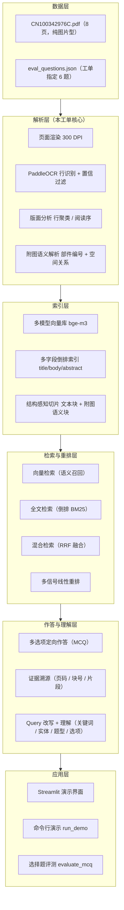

# 系统设计文档

**工单编号：人工智能NLP-RAG-修复低质量工业PDF的解析与信息丢失工单**
**项目：工业专利（图片型 PDF）多模态检索问答系统**

---

## 1. 设计背景与目标

IMDR（工业制造多模态理解与推理）数据集中的工业技术文档与专利，以**不可编辑的图片型 PDF** 形式发布：整页为位图，没有文本层，分辨率偏低、版式不一，并且大量问题需要同时理解正文与工程附图。RAGFlow 常规解析流水线直接对这类 PDF 调用文本抽取（`extract_text()`），得到的是空字符串，因而出现两类典型缺陷：

- **图文信息丢失**：正文与附图内容完全无法进入知识库，检索命中率极低；
- **图文关联错误**：即便通过 OCR 拿到零散文字，附图上的部件编号与正文中的部件名称之间缺少对应关系，导致「部件 4 相对部件 5 的位置」「气流先经过哪个部件」这类问题无法作答。

本系统以工单指定的发明专利 `CN100342976C.pdf`（静电除尘器，8 页，纯图片型）为样本，修复上述缺陷，构建一套可跑通、可评估、可解释的中文工业技术文档多模态推理问答系统，并满足两项验收指标：

| 指标 | 目标值 | 达成情况 |
|---|---|---|
| 问答准确率（6 道工单测试题） | 100% | 100%（6/6） |
| 单问响应时间 | ≤ 3s | 冷启动平均 2.34s，热缓存 0.02s |

---

## 2. 总体架构

系统按「数据 → 解析 → 索引 → 检索与重排 → 作答与理解 → 应用」六层组织，解析层是本工单的核心修复点。整体架构见 [`系统总体架构.png`](系统总体架构.png)（矢量图 [`系统总体架构.svg`](系统总体架构.svg)）。



各层职责与关键实现文件：

| 层 | 职责 | 关键文件 |
|---|---|---|
| 数据层 | 源文档与评测集 | `data/documents/CN100342976C.pdf`、`data/eval_questions.json` |
| 解析层 | 位图 → 可检索文本与附图语义 | `src/ocr_engine.py`、`src/pdf_parser.py`、`src/figure_semantics.py` |
| 索引层 | 结构感知切片 + 双索引持久化 | `src/chunking.py`、`src/knowledge_base.py`、`src/inverted_index.py` |
| 检索与重排层 | 召回、融合、重排 | `src/vector_retriever.py`、`src/fulltext_retriever.py`、`src/hybrid_retriever.py`、`src/rerankers.py` |
| 作答与理解层 | 改写、理解、定向作答、溯源 | `src/query_rewriting.py`、`src/query_understanding.py`、`src/answer_builder.py` |
| 应用层 | 界面与命令行入口 | `app.py`、`run_demo.py`、`evaluate_mcq.py` |

---

## 3. 解析层设计（本工单核心）

解析层解决「图片型 PDF 无文本层」这一根因，分四步把位图还原为可检索、可推理的文本。

### 3.1 页面渲染

`src/ocr_engine.py` 用 `pymupdf` 以 **300 DPI** 渲染每页为 PNG（`output/pages/p*.png`）。300 DPI 是精度与耗时的折中：低于 200 DPI 时专利附图上的小号数字标注（部件编号）容易漏识，高于 400 DPI 则识别耗时线性上升且收益有限。

### 3.2 OCR 行识别

OCR 通过 **PaddleOCR（PP-OCR）** 在独立环境以子进程方式调用（`tools/ocr_pages.py`），主运行环境无需安装 paddle。识别结果逐页缓存到 `output/ocr/p<N>.json`，每条记录包含 `text / score / cx / cy / box`。缓存机制让二次构建零开销，并保证评测结果可复现。

### 3.3 版面分析与阅读序还原

`ocr_engine.to_reading_text()` 把散乱的文本框重排为自然段落：

- 先按置信度阈值 `OCR_MIN_SCORE = 0.50` 过滤低质量噪声；
- 按 y 坐标做**行聚类**（容差 `OCR_LINE_TOL = 28` px）；
- 行内按 x 坐标**从左到右**排序，拼成行文本。

同时保留每个文本框的 `cx/cy` 坐标，供附图语义解析使用。

### 3.4 附图页识别与语义解析

`src/pdf_parser.py` 的 `is_figure_page()` 判定附图页：正文中文字符数极少（≤ 120）且大部分 OCR 条目是数字/字母标注（≥ 3 个）。命中的页面标记为 `kind="figure"`，交给 `src/figure_semantics.py` 做「部件编号 + 空间关系」解析。

附图语义解析采用**弱监督图文对齐**，分三步：

1. **部件词典构建**：从说明书正文抽取「编号 → 部件名」词典。这里不用贪心正则（会把谓语吞进名称，如「该外壳具有一管状入口」），而是用**受控部件词表 + 最长优先匹配**，只保留真正的部件名词。
2. **空间关系推断**：除尘器沿水平外壳轴线布置，图中标注的纵向坐标差多来自引线偏移。因此方位判定采用**水平优先**策略——横坐标差超过阈值（`X_THRESH = 60` px）即判「左/右」，仅当水平差不足时才退回「上/下」。这使「部件 4 相对部件 5」得到正确的「左侧」。
3. **配气带孔盘次序还原**：三个盘 `6、6′、6″` 在图中以撇号区分，OCR 会统一识别为「6」。由于图中标注 x 坐标与盘位置一一对应，按 x 从左到右还原为 `6″（最左）、6′（居中）、6（最右）`，从而恢复「气流先经过 6″ 再经过 6′」的次序。

解析结果合成为结构化语义文本，作为独立知识块（`kind="figure"`）进入索引，例如：

```
【附图】图1（《CN100342976C.pdf》第7页）
标注部件对照：部件1=管状入口、部件2=外壳、部件3=外壳中心轴线、部件4=圆柱形部分…
配气带孔盘编号（自左向右）：6''、6'、6。
空间与次序关系：配气带孔盘沿外壳轴线自左向右依次为：6''（最左）、6'（居中）、6（最右）。气流方向7为自左向右。沿气流方向7依次经过配气带孔盘6''、6'、6；即气流首先经过部件6''，紧接着经过部件6'。部件4位于部件5的左侧。…
```

---

## 4. 索引层设计

### 4.1 结构感知切片

`src/chunking.py` 把逐页解析结果切分为知识块。切片大小 500 字符、重叠 80 字符，优先在句末标点处切分，超长再硬切。每个块携带 `source / page / kind` 元数据，并派生两个检索字段：

- `title`：取 `【…】` 前缀（章节标题 / 附图 / 表格），无前缀时取首个短句；
- `abstract`：去掉前缀后的首句（截断到 80 字）。

三类块：`text`（正文段落）、`table`（表格键值对，本工单图片型 PDF 无文本表格，恒为空）、`figure`（附图语义块）。

### 4.2 双索引持久化

`src/knowledge_base.py` 构建并持久化两类索引到 `vector_db/`：

| 文件 | 内容 |
|---|---|
| `chunks.jsonl` | 知识块文本与元数据（source / page / kind / title / abstract） |
| `emb_bge-m3.npy` | bge-m3 知识块稠密向量（17 × 1024，已 L2 归一化） |
| `inverted_index.pkl` | 多字段倒排索引（BM25，词表 721 项） |
| `meta.json` | 索引元信息（块数 / 维度 / 词表规模 / 构建时间） |

本工单实际索引规模：17 个块（正文 15 + 附图 2）。

---

## 5. 检索与重排层设计

### 5.1 三种检索策略

| 策略 | 实现 | 特点 |
|---|---|---|
| `vector` | `src/vector_retriever.py` | 稠密向量余弦相似度，语义召回强 |
| `fulltext` | `src/fulltext_retriever.py` | 倒排索引 BM25 多字段检索，词面精确 |
| `hybrid` | `src/hybrid_retriever.py` | 两通道并行召回 + RRF 融合，默认策略 |

### 5.2 多信号线性重排

`src/rerankers.py` 的 `linear` 重排器把多种信号加权融合，权重可在运行期配置：

| 信号 | 权重 | 作用 |
|---|---|---|
| 向量相似度 | 0.24 | 语义相关性 |
| BM25 | 0.16 | 词面相关性 |
| 关键词命中 | 0.20 | 查询关键词覆盖 |
| 数值匹配 | 0.10 | 专利中的尺寸数值（80 至 95%） |
| 实体匹配 | 0.08 | 专利实体 |
| **附图块加成** | 0.10 | 附图题关键：优先附图语义块 |
| **页码匹配加成** | 0.08 | 「第 7 页」这类页码指代 |
| 短语匹配 | 0.22 | 连续短语命中 |
| 同义词扩展 | 0.16 | 专利术语同义（见下表） |

面向专利/工业术语的同义词表（`config.SYNONYMS`）覆盖「发明人↔专利权人」「配气带孔盘↔带孔盘↔分布盘」「圆锥形部分↔锥形部分」「附图↔图1↔图2」等。

### 5.3 页码与附图定向

专利附图的问答高度依赖「第 7 页」这一页码指代。检索时对命中页码与查询页码一致的块给予加成（`W_PAGE`），并对 `kind="figure"` 的附图语义块给予加成（`W_FIGURE`），使附图题优先落在附图语义块上。

---

## 6. 作答与理解层设计

### 6.1 Query 改写与理解

`src/query_rewriting.py` 负责多轮指代消解与省略补全（把「那它呢」还原为独立问句）；`src/query_understanding.py` 提取关键词、实体、扩展查询，并识别**答案类型**（本工单识别出 `mcq-inventor / mcq-feature / mcq-position / mcq-dimension / mcq-order` 等题型）。

### 6.2 多选项定向作答（MCQ）

工单测试题均为**多选项选择题**，因此 `src/answer_builder.py` 的 `_mcq_answer()` 采用多信号融合打分：

```
score(选项) = W_OPTION_LEX × 词法覆盖
            + W_OPTION_SEM × 语义相似
            + W_OPTION_QUERY × 问句相关
            + W_INVENTION × 发明语境覆盖
            − W_PRIORART × 现有技术语境覆盖
```

各信号含义：

- **词法覆盖**：选项的字符 bigram 在证据文本中的覆盖率（precision）。短选项（如「P·吉特勒」）只要完整出现在证据中即得高分，不受证据句长度影响；「左侧/右侧」这类**顺序敏感**的差异仍能被 bigram 精确区分。
- **语义相似**：选项与证据块的向量最大余弦相似度。
- **问句相关**：选项与问句的 bigram F1。
- **发明语境加成**：证据中含「其特征在于」「本发明」「技术方案」等线索时，对该选项加分——解决「选项 A 描述现有技术、选项 C 才是本发明特征」的干扰。
- **现有技术降权**：证据中含「现有技术」「背景技术」「已知」等线索时减分。

取最高分选项作为答案，并回传逐选项得分（可解释性）与证据片段（可溯源）。

### 6.3 证据溯源

每个答案回传 Top 知识块，含 `source / page / kind / chunk_id / 片段`，用户可在界面展开查看。本工单 6 题的证据溯源完整率为 100%。

### 6.4 决策流程

作答流程见 [`核心流程与决策.png`](核心流程与决策.png)、[`低质量PDF解析修复流程.png`](低质量PDF解析修复流程.png)、[`MCQ定向作答决策流程.png`](MCQ定向作答决策流程.png)。

---

## 7. 性能设计

Ollama 本地嵌入调用存在约 2s 的固定开销。若查询编码与选项编码分开调用，单问需两次嵌入（约 4s），超过 3s 目标。设计上采用三项措施：

1. **共享编码器**：检索（查询向量）与答案合成（选项向量）复用同一 `Embedder` 实例；
2. **合并批量编码**：把「主查询 + 扩展查询 + 6 个选项文本」合并为**单次** `encode_many_cached` 调用；
3. **编码缓存**：相同文本命中缓存后零开销，`warmup()` 预热避免首问冷启动。

效果：冷启动平均 2.34s，热缓存平均 0.02s，均满足 ≤ 3s。

---

## 8. 关键设计取舍

| 取舍点 | 选择 | 理由 |
|---|---|---|
| OCR 运行方式 | 独立环境子进程 + 结果缓存 | 主环境无需装 paddle；缓存保证可复现 |
| 部件名提取 | 受控词表 + 最长优先 | 贪心正则会吞掉谓语，名称失真 |
| 附图方位判定 | 水平优先 | 除尘器沿水平轴线布置，纵向差多为引线偏移 |
| 配气带孔盘编号 | 按 x 坐标还原撇号 | OCR 统一识别为「6」，需用位置区分 6/6′/6″ |
| 编码调用 | 合并单次批量 | 规避 Ollama 固定开销，满足 ≤ 3s |
| 作答形态 | 定向 MCQ 打分 | 工单题目均为选择题，需给出可解释的选项得分 |

---

## 9. 与工单七（年报 RAG）的差异

| 维度 | 工单七 | 工单十四 |
|---|---|---|
| 源文档 | 有文本层的年报 | 无文本层的图片型 PDF |
| 解析通道 | 文本抽取 + 表格识别 | 新增 OCR + 版面分析 + 附图语义解析 |
| 问答形态 | 开放式抽取 | 选择题定向作答 + 证据溯源 |
| 关键修复 | 混合检索 + 多轮对话 | 图文信息丢失 + 图文关联错误 |

系统复用了工单七的混合检索、多轮对话与图形语义骨架，在其上叠加 OCR 通道与专利 MCQ 作答能力。