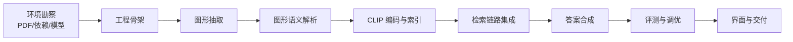

# 研发文档
## 人工智能 NLP-RAG-图像内容解析及检索优化

> 工单编号：人工智能 NLP-RAG-图像内容解析及检索优化
> 研发周期：2 人日 · 交付目录：`工单四/研发`

---

## 1. 研发目标与难点

在既有 PDF 问答系统上新增《招股说明书2.pdf》的**图像内容解析**与**检索优化**。

| 难点 | 表现 | 解决思路 |
|---|---|---|
| 图形区域定位 | 水印、表格边框、版式线、扫描页混入 | xref 频率剔水印 + 表格 bbox 排除 + 噪声区域过滤 |
| 组织结构还原 | 共享母线导致兄弟节点互连 | **母线归属法**有向遍历 |
| 根节点丢失 | 顶端节点被聚类裁掉 | 区域**紧致化扩展** |
| 图内文字识别 | 位图文字不在文本层 | OCR + **去水印前处理** |
| 系列名—数值配对 | 柱状/饼图排布不同 | 顺序配对 / 竖排块配对 / 最近邻配对 |
| 图形进入检索 | 图像无法直接做文本检索 | 语义文本块 + CLIP 跨模态向量 |
| 多文档串味 | 两份招股说明书同构表格 | 公司别名 → 文档级路由 |
| 响应 ≤ 3s | 本地 LLM 生成慢 | 抽取式合成 + 离线预计算 |

---

## 2. 开发过程



1. **环境勘察**：定位《招股说明书2.pdf》关键图形（p39 组织结构图、p72 IC 市场增长图）；
   确认 Ollama 模型、Chinese-CLIP、OCR 依赖。
2. **工程骨架**：`研发/` 下建立 src 模块与 build/evaluate/app 入口。
3. **图形抽取**：位图 + 矢量簇双通道，含噪声过滤与区域紧致化。
4. **图形语义解析**：组织结构层级还原 + 统计图 OCR 数值配对与结论派生。
5. **CLIP 编码与索引**：图文编码、零样本类型分类、图像向量离线落盘。
6. **检索集成**：以文搜图注入候选池，重排新增图形块与 CLIP 分项。
7. **答案合成**：新增图形类问题路径（层级/数值抽取）。
8. **评测调优**：16 题准确率与耗时评测，针对性修复。
9. **界面与交付**：Streamlit 中英双语界面、截图、演示视频、文档。

---

## 3. 关键算法实现

### 3.1 母线归属法（`figure_semantics._build_tree`）

组织结构图的连接关系：父节点下引线 → 横向母线 → 各子节点上引线。
若做无向连通遍历，兄弟节点会经母线互连，产生错误父子关系。算法：

```
owned = {}                       # 已占用线段（母线 / 祖先引线）
root = 最靠上且有引线的节点
栈 = [root]
while 栈:
    父 = 栈.pop()
    局部 = 父的未占用引线 ∪ 与之相连的线段（沿母线扩散）
    子集 = 局部线段端点命中的其他节点框
    for 局部中的线段:
        if 线段不锚定任何节点框: owned.add(线段)      # 母线占用
        elif 线段锚定已访问节点: owned.add(线段)      # 祖先引线占用
    栈.extend(子集)
```

结果：p39 还原出 `股东大会 → 董事会/监事会 → 总经理 → 销售部 → 大客户销售部 → 6 个销售处`。

### 3.2 OCR 去水印（`figure_semantics._preprocess_for_ocr`）

```python
arr = np.array(Image.open(path).convert("L"))
arr = np.where(arr > config.OCR_WATERMARK_LUMA, 255, arr)   # 浅灰水印置白
```

### 3.3 系列名—数值配对（`figure_semantics._pair_labels_values`）

| 图形 | 策略 |
|---|---|
| 条形/柱状图 | 系列名左列、数值右列 → 按 y 排序**顺序配对** |
| 饼图 | 标签在上、数值在下 → `_pair_vertical` 竖排块配对 |
| 其他 | 最近邻配对 |

并派生结论：增长率最快 / 负增长 / 占比最高。

### 3.4 CLIP 跨模态检索（`image_encoder` + `image_index`）

- 构建期：`encode_images` 批量编码图形 → `figures.npy`；元数据 → `figures.jsonl`；
- 查询期：`encode_texts(query)` 一次编码 → 与图像向量点积取 Top-K；
- 命中图形对应的语义块注入候选池，相似度计入重排 `W_CLIP` 分项。

### 3.5 多信号重排（`reranker`）

```
score = w_vec·向量 + w_bm25·BM25 + w_kw·关键词 + w_num·数值/年份
      + w_ent·实体 + w_tbl·表格加成 + w_fig·图形加成 + w_clip·CLIP + w_doc·文档匹配
```

---

## 4. 代码规范

- 所有模块文件头标注工单编号；
- 关键函数使用中文 docstring 说明「为什么这样做」（设计意图与坑）；
- 全部可调参数集中于 `config.py`，支持环境变量覆盖；
- 容错优先：任一可选组件（CLIP/OCR）失败均优雅降级，不阻断主链路。

---

## 5. 交付物清单

| 类别 | 位置 |
|---|---|
| 功能代码 | `研发/`（src + build_kb.py + evaluate.py + app.py） |
| 设计文档 | `设计/01_系统设计文档.md` |
| 部署文档 | `部署/部署文档.md`、`部署/run_all.ps1` |
| 测试报告 | `测试/测试报告.md`、`测试/性能测试报告.md`、`测试/测试用例文档.md` |
| 优化报告 | `优化/优化报告.md` |
| 演示 | `演示/`（演示视频、界面截图） |
| 评测结果 | `研发/output/`（eval_results.json、评测报告.md、图表） |