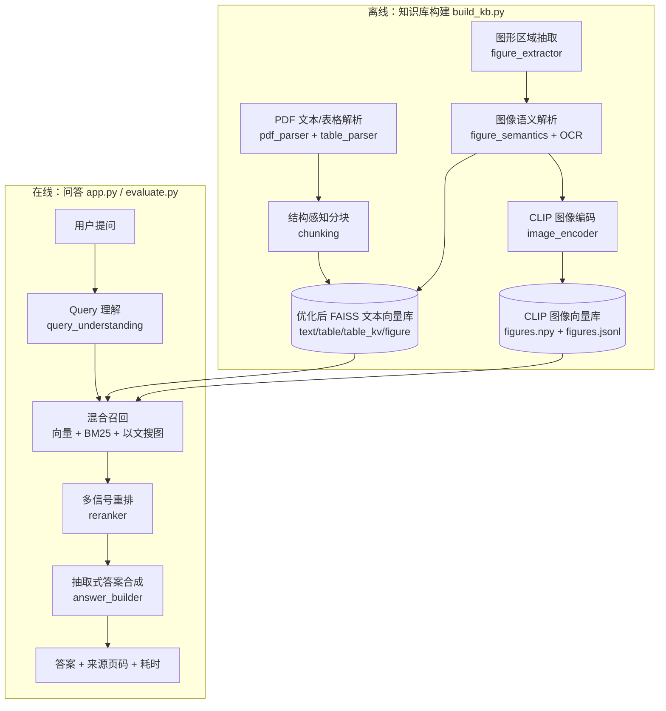
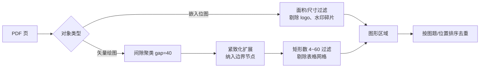
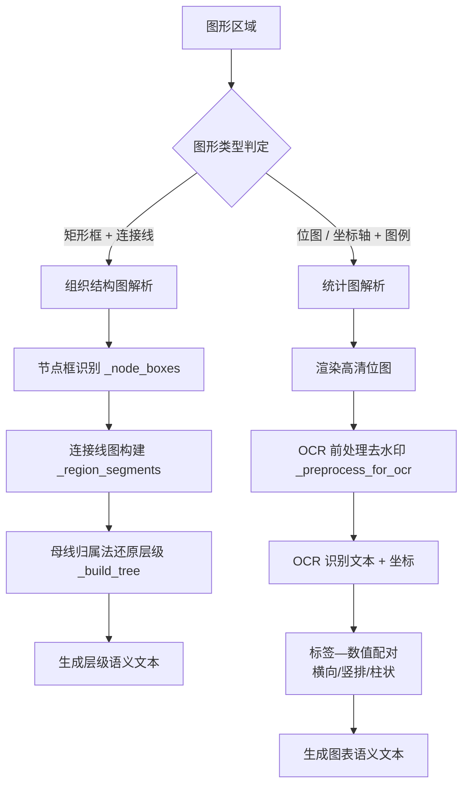
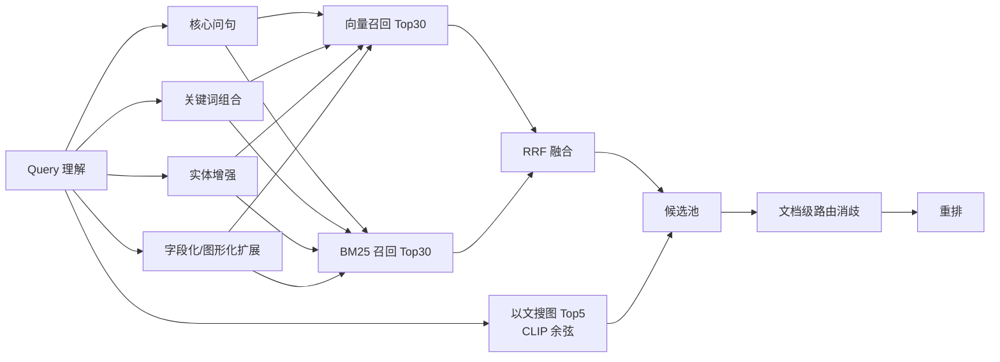

# 系统设计文档
## 人工智能 NLP-RAG-图像内容解析及检索优化

> 工单编号：人工智能 NLP-RAG-图像内容解析及检索优化
> 交付目录：`工单四/研发`（功能实现代码）、`工单四/设计`（设计文档）

---

## 1. 项目背景与目标

本工单在《01-基于 PDF 文档的问答系统》《02-问答系统优化》《03-表格解析及检索优化》基础上，
针对新增 PDF《招股说明书2.pdf》（武汉力源信息技术股份有限公司）实现：

1. **图像内容解析**：从 PDF 中抽取图形区域（嵌入位图 + 矢量绘图簇），并用**多模态模型
   （Chinese-CLIP）** 完成语义解析与结构化还原；
2. **检索优化**：把图像语义接入 RAG 检索链路，支持「以文搜图」，使图形类问题
   （如组织结构图层级、IC 市场增长图涨跌幅）可被准确检索与作答；
3. **验收指标**：16 题问答准确率 ≥ 90%，端到端响应 ≤ 3s。

### 1.1 验收问题分布

| 题型 | 题量 | 说明 |
|---|---|---|
| figure（图形） | 2 | id 5 组织结构图、id 6 IC 市场应用结构与增长图 |
| table（表格） | 8 | 发行股数、募投项目、关联方、军用收入及占比、注册资本、补充流动资金等 |
| text（正文） | 6 | 技术标准、上下游企业、供应商领域、获奖工程、法定代表人等 |

---

## 2. 总体架构



---

## 3. 模块设计

| 模块 | 文件 | 职责 |
|---|---|---|
| 配置 | `src/config.py` | 全局参数、路径、权重、阈值 |
| PDF 解析 | `src/pdf_parser.py` | 文本/图形/表格对象提取 |
| 表格解析 | `src/table_parser.py` | 表格结构化 + 键值对行 |
| 分块 | `src/chunking.py` | 结构感知切片 + 父子块 |
| 图形抽取 | `src/figure_extractor.py` | 图形区域定位与渲染 |
| 图形语义 | `src/figure_semantics.py` | 组织结构还原 + 图表数值配对 |
| 图像编码 | `src/image_encoder.py` | Chinese-CLIP 图文编码 |
| 图像索引 | `src/image_index.py` | 图像语义块 + CLIP 向量持久化与检索 |
| 知识库 | `src/knowledge_base.py` | FAISS 向量化与持久化 |
| 检索 | `src/retriever.py` | 向量+BM25+RRF+以文搜图 |
| 重排 | `src/reranker.py` | 加权线性多信号融合 |
| 答案合成 | `src/answer_builder.py` | 表格/图形/正文三类抽取式合成 |
| 问答引擎 | `src/qa_engine.py` | 优化/基线/消融四链路 |
| 界面 | `app.py` | Streamlit 中英双语演示 |
| 评估 | `evaluate.py` | 16 题准确率与耗时评测 |

---

## 4. 图像内容解析设计（本工单核心）

### 4.1 图形区域抽取



**关键点：区域紧致化（`_expand_to_rects`）**
矢量图形按「间隙聚类」时，边界节点（如组织结构图顶端的“股东大会”）可能与主体相距略大于
聚类间隙而落入独立小簇。若不扩展，区域上沿被裁掉，该节点在语义还原时被丢弃，导致层级树
根节点错误（曾误判为“薪酬与考核委员会”）。故把「中心落在簇内」的矩形一并纳入。

### 4.2 图形语义解析



**关键算法 1：母线归属法（`_build_tree`）**
组织结构图用**共享母线**连接同一父节点下的多个子节点。若做无向连通遍历，兄弟节点会经由
母线互相连通，产生「A 是 B 的子节点、B 也是 A 的子节点」的错误。本实现：
1. 只把「不锚定在任何节点框上」的线段（母线）标记为**已占用**；
2. 从父节点出发，沿引线 → 母线 → 各子节点引线推进；
3. 子节点展开时，父节点引线与母线均已占用，无法回溯，兄弟亦不可达。

由此得到一棵**有向树**，与人工阅读层级一致（p39 还原出：股东大会 → 董事会/监事会 →
总经理 → 销售部 → 大客户销售部 → 6 个销售处）。

**关键算法 2：OCR 去水印（`_preprocess_for_ocr`）**
招股说明书图形区域叠加浅灰水印（作者名/机构名），OCR 会误识为图内标签，污染「系列名—数值」
配对。水印亮度明显高于图内文字，按亮度阈值（`OCR_WATERMARK_LUMA=190`）置白即可滤除。

**关键算法 3：标签—数值配对**
- 柱状图：按 y 坐标排序做顺序配对；
- 饼图：`_pair_vertical` 取「位于标签下方、横向最近」的数值配对。

### 4.3 多模态编码（Chinese-CLIP）

- 模型：`OFA-Sys/chinese-clip-vit-base-patch16`（本地离线缓存）；
- `encode_images` / `encode_texts` 输出归一化向量，位于同一语义空间；
- 图像向量在**构建期离线预计算**并落盘（`figures.npy` + `figures.jsonl`），
  查询期仅编码一次文本（毫秒级），满足「响应 ≤ 3s」；
- 零样本图形类型分类（组织结构图/柱状图/饼图…）；
- 模型不可用时**优雅降级**（`available=False`），主链路不受影响（容错要求）。

---

## 5. 检索优化设计

### 5.1 多路召回



### 5.2 加权线性重排

```
score = 0.20·向量语义 + 0.14·BM25 + 0.19·关键词覆盖 + 0.11·数值/年份
      + 0.06·实体匹配 + 0.08·表格块加成 + 0.12·图形块加成 + 0.10·CLIP 相似度
      + 0.18·文档匹配加成
```

- **表格块加成**：表格类问题对 `table` / `table_kv` 块强加成；
- **图形块加成**：图形类问题（`answer_type == "figure"`）对 `figure` 块强加成；
- **CLIP 相似度**：以文搜图命中度，定位答案所在图形；
- **文档匹配加成**：按问题中的公司名做文档级路由，消除两份招股说明书的跨文档串味。

### 5.3 答案合成

| 类型 | 策略 |
|---|---|
| table | 聚焦得分最高且命中线索的表格块，抽取「表头：取值」键值对行结构化拼装 |
| figure | 从图形语义块抽取层级/数值，生成「构成数量 + 明细」式答案 |
| text | 句子级打分抽取（关键词覆盖/数值线索/实体/定义式句式/对比词惩罚/套话惩罚） |

采用**抽取式**合成的原因：需求要求「准确率 ≥ 90% 且响应 ≤ 3s」，本地生成模型
（deepseek-r1:1.5b）为推理型、速度慢且易幻觉；抽取式零幻觉、可溯源（附页码）、毫秒级返回。

---

## 6. 多文档实体消歧

知识库同时收录两份招股说明书，二者都存在「发行股数 / 募集资金 / 关联方」等同构表格。
设计「公司别名 → 源文件名」映射（`DOC_COMPANY`），在 Query 理解阶段判定 `doc_hint`，
检索阶段做文档级过滤（过滤后候选 ≥ 5 才生效，避免召回塌陷），重排阶段给予文档匹配加成。
这样「问力源」不会召回「兴图新科」的同构表格。

---

## 7. 容错与稳定性

| 异常场景 | 容错策略 |
|---|---|
| CLIP 模型缺失/加载失败 | 降级为纯文本检索，主链路继续 |
| OCR 不可用 | 跳过图表数值配对，保留图形类型与层级语义 |
| 图形解析异常 | 捕获异常，仅使用文本/表格块建库 |
| 用户输入为空/超短 | 返回提示，不进入检索 |
| 向量库未构建 | 界面提示先运行 `build_kb.py` |
| 中文路径导致 FAISS 保存失败 | 非 ASCII 路径经临时目录桥接 |

---

## 8. 性能设计

- Query 理解为确定性规则（jieba 分词 + 正则），毫秒级，不调用大模型；
- 向量库、BM25 语料、CLIP 图像向量均在构建期预计算，进程内单例复用；
- 在线链路仅做：1 次查询文本编码 + 向量检索 + BM25 + 重排 + 抽取，端到端毫秒级；
- 默认 `ANSWER_MODE=extractive`，避免 LLM 生成带来的秒级延迟与幻觉。