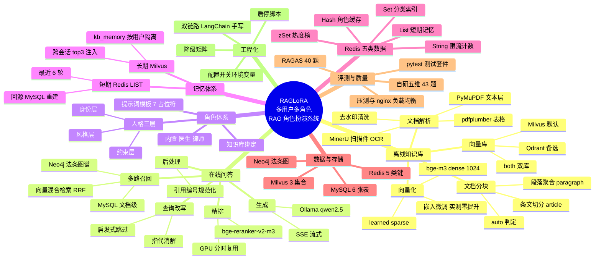

# RAGLoRA 系统思维导图

> 两种载体：①下方 Mermaid `mindmap` 可直接在支持 Mermaid 的查看器（GitHub / Typora /
> VS Code）渲染；②同结构的**大纲文本**可直接导入 XMind / 幕布。
> 与实现同步：节点标注对应的服务模块 / 文档编号。

## Mermaid 思维导图

## 大纲版（导入 XMind / 幕布）

- RAGLoRA 多用户多角色 RAG 角色扮演系统
  - 离线知识库
    - 文档解析 —— `services/ocr.py`
      - PyMuPDF：文本层 PDF，页均字数 ≥50
      - MinerU：扫描件（独立 conda 环境，vlm-engine）
      - pdfplumber：表格抽取（可选）
      - 清洗：页眉页脚/水印剔除
    - 文档分块 —— `services/ingest.py`
      - article：按「第X条」切分
      - paragraph：512 字聚合 + 50 重叠
      - auto：按语料类型自动判定
    - 向量化 —— `services/embed.py`
      - bge-m3：dense 1024 维（mean 池化）
      - learned sparse（词权重 ≥0.01）
      - 嵌入微调：链路跑通，实测零提升（语料缺口已定位）
    - 向量库
      - Milvus（默认，Docker）
      - Qdrant（嵌入式备选）
      - both（双库对比）
  - 在线问答 —— `services/chain.py` 分发
    - 查询改写（`llm.py`）：指代消解，启发式跳过
    - 多路召回（`retrieval.py`）
      - 向量混合检索：dense+sparse → RRF
      - MySQL 文档级：指名文档识别 + 限定检索
      - Neo4j 图谱：《法名》第X条精确召回
    - 精排（`rerank.py`）：bge-reranker-v2-m3，top20→5，GPU 分时 413ms
    - 生成（`llm.py`）：Ollama qwen2.5:7b，SSE 流式
    - 后处理：换行/装饰符/引用编号规范化
  - 角色体系 —— `services/persona.py`
    - 人格三层：身份 / 风格 / 约束
    - 提示词模板：7 占位符，DB 托管
    - 知识库绑定：kb_medical / kb_legal
    - 内置角色：心血管内科医生 / 执业律师
  - 记忆体系
    - 短期：Redis LIST 最近 6 轮，未命中回源 MySQL（`memory.py`）
    - 长期：Milvus kb_memory，按用户隔离，跨会话 top3（`long_memory.py`）
  - Redis 五类数据 —— `services/redis_extra.py`（2026-09-27）
    - String：每分钟问答限流（fail-open）
    - Hash：角色详情缓存（read-through）
    - List：短期记忆
    - Set：角色分类索引（启动幂等重建）
    - zSet：角色热度榜（每轮 +1）
  - 数据与存储
    - MySQL：users / characters / conversations / messages / search_history / kb_documents
    - Milvus：kb_medical / kb_legal / kb_memory
    - Neo4j：Article 节点 + CITES / ADJACENT 边
    - Redis：五类键（见需求规格说明书 §5.3）
  - 评测与质量
    - RAGAS 评测：40 题逐题数据
    - 自研五维评测：43 题，命中率/引用率 100%
    - pytest：14 文件守护不变量
    - 压测 + nginx 50/50 轮询（修复 27% 并发缺陷）
  - 工程化
    - 双链路：LangChain 默认 / 手写退路（`RAGLORA_CHAIN`）
    - 配置开关：全环境变量可覆盖（`core/config.py`）
    - 降级矩阵：单一依赖故障不放大（BR-08）
    - 启停脚本：run.sh / shutdown.sh

## 阅读指引

| 分支 | 详细文档 |
|---|---|
| 离线 / 在线链路细节 | 01-系统设计文档 · 12-业务流程图 |
| 向量库 | 07-Milvus接入说明 |
| 多路召回 | 08-多路召回说明 |
| OCR 分流 | 09-OCR分流说明 |
| 压测与负载均衡 | 10-压测与负载均衡报告 |
| 需求与验收 | 05-需求规格说明书（§8 对照表） |
