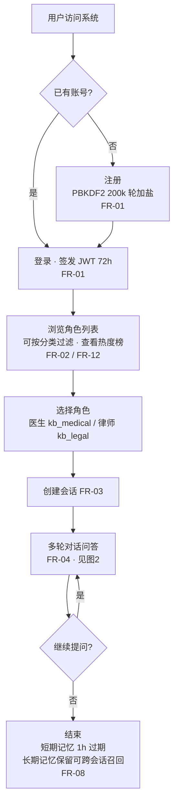
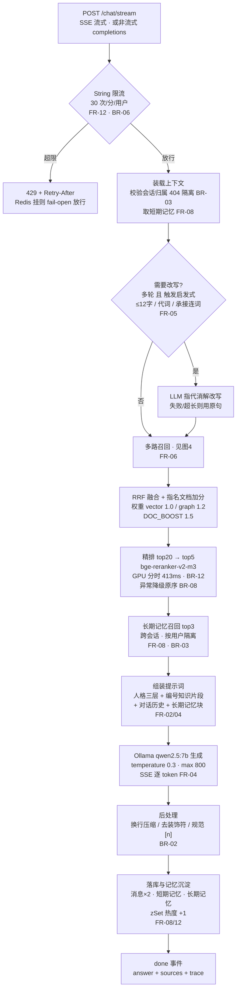
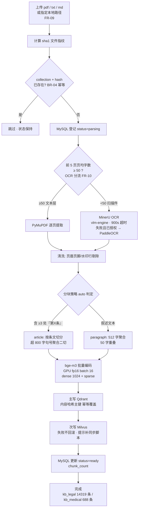
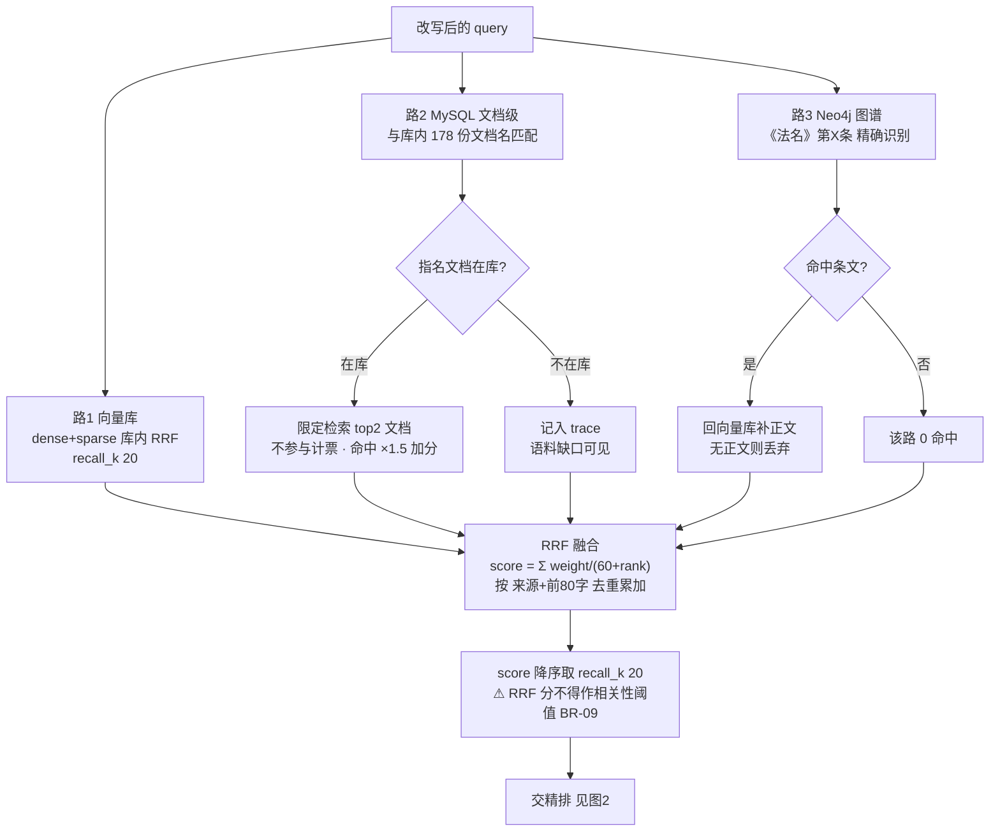
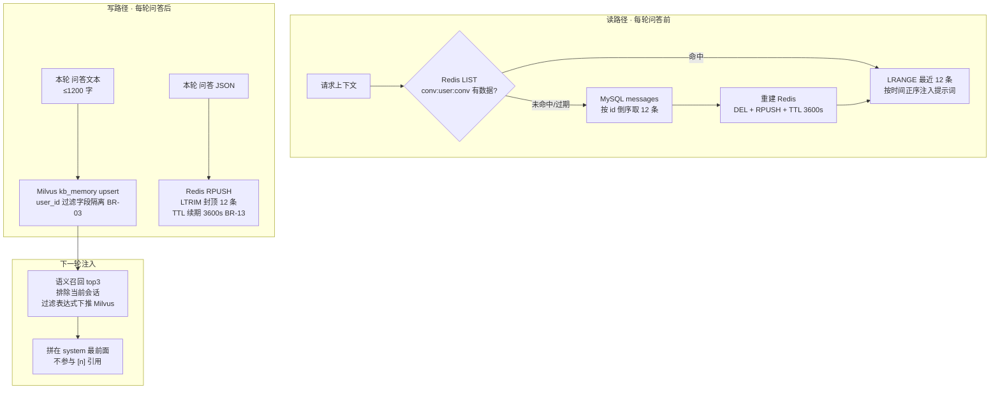

# RAGLoRA 业务流程图

> 六张 Mermaid 流程图覆盖系统全部核心业务。节点内标注对应模块 / 需求规格说明书（05）的
> FR / BR 编号，便于追溯。渲染：GitHub / Typora / VS Code 均可直接显示。

## 图1 系统总体业务流程（用户视角）

## 图2 在线问答主链路（核心流程）

## 图3 离线知识库入库流程

## 图4 多路召回与 RRF 融合

## 图5 记忆体系

## 图6 角色数据的 Redis 协同（2026-09-27 新增）

```mermaid
flowchart TD
    subgraph DETAIL["详情读路径 · Hash read-through FR-12"]
        A1["GET /characters/id"] --> A2{"Hash char:id<br/>命中?"}
        A2 -- "是" --> A3["类型还原直接返回"]
        A2 -- "否" --> A4["回源 MySQL"]
        A4 --> A5["HSET 回填 + TTL 300s"]
        A5 --> A3
    end
    subgraph WRITE2["写路径一致性 BR-07"]
        B1["修改/删除角色"] --> B2["DEL char:id 缓存失效"]
        B1 --> B3{"category 变更?"}
        B3 -- "是" --> B4["SREM 旧分类<br/>SADD 新分类"]
    end
    subgraph LISTV["列表读路径 · Set 索引"]
        C1["GET /characters?category="] --> C2{"Redis 可用?"}
        C2 -- "是" --> C3["SMEMBERS char_cat:分类<br/>按 id 查角色"]
        C2 -- "否" --> C4["回源 MySQL 过滤 BR-08"]
    end
    subgraph RANK["热度与限流"]
        D1["每轮问答完成"] --> D2["ZINCRBY rank:char_hot<br/>角色 id +1"]
        D2 --> D3["GET /characters/rank/hot<br/>ZREVRANGE 降序出榜"]
        E1["每轮问答开始"] --> E2["INCR rl:chat:user<br/>首次 EXPIRE 60s<br/>TTL<0 自愈补期"]
        E2 --> E3{"n ≤ 30?"}
        E3 -- "否" --> E4["429 拒绝"]
        E3 -- "是 / Redis挂" --> E5["放行 fail-open BR-06"]
    end
    subgraph BOOT["启动自愈"]
        F1["lifespan 启动"] --> F2["全量重建 char_cat:*<br/>幂等 · 自愈漏更"]
    end
```

## 业务规则速查（图中 BR 编号）

| 编号 | 一句话规则 | 详见 05-需求规格说明书 |
|---|---|---|
| BR-02 | 每句结论带 [n] 引用 | §4 |
| BR-03 | 越权 404；隔离过滤下推向量库 | §4 |
| BR-04 | (collection, file_hash) 幂等 | §4 |
| BR-06 | 限流 fail-open | §4 |
| BR-07 | MySQL 权威 + 写失效 + TTL 兜底 | §4 |
| BR-08 | 降级矩阵：单依赖故障不放大 | §4 |
| BR-09 | RRF 分不作相关性阈值 | §4 |
| BR-12 | 精排 GPU 分时复用 | §4 |
| BR-13 | 短期记忆 12 条封顶 + TTL 自愈 | §4 |
