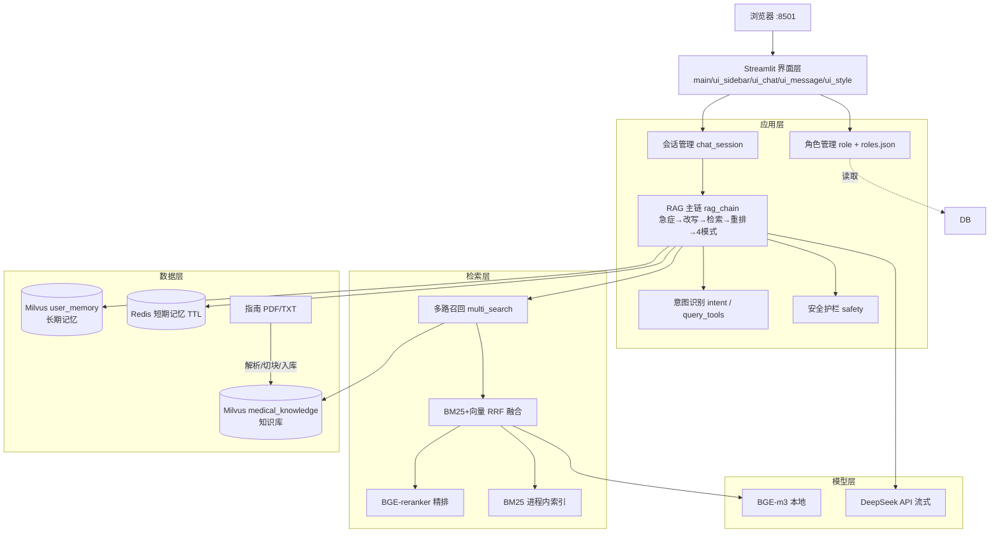

# 2. 需求规格说明书

## 2.1 功能需求（思维导图）

```
医小助 · 医疗 RAG 角色扮演系统
├── F1. 角色选角
│   ├── 西医医生 doctor（禁用中医术语，症状题须鉴别诊断≥3种）
│   ├── 中医 tcm（辨证分型，禁止要求看舌象/脉象）
│   └── 心理医生 psychologist（情绪偏向检索 boost，禁中医辨证术语）
├── F2. 多轮智能问诊
│   ├── Redis 短期记忆（滑动窗口 + 30 分钟 TTL）
│   ├── 按角色隔离的多会话（新建/切换/删除/自动命名）
│   └── 省略句多轮改写（"一直持续了一天"→完整问句）
├── F3. RAG 知识/用药问答
│   ├── 基于指南原文作答 + 来源/页码/相关度引用卡片
│   ├── 五大类降压药(CCB/ACEI/ARB/利尿剂/β阻滞剂)清单直答
│   └── 回答末尾免责声明
├── F4. 意图识别与应答路由（4 种模式）
│   ├── emergency 急症拦截（胸痛/说不出话等 → 直接提示拨打 120）
│   ├── clarify 信息不完整先追问（断句/缺宾语 + 可点选项）
│   ├── no_content 低于阈值 → 只给生活方式建议，不硬答
│   └── answer 命中 → 检索增强流式回答
├── F5. 混合检索
│   ├── BM25 关键词召回（jieba 分词）
│   ├── Milvus 向量召回（BGE-m3，1024 维，IP）
│   ├── RRF 融合（向量路权重×2）
│   ├── 角色偏向 + 多路召回（用药按五类、饮食按盐脂酒糖甘草拆路）
│   ├── 角色禁用术语后置过滤
│   └── BGE-reranker 精排（阈值 0.30；症状类问句降阈 0.21）
├── F6. 长期记忆（Milvus user_memory）
│   └── 会话摘要按用户存储，新问题自动向量召回注入上下文
├── F7. 安全护栏
│   ├── 急症关键词拦截   ├── 药物白名单校验（未在资料中出现的药名给红色警告）
│   └── 角色越界术语检测
├── F8. 知识库动态更新：追加 PDF/TXT → 解析 → 切块 → 增量入库
│   └── MinerU 扫描件支持（可选）：无文本层 PDF → 解析 → 按页重建 → 入库
├── F9. 流式输出（DeepSeek stream，首字秒出）
├── F10. 回答反馈 👍/👎（差评落 data/feedback.jsonl 供优化）
├── F11. 工程与运维
│   ├── python logging（控制台 + logs/app.log 按天滚动）
│   ├── 全局异常兜底（try/except + traceback 入日志，不白屏）
│   └── Redis/Milvus/reranker 故障自动降级
├── F12. 角色数据（roles.json 配置化）
│   └── 3 角色人设：system_prompt / 禁用术语 / 检索偏向词
└── F13. 图片识图问答（可选，未装依赖自动降级）
    ├── 侧栏上传化验单/药盒/说明书照片 → PaddleOCR 识别
    ├── OCR 文本拼入检索 query 走正常 RAG（气泡仅显示缩略图）
    └── 结果按"文件名:大小"指纹缓存，页面刷新不重复识别
```

## 2.2 技术架构图



## 2.3 非功能需求

| 类别 | 指标 | 目标/现状 |
|------|------|----------|
| 性能 | 流式首字延迟 | ≤ 3 秒 |
| 性能 | 启动 embedder 加载 | 本地加载约 35s（联网下载曾 1062s，已本地化） |
| 性能 | reranker 冷启动 | 后台线程预热（约 27s），不阻塞界面 |
| 可靠性 | 外部依赖故障 | Redis/Milvus/reranker 任一挂掉自动降级，不白屏 |
| 可靠性 | 大模型调用 | timeout=30s、max_retries=0，异常有兜底文案 |
| 可维护性 | 单个 .py 文件 | **≤ 150 行**（pytest 守护，含 scripts/tests） |
| 可维护性 | src/ 文件数 | **≤ 24 个**（当前 22 个，pytest 守护） |
| 可扩展性 | 新增角色 | 仅改 data/roles.json；新增资料跑 04 脚本增量入库 |
| 可观测性 | 日志 | python logging，落 logs/app.log 按天滚动 |
| 安全 | 隐私 | Redis TTL 30 分钟过期，会话不留持久明文 |

## 2.4 端到端数据流

```
离线：指南 PDF → PyMuPDF(去页眉页脚/水印/表格) → 按[第N页]切块(55字/重叠8)
      → BGE-m3 向量化(1024维, 归一化) → Milvus medical_knowledge(id/vector/text/source/page)

在线：用户问题
      → 急症关键词命中？ ──是──▶ 120 急救提示
      → 缺宾语/断句？    ──是──▶ 澄清选项
      → LLM 多轮改写（结合 Redis 历史）
      → 意图判定(知识/个人) + 多路口径生成
      → BM25 召回 + Milvus 向量召回 → RRF 融合 → 角色禁用术语过滤
      → BGE-reranker 打分(阈值0.30/症状0.21)
        ├─ top<阈值 → no_content 生活方式建议
        └─ top≥阈值 → 组装 prompt(角色人设+指南片段+历史+长期记忆)
                    → DeepSeek 流式生成 → 后处理 → 带引用卡片的回答
                    → 药物白名单/越界术语二次校验 → 写回 Redis 短期记忆
```

## 2.5 运行环境

| 项 | 要求 |
|----|------|
| 操作系统 | WSL2 Ubuntu 22.04（亦可原生 Linux） |
| Python | 3.10+ |
| Docker | Docker Compose（Milvus/etcd/MinIO/Redis 一键起） |
| 模型 | BGE-m3、bge-reranker-v2-m3 本地路径（见 .env） |
| 外部服务 | DeepSeek API Key |
