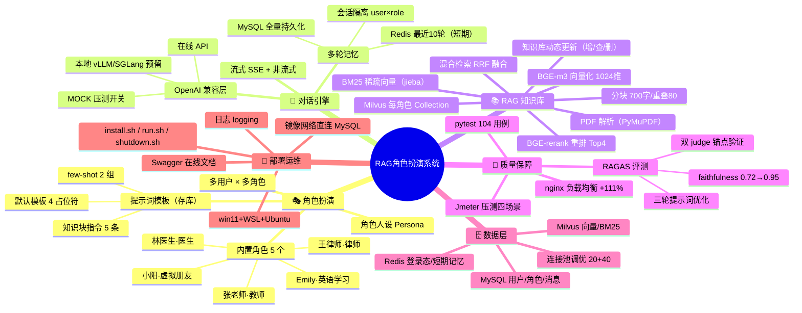

# 基于 RAG 的角色扮演系统 · 思维导图

## 图形版（Mermaid mindmap，VS Code / Typora / GitHub 直接渲染）



## 大纲版（可导入 XMind 或直接阅读）

```
基于 RAG 的角色扮演系统
├── 1. 角色扮演
│   ├── 多用户 × 多角色（会话按 user×role 隔离）
│   ├── 角色人设 + 提示词模板（存库，可自定义）
│   │   ├── 默认模板：{role_name}/{persona}/{history}/{knowledge}
│   │   ├── 知识块指令：严格依据/精确数值/逐子问题/不编造/无关才自由答
│   │   └── few-shot 示例：枚举列全 + 归类照原文
│   └── 内置角色：小阳(朋友)/林医生(医生)/王律师(律师)/张老师(教师)/Emily(英语)
├── 2. 对话引擎
│   ├── LLM 兼容层（OpenAI 协议）：在线 API（DeepSeek 实测）/ 本地 vLLM-SGLang 预留 / MOCK 开关
│   ├── 非流式 + SSE 流式（delta → sources → DONE）
│   └── 多轮记忆：Redis 最近10轮（短期）+ MySQL 全量（长期）
├── 3. RAG 知识库
│   ├── PDF 解析（PyMuPDF）→ 分块（700字/重叠80，中英句+换行断句）
│   ├── BGE-m3 向量化（1024 维，本地 CPU）+ BM25 稀疏（jieba，客户端生成）
│   ├── Milvus v3.0：每角色一个 Collection，稠密+稀疏混合检索（RRF）
│   ├── BGE-reranker-v2-m3 重排，召回30取Top4
│   └── 动态更新：上传/列表/删除（删除 Strong 一致性即时生效）
├── 4. 质量保障
│   ├── RAGAS 评测：基线 → 5指令 → few-shot 三轮，faithfulness 0.718→0.951
│   │   └── 双 judge 锚点（deepseek-chat / 第二模型）方向一致
│   ├── 自动化测试：pytest 104 用例（单元+集成，无需外部 key）
│   └── 压测：Jmeter 四场景（注册/对话MOCK/真实LLM/nginx双实例），0 错误
├── 5. 数据层
│   ├── MySQL：users / roles / messages（索引 user_id+role_id+created_at）
│   ├── Redis：session:token:*（String）、chat:history:*:*（List，10轮TTL7天）
│   └── Milvus：role_kb_{id}（text/dense/sparse/source/时间戳）
└── 6. 部署运维
    ├── win11 + WSL Ubuntu（镜像网络，直连 Windows MySQL）
    ├── deploy：install.sh（幂等，core/rag 依赖拆分）/ run.sh / shutdown.sh
    ├── 日志：python logging；接口文档：Swagger + docs/接口文档.md
    └── 交付文档：需求规格说明书 / 思维导图 / 设计文档 / 部署文档 / 评测报告 / 压测报告
```
